# Граница размещения объектов packet 79

TerraRuntime имеет typed protocol-326 границу для Terraria-сообщения `PlaceObject` с id 79 и теперь подключает её к проверенной authoritative-транзакции базового Chest. Codec остаётся protocol-only; gameplay authorization выполняется выше него.

## Wire layout

Payload protocol 326 имеет фиксированный размер

$$
S_{79}=2+2+2+2+1+1+1=11\ \mathrm{bytes}.
$$

Поля идут в следующем порядке: signed 16-bit tile X, tile Y, tile type и style; unsigned 8-bit alternate; signed 8-bit random selector; однобайтовый boolean direction. С учётом двухбайтовой длины Terraria-frame и одного байта message id полный frame packet 79 занимает 14 байт.

`TerrariaPlaceObjectCodec` принимает только payload ровно из 11 байт и отклоняет direction, если байт отличается от `0` или `1`. Codec не решает, допустимы ли tile type, style, alternate, координаты или предмет инвентаря. Это authoritative gameplay-решения.

## Production ownership boundary

```mermaid
flowchart LR
    Socket["Socket / framed message"] --> Projectile["ProjectileLifecycleFrameSink"]
    Projectile --> Object["ObjectPlacementFrameSink"]
    Object --> Codec["TerrariaPlaceObjectCodec"]
    Codec --> Session["Playing-session identity"]
    Session --> Ingress["RuntimeProjectileNetworkIngress"]
    Ingress --> Queue["Bounded authoritative command queue"]
    Queue --> State["ServerRuntimeState"]
    State --> Gameplay["RuntimeObjectPlacementCommandProcessor"]
```

`ObjectPlacementFrameSink` не принимает packet 79 до перехода игрока в `Playing`, останавливает соединение на malformed payload и трактует переполненный game ingress как backpressure. `RuntimeProjectileNetworkIngress` реализует object-placement ingress рядом с уже существующими projectile и packet-17 обязанностями, поэтому все три пути используют одну bounded command ownership. Socket thread никогда не изменяет `WorldTileStore`, metadata сундуков или inventory.

Первая gameplay-связь: Chest item `48` → `Containers` tile `21`, style `0`, alternate `0`. Поля packet random/direction сохраняются, но не могут переопределить эту item/object identity. Authoritative thread разрешает выбранный inventory slot игрока, проверяет mapping, атомарно создаёт объект 2×2 и chest metadata, расходует один предмет и только затем реплицирует packet 79 peers. Если inventory commit не проходит, только что созданный пустой объект откатывается.

## Abuse budget

Built-in профиль hard-abuse задаёт для packet 79 секундный предел 240 frames и 32 KiB. Это намеренно высокий аварийный flood-ceiling, а не ограничение обычной скорости строительства.

## Граница доказательств

Layout полей сверён с независимой реализацией Terraria protocol и публичной формой `NetMessage.SendObjectPlacement` / `WorldGen.PlaceObject`. Более широкие semantics объектов и предметов остаются fail-closed, пока не будут независимо закреплены для TerrariaServer 1.4.5.8.

## Текущее ограничение

Production composition packet 79 включён только для проверенного базового Chest. Другие object families, styles, alternates, точные furniture support rules и metadata tile-entity/sign остаются отдельной parity-работой.
