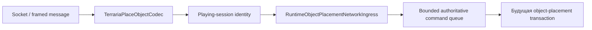

# Граница размещения объектов packet 79

TerraRuntime теперь имеет typed protocol-only границу для Terraria-сообщения `PlaceObject` с id 79. Эта страница намеренно описывает только wire- и ingress-контракт. Наличие codec не означает, что production host composition или gameplay authorization уже подключены.

## Wire layout

Payload protocol 326 имеет фиксированный размер

$$
S_{79}=2+2+2+2+1+1+1=11\ \mathrm{bytes}.
$$

Поля идут в следующем порядке: signed 16-bit tile X, tile Y, tile type и style; unsigned 8-bit alternate; signed 8-bit random selector; однобайтовый boolean direction. С учётом двухбайтовой длины Terraria-frame и одного байта message id полный frame packet 79 занимает 14 байт.

`TerrariaPlaceObjectCodec` принимает только payload ровно из 11 байт и отклоняет direction, если байт отличается от `0` или `1`. Codec не решает, допустимы ли tile type, style, alternate, координаты или предмет инвентаря. Это gameplay-решения.

## Граница владения

`ObjectPlacementFrameSink` не принимает packet 79 до перехода игрока в `Playing`, останавливает соединение на malformed payload и трактует переполненный game ingress как backpressure. Socket thread никогда не изменяет `WorldTileStore`, metadata сундуков или inventory.

## Abuse budget

Built-in профиль hard-abuse задаёт для packet 79 секундный предел 240 frames и 32 KiB. Это намеренно высокий аварийный flood-ceiling, а не ограничение обычной скорости строительства.

## Граница доказательств

Layout полей сверён с независимой реализацией Terraria protocol и публичной формой `NetMessage.SendObjectPlacement` / `WorldGen.PlaceObject`. Gameplay-решения TerraRuntime по-прежнему остаются fail-closed, пока соответствующие semantics объектов и предметов Terraria 1.4.5.8 не закреплены отдельно.

## Текущее ограничение

Этот срез намеренно **ещё не подключён к production connection sink chain**. Так сервер не начнёт принимать packet 79 раньше появления authoritative item-to-object transaction. Следующий срез связывает decoded request с selected-item inventory authority, multi-tile mutation, chest metadata, расходом предмета и peer replication.
