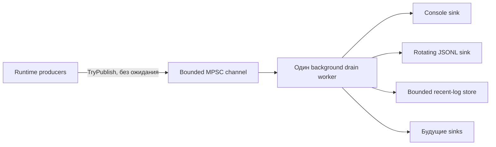

# Наблюдаемость и структурированное логирование runtime

В TerraRuntime теперь есть **фундамент структурированного логирования L0-L2**: стабильные диагностические контракты, ограниченный неблокирующий pipeline runtime и фоновые sinks. Живой host пока использует старый путь `RuntimeHostLog`; перевод call sites выполняется на этапе L3. Разделение сделано намеренно: новый pipeline можно закончить и проверить независимо, не смешивая в одном коммите изменение поведения authoritative runtime.

## Архитектура

Producer path только собирает компактный immutable `RuntimeLogRecord`, ограничивает свободный текст, назначает sequence/timestamp и вызывает `ChannelWriter.TryWrite`. Дисковый и консольный I/O, JSON-кодирование, flush, rotation, retention и обработка отказов sinks выполняются drain worker'ом.

При ёмкости очереди \(N_q\) и резерве для warning/error \(N_r\) обычные записи могут занимать не более

\[
N_{normal}=N_q-N_r.
\]

По умолчанию \(N_q=2048\), \(N_r=256\). Записи `Warning`, `Error` и `Critical` могут использовать резерв. При saturation producer не блокируется: запись отклоняется, а drop учитывается отдельно по severity.

## Стабильный контракт записи

`TerraRuntime.Contracts.Diagnostics.RuntimeLogRecord` содержит:

- монотонно растущий process-local sequence;
- UTC timestamp;
- severity;
- стабильный числовой event ID;
- верхнеуровневую category;
- subsystem;
- ограниченный message;
- detached correlation context;
- ограниченные поля типа и сообщения exception.

Detached context намеренно содержит только scalar handles: correlation, world, connection, player, entity, packet direction и packet ID. Ссылки на runtime entities и сырые packet payloads в log record не удерживаются.

### Распределение event ID

Event ID является стабильным машинным идентификатором. Текст сообщения может меняться без изменения ID. Зарезервированы диапазоны:

| Диапазон | Категория |
| ---: | --- |
| `1000-1999` | Lifecycle |
| `2000-2999` | Network |
| `3000-3999` | Protocol |
| `4000-4999` | World |
| `5000-5999` | Persistence |
| `6000-6999` | Plugin |
| `7000-7999` | Gameplay |
| `8000-8999` | Operations |
| `9000-9999` | Security |

Новые события должны получать ID внутри диапазона своей подсистемы. Старый ID нельзя переиспользовать для другого смысла.

## Backpressure и метрики

`RuntimeLogPipeline` отдаёт snapshot со счётчиками accepted/filtered, drops по severity, drained, sink failures, текущей глубиной очереди и high-water mark. Состояние каждого sink отслеживается отдельно, поэтому отказ одного назначения не должен молча ломать остальные.

При shutdown pipeline перестаёт принимать новые records, завершает writer и в пределах ограниченного окна дренирует уже принятые записи. Зависший sink ограничивается timeout одной операции. Повторные ошибки помещают только этот sink в quarantine; здоровые sinks продолжают получать records.

## Встроенные sinks

### Console

`RuntimeConsoleLogSink` пишет одну компактную человекочитаемую строку на record. Он вызывается только drain worker'ом и никогда напрямую authoritative producer path.

### Rotating JSONL

`RuntimeJsonLinesLogSink` пишет по одному структурированному JSON object на строку. Сериализация выполнена напрямую через `Utf8JsonWriter`, поэтому sink не зависит от reflection-based serializer и остаётся совместимым с NativeAOT.

Значения по умолчанию:

- максимальный размер файла: \(16\,\mathrm{MiB}\);
- rotation по границе UTC-дня;
- хранение \(8\) файлов;
- периодический flush каждые \(64\) records;
- немедленный flush для `Error` и `Critical`.

Rotation и retention выполняются на background sink path. Имя файла содержит UTC-время, process ID и ordinal для исключения коллизий.

### Recent-log store

`RuntimeRecentLogStore` — bounded in-memory ring для будущей выдачи в TUI/API. По умолчанию он хранит не более \(512\) records, поддерживает фильтрацию по level/category и считает вытесненные records. Жёсткий предел ёмкости — \(8192\).

## Правила для чувствительных данных

Structured contract намеренно узкий. В `Message` и context нельзя помещать пароли, authentication tokens, secrets, сырые тела пакетов, private keys и произвольные object dumps. Вместо персональных или mutable runtime данных следует использовать opaque handles. Операционные идентификаторы добавляются только когда они нужны для диагностики и уже очищены на call site.

Free-form fields ограничиваются по длине, а управляющие символы нормализуются до enqueue. Это защищает от log amplification и базовой terminal/line injection, но не делает секретные данные допустимыми для логирования.

## Ограничения NativeAOT

Фундамент не добавляет runtime NuGet dependencies. Используются BCL channels, явные contracts и ручная запись JSON. Runtime type discovery, dynamic serializer generation и reflection-driven log schema отсутствуют.

## Что осталось для внедрения

На L3 и последующих этапах нужно:

- заменить live `RuntimeHostLog`/direct console call sites на стабильные event IDs и structured context;
- протащить correlation context через connection, world, gameplay, persistence, plugin и command paths;
- экспортировать pipeline/drop/sink-health metrics через observability surface runtime;
- добавить benchmark/load gates и Linux/Windows NativeAOT smoke для уже внедрённого pipeline;
- отдать bounded recent logs в TUI/API и добавить optional external sinks.

Подробный статус этапов ведётся в [`../roadmap/runtime-logging-pipeline.md`](../roadmap/runtime-logging-pipeline.md).
