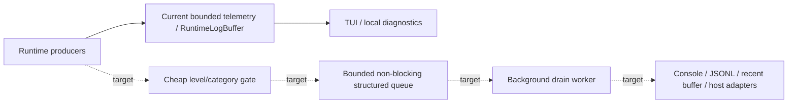
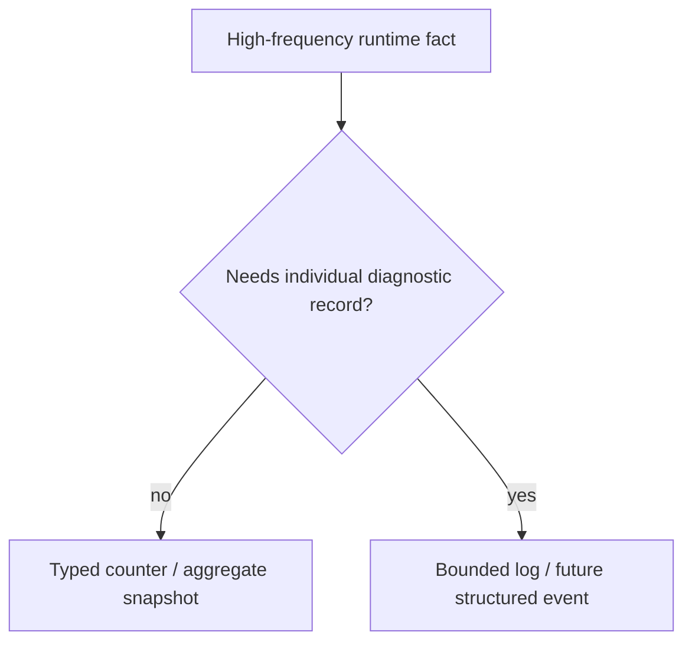
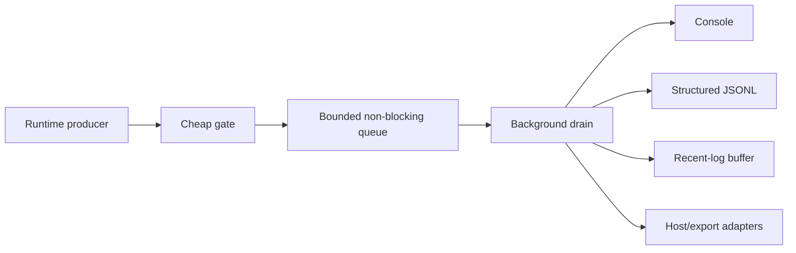

# Observability и logging

[English](../en/observability-logging.md) · [Документация](README.md) · [Operations/TUI](operations-tui.md) · [Logging roadmap](../roadmap/runtime-logging-pipeline.md)

## 1. Текущий статус

TerraRuntime уже имеет bounded operations telemetry, bounded recent-log read model и TUI consumption. Полный runtime-owned asynchronous structured logging pipeline **ещё не завершён**.

Solid arrows показывают current foundation. Dashed target path остаётся roadmap work.

## 2. Ownership boundary

Observability не становится owner simulation state. High-frequency owners публикуют bounded counters, immutable snapshots или bounded log records; TUI/exporters потребляют detached data и не scan'ят mutable runtime stores.

## 3. Current recent-log limits

`RuntimeLogBuffer` — bounded operations read model, не final public logging API.

| Limit | Current value |
|---|---:|
| Default retained entries | `$512$` entries |
| Maximum retained entries | `$8\,192$` entries |
| Maximum source length | `$64$` characters |
| Maximum message length | `$2\,048$` characters |

При full ring новые events overwrite oldest retained entry и увеличивают overwrite counter. Control characters normalized, empty source fallback'ится в `Runtime`, retained history не может расти от arbitrary object graphs/packet payloads.

## 4. Current record shape

Current operations record содержит `Sequence`, `TimestampUtc`, `Level`, `Source`, `Message`; levels: `Debug`, `Information`, `Warning`, `Error`.

Snapshots также публикуют published/overwritten counts, minimum level и capture time. Эта shape намеренно меньше future structured record model.

## 5. Reads и filtering

Consumers запрашивают bounded snapshot по minimum level, optional exact source и maximum entry count. Newest matching records возвращаются в chronological order. Bounded sorted source list поддерживает UI filtering.

## 6. Chat не logging

Read-only source `Chat` проецирует separate bounded public-chat telemetry в operator log view. Chat routing остаётся своей subsystem и не превращается в generic logging ownership только потому, что operator может его видеть.

## 7. Current host-log behavior

`RuntimeHostLog` связывает runtime messages с bounded recent-log buffer и local console behavior.

При active TUI normal console writes suppressed, чтобы не ломать dashboard. После fallback в plain console output может вернуться stdout/stderr.

Current bridge пока synchronous на call site. Sink formatting/I/O future structured pipeline должен вынести с hot runtime paths.

## 8. Telemetry и logs

High-frequency facts должны жить в counters/snapshots, а не в одной text line на каждое occurrence. Примеры: connection/admission counts, inbound/outbound frames/bytes, queue depth/high-water, rate rejects, typed stop reasons, normalized frame rejections и entity replication counters.

## 9. Connection rejection telemetry

Network telemetry сохраняет malformed protocol, rate limit, invalid state, gameplay rejection и backpressure раздельно. Terminal stop categories также typed: protocol failure, invalid handshake, unsupported protocol, slow client, handshake/join/idle timeout, application stop.

Flatten в `connection failed` выбросил бы полезное evidence.

## 10. TUI consumption

TUI читает operations snapshots на UI thread примерно каждые

$$
T_{\mathrm{refresh}}\approx500\,\mathrm{ms}.
$$

Log view потребляет `ILogOperations` / `RuntimeLogBuffer` snapshots и не блокирует runtime publishers. Future tail/follow остаётся sequence-based/bounded, чтобы slow consumer reported gap, а не требовал unbounded retention.

## 11. Target structured event model

Logging roadmap предлагает immutable machine-readable records с `Sequence`, `TimestampUtc`, `Level`, `EventId`, `Category`, `Subsystem`, message template/key, exception, correlation IDs, world/connection/player/entity context, packet direction/ID и bounded properties.

Это **target architecture**, не current public record shape.

## 12. Target queue и backpressure

Expected pressure policy preferential: Debug/Trace drop first, Information может sample/coalesce/drop, Warning/Error получают stronger retention, Critical требует bounded emergency fallback, а не unbounded synchronous path.

Exact queue sizes остаются measurement work.

## 13. Sink failure isolation target

Future sink failure не должен останавливать simulation или остальные sinks. Roadmap требует initial one long-lived drain worker, batching where useful, independent sink isolation, bounded health telemetry, graceful shutdown drain/flush и separate bounded buffering future network exporters.

Existing ring buffer сам по себе эти guarantees не доказывает.

## 14. File logging status

Durable target — newline-delimited structured JSON (`.jsonl`) с rotation/retention и explicit flush semantics из background worker. Complete file-sink pipeline ещё не implemented.

Нельзя закрывать gap synchronous JSON/file writes из gameplay/network hot paths.

## 15. Host/Vega boundary

TerraRuntime владеет runtime/network/gameplay/world diagnostics. Vega владеет Vega/application/plugin policy logs. Future integration может потреблять immutable TerraRuntime records через adapter, но TerraRuntime не ссылается на Vega assemblies и не выдаёт mutable runtime objects.

Arbitrary external `ILogger` providers не должны выполняться synchronously на authoritative game-loop thread.

## 16. Performance rule

Observability changes на hot paths требуют before/after measurement. Ни один log sink, file flush, terminal rendering или exporter не должен быть required progress authoritative simulation tick.

## 17. Evidence и limitations

Current tests покрывают recent-log buffer, host-log behavior, chat projection и operations/network telemetry mappings.

Incomplete остаются bounded async structured producer/drain pipeline, universal stable event IDs/categories, JSONL rotation/retention, Vega/MEL adapter contract, broad saturation/drop-policy/sink-failure tests и full subsystem telemetry coverage.

## 18. Checklist изменения observability/logging

Observability/logging change не завершён, пока hot-path work bounded/non-blocking, retained data bounded, counters preferred для high-frequency facts, consumers получают immutable data, sink failure не становится gameplay failure, current/target architecture explicit, diagrams используют Mermaid, dimensional quantities используют LaTeX, и эта page изменена вместе с `docs/en/observability-logging.md`.
