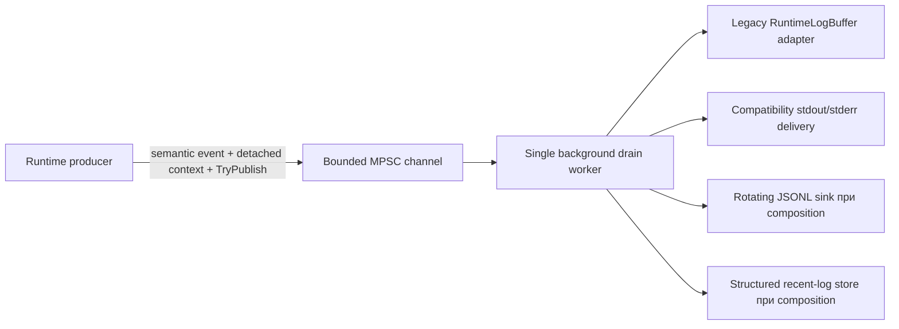

# Observability и structured runtime logging

[English](../en/observability-logging.md) · [Документация](README.md) · [Operations/TUI](operations-tui.md) · [Logging roadmap](../roadmap/runtime-logging-pipeline.md)

В TerraRuntime уже есть **L0-L2 structured logging foundation**, а live-host путь L3 существенно продвинут. Startup, загрузка/cache/recovery мира, persistence, lifecycle listener/connection, lifecycle trusted host module, shutdown failures и TUI failures теперь идут в bounded structured pipeline с semantic event IDs. Обычный lifetime `TerrariaServerHost.RunAsync` явно dispose'ит и drain'ит logger на любом return path.

## Архитектура

Semantic identity и локальная console delivery теперь намеренно разделены. `RuntimeLogRecord.EventId` описывает **что произошло**. Host-local delivery hint идёт рядом с record во внутреннем pipeline envelope и сообщает только delivery-aware sink, нужно ли принятое событие оставить buffered, отправить в stdout или stderr. Обычные structured sinks получают только `RuntimeLogRecord`, поэтому console routing не может случайно превратиться в semantic event identity.

Delivery hint фиксируется до enqueue, поэтому последующее изменение состояния TUI не может задним числом перенаправить уже принятое событие.

## Ограничение producer path

Producer path нормализует bounded scalar text/context, назначает sequence/timestamp и вызывает `ChannelWriter.TryWrite`. Disk I/O, console I/O, JSON encoding, flush, rotation, retention и обработка sink failure выполняются вне authoritative producer path.

При capacity очереди \(N_q\) и reserve для warning/error \(N_r\) normal records могут занять не больше

\[
N_{normal}=N_q-N_r.
\]

Defaults остаются \(N_q=2048\) и \(N_r=256\). `Warning`, `Error` и `Critical` могут использовать reserve. При saturation producer не ждёт место, а отклоняет record и увеличивает per-level drop counter.

## Stable record contract

`TerraRuntime.Contracts.Diagnostics.RuntimeLogRecord` содержит sequence, UTC timestamp, severity, stable event ID, category, subsystem, bounded message text, detached correlation context и bounded exception type/message. Context состоит только из scalar identifiers: logging не удерживает mutable runtime entities и raw packet payloads.

### Event ID allocation

| Range | Category |
| ---: | --- |
| `1000-1999` | Lifecycle |
| `2000-2999` | Network |
| `3000-3999` | Protocol |
| `4000-4999` | World |
| `5000-5999` | Persistence |
| `6000-6999` | Plugin |
| `7000-7999` | Gameplay |
| `8000-8999` | Operations |
| `9000-9999` | Security |

Legacy bridge по-прежнему резервирует `8000-8002` для старых callers `RuntimeHostLog.Write`/`Publish`. Новые live-host call sites эти ID больше не используют. Для lifecycle, network, world, persistence, plugin/host integration и operations событий назначены финальные category-specific IDs. `8003` является semantic event для отказа Terminal UI.

Protocol, gameplay и security IDs выделяются тогда, когда реально мигрируют соответствующие semantic call-site families; runtime не выдумывает события только ради заполнения диапазонов.

## Live-host context

`RuntimeHostLog` добавляет run-scoped correlation identifier к semantic events, если caller не передал более узкую correlation. После загрузки мира также добавляется стабильный world ID. Connection lifecycle events используют один connection-scoped correlation ID и `ConnectionId`; если при ошибке disconnect уже известен authoritative player handle, он добавляется как `PlayerHandle`.

Entity и packet context остаются полями того же detached contract, но заполняются только call sites, которые действительно владеют проверенными entity/packet identifiers. Raw packet payload и mutable runtime object в logging не удерживаются.

## RuntimeHostLog adoption

Следующие families в `TerrariaServerHost` теперь structured и больше не вызывают напрямую `Console.WriteLine`, `Console.Error.WriteLine` или `RuntimeLogBuffer.Publish`:

- cleanup abandoned-save и подготовка save template;
- stat/read/load world source, runtime cache hit/miss/rebuild, checkpoint recovery и bootstrap cache preparation;
- startup profile и listener-ready/failure events;
- failures attach/detach trusted host module;
- connection accept/stop/failure и shutdown faults;
- TUI startup/runtime failures;
- дедлайны authoritative command drain и остановки game loop;
- success/failure финального canonical world save и failures invalidation runtime cache.

`Console.CancelKeyPress` остаётся control/lifecycle signal, а не logging call, поэтому намеренно не меняется. `TerminalUiHost` продолжает владеть интерактивным console rendering/input в plain-console mode; пользовательский интерфейс не является runtime log sink.

`TerrariaServerHost.RunAsync` владеет `RuntimeHostLog` через `await using`. Поэтому early startup failure, listener failure, normal shutdown и успешный return проходят один и тот же bounded drain/disposal pipeline. Process-exit handler остаётся только fallback для аварийной потери ownership.

## Backpressure и sink health

`RuntimeLogPipeline` публикует accepted/filtered counts, per-severity drops, drained count, sink failures, queue depth и high-water mark. Sink failures изолированы; repeatedly failing sink quarantine'ится, а healthy sinks продолжают работу.

Blocked compatibility console writer не может блокировать producer. Delivery-aware console routing всё равно выполняется только drain worker'ом.

## Built-in sinks

`RuntimeConsoleLogSink` даёт structured human-readable console output. `RuntimeJsonLinesLogSink` пишет NativeAOT-safe JSONL через explicit `Utf8JsonWriter`, с size/day rotation и bounded retention. `RuntimeRecentLogStore` остаётся structured bounded ring, который должен заменить transitional `RuntimeLogBuffer` adapter в следующем L3 slice.

Default JSONL policy:

- maximum file size \(16\,\mathrm{MiB}\);
- rotation по UTC day boundary;
- retention \(8\) files;
- periodic flush каждые \(64\) records;
- immediate flush для `Error` и `Critical`.

## Sensitive-data rules

Нельзя писать passwords, authentication tokens, secrets, raw packet bodies, private keys или arbitrary object dumps в message/context. Предпочтительны opaque handles, а не personal/mutable runtime data. Free-form fields bounded и control characters normalized, но sanitization не делает secret material безопасным для logging.

## NativeAOT constraints

Pipeline использует BCL channels, explicit contracts и manual JSON writing. Host-local delivery envelope не добавляет dependency, reflection, runtime type discovery, dynamic serializer generation или runtime code generation.

## Оставшаяся L3 adoption

Оставшаяся работа L3 теперь уже:

- перевести TUI operations consumption с compatibility `RuntimeLogBuffer` adapter на `RuntimeRecentLogStore`;
- определить runtime logging configuration для minimum level, enabled sinks, directory, capacities, retention и timeouts;
- выделять semantic event IDs и detached entity/packet context при фактической миграции protocol/gameplay/security families;
- закончить оставшиеся legacy callers `RuntimeHostLog.Write`/`Publish` вне уже мигрированных families `TerrariaServerHost`, после чего убрать bridge IDs `8000-8002`.

Подробный milestone state находится в [`../roadmap/runtime-logging-pipeline.md`](../roadmap/runtime-logging-pipeline.md).
