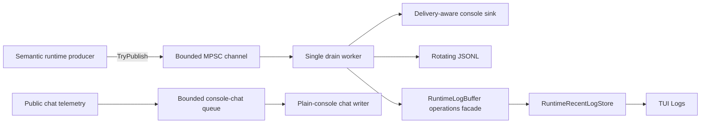

# Observability и structured runtime logging

[English](../en/observability-logging.md) · [Документация](README.md) · [Operations/TUI](operations-tui.md) · [Logging roadmap](../roadmap/runtime-logging-pipeline.md)

В TerraRuntime завершены этапы logging roadmap **L0-L3**. Live host logging принадлежит runtime, bounded, не блокирует producer, имеет semantic event identity, совместим с NativeAOT и явно drain'ится lifecycle сервера.

## Архитектура

`RuntimeLogRecord.EventId` описывает **что произошло**. Private delivery hint определяет только то, должен ли host console sink оставить принятый record buffered, вывести его в stdout или stderr. Structured sinks не выводят semantic meaning из console routing.

Public chat остаётся отдельной operations projection и не переименовывается в structured logging. Plain-console chat writer подписывается на bounded chat telemetry, выполняет только `TryWrite` на publishing path и пишет из background worker, пока TUI не владеет terminal.

## Bounds producer и очереди

Producer нормализует bounded scalar text/context, назначает sequence/timestamp и вызывает `ChannelWriter.TryWrite`. Console I/O, disk I/O, JSON serialization, flush, rotation, retention и обновление recent store выполняются вне authoritative producers.

При capacity очереди \(N_q\) и reserve для warning/error \(N_r\) обычный traffic может занять не больше

\[
N_{normal}=N_q-N_r.
\]

Defaults: \(N_q=2048\), \(N_r=256\). При saturation record отклоняется вместо ожидания, а per-level drop counter увеличивается. Plain-console projection public chat имеет отдельную bounded queue на \(256\) entries и при terminal backpressure вытесняет самые старые entries.

## Stable event identity

| Диапазон | Категория |
| ---: | --- |
| `1000-1999` | Lifecycle |
| `2000-2999` | Network |
| `3000-3999` | Protocol |
| `4000-4999` | World |
| `5000-5999` | Persistence |
| `6000-6999` | Plugin/host integration |
| `7000-7999` | Gameplay |
| `8000-8999` | Operations |
| `9000-9999` | Security |

Stable IDs никогда не переиспользуются для несвязанных смыслов. Operations IDs `8000-8002` принадлежали transitional L3 delivery bridge и permanently retired. `8003` — `OperationsTerminalUiFailed`; `8004` — `OperationsReadModelMessage` для direct local operations-read-model publication.

Runtime не создаёт фиктивные protocol/gameplay/security события только ради заполнения диапазонов. ID добавляется, когда появляется реальное semantic событие.

## RuntimeHostLog

`RuntimeHostLog` теперь имеет один production-facing producer method: `Log(...)`. Старые compatibility API `Write(...)` и `Publish(...)` удалены после repository-wide поиска, подтвердившего отсутствие production callers.

TUI activation влияет только на terminal delivery routing. Пока TUI владеет terminal, semantic events продолжают попадать в structured sinks и recent store, но compatibility console output остаётся buffered. Plain-console chat projection также прекращает принимать новые terminal writes. После выключения TUI новые подходящие events и public chat снова могут идти в stdout/stderr.

Logger по умолчанию добавляет run-scoped correlation, после загрузки мира — world ID, а connection/player context добавляется там, где эти identifiers проверены. Mutable runtime objects и raw packet payloads в context не удерживаются.

`TerrariaServerHost.RunAsync` владеет logger через `await using`, поэтому startup failures, early returns, normal shutdown и listener failures проходят bounded drain/disposal. Process-exit handler остаётся только последним fallback.

## Recent logs и TUI

Retained structured store один. `RuntimeLogBuffer` остаётся компактным `ILogOperations` facade для local TUI, но сам является `IRuntimeLogSink` поверх `RuntimeRecentLogStore`; отдельного второго ring больше нет.

Default retained capacity равен \(512\) records, hard maximum — \(8192\). TUI projection сохраняет прежние bounds source/message и operations-level mapping, тогда как underlying structured record сохраняет event/category/context.

## Production configuration

Invalid или out-of-range environment values откатываются к safe defaults, а priority reserve нормализуется так, чтобы

\[
1\le N_r<N_q.
\]

| Переменная | Default | Назначение |
| --- | --- | --- |
| `TERRARUNTIME_LOG_LEVEL` | `Debug` | minimum accepted level всего structured pipeline |
| `TERRARUNTIME_LOG_CONSOLE_LEVEL` | `Error` | independent minimum level для stdout/stderr delivery |
| `TERRARUNTIME_LOG_QUEUE_CAPACITY` | `2048` | bounded queue capacity |
| `TERRARUNTIME_LOG_PRIORITY_RESERVE` | `256` | Warning+ reserve |
| `TERRARUNTIME_LOG_CONSOLE` | `true` | structured compatibility console sink |
| `TERRARUNTIME_LOG_JSONL` | `true` | rotating JSONL sink |
| `TERRARUNTIME_LOG_DIRECTORY` | `<app>/logs` | JSONL directory |
| `TERRARUNTIME_LOG_MAX_FILE_BYTES` | `16777216` | rotation threshold \(16\,\mathrm{MiB}\) |
| `TERRARUNTIME_LOG_RETAINED_FILES` | `8` | retained files |
| `TERRARUNTIME_LOG_FLUSH_RECORDS` | `64` | periodic flush interval |
| `TERRARUNTIME_LOG_SINK_TIMEOUT_MS` | `2000` | per-sink deadline |
| `TERRARUNTIME_LOG_SHUTDOWN_TIMEOUT_MS` | `5000` | bounded shutdown drain |

`TERRARUNTIME_LOG_CONSOLE_LEVEL` принимает `Trace`, `Debug`, `Information`, `Warning`, `Error` и `Critical`. Это sink-local настройка: повышение threshold не удаляет lower-level records из JSONL или TUI recent store. И наоборот, снижение console threshold не возвращает records, уже отброшенные global `TERRARUNTIME_LOG_LEVEL`.

`TERRARUNTIME_LOG_CONSOLE=off` отключает только structured stdout/stderr delivery. Public chat остаётся independent plain-console projection, когда TUI неактивен.

Unit-test composition отключает JSONL, если sink явно не передан, по умолчанию не включает production chat subscription и оставляет unrestricted console threshold для deterministic compatibility tests.

## Sink isolation и NativeAOT

Repeatedly failing structured sink quarantine'ится без остановки healthy sinks. Pipeline metrics включают accepted/filtered records, per-level drops, drained count, sink failures, queue depth и high-water mark.

Chat console writer также изолирован от authoritative producers. Если stdout недоступен или блокируется дольше bounded shutdown wait, shutdown не ждёт observability бесконечно.

JSONL serialization использует explicit `Utf8JsonWriter`; logging graph не имеет reflection-driven serializer discovery, runtime code generation или dynamic schema construction.

## Sensitive data

Нельзя логировать passwords, authentication tokens, private keys, secrets, raw packet bodies или arbitrary object dumps. Предпочтительны opaque handles и detached identifiers. Нормализация длины/control characters не является secret redaction.

## Следующий этап

Logging L3 закрыт. Следующий roadmap stage — L4: экспорт pipeline/recent-store health в operator metrics, structured sink health, deterministic filters по level/category/event/subsystem/correlation и sustained overload/slow-sink/disk-failure quality gates.
