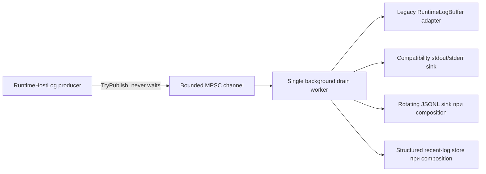

# Observability и structured runtime logging

[English](../en/observability-logging.md) · [Документация](README.md) · [Operations/TUI](operations-tui.md) · [Logging roadmap](../roadmap/runtime-logging-pipeline.md)

TerraRuntime уже имеет **L0-L2 structured logging foundation** и первый live-host slice этапа L3. `RuntimeHostLog` теперь публикует события в bounded structured pipeline; legacy operations read model и совместимое поведение stdout/stderr стали worker-owned sinks вместо synchronous работы producer thread. Оставшиеся прямые `Console.*` в startup/world-host остаются явной задачей L3.

## Архитектура

Мигрированный bridge фиксирует маршрут консоли в момент enqueue. Record заранее получает режим buffered-only, stdout или stderr, поэтому последующее изменение состояния TUI не может задним числом перенаправить уже принятое сообщение.

## Ограничение producer path

Producer path только нормализует bounded scalar text, назначает sequence/timestamp и вызывает `ChannelWriter.TryWrite`. Disk I/O, console I/O, JSON encoding, flush, rotation, retention и обработка sink failure выполняются вне authoritative producer path.

При capacity очереди \(N_q\) и reserve для warning/error \(N_r\) normal records могут занять не больше

\[
N_{normal}=N_q-N_r.
\]

Defaults остаются \(N_q=2048\) и \(N_r=256\). `Warning`, `Error` и `Critical` могут использовать reserve. При saturation producer не ждёт место, а отклоняет record и увеличивает per-level drop counter.

## Stable record contract

`TerraRuntime.Contracts.Diagnostics.RuntimeLogRecord` содержит sequence, UTC timestamp, severity, stable event ID, category, subsystem, bounded message text, detached correlation context и bounded exception type/message. Context состоит только из scalar identifiers: logging не удерживает mutable runtime entities и raw packet payloads.

### Event ID allocation

| Range | Category |
| ---: | --- |
| `1000-1999` | Lifecycle |
| `2000-2999` | Network |
| `3000-3999` | Protocol |
| `4000-4999` | World |
| `5000-5999` | Persistence |
| `6000-6999` | Plugin |
| `7000-7999` | Gameplay |
| `8000-8999` | Operations |
| `9000-9999` | Security |

L3 compatibility bridge резервирует `8000-8002` для buffered-only, stdout и stderr delivery. Это transitional routing IDs, а не финальные semantic IDs исходных call sites. При миграции конкретных subsystem families они получают свои стабильные semantic IDs.

## Миграция RuntimeHostLog

`RuntimeHostLog.Write` и `RuntimeHostLog.Publish` больше не вызывают `TextWriter.WriteLine` или `RuntimeLogBuffer.Publish` на caller thread. Оба действия выполняются sinks за `RuntimeLogPipeline`.

Совместимое поведение сохраняется:

- при active TUI host messages сохраняются, но не ломают terminal dashboard;
- после fallback TUI в plain console `Publish` снова может идти в stdout;
- явные stderr writes остаются stderr writes;
- существующий `RuntimeLogBuffer` продолжает кормить current TUI/read model на переходном этапе.

Bridge имеет bounded process-exit drain fallback и `DisposeAsync` для explicit lifecycle ownership. Подключение explicit disposal к полному normal server-host shutdown остаётся открытой задачей L3; fallback нужен, чтобы обычный process exit не бросал worker без bounded попытки drain.

## Backpressure и sink health

`RuntimeLogPipeline` публикует accepted/filtered counts, per-severity drops, drained count, sink failures, queue depth и high-water mark. Sink failures изолированы; repeatedly failing sink quarantine'ится, а healthy sinks продолжают работу.

Blocked compatibility console writer больше не блокирует caller, который создал runtime event. Тест специально удерживает writer и проверяет, что producer завершился до release worker'а.

## Built-in sinks

`RuntimeConsoleLogSink` даёт structured human-readable console output. `RuntimeJsonLinesLogSink` пишет NativeAOT-safe JSONL через explicit `Utf8JsonWriter`, с size/day rotation и bounded retention. `RuntimeRecentLogStore` является structured bounded ring, который должен заменить transitional `RuntimeLogBuffer` adapter в следующем L3/L4 slice.

Default JSONL policy:

- maximum file size \(16\,\mathrm{MiB}\);
- rotation по UTC day boundary;
- retention \(8\) files;
- periodic flush каждые \(64\) records;
- immediate flush для `Error` и `Critical`.

## Sensitive-data rules

Нельзя писать passwords, authentication tokens, secrets, raw packet bodies, private keys или arbitrary object dumps в message/context. Предпочтительны opaque handles, а не personal/mutable runtime data. Free-form fields bounded и control characters normalized, но sanitization не делает secret material безопасным для logging.

## NativeAOT constraints

Pipeline использует BCL channels, explicit contracts и manual JSON writing. Runtime type discovery, dynamic serializer generation и reflection-driven log schema отсутствуют.

## Оставшаяся L3 adoption

Следующий live-host slice должен:

- заменить оставшиеся прямые `Console.*` startup/world-host на structured events;
- выделить финальные semantic IDs для lifecycle, world, persistence, network, protocol, gameplay, plugin и security call-site families;
- протащить detached correlation/world/connection/player/entity/packet context;
- перевести TUI operations consumption с compatibility `RuntimeLogBuffer` adapter на `RuntimeRecentLogStore`;
- определить runtime logging configuration для minimum level, enabled sinks, directory, capacities, retention и timeouts;
- сделать explicit logging disposal частью normal server-host shutdown вместо зависимости от process-exit fallback.

Подробный milestone state находится в [`../roadmap/runtime-logging-pipeline.md`](../roadmap/runtime-logging-pipeline.md).
