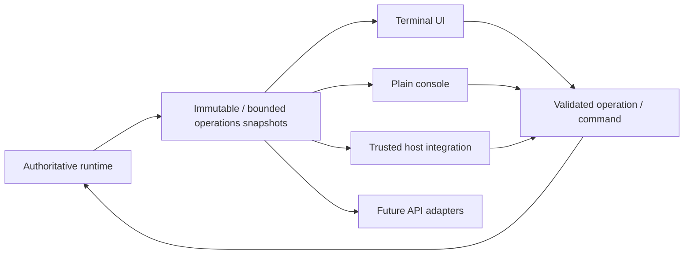
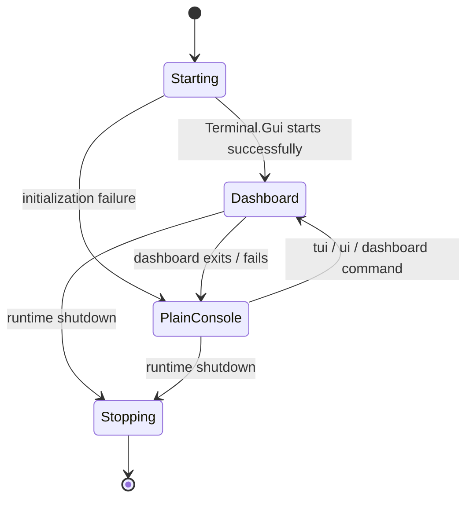
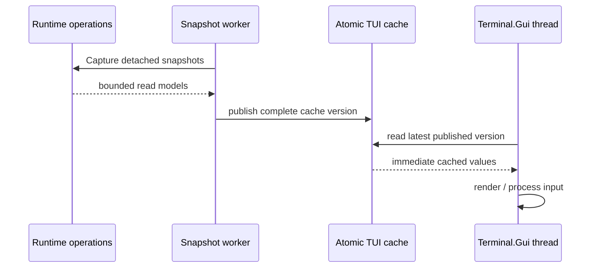
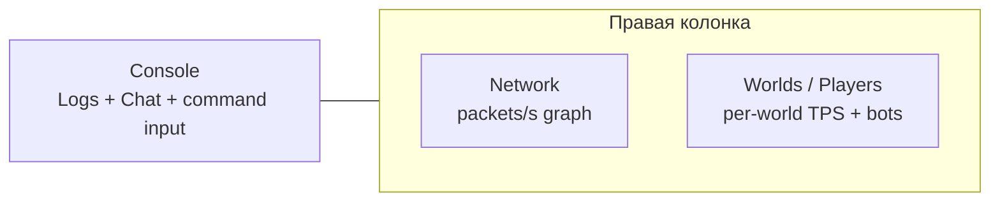
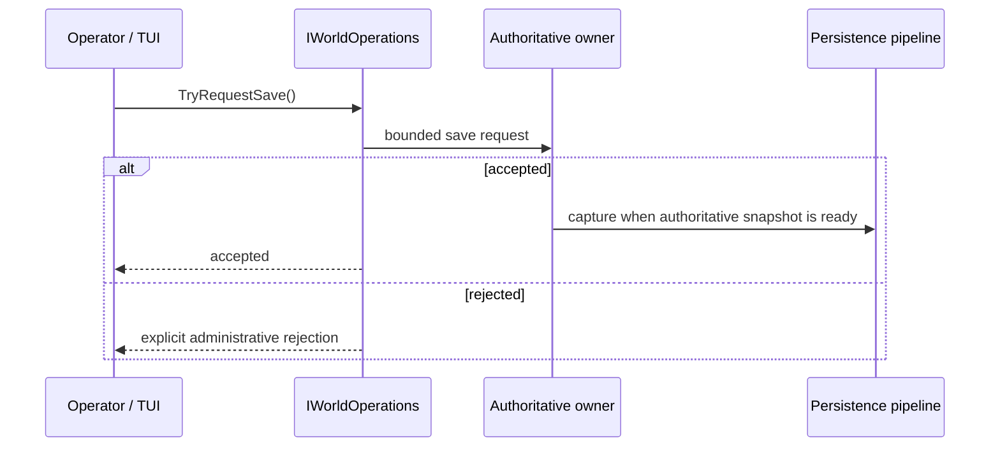
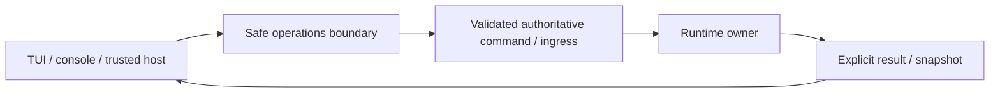

# Operations, startup и Terminal UI

[English](../en/operations-tui.md) · [Документация](README.md) · [Архитектура](architecture.md) · [Host interfaces](host-interfaces.md)

## 1. Назначение

Operations layer предоставляет bounded read models и safe control surfaces, не позволяя UI code напрямую обходить или мутировать authoritative runtime collections.



Terminal.Gui v2 является current local UI implementation, но boundary toolkit-independent.

## 2. Startup без аргументов

Normal startup без `--world` создаёт required runtime directories и сканирует canonical `Worlds/` через local selector. Selected `.wld` становится effective `--world`. Cancel selection завершает startup чисто.

Интерактивный список намеренно показывает только display name мира. Absolute filesystem path больше не повторяется рядом с каждым названием; явный путь по-прежнему можно ввести через `P` или `--world`.

Directory layout остаётся literal filesystem structure:

```text
Worlds/
config/
data/
logs/
```

## 3. Основные server options

```text
--world <path.wld>
--port <1..65535>
--max-players <1..255>
--interest-management
--tui
--no-tui
```

Defaults: `port = 7777`, `max players = 8`, TUI enabled, interest management disabled. Это configuration values/identifiers, а не dimensional measurements, поэтому они остаются code literals.

`--tui` accepted explicitly, хотя TUI default-on. `--no-tui` выключает его.

Special startup paths включают `--help`, `--list-world-generators`, CI smoke modes и `--save-wld`.

## 4. TUI lifecycle



UI работает на собственном background thread `TerraRuntime Terminal UI`, не на authoritative game-loop thread. `Host` владеет linked cancellation и ждёт UI thread только bounded interval при disposal.

На Windows TerraRuntime намеренно использует cross-platform `dotnet` driver Terminal.Gui вместо принудительного native `windows` driver. Это compatibility policy для Windows 10/conhost-подобных rendering failures, при которых Terminal.Gui 2.4.x может оставить content area пустой/чёрной, хотя menu chrome продолжает отображаться. На Linux и остальных платформах сохраняется обычный platform selection Terminal.Gui.

Production TUI после initialization Terminal.Gui также устанавливает явную high-contrast схему TerraRuntime. Base, Menu, Dialog, Accent и Error используют opaque near-black backgrounds и зелёные foreground/accent colors вместо наследования terminal-default `Color.None`.

## 5. Refresh model и отзывчивость input

Runtime data сохраняет целевой период snapshot примерно

$$
T_{\mathrm{snapshot}}\approx100\,\mathrm{ms},
$$

но сбор snapshot больше не выполняется на Terminal.Gui thread. `OperationsCache` собирает detached operations state в worker task и публикует целый cache одним atomic reference swap. UI thread только читает уже опубликованное состояние и форматирует его во views.

Лёгкий Terminal.Gui timer проверяет появление новой cache version примерно каждые

$$
T_{\mathrm{ui\ pump}}\approx16\,\mathrm{ms}.
$$

Этот timer не захватывает gameplay/network/world state. Поэтому медленный operations snapshot не может остановить keyboard navigation, mouse focus, перемещение по menu или interaction с панелями. Если background capture ещё идёт, UI продолжает показывать предыдущий полный snapshot вместо ожидания.



Overview постоянно обновляет dashboard/player/network/world/log state, который ему нужен. Detail-only snapshots NPC, projectiles, dropped items и full-debug log обновляются demand-driven: пока соответствующий detail screen реально читается. Так отзывчивость UI не превращается в постоянный allocation/copy tax для всех сущностей на каждом refresh.

World-scoped inspection вынесен в отдельную ответственность cache. `LocalRuntimeWorldInspectionOperations` разрешает live worlds по стабильному `WorldRuntimeId`, а `WorldInspectionCache` хранит выбранный оператором мир и снимает только запрошенный Players/NPCs/Projectiles/Items/World snapshot этого мира. Terminal.Gui thread получает только detached read models и не хранит ссылки на `WorldRuntime`. Operations telemetry для sandbox включается только при включённом TUI.

Плитка Worlds / Players содержит действие `+ Sandbox` в той же Base-схеме, что и дерево, без отдельного подсвеченного фона кнопки. В окне создания isolation выбирается через dropdown; отдельная строка `Selected:` больше не выводится. Generator, game mode, world evil и size preset выбираются через dropdown. Список генераторов снимается из реального runtime/host generator registry. Size presets: Primary, Small `4200x1200`, Medium `6400x1800`, Large `8400x2400` и Custom. При открытии формы сразу создаётся случайный unsigned seed; кнопка `Random` генерирует новый без ручного ввода слова `random`.

Create admission выполняется синхронно и без блокировки: форма закрывается только после того, как `SandboxHost.TryCreate` принял typed request в bounded materialization queue. Немедленный отказ, включая выбор Level 2 dedicated-process isolation при реализованном только Level 1, остаётся видимым прямо в форме. Сама generation/materialization продолжает выполняться на существующем bounded worker и публикует terminal success/failure через sandbox job feed.

Administrative operations не становятся cached writes. Interest-management changes и world-save requests по-прежнему напрямую делегируются в authoritative bounded ingress.

## 6. Плиточный System Dashboard

Default System Dashboard является runtime-owned workspace из трёх основных поверхностей. **Console** занимает широкую левую колонку. Справа сверху находится компактный **Network** graph, а остальное место занимает **Worlds / Players**. Отдельного global TPS tile нет: у каждого live world свой authoritative loop и собственные observed/target TPS.



Focusable panels имеют явное selection state. Keyboard focus или mouse press включает Accent scheme и добавляет к title активной панели `▶`. Double-click по title переключает панель между tiled и full-workspace view. Это presentation-only operations; authoritative state остаётся за operations contracts.

Console объединяет bounded structured-log/chat feed и постоянно видимый Accent input `>`. Worlds / Players является `ListView` с typed world/player/bot entries, а не результатом парсинга отображаемого текста. Double-click по player открывает generation-safe live details window. Drag-and-drop использует захваченный точный `PlayerHandle(slot,generation)`. `[X]` на строке sandbox/player/bot вызывает typed destroy/kick/despawn operation.

Action row содержит **`+ Sandbox`**, затем **`+ Bot`**. Теперь создаются только PlayerBot: hostile NpcBot/защитники и их presets удалены. Обычный NPC actor, interaction и shop foundation сохранён отдельно. Double-click открывает weapon policy, flight, target, Idle/Follow/Guard и GodMode. Боты начинают с 500/500 HP и 200/200 mana, получают уникальные случайные имена, согласованные random functional/vanity loadouts и запас healing/mana potions. Pickup, лечение и поддерживаемые Archery/Wrath используются автоматически с расходом authoritative inventory. Зелья не тратятся на незначительную потерю HP/mana; лечение и mana в одном тике сохраняют оба обновления vitals. Поддерживаемые NPC contact, hostile projectiles и их termination explosions проходят существующий authoritative damage pipeline; смертельный урон создаёт настоящее dead state и packet 118. Наличие loadout не означает поддержку неподтверждённых combat/equipment effects.

PlayerBot использует существующие server-player, projectile и world-item authorities. Automatic selection выбирает поддерживаемые Muramasa, Platinum Bow и gun loadouts с Unholy Arrow/Silver Bullet; held slots и use-item controls реплицируются. Упреждение учитывает настоящую скорость weapon/ammo/accessories, source projectile substeps и tile-aware проверку линии/траектории. Guard удерживает generation-safe цель, сближается до эффективной дистанции, сохраняет открытую огневую позицию и выбирает ограниченную стабильную reposition point при перекрытом выстреле. Flight позволяет подняться над препятствием; Follow сохраняет разнесённые formation и ходьбу/полёт. Catch-up recovery показывает Magic Mirror из inventory (item 50, использование 90 ticks), переносит на tick 45 и затем возвращается к оружию. Packet 12 RecallFromItem передаёт наблюдателю recall floor. Перенос к игроку вместо сохранённой кровати — явно политика бота, а не новое vanilla-правило зеркала. Полный pathfinding, все weapon/accessory effects и live-client visual parity не входят в этот проверенный slice.

Повторная проверка замечаний тестера исправляет отображение remote item в protocol 326: packet `13` передаёт нормальную гравитацию и флаг успешного использования, требуемый remote `Player.ItemCheck`; прицельные выстрелы дополнительно отправляют packet `41` с authoritative rotation/animation. PvP melee claims, trusted player projectiles и termination explosions теперь включают серверных ботов в существующий damage/mitigation path, сохраняя hostility/team/generation checks и GodMode. Смертельный PvP отправляет packet `118`. Bullet `14`, Silver Bullet `981`, Green Laser `20` и Jester's Arrow `5` сохраняют source AI_001 timer без обычной гравитации стрелы; prediction использует то же различие. Открытые настройки обновляют текущий PvP. Потеря exact target generation очищает цель и выбирает Idle без привязки переподключившегося игрока по имени. Follow сокращает formation offset, попавший внутрь твёрдого препятствия. World replacement деактивирует все remote player slots перед destination baseline, кроме собственного slot соединения и sentinel `255`; primary-бот остаётся в primary. Проверены три повторных перехода, но это не устанавливает причину Lost connection тестера и не заменяет визуальную проверку живым клиентом.

На dashboard **нет дублирующей видимой кнопки Settings**. Runtime settings остаются доступны через верхнее меню **Settings → Runtime settings**. Окно runtime settings содержит только practically useful operator controls: текущие bind-address/IP и TCP port, listener lifecycle/generation/draining/rebind counters, active connections относительно player limit, target TPS и toggle interest management. Изменение bind/port проходит operations boundary и заменяет поколение listener; TUI не получает `Socket` и не владеет connection lifetime. Уже accepted clients остаются подключёнными, пока предыдущий listener проходит `Active → Draining → Closed`.

Network graph хранит историю **packets/second**, а не byte-volume. IN использует левую вертикальную шкалу, OUT — независимую правую, поэтому тихое направление остаётся видимым рядом с загруженным. Числовая строка одновременно показывает packet rate и byte throughput (`KiB/s` или `MiB/s`). Rates вычисляются по delta process-lifetime message counters между detached network snapshots; некорректный interval или rollback counters сбрасывает UI-local sample вместо искусственного spike.

Повторная публикация одного snapshot не добавляет ложные нулевые samples. Неизменившийся текст world list сохраняет ListView source; refresh инвалидирует только изменённые дочерние views, а не весь dashboard. Framebuffer regression проверяет отсутствие redraw для прежних данных и отрисовку новых samples.

World detail screen также показывает section-cache pipeline health из `RuntimeWorldSnapshot`: in-flight/submitted/rejected rebuilds, stale results, encode failures, publish rejections и accumulated encode time. Строка on-demand показывает requests, unique/deduplicated requests, pending work относительно bounded capacity, rejected requests и completed/timed-out waits.

## 7. Save telemetry и manual checkpoint

World-save status публикует persistence acceptance, tile-shadow readiness, remaining bootstrap/dirty sections, requested state, active/pending writes и accepted/started/completed/coalesced/failed counters.

**Actions → Save world checkpoint** вызывает `IWorldOperations.TryRequestSave()` и проходит persistence ingress, не получая save service или mutable tile shadow.



ANSI TUI smoke проходит реальный menu path и проверяет pending-save state; unit tests покрывают accepted/rejected requests.

## 8. Network telemetry

`INetworkOperations` отдаёт bounded network state без передачи UI ownership connection lifecycle. Он включает active/registered connections, admission totals/rejections, one-second и lifetime inbound totals, per-connection inbound details, outbound current/capacity/high-water/rejection state, slow clients, player lifecycle/replication counters, health/mana baseline counters и health duplicate-suppression counters, unsupported replication commits, typed terminal stops и normalized frame-rejection categories.

TUI потребляет subsystem-owned counters, а не парсит log text и не создаёт duplicate packet-hot-path counters.

## 9. Logs

TUI потребляет bounded log state и не является logging backend. UI failure не теряет authoritative state, rendering не блокирует game loop, retained history bounded.

См. [Observability и logging](observability-logging.md) и logging roadmap.

## 10. Plain console fallback

Literal fallback commands:

```text
tui | ui | dashboard   снова открыть dashboard
clear                  очистить console, если поддерживается
help                   показать fallback-console commands
```

Когда TUI отключён через `--no-tui`, не смог инициализироваться или был закрыт оператором, public chat проецируется в stdout в виде `[chat] #<slot>: <text>`. Проекция использует bounded queue и background writer; authoritative chat relay никогда не ждёт terminal I/O.

Structured console events имеют отдельный sink threshold. Default — `Error`: в тихой plain console остаются error/critical-class events плюс chat, а подробные `Debug`/`Information` records продолжают быть доступны другим включённым sinks. `TERRARUNTIME_LOG_CONSOLE_LEVEL` принимает `Trace`, `Debug`, `Information`, `Warning`, `Error` или `Critical` и меняет только console threshold. `TERRARUNTIME_LOG_LEVEL` остаётся global pipeline acceptance threshold, поэтому более подробная console настройка не может вернуть уже globally filtered events.

`TERRARUNTIME_LOG_CONSOLE=off` отключает structured stdout/stderr delivery; public-chat projection остаётся независимой, чтобы headless server не становился полностью немым относительно player conversation.

Unknown commands reported, а не превращаются в runtime mutations. Closed/redirected stdin ждёт, а не busy-loop'ит.

## 11. Trusted host dashboards

CoreCLR trusted hosts могут регистрировать complete dashboards через `IDashboardRegistry`.

Provider задаёт stable `Id`, display `Title`, `CreateDashboard()` и `Refresh(View rootView)` на Terminal.Gui UI thread. Он предоставляет собственный root view и не inject'ит arbitrary controls в built-in TerraRuntime dashboard.

Registration metadata/factory-oriented и не выдаёт mutable runtime state.

## 12. UI-thread ownership

Terminal.Gui views остаются UI-thread objects. Dashboard provider обновляет свой view из `Refresh`, а gameplay/runtime work запрашивает через safe contracts. `View` не может становиться synchronization primitive authoritative state.

Built-in TerraRuntime snapshot acquisition теперь явно исключён из UI thread. На нём остаются только formatting, view mutation и trusted-host callback `Refresh(View)`. Если trusted host выполняет blocking work внутри собственного `Refresh(View)`, он всё ещё может затормозить свой dashboard и должен вынести такую работу за собственную detached snapshot/cache boundary.

## 13. Правило administrative mutation



Implemented examples: interest-management enable/disable через authoritative command ingress и manual checkpoint через `IWorldOperations.TryRequestSave()`.

Работа в одном process не даёт TUI direct-mutation shortcut.

## 14. Headless и extensible profiles

Отключение TUI не отключает server. NativeAOT/CoreCLR profiles остаются functional без successful graphical terminal session.

CoreCLR может загрузить trusted host modules вроде Vega за `TerraRuntime.HostContracts`; ordinary Vega plugins остаются за Vega plugin SDK. NativeAOT не выполняет arbitrary managed DLL loading.

## 15. Текущие ограничения

Ещё развиваются final dashboard layout/UX, future remote/web adapters, richer safe administrative actions и panel-specific docs. Tiled dashboard намеренно использует compact local histories и не изображает UI sparklines полноценным metrics time-series store.

## 16. Checklist изменения operations/TUI

Operations/TUI change не завершён, пока UI work остаётся вне authoritative thread, built-in snapshot acquisition остаётся вне Terminal.Gui thread, read models immutable/bounded, mutations проходят safe operations, UI failure деградирует без shutdown server, terminal input не busy-loop'ит, host dashboards не получают mutable implementation state, diagrams используют Mermaid, dimensional timings используют LaTeX, и эта page изменена вместе с `docs/en/operations-tui.md`.
