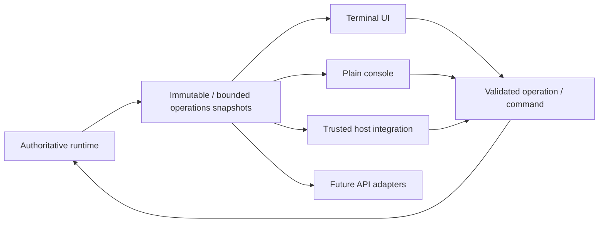
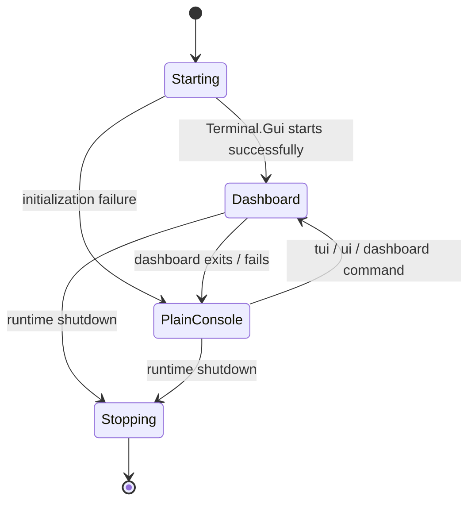
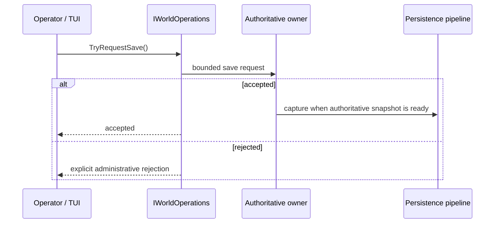
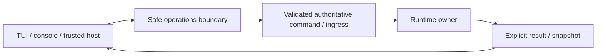

# Operations, startup и Terminal UI

[English](../en/operations-tui.md) · [Документация](README.md) · [Архитектура](architecture.md) · [Host interfaces](host-interfaces.md)

## 1. Назначение

Operations layer предоставляет bounded read models и safe control surfaces, не позволяя UI code напрямую обходить или мутировать authoritative runtime collections.



Terminal.Gui v2 является current local UI implementation, но boundary toolkit-independent.

## 2. Startup без аргументов

Normal startup без `--world` создаёт required runtime directories и сканирует canonical `Worlds/` через local selector. Selected `.wld` становится effective `--world`. Cancel selection завершает startup чисто.

Directory layout остаётся literal filesystem structure:

```text
Worlds/
config/
data/
logs/
```

## 3. Основные server options

```text
--world <path.wld>
--port <1..65535>
--max-players <1..255>
--interest-management
--tui
--no-tui
```

Defaults: `port = 7777`, `max players = 8`, TUI enabled, interest management disabled. Это configuration values/identifiers, а не dimensional measurements, поэтому они остаются code literals.

`--tui` accepted explicitly, хотя TUI default-on. `--no-tui` выключает его.

Special startup paths включают `--help`, `--list-world-generators`, CI smoke modes и `--save-wld`.

## 4. TUI lifecycle



UI работает на собственном background thread `TerraRuntime Terminal UI`, не на authoritative game-loop thread. `TerminalUiHost` владеет linked cancellation и ждёт UI thread только bounded interval при disposal.

## 5. Refresh model

Dashboard refresh идёт из Terminal.Gui application iteration callback примерно с периодом

$$
T_{\mathrm{refresh}}\approx500\,\mathrm{ms}.
$$

UI читает operations snapshots и не ходит напрямую по mutable player/NPC/projectile/world collections.

## 6. Dashboard data

Current operations read models покрывают lifecycle/runtime status, tick/TPS/phase timing, players, NPCs, projectiles, world items, networking/queues, world state/clock, save/persistence и bounded logs/warnings.

Window layout может эволюционировать; snapshot ownership остаётся invariant.

## 7. Save telemetry и manual checkpoint

World-save status публикует persistence acceptance, tile-shadow readiness, remaining bootstrap/dirty sections, requested state, active/pending writes и accepted/started/completed/coalesced/failed counters.

**Actions → Save world checkpoint** вызывает `IWorldOperations.TryRequestSave()` и проходит persistence ingress, не получая save service или mutable tile shadow.



ANSI TUI smoke проходит реальный menu path (`Alt+A`, затем `S`) и проверяет pending-save state; unit tests покрывают accepted/rejected requests.

## 8. Network telemetry

`INetworkOperations` отдаёт bounded network state без передачи UI ownership connection lifecycle. Он включает active/registered connections, admission totals/rejections, inbound rate/per-connection details, outbound backpressure/high-water state, slow clients, replication counters, typed terminal stops и normalized frame-rejection categories.

TUI потребляет subsystem-owned counters, а не парсит log text и не создаёт duplicate packet-hot-path counters.

## 9. Logs

TUI потребляет bounded log state и не является logging backend. UI failure не теряет authoritative state, rendering не блокирует game loop, retained history bounded, future structured pipeline сохраняет event/category identity.

См. [Observability и logging](observability-logging.md) и logging roadmap.

## 10. Plain console fallback

Literal fallback commands:

```text
tui | ui | dashboard   снова открыть dashboard
clear                  очистить console, если поддерживается
help                   показать fallback-console commands
```

Unknown commands reported, а не превращаются в runtime mutations. Closed/redirected stdin ждёт, а не busy-loop'ит.

## 11. Trusted host dashboards

CoreCLR trusted hosts могут регистрировать complete dashboards через `ITerraRuntimeTerminalDashboardRegistry`.

Provider задаёт stable `Id`, display `Title`, `CreateDashboard()` и `Refresh(View rootView)` на Terminal.Gui UI thread. Он предоставляет собственный root view и не inject'ит arbitrary controls в built-in TerraRuntime dashboard.

Registration metadata/factory-oriented и не выдаёт mutable runtime state.

## 12. UI-thread ownership

Terminal.Gui views остаются UI-thread objects. Dashboard provider обновляет свой view из `Refresh`, а gameplay/runtime work запрашивает через safe contracts. `View` не может становиться synchronization primitive authoritative state.

## 13. Правило administrative mutation



Implemented examples: interest-management enable/disable через authoritative command ingress и manual checkpoint через `IWorldOperations.TryRequestSave()`.

Работа в одном process не даёт TUI direct-mutation shortcut.

## 14. Headless и extensible profiles

Отключение TUI не отключает server. NativeAOT/CoreCLR profiles остаются functional без successful graphical terminal session.

CoreCLR может загрузить trusted host modules вроде Vega за `TerraRuntime.HostContracts`; ordinary Vega plugins остаются за Vega plugin SDK. NativeAOT не выполняет arbitrary managed DLL loading.

## 15. Текущие ограничения

Ещё развиваются complete structured event IDs/logging, deeper subsystem-owned packet/security telemetry, final dashboard layout/UX, future remote/web adapters, richer safe administrative actions и panel-specific docs.

## 16. Checklist изменения operations/TUI

Operations/TUI change не завершён, пока UI work остаётся вне authoritative thread, read models immutable/bounded, mutations проходят safe operations, UI failure деградирует без shutdown server, terminal input не busy-loop'ит, host dashboards не получают mutable implementation state, diagrams используют Mermaid, dimensional timings используют LaTeX, и эта page изменена вместе с `docs/en/operations-tui.md`.
