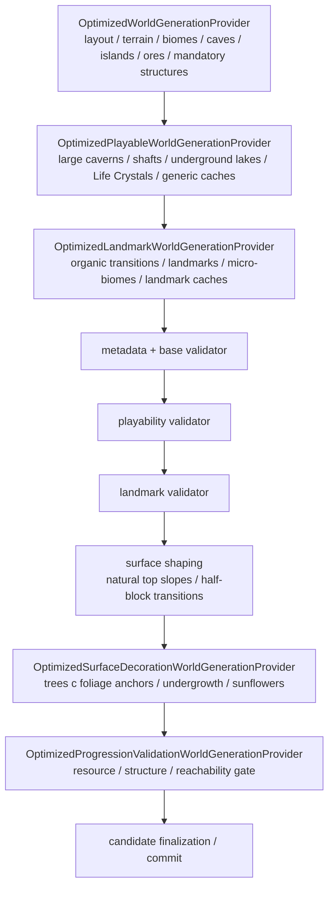

# Оптимизированная генерация мира

`terraruntime:optimized` — production-oriented собственный генератор TerraRuntime. Он намеренно **не** обещает
seed-identical генерацию Terraria. Контракт другой: одинаковые версия TerraRuntime и seed должны воспроизводить один и
тот же candidate, обязательные роли мира обязаны помещаться, content IDs должны оставаться совместимыми с официальным
клиентом, а результат должен быть визуально цельным и проходимым без импорта второго мира.

`terraruntime:vanilla` остаётся профилем source/reference parity. Optimized его не заменяет.

## Раскладка исходников

Встроенные генераторы разделены по профилям:

```text
src/TerraRuntime.World/Generation/
├── Flat/
├── Optimized/
├── Skyblock/
└── Vanilla/
```

Optimized строится слоями, а не одним разрастающимся provider:



Все optimized passes используют `WorldGenerationRngMode.IsolatedDeterministic`. Поэтому новый несвязанный pass не
должен сдвигать random stream уже существующего pass.

## Что сейчас генерируется

Optimized profile сейчас создаёт и валидирует:

- защищённую центральную spawn-зону и стартового Guide;
- оба океана и beaches с проверяемым непрерывным дном basin;
- forest, snow, desert, jungle, corruption/crimson и underground mushroom regions;
- Underworld band с Lava, Hellstone и Hellforge;
- малые correlated caves, крупные warped caverns, vertical shafts и inland underground lakes;
- несколько floating islands;
- dungeon, jungle hive, Jungle Temple и Aether/Shimmer pocket;
- pre-Hardmode ore tiers;
- масштабируемый по площади мира бюджет Life Crystals;
- persistent surface, underground и cavern exploration caches;
- persistent sky houses на части floating islands;
- отдельные Floating Lakes на других островах;
- детерминированные desert pyramids с внутренней chamber и persistent cache;
- полые Living Wood trees с roots, underground room и persistent cache;
- ограниченное число Underworld houses, соединённых волнистыми platform bridges;
- granite, marble и spider/cobweb micro-biomes;
- явный читаемый вход в dungeon;
- domain-warped material tongues на границах snow, desert, jungle и world evil;
- детерминированные обычные forest/jungle/snow trees, surface undergrowth и sunflower patches, которые ставятся после landmarks и обходят progression objects/caches.
- отдельный deterministic surface-finishing pass превращает чистые однотайловые перепады natural terrain в сохраняемые walkable slopes/half-blocks; верхушки обычных optimized trees получают vanilla-format foliage anchors вместо голого последнего trunk tile.

Landmark layer использует только tile/wall identities, которые уже source-backed текущей работой репозитория с
TerrariaServer `1.4.5.8`. Loot landmark caches пока намеренно собственный и консервативный, пока полный vanilla
biome-loot catalog не подтверждён source-backed данными.

## Органичные переходы

Base generator по-прежнему владеет крупной раскладкой биомов. Landmark pass не переставляет биомы после резервирования
major structures. Вместо этого он измеряет уже созданный material band, находит границы и выращивает в соседнюю
естественную породу детерминированные noise-shaped tongues. Заменяться могут только natural terrain families, поэтому
ores, frame-important objects и обязательные structures не рассматриваются как материал для перекраски.

Это убирает наиболее заметные прямые вертикальные границы, не ломая bounded layout contract.

## Роли летающих островов

Sky terrain сканируется как отдельные горизонтальные masses. Landmark pass назначает две роли:

- **sky house**: Sunplate shell, Disc Wall interior и persistent custom sky cache;
- **Floating Lake**: ограниченный вырезанный water basin внутри существующей island mass.

У обеих ролей есть явные минимальные бюджеты. Если pass не может разместить требуемое число houses/lakes, generation
завершается ошибкой вместо тихой публикации неполного мира.

Текущий sky cache не выдаётся за точное vanilla Skyware loot. Source-backed роли Starfury/Horseshoe/Balloon остаются
отдельной progression-задачей.

## Наземные и подземные landmarks

### Pyramids

Desert surface spans определяются по реально сгенерированному материалу, а не по захардкоженным X. Генератор выводит
budget из ширины мира, сначала строит сплошную sandstone-brick массу, затем вырезает surface opening, внутренний shaft
и chamber, после чего сохраняет cache внутри.

### Living trees

Forest candidates выбираются вне защищённой spawn envelope. Каждое дерево имеет Living Wood trunk, Leaf Block crown,
roots, полое вертикальное ядро, underground room из Living Wood и persistent cache.

### Underworld settlements

Underworld получает ограниченное число Ash houses. Открытые проходы и platform bridges делают structures
используемыми без угадывания furniture/door frame metadata. Более богатые vanilla-inspired наборы мебели можно добавить
после source-backed подтверждения соответствующих content contracts.

## Micro-biomes

Landmark pass добавляет ограниченные granite и marble lenses, а также spider grottoes. Spider grotto вырезает подземную
chamber, ставит source-backed unsafe spider wall и распределяет Cobweb tiles. Placement отклоняет зоны рядом с
frame-important, hive, temple, dungeon, chest, Honey и Shimmer content.

Это визуальные/exploration роли, а не заявление о повторении точных vanilla placement algorithms.

## Гарантированный progression-контент

После landmark validation `terraruntime:optimized` теперь добавляет 2x2 Shadow Orb или Crimson Heart с budget по размеру
мира и закреплённым контрактом framing 1.4.5.8 (`+36` frame-X для Crimson), сухие 3x3 Larva anchors внутри Hive, один
persistent `Jungle Progression Cache` с source-backed Jungle Spores/Stingers/Vines и сухой Underworld forge pocket с
доступными Obsidian и открытым Hellstone. Финальный topology validator считает все четыре роли обязательными route targets.

Размещение Larva доказывает только worldgen anchor. Семантика разрушения Larva/активации Queen Bee принадлежит gameplay
runtime и здесь намеренно не объявляется завершённой.

## Validation

Generation остаётся fail-closed. Landmark validator запускается после существующих geography/playability validators и
требует:

- точные бюджеты sky houses и Floating Lakes;
- точные бюджеты pyramids, Living Trees и Underworld houses;
- точные бюджеты granite, marble и spider grottoes;
- нетривиальное число warped biome-transition cells;
- persistent side-table entries для landmark chests;
- минимальные количества material/wall для каждого landmark family;
- успешно открытый dungeon entrance.

Это намеренно строже проверки одного representative tile. Наполовину созданный набор landmarks отклоняется.

После него финальный `OptimizedProgressionValidationWorldGenerationProvider` сканирует уже post-landmark candidate. Он
требует масштабируемые по площади минимумы Copper, Iron, Silver, Gold и Hellstone; проверяет полные 3x2 footprints
Demon/Crimson Altar, Hellforge и Lihzahrd Altar; требует нетривиальные связные interiors dungeon, hive и Jungle Temple;
а также строит ограниченный excavation-aware reachability graph от spawn до snow, desert, jungle, world evil, dungeon
entrance, hive interior, Jungle Temple entrance и Underworld Hellforge. Обычная порода учитывается как стоимость
прокапывания, а плотные Lihzahrd barriers и глубокая Lava считаются блокирующими. Это structural topology gate, а не
заявление о pixel-exact физике движения игрока или точной tool progression Terraria.

## Совместимость и не-цели

Одинаковый seed **не обязан** создавать тот же мир, что Terraria. Для source/reference parity используется
`terraruntime:vanilla`.

Optimized worlds всё ещё ориентированы на official-client-compatible tile, wall, liquid, object и `.wld` finalization
contracts. Загрузка существующего vanilla `.wld` не зависит от генератора новых миров.

## Что ещё осталось

Landmark и final progression-validation slices закрывают заметные visual/content и structural gaps, но
`terraruntime:optimized` ещё не production-complete.
Основные оставшиеся задачи:

- настоящие source-backed biome и Skyware loot families;
- dungeon locked chest/key progression и более богатые dungeon branches/traps;
- несколько hives и более сильная гарантия Queen Bee space на больших мирах;
- glowing-mushroom и дополнительные decorative micro-biomes;
- Hardmode-ready mutation anchors;
- измерения generation time и peak memory на Small/Medium/Large;
- deterministic map/screenshot visual-regression fixtures;
- acceptance через pinned TerrariaServer `1.4.5.8` и official-client join smoke.

Список работ находится в [`../roadmap/optimized-worldgen.md`](../roadmap/optimized-worldgen.md).
