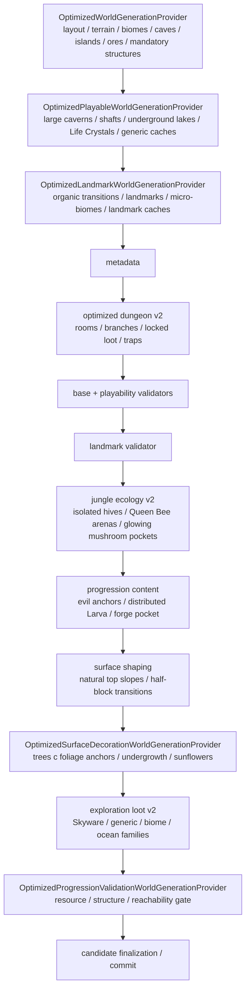

# Оптимизированная генерация мира

`terraruntime:optimized` — production-oriented собственный генератор TerraRuntime. Он намеренно **не** обещает
seed-identical генерацию Terraria. Контракт другой: одинаковые версия TerraRuntime и seed должны воспроизводить один и
тот же candidate, обязательные роли мира обязаны помещаться, content IDs должны оставаться совместимыми с официальным
клиентом, а результат должен быть визуально цельным и проходимым без импорта второго мира.

`terraruntime:vanilla` остаётся профилем source/reference parity. Optimized его не заменяет.

## Раскладка исходников

Встроенные генераторы разделены по профилям:

```text
src/TerraRuntime.World/Generation/
├── Flat/
├── Optimized/
├── Skyblock/
└── Vanilla/
```

Optimized строится слоями, а не одним разрастающимся provider:



Все optimized passes используют `WorldGenerationRngMode.IsolatedDeterministic`. Поэтому новый несвязанный pass не
должен сдвигать random stream уже существующего pass.

## Что сейчас генерируется

Optimized profile сейчас создаёт и валидирует:

- защищённую центральную spawn-зону и стартового Guide;
- оба океана и beaches с проверяемым непрерывным дном basin;
- forest, snow, desert, jungle, corruption/crimson и underground mushroom regions;
- Underworld band с Lava, Hellstone и Hellforge;
- малые correlated caves, крупные warped caverns, vertical shafts и inland underground lakes;
- несколько floating islands;
- связный dungeon graph с main rooms/branches, читаемым входом, locked dungeon loot, Golden Keys, spikes и wired dart traps;
- масштабируемые по ширине изолированные jungle hives с сухими Queen Bee arenas и Honey basins, а также Jungle Temple и Aether/Shimmer pocket;
- pre-Hardmode ore tiers;
- масштабируемый по площади мира бюджет Life Crystals;
- persistent surface, underground и cavern exploration caches с source-backed primary loot families;
- persistent sky houses, чьи caches нормализуются в source-backed Skyware primary roles;
- отдельные source-backed Snow/Ice, Jungle, Underground Desert и левый/правый Ocean exploration caches;
- отдельные Floating Lakes на других островах;
- детерминированные desert pyramids с внутренней chamber и persistent cache;
- полые Living Wood trees с roots, underground room и persistent cache;
- ограниченное число Underworld houses, соединённых волнистыми platform bridges;
- granite, marble, spider/cobweb и отдельные glowing-mushroom cave micro-biomes;
- domain-warped material tongues на границах snow, desert, jungle и world evil;
- детерминированные обычные forest/jungle/snow trees, surface undergrowth и sunflower patches, которые ставятся после landmarks и обходят progression objects/caches;
- deterministic surface-finishing pass, который превращает чистые однотайловые перепады natural terrain в сохраняемые walkable slopes/half-blocks и публикует vanilla-format foliage anchors для обычных деревьев.

Landmark layer использует tile/wall identities, которые уже source-backed текущей работой репозитория с TerrariaServer
`1.4.5.8`. Exploration loot теперь использует pinned source primary families, а содержимое pyramid, Living Tree и
Underworld landmark caches остаётся намеренно собственными ролями, а не заявлением о точных vanilla chest tables.

## Органичные переходы

Base generator по-прежнему владеет крупной раскладкой биомов. Landmark pass не переставляет биомы после резервирования
major structures. Вместо этого он измеряет уже созданный material band, находит границы и выращивает в соседнюю
естественную породу детерминированные noise-shaped tongues. Заменяться могут только natural terrain families, поэтому
ores, frame-important objects и обязательные structures не рассматриваются как материал для перекраски.

Это убирает наиболее заметные прямые вертикальные границы, не ломая bounded layout contract.

## Роли летающих островов

Sky terrain сканируется как отдельные горизонтальные masses. Landmark pass назначает две distinct роли:

- **sky house**: Sunplate shell, Disc Wall interior и persistent sky cache;
- **Floating Lake**: ограниченный вырезанный water basin внутри существующей island mass.

У обеих ролей есть явные минимальные бюджеты. Если pass не может разместить требуемое число houses/lakes, generation
завершается ошибкой вместо тихой публикации неполного мира.

Финальный exploration-loot pass заменяет side table каждого sky cache на детерминированный primary item из pinned
Skyware family TerrariaServer `1.4.5.8`: Shiny Red Balloon, Starfury, Lucky Horseshoe или Celestial Magnet. Раскладка
optimized остаётся собственной и детерминированной: это source-backed покрытие роли, а не seed-identical генерация
Skyware chests.

## Exploration loot v2

Финальный quality overlay запускает `terraruntime:optimized/exploration-loot-v2` после surface decoration и перед
финальной progression validation. Для уже существующих generic/sky caches он меняет только runtime-owned chest side
table, поэтому coordinates, dense chest slot identity, names и tile geometry сохраняются. Новое содержимое проходит ту
же проверку vanilla item/prefix, что и при первоначальной регистрации generated chest.

Primary families закреплены по world-generation веткам TerrariaServer `1.4.5.8`: Skyware, обычные Surface,
Underground, Ice/Snow, Jungle, Underground Desert и Underwater/Ocean. Generic caches локализуются в Ice, Jungle или
Desert family, если окружающий material подтверждает соответствующий biome; отдельные Snow, Jungle и Desert caches плюс
по одному cache в каждом океане гарантируют эти exploration-роли даже когда generic placement не попал в biome. Utility
filler ограничен source-backed chest items, включая Rope, Recall Potions, Torches и ограниченное семейство potions.

Desert caches используют source-backed семейство `Containers2`. Поэтому world validator принимает полный chest
footprint, когда все четыре клетки согласованно используют vanilla container tile `21` или `467`; смешанные и
повреждённые footprints по-прежнему fail-closed.

## Dungeon v2

Финальный optimized profile перестраивает только заранее зарезервированный Blue Dungeon footprint. Pass формирует
детерминированную цепочку проходимых main rooms, чередующиеся боковые branches и связанный с поверхностью вход, при этом
сохраняя footprint уже существующих persistent chests, если они попали внутрь reservation. Затем создаётся открытый
entrance cache с количеством Golden Keys не меньше числа generated locked chests, source-backed dungeon primary loot,
ограниченные поля Spike и пары pressure plate / dart trap, соединённые red wire.

Алгоритм намеренно собственный и не заявляет seed-identical parity с Terraria. Для locked chest style/framing, Golden
Keys, Muramasa, Cobalt Shield, Aqua Scepter, Blue Moon, Magic Missile, Valor, Handgun, pressure plates и dart traps
используются source-backed контракты TerrariaServer 1.4.5.8. Generation завершается ошибкой, если не выполнены контракты
связности комнат, количества locked chests, баланса ключей, budgets traps/spikes, framing сундуков или читаемости входа.

## Наземные и подземные landmarks

### Pyramids

Desert surface spans определяются по реально сгенерированному материалу, а не по захардкоженным X. Генератор выводит
budget из ширины мира, сначала строит сплошную sandstone-brick массу, затем вырезает surface opening, внутренний shaft
и chamber, после чего сохраняет cache внутри.

### Living trees

Forest candidates выбираются вне защищённой spawn envelope. Каждое дерево имеет Living Wood trunk, Leaf Block crown,
roots, полое вертикальное ядро, underground room из Living Wood и persistent cache.

### Underworld settlements

Underworld получает ограниченное число Ash houses. Открытые проходы и platform bridges делают structures
используемыми без угадывания furniture/door frame metadata. Более богатые vanilla-inspired наборы мебели можно добавить
после source-backed подтверждения соответствующих content contracts.

## Micro-biomes

Landmark pass добавляет ограниченные granite и marble lenses, а также spider grottoes. Spider grotto вырезает подземную
chamber, ставит source-backed unsafe spider wall и распределяет Cobweb tiles. Placement отклоняет зоны рядом с
frame-important, hive, temple, dungeon, chest, Honey и Shimmer content.

Это визуальные/exploration роли, а не заявление о повторении точных vanilla placement algorithms.

## Jungle ecology v2

После landmark validation pass `terraruntime:optimized/jungle-ecology-v2` считает фактические connected components стены
`HiveUnsafe` авторитетными границами ульев. Финальный profile требует один изолированный hive на Small, два на Medium
и три на более крупных мирах. Каждый component нормализуется так, чтобы сохранить сухую combat arena, нижний Honey
basin и как минимум одно сухое место 3x3 для Larva. Недостающие hives размещаются только в подтверждённой материалом
jungle-зоне; full-cell проверки запрещают затрагивать frame-important objects, dungeon/Temple content, Shimmer и уже
существующие hives.

Progression-content затем ставит не более одной Larva в каждый отдельный hive до compatibility fallback, поэтому
финальный budget 1/2/3 распределён по разным компонентам, а не скучен в одном улье. Семантика активации/разрушения
Larva и Queen Bee остаётся gameplay-owned; worldgen доказывает контракт арены и anchor.

Тот же ecology pass добавляет детерминированные underground glowing-mushroom pockets с budget 1/2/3/4 по ширине мира.
Pockets не сливаются друг с другом или с baseline mushroom region и обходят frame-important, hive, Temple, dungeon,
Honey и Shimmer content. Placement остаётся собственной детерминированной логикой TerraRuntime, без заявления о
seed-identical размещении micro-biomes Terraria.

## Гарантированный progression-контент

После landmark validation `terraruntime:optimized` добавляет 2x2 Shadow Orb или Crimson Heart с budget по размеру мира и
закреплённым контрактом framing 1.4.5.8 (`+36` frame-X для Crimson), сухие 3x3 Larva anchors, распределённые по изолированным hive components, один persistent
`Jungle Progression Cache` с source-backed Jungle Spores/Stingers/Vines и сухой Underworld forge pocket с доступными
Obsidian и открытым Hellstone. Финальный topology validator считает все четыре роли обязательными route targets.

Размещение Larva доказывает только worldgen anchor. Семантика разрушения Larva/активации Queen Bee принадлежит gameplay
runtime и здесь намеренно не объявляется завершённой.

## Validation

Generation остаётся fail-closed. Перед playability validation неполные фрагменты Life Crystal удаляются, полные 2x2 frame footprints пересчитываются, а недостающие объекты детерминированно восстанавливаются до исходного area-scaled target без снижения минимума. После этого validators требуют точные landmark budgets, persistent chest side-table entries,
source-backed exploration-loot family budgets, минимальные material/wall counts, читаемый dungeon entrance, Dungeon v2
room/loot/trap contracts и финальную progression topology. Финальный
`OptimizedProgressionValidationWorldGenerationProvider` требует масштабируемые по площади минимумы Copper, Iron,
Silver, Gold и Hellstone; проверяет полные footprints progression objects; требует нетривиальные связные interiors
dungeon, hive и Jungle Temple; а также строит bounded excavation-aware reachability graph от spawn до обязательных
surface/deep-world targets. Это structural topology gate, а не заявление о pixel-exact физике движения игрока или точной
tool progression Terraria.

## Совместимость и не-цели

Одинаковый seed **не обязан** создавать тот же мир, что Terraria. Для source/reference parity используется
`terraruntime:vanilla`.

Optimized worlds всё ещё ориентированы на official-client-compatible tile, wall, liquid, object и `.wld` finalization
contracts. Загрузка существующего vanilla `.wld` не зависит от генератора новых миров.

## Что ещё осталось

`terraruntime:optimized` ещё не production-complete. Основные оставшиеся задачи:

- Hardmode-ready mutation anchors;
- более богатые source-backed furniture/loot/resource families для Underworld settlements;
- измерения generation time и peak memory на Small/Medium/Large;
- deterministic map/screenshot visual-regression fixtures;
- acceptance через pinned TerrariaServer `1.4.5.8` и official-client join smoke.

Список работ находится в [`../roadmap/optimized-worldgen.md`](../roadmap/optimized-worldgen.md).