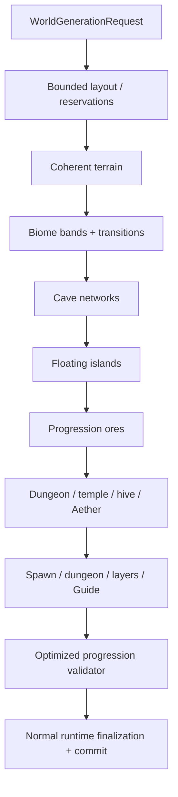

# Оптимизированная генерация мира

`terraruntime:optimized` — собственный production-oriented генератор мира TerraRuntime. Он намеренно **не** обязан
создавать тот же мир, что Terraria, при одинаковом seed. Его контракт строг в другом месте: каждый опубликованный мир
должен быть детерминированным для той же версии TerraRuntime и seed, вмещать все обязательные зоны в заданные размеры
карты, оставаться совместимым с набором контента официального клиента и содержать географию и структуры, необходимые
для нормального прохождения.

`terraruntime:vanilla` остаётся профилем source-parity. Оптимизированный профиль его не заменяет.

## Цели проектирования

Оптимизированный генератор строится вокруг четырёх правил:

1. **Сначала план, потом рисование.** Крупные структуры и progression-зоны получают ограниченные reservation до
   изменения terrain.
2. **Для органичной геометрии разрешена собственная математика.** Terrain, caves и floating islands могут использовать
   deterministic value noise, fractal combinations, random walks, signed-distance-подобные маски и другие измеренные
   позднее алгоритмы. Повторять историческую реализацию Re-Logic не требуется.
3. **Gameplay requirements являются жёсткими требованиями.** Обязательный dungeon, temple, ocean или progression
   resource не является пожеланием RNG. Если объект не помещается или исчез, generation завершается ошибкой до commit.
4. **Validation является частью generation.** Candidate нельзя публиковать только потому, что все passes вернулись без
   exception.

Все текущие passes используют `WorldGenerationRngMode.IsolatedDeterministic`. Поэтому добавление несвязанного нового
pass в будущем не должно сдвигать RNG stream уже существующих passes.

## Текущий реализованный срез

Первая реализация резервирует и генерирует:

- безопасную центральную spawn-зону и стартового Guide;
- левый и правый oceans с ограниченными beaches;
- forest terrain, а также snow, desert, jungle, world evil и underground mushroom regions;
- Underworld band с Lava и Hellstone;
- детерминированные органичные cave networks;
- несколько floating islands внутри заранее выделенных sky regions;
- dungeon region на стороне, противоположной jungle;
- jungle hive с Honey;
- ограниченный Jungle Temple с Lihzahrd brick и Lihzahrd Altar;
- Aether pocket с Shimmer;
- Demon Altar в world-evil зоне и Hellforge в Underworld;
- первые четыре pre-hardmode ore tiers.

Финальный optimized validation pass явно проверяет перечисленные обязательные regions и materials. При ошибке candidate
отбрасывается существующим world-generation pipeline.

## Гарантии layout

Layout pass рассматривает крупные структуры как прямоугольники с явными bounds и collision checks. Текущий минимальный
размер candidate — `512x240`; меньший запрос отклоняется до terrain generation, потому что TerraRuntime не может
гарантировать там разумную полную раскладку.

Biome bands могут содержать structures намеренно. Но reservations крупных structures не должны пересекаться друг с
другом. Floating islands удерживаются выше обычного terrain envelope и внутри ocean margins.

Это принципиально отличается от схемы «попробовать N случайных позиций и молча сдаться»: для обязательного контента
место выделено ещё до дорогих passes.

## Визуальное качество

Surface heightfield объединяет несколько детерминированных one-dimensional noise octaves разных масштабов. Spawn area
плавно смешивается с более спокойным профилем вместо жёсткой прямоугольной площадки. Cave paths строятся
коррелированными random walks с меняющимся radius. Floating islands используют ellipse/SDF-подобную форму с
низкочастотным perturbation вместо прямоугольных кусков.

Эти алгоритмы намеренно заменяемы. Визуальное улучшение допустимо, если сохраняются детерминизм новой версии
генератора, bounded work, official-client content IDs и все validation guarantees.

## Совместимость и не-цели

Одинаковый текстовый или числовой seed **не обязан** создавать тот же мир, что Terraria. Для source/reference parity
используется `terraruntime:vanilla`.

При этом optimized profile по-прежнему ориентирован на official-client-compatible tiles, walls, liquids, metadata и
`.wld` finalization. Загрузка существующих vanilla worlds не зависит от того, какой generator создаёт новые миры.

## Оставшаяся работа по progression и качеству

Первый срез создаёт обязательную географию и основные progression anchors, но это ещё не финальный content pass. До
production-complete состояния roadmap требует:

- более богатый граф dungeon rooms, locked/dungeon loot и разнообразие structures;
- гарантированные Floating Island house/loot variants и Floating Lakes;
- распределение Life Crystals и chests с progression-aware loot tables;
- полноценные Underworld houses и resource distribution;
- pyramids, living trees и representative micro-biomes с ограниченными minimum/maximum counts;
- более сильные гарантии traversal в jungle/temple и поддержку hive/Queen Bee progression;
- vegetation, decoration и transition passes без разрушения читаемого силуэта biomes;
- проверки reachability/progression сверх простого наличия, включая spawn safety и доступ к critical structures;
- измерения generation time, allocations и output quality на Small/Medium/Large worlds;
- acceptance generated `.wld` официальным client/server и deterministic replay artifacts.

До закрытия этих gates `terraruntime:optimized` является активно развиваемым встроенным профилем, а не заявлением о
полной parity всего world-content Terraria.

Список работ находится в [`../roadmap/optimized-worldgen.md`](../roadmap/optimized-worldgen.md).
