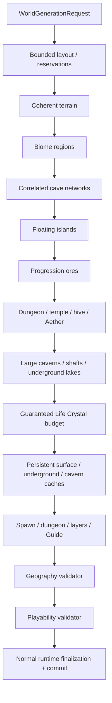

# Оптимизированная генерация мира

`terraruntime:optimized` — собственный production-oriented генератор мира TerraRuntime. Он намеренно **не** обязан
создавать тот же мир, что Terraria, при одинаковом seed. Его контракт строг в другом месте: каждый опубликованный мир
должен быть детерминированным для той же версии TerraRuntime и seed, вмещать все обязательные зоны в заданные размеры
карты, оставаться совместимым с набором контента официального клиента и содержать географию и progression-ресурсы,
необходимые для нормального прохождения.

`terraruntime:vanilla` остаётся профилем source-parity. Оптимизированный профиль его не заменяет.

## Раскладка исходников

Реализации встроенных генераторов находятся под `src/TerraRuntime.World/Generation/` и разделены по профилям:

```text
Generation/
├── Flat/
├── Optimized/
├── Skyblock/
└── Vanilla/
```

Runtime registry только явно регистрирует providers. Реализация конкретного генератора внутри registry больше не
живет.

## Цели проектирования

Оптимизированный генератор строится вокруг четырёх правил:

1. **Сначала план, потом рисование.** Крупные структуры и progression-зоны получают ограниченные reservation до
   изменения terrain.
2. **Для органичной геометрии разрешена собственная математика.** Terrain, caves и floating islands могут использовать
   deterministic value noise, fractal combinations, random walks, signed-distance-подобные маски, связанные cavern
   graphs и другие измеренные позднее алгоритмы. Повторять историческую реализацию Re-Logic не требуется.
3. **Gameplay requirements являются жёсткими требованиями.** Обязательный dungeon, temple, ocean, бюджет Life Crystals
   или другой progression resource не является пожеланием RNG. Если объект не помещается или исчез, generation
   завершается ошибкой до commit.
4. **Validation является частью generation.** Candidate нельзя публиковать только потому, что все passes вернулись без
   exception.



Все optimized passes используют `WorldGenerationRngMode.IsolatedDeterministic`. Поэтому добавление несвязанного pass
не должно сдвигать RNG stream уже существующих passes.

## Текущий реализованный срез

Текущая реализация резервирует или генерирует:

- безопасную центральную spawn-зону и стартового Guide;
- левый и правый oceans с ограниченными beaches;
- forest terrain, а также snow, desert, jungle, world evil и underground mushroom regions;
- Underworld band с Lava и Hellstone;
- детерминированные correlated cave walkers;
- крупные noise-warped cavern landmarks, соединённые извилистыми tunnels;
- естественные vertical shafts и гарантированные inland underground lakes;
- несколько floating islands внутри заранее выделенных sky regions;
- dungeon region на стороне, противоположной jungle;
- jungle hive с Honey;
- ограниченный Jungle Temple с Lihzahrd brick и Lihzahrd Altar;
- Aether pocket с Shimmer;
- Demon Altar в world-evil зоне и Hellforge в Underworld;
- первые четыре pre-hardmode ore tiers;
- детерминированный минимальный бюджет Life Crystals, масштабируемый по площади мира;
- persistent бюджеты surface, underground и cavern exploration caches.

Loot этих cache намеренно собственный и пока консервативный. Используются только item identities, уже подтверждённые
source-backed данными репозитория. Это доказывает persistent non-empty exploration loot, но не выдаётся за готовую
замену полных vanilla chest loot tables.

## Органичная подземная геометрия

Базовые correlated cave walkers дают локальные tunnels. Playability overlay добавляет крупные landmarks через warped
signed-distance field, после чего принятые caverns соединяются детерминированными извилистыми tunnels. Часть caverns
получает ограниченные водные бассейны, а один или несколько natural shafts связывают вертикальные слои в стороне от
защищённой spawn envelope.

При carving защищаются frame-important objects, dungeon material, hive/temple content, Honey и Shimmer. После overlay
всё равно запускается исходный geography validator, поэтому визуальный pass не может тихо стереть обязательную
структуру и всё равно опубликовать candidate.

Цель — не максимальное количество пустоты. Малые tunnels, большие rooms, водные landmarks и вертикальные разрывы
должны создавать читаемый ритм исследования вместо одной равномерной random-walk текстуры.

## Бюджеты progression

Life Crystals используют source-backed Terraria `1.4.5.8` tile identity, уже проверяемый vanilla post-settle
world-generation реализацией. Optimized profile выводит ограниченный target из площади карты, сначала пытается
органично разместить crystals на полу caves, а затем использует детерминированные безопасные fallback niches, если RNG
не смог закрыть target. Pass завершается ошибкой, если полный бюджет разместить не удалось.

Surface, underground и cavern chests имеют отдельные бюджеты, масштабируемые по ширине мира. Chest tiles и persistent
chest side table коммитятся совместно через `IWorldGenerationChestWorkspace`. Просто нарисованный chest tile без
side-table записи не считается успешно созданным cache.

## Проверка играбельности

Исходный optimized validator продолжает проверять крупную географию. Второй fail-closed validator дополнительно
проверяет:

- сохранность всех требуемых Life Crystal objects;
- полный persistent бюджет generated chests и корректный tile anchor каждого chest;
- выполнение минимумов по large caverns, underground lakes и vertical shafts;
- наличие вокруг spawn ограниченного количества сухих walkable columns высотой минимум в две tiles.

Эти проверки намеренно сильнее проверки одного representative tile. Pass, который тихо сдался на половине target, не
может отметить candidate готовым.

## Гарантии layout

Layout pass рассматривает крупные структуры как прямоугольники с явными bounds и collision checks. Текущий минимальный
размер candidate — `512x240`; меньший запрос отклоняется до terrain generation, потому что TerraRuntime не может
гарантировать там разумную полную раскладку.

Biome regions могут содержать structures намеренно. Но reservations крупных structures не должны пересекаться друг с
другом. Floating islands удерживаются выше обычного terrain envelope и внутри ocean margins.

Это принципиально отличается от схемы «попробовать N случайных позиций и молча сдаться»: место для обязательного
контента выделяется до дорогих passes, а post-layout resource budgets имеют fail-closed fallback placement.

## Визуальное качество

Surface heightfield объединяет несколько детерминированных one-dimensional noise octaves разных масштабов. Spawn area
плавно смешивается с более спокойным профилем вместо жёсткой прямоугольной площадки. Малые caves используют correlated
random walks с меняющимся radius, крупные caverns — two-dimensional fractal-noise warp, а floating islands —
ellipse/SDF-подобную форму с low-frequency perturbation вместо прямоугольных кусков.

Эти алгоритмы намеренно заменяемы. Визуальное улучшение допустимо, если сохраняются детерминизм новой версии
генератора, bounded work, official-client content IDs и все validation guarantees.

## Совместимость и не-цели

Одинаковый текстовый или числовой seed **не обязан** создавать тот же мир, что Terraria. Для source/reference parity
используется `terraruntime:vanilla`.

При этом optimized profile по-прежнему ориентирован на official-client-compatible tiles, walls, liquids, metadata и
`.wld` finalization. Загрузка существующих vanilla worlds не зависит от того, какой generator создаёт новые миры.

## Оставшаяся работа по progression и качеству

Текущий срез уже заметно ближе к реальной игре, но это ещё не финальный content pass. До production-complete состояния
roadmap всё ещё требует:

- более богатый граф dungeon rooms, locked/dungeon loot и разнообразие structures;
- гарантированные Floating Island house/loot variants и отдельные Floating Lakes;
- полноценные biome-aware chest loot families вместо текущих консервативных custom caches;
- Shadow Orb / Crimson Heart progression anchors;
- полноценные Underworld houses и resource distribution;
- pyramids, living trees и representative granite/marble/spider/mushroom micro-biomes с ограниченными counts;
- более сильные гарантии traversal в jungle/temple и несколько hives с Queen Bee space на больших мирах;
- vegetation, decoration и domain-warped biome transition passes без разрушения читаемого силуэта biomes;
- path/reachability checks от spawn до critical entrances вместо одной проверки starter-area safety;
- minimum ore/resource quantity gates и hardmode-ready anchor validation;
- измерения generation time, allocations и output quality на Small/Medium/Large worlds;
- acceptance generated `.wld` официальным client/server и deterministic visual-regression artifacts.

До закрытия этих gates `terraruntime:optimized` является активно развиваемым встроенным профилем, а не заявлением о
полной parity всего world-content Terraria.

Список работ находится в [`../roadmap/optimized-worldgen.md`](../roadmap/optimized-worldgen.md).
