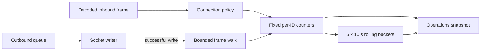

# Телеметрия пакетов по message ID

TerraRuntime ведёт ограниченную process-lifetime статистику Terraria wire-трафика по message ID и направлению. Учёт находится на сетевой границе, поэтому счётчики описывают байты, реально дошедшие до policy pipeline, и байты, которые были успешно записаны в сокет.

## Модель данных

Для каждого наблюдавшегося message ID в каждом направлении snapshot содержит:

- общее число кадров за время жизни процесса;
- общее число wire-байтов, включая двухбайтовую длину и однобайтовый message ID;
- кадры и байты в текущем скользящем окне;
- признак принадлежности ID проверенному каталогу protocol 326 `TerrariaMessageId`.

Отдельно доступны суммарные inbound/outbound кадры и байты, unknown ID и malformed inbound/outbound события. Unknown не означает malformed: wire ID занимает один байт, поэтому синтаксически корректный кадр может содержать ID, который ещё не внесён в проверенный каталог.

Существующий `TerrariaFrameRejectionTelemetry` остаётся нормализованной классификацией причин отклонения: malformed protocol, rate limit, invalid connection state, gameplay rejection и backpressure. Malformed protocol rejection одновременно увеличивает inbound malformed-message counter, поэтому operations snapshot показывает и причину отказа, и пакетное представление без второй независимой классификации.

## Поведение hot path

Учёт каждого пакета использует фиксированные массивы и `Interlocked`. На hot path нет форматирования строк, LINQ, вставок в словари и аллокаций на сообщение. По умолчанию rolling diagnostics используют шесть корзин по десять секунд, то есть окно

\[
60\,\mathrm{s}.
\]

Замена корзины ограничена и происходит только при переходе трафика в новый временной интервал.

Построение snapshot может выделять ограниченные массивы проекций, потому что это operations/read path, а не обработка пакета. Полная активная таблица lifetime-данных ограничена

\[
2 \times 256 = 512
\]

слотами направление/message ID. Дополнительно operations surface оставляет только восемь крупнейших элементов текущего rolling window для компактной диагностики.

## Inbound-семантика

Декодированный кадр учитывается до rate/state/gameplay policy. Поэтому в трафик входят и корректно сформированные пакеты, которые затем были отклонены: они уже дошли до сервера и потребовали сетевой/policy работы. Ошибки framing/protocol, из которых нельзя получить валидный message ID, учитываются как malformed.

## Outbound-семантика

Outbound кадры учитываются только после успешного `Stream.WriteAsync`. Если writer объединяет несколько готовых кадров в один socket write, телеметрия ограниченно проходит успешный буфер по Terraria framing `[u16 length][u8 message id][payload]` и считает каждый кадр отдельно. Некорректный внутренне сгенерированный буфер никогда не читается за пределами оставшегося span: увеличивается outbound malformed counter, после чего разбор прекращается.

## Operations surface

`RuntimeNetworkSnapshot` публикует суммарный message traffic, unknown/malformed counters, длительность rolling window, ограниченную таблицу по ID и top rolling traffic. Read model остаётся immutable и не заставляет TUI или будущий API обходить изменяемое состояние соединений.

## Проверка

Фокусные тесты закрепляют totals по направлениям/message ID, unknown ID, разбор batched outbound, malformed buffers, истечение rolling window без потери lifetime totals и ограниченную сортировку top-message списка.
