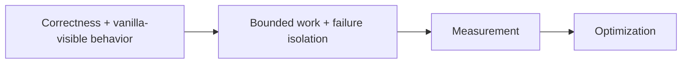
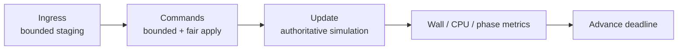
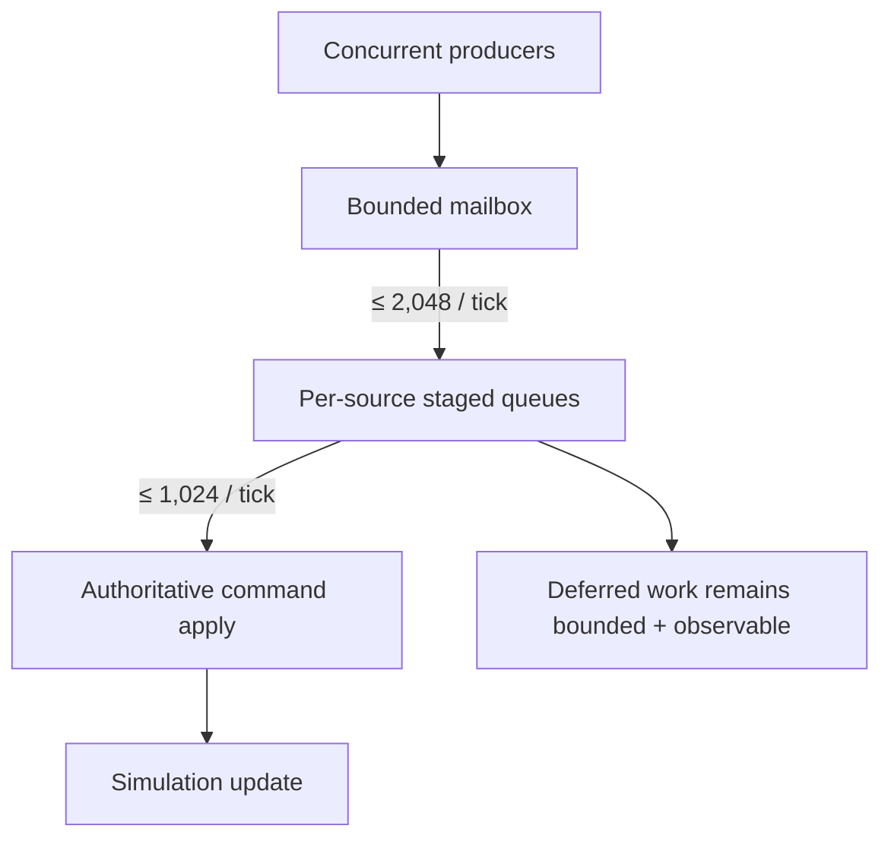
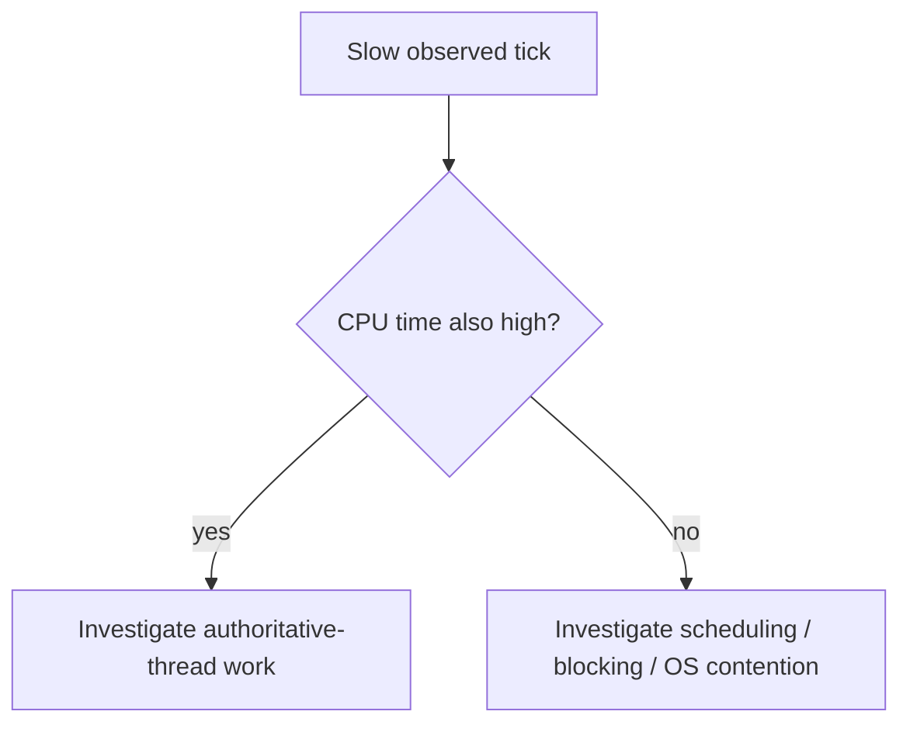
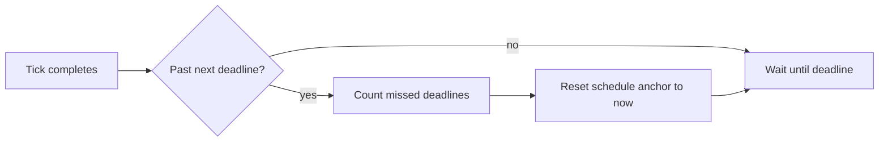
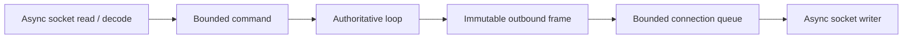
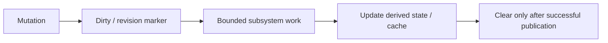

# Performance, tick scheduling и work budgets

[English](../en/performance-runtime.md) · [Документация](README.md) · [Архитектура](architecture.md) · [Performance roadmap](../roadmap/performance-tick-stability.md)

## 1. Performance model

TerraRuntime считает performance correctness constraint вокруг bounded work.

Optimization без measurement является hypothesis, а не completed performance change.

## 2. Tick rate

Terraria runtime baseline: `$60\,\mathrm{Hz}$`.

$$
T_{\mathrm{tick}}=\frac{1}{60}\,\mathrm{s}\approx16.67\,\mathrm{ms}.
$$

Generic loop допускает configured rate до `$1000\,\mathrm{Hz}$`, но higher generic frequency не означает vanilla-correct gameplay на этой частоте.

## 3. Authoritative thread и phases

`AuthoritativeGameLoop<TState,TCommand>` владеет mutable simulation state на dedicated thread `TerraRuntime Game Loop`.

## 4. Default command budgets

| Budget | Default |
|---|---:|
| `CommandCapacity` | `$8\,192$` commands |
| `MaxCommandIngressPerTick` | `$2\,048\,\text{commands/tick}$` |
| `MaxCommandsPerTick` | `$1\,024\,\text{commands/tick}$` |
| `MaxCommandsPerSourcePerTick` | `$128\,\text{commands/source/tick}$` |
| `MaxPendingCommandsPerSource` | `$1\,024\,\text{commands/source}$` |

Это hard bounded defaults, не final measurement-derived values любого workload.

Per-source pending/per-tick quotas не дают одному connection занять shared capacity или monopolize command application.

## 5. Optional CPU budget

`MaxCommandCpuMillisecondsPerTick` может задавать optional authoritative-thread CPU-time ceiling command application. Operation-count limits остаются active при unavailable thread CPU clock.

Default CPU-time value не guessed; production values должны быть measurement-derived.

## 6. CPU и wall time

Wall и CPU time отвечают на разные вопросы и остаются separate metrics.

## 7. Missed-tick policy

TerraRuntime не выполняет burst catch-up ticks.

Так один slow tick не порождает burst immediate ticks и backlog spiral.

## 8. Backlog observability

Loop отслеживает pending/deferred count, rejected commands, budget exhaustion, missed deadlines и oldest pending-command age. Stable queue depth при increasing oldest age всё равно означает starvation.

## 9. Asynchronous networking и workers

Slow TCP peer не блокирует simulation. CPU-heavy/blocking workers consume immutable snapshots/isolated buffers и возвращают explicit completion data; unbounded `Task.Run` fan-out не является architecture.

## 10. Saving

Disk serialization/write detached от authoritative hot path. Tile-save shadow synchronization по default идёт `$4\,\text{sections/tick}$`, а не copy всего tile array одной pause.

## 11. Join/bootstrap performance

Current final pre-`packet 49` contract:

$$
F_{\mathrm{pre49,max}}=65,
\qquad
F_{\mathrm{probe}}=96.
$$

Для default $P=8$ structural connection sizing:

$$
F_{\mathrm{queue}}(8)=4\,077\ \text{frames},
$$

следовательно:

$$
65 < 96 < 4\,077.
$$

Runtime entity/global baselines находятся вне final packet-10-to-packet-49 contract. Join section generation/compression всё равно требует global subsystem budgets, не per-player multiplication.

## 12. Synchronization scaling

Broad player movement fanout стремится к:

$$
W(P)=\Theta(P^2),
$$

где $P$ — active players. Interest-management infrastructure существует, но production suppression остаётся passthrough до proof visibility transitions/resync.

## 13. Dirty/revision-driven work

Dirty world sections, replication registries и prepared startup state должны заменять full scans там, где correctness допускает. Fast stale cache всё равно bug.

## 14. Allocation и GC discipline

Spans, owned/pooled buffers, immutable frame sharing и compact values применяются where measured. `unsafe`, custom allocators и broad pooling требуют evidence material benefit и проверки memory costs.

NativeAOT core не зависит от JIT-specific assumptions. CoreCLR может использовать runtime features без weakening NativeAOT production gate.

## 15. Performance telemetry

Useful telemetry: tick wall/CPU, phase timing, command processed/deferred/rejected counts, budget exhaustion, oldest pending age, queue depth/high-water marks, slow-client events, entity counts, save state, startup/cache timing и safe allocation/GC metrics.

Telemetry сама остаётся bounded/low-allocation.

## 16. Benchmark matrix

Useful scale checkpoints:

$$
P\in\{1,8,24,64,128,255\}.
$$

`$24$` players — первый meaningful realistic optimization baseline; `$255$` connections — stress/scalability target. Idle, normal-play, join-burst, slow-reader и save workloads находят разные bottlenecks.

## 17. Before/after rule

Для target metric $M$ приводятся $M_{\mathrm{before}}$ и $M_{\mathrm{after}}$ на одном hardware/environment, world и workload. Percentage без underlying measurements является weak evidence.

Complexity, которая не улучшает intended metric materially или ухудшает memory/latency/correctness, должна revert'иться.

## 18. Текущие ограничения

Active work: final measurement-derived queue limits, complete subsystem budgets, real production interest-management suppression/resync, complete packet allocation/throughput baselines, broad `$24$`-player / `$255$`-connection soak coverage, large-world startup/save/GC profiling и final section-cache/dirty synchronization tuning.

## 19. Checklist performance/scheduler change

Performance/scheduler change не завершён, пока ownership explicit, work/fairness bounded, missed-tick behavior tested, CPU/wall timing separate, performance claims имеют before/after evidence, NativeAOT valid, diagrams используют Mermaid, dimensional values/formulas используют LaTeX, и эта page изменена вместе с `docs/en/performance-runtime.md`.
