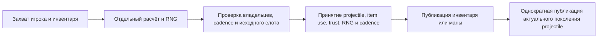

# Владение использованием предметов игрока 1.4.5.8

## Нормализация prefix в packet5 (2026-10-10, локальная проверка пройдена)

Поддерживаемые отчёты inventory и equipment нормализуют prefix до вызова наблюдателей. Существующая таблица числовой допустимости определяет, сохраняется ли запрошенный положительный prefix; отклонённый prefix выбирается повторно из семейства предмета с существующим общим gameplay-курсором. Предмет/profile, ревизии игрока и ввода, курсор и учёт принимаются вместе. Публикация повторно проверяет принятое состояние и подавляет устаревшую работу без отката.

`VanillaItemPrefixNormalization1458.IsSupported` классифицирует канонический ввод без случайных callbacks. `Resolve` получает callback отделённого курсора и явную платформенную арифметику; только `Resolved` разрешает принять предложенный курсор. `Unsupported`, `BudgetExhausted` и `InvalidDraw` сохраняют живой курсор. Поле `Applied` отличает изначально запрошенный ноль (`false`) от нуля, полученного при повторном выборе (`true`); боевую capability оно не предоставляет.

Ненулевые запросы для25 официальных variant-идентификаторов сохраняют предыдущую компонентную политику. Таблица инвариантных предметов содержит868 записей с поддержкой prefix; канонические предметы без prefix не расходуют случайные предложения. Нулевым запросам variant-defaults не нужны. Лимит256 попыток — бюджет безопасности runtime, а не предел оригинальной игры: исчерпанное принятое предложение отклоняется до изменения живого состояния и не переходит на старый путь.

Глобальное ограничение prefix>=98, ClientReported inventory, SSCfalse, отчёты до Spawn и отмена pending по совпадающему отчёту сохраняют прежние политики. Полные inventory-производители, причинность ammo-отчётов и полные ItemDefaults остаются открытыми. Владение настроенным общим курсором не доказывает целое расписание Main. Независимые168 строки LinuxGetData и266 настоящих Windows CLR4 x86 Prefix subcalls сохранены отдельно. Сравнение105 строк на платформу с одинаковым seed выявляет42 различия арифметики для21 предмета;194 из210 строк поддерживаются,16 ненулевых variant-запросов остаются reference/early-refusal. Три групповых Facts проверяют59 inventory-слотов/full56/оригинальный public-next, настоящий bootstrap claimed31 в bound0 и154 буквальных server relay, currentness/prejoin/reentry и отмену pending по совпадающему5. Game positive/restored3750 проверок; шесть omissions дают427/250/66/152/2/434 assertion failures без runner errors. App positive/restored21276 проверок; четыре omissions выявляются независимо и тремя durable Facts с одним assertion failure на omission. Первоначальный focused v1 сохраняет704/708, четыре конфликта старых consumer-negative fixtures и отсутствие full-прогона. Минимальные исправления трёх fixtures напрямую задают намеренно некорректный retained prefix в существующем owner, сохраняя все assertions/source goldens. Удаление исправлений воспроизводит два Mining/один Metal/один Style1 assertion failures; исправленные классы и restored проходят.

Release Rebuild: ноль warnings/errors; focused 708/708 проходит. ОДИН full suite: 1563116/1563117, ноль failures/errors, один известный canonical-liquid skip, runner $685.374\,\mathrm{s}$. Свежие shipping WindowsNativeAOT/пять smokes и typed managed/Native 22156 проверок каждый проходят с exact32 references; AMD64 PE CLR directory равен нулю. Native проверяет канонический inventory, независимый public seeded-next, платформенную арифметику и adoption/currentness observers; full56/private guards и154 буквальных relay остаются managed-доказательствами. Release/Native live82/49 проходит с15 sections/client,312 frames до49,129/relay/chat82 и чистой остановкой. CI-tools/docs/graph/domain/diff проходят. Новых dependency/project edges нет. Настоящий LinuxNativeAOT локально не проверен; GitHub CI не ожидается.

Evidence: `.cache/packet5-normalization-block-v2-status.json`, `.cache/packet5-normalization-block-v2-full-tests/result.json`, `.cache/packet5-normalization-shipping-bin-v2/shipping-freeze.json`, `.cache/packet5-normalization-shipping-native-v2/freeze-manifest.json`, `.cache/packet5-normalization-block-live-v2/results.json`, `.cache/packet5-prefix-game-api-work/freeze-manifest.json`, `.cache/packet5-app-promoted-work/freeze-manifest.json` and `.cache/packet5-durable-tests-v2-work/final-freeze-manifest.json`.

```mermaid
sequenceDiagram
    participant Ingress
    participant PlayerAuthority
    participant PrefixRule
    participant OwnedState
    participant Observer
    Ingress->>PlayerAuthority: canonical equipment command
    PlayerAuthority->>PrefixRule: supported defaults and cloned cursor
    PrefixRule-->>PlayerAuthority: normalized prefix and candidate cursor
    PlayerAuthority->>OwnedState: verify current owners; adopt item, revision, cursor, accounting
    PlayerAuthority->>Observer: publish current accepted state
```

## Удерживаемые subupdate обычных стрел — 2026-10-10, локальная проверка пройдена

Принятый блок готовит движение и попадания в NPC на каждом source subupdate стрелы. У Jester два локальных обновления на мировой tick; damage и immunity после первого должны влиять на следующую цель и обновление. Настоящие configured36 Update-вызовы оригинала различают случаи с одинаковым итоговым cursor, но разным HP после второго попадания. Изменение сохранённого damage и raw AI2 flags связано с порядком hits; добавление всех RNG-вызовов перед прежним внешним combat pass сохранит ошибку.

Реализованный кандидат охватывает доверенные человеческие Unholy/Jester projectiles4/5 с известной обычной местностью, нейтральными сохранёнными эффектами владельца и достижимыми нелетальными canonical NPC3 с известным пустым статусом. Прямой replay конкретного actor/registry проходит1469 проверок:18 случаев попадания, два без контакта и два повторных выстрела того же владельца. Конечное движение, представленные lifecycle-поля, исходный RNG и буквальный порядок packet28/27 совпадают с этими оригинальными захватами. Настоящий драйвер ProjectileAuthority проходит1455 проверок по тем же22 source-строкам, включая конечные baseline-байты до первого observer, поздний join replay, shared immunity и отсутствие повторных внешних hits. Шесть реальных driver guard-случаев проходят. Исправленный v2 также доказывает последующее истечение жизни вместо зависания; независимые positive/restored267 проверки и шесть содержательных omission controls проходят. Два компактных durable Facts заморожены; старый вариант даёт три assertion failures. Typed managed/fresh WindowsNative prototype проходит383 проверки на runtime, используя публичные seeded checkpoints и typed state/queue observers; Native literal packets/full56 не заявляются. Release Rebuild и focused705/705 проходят. Один full suite: 1563113 успешных тестов, ноль failures/errors и один известный skip. Свежие shipping WindowsNativeAOT/пять smokes и typed383 проверки на managed/Native runtime проходят с exact32 references; AMD64 CLR directory равен нулю. Release/Native live82/49 проходят. Full56/literal28/27/конечные baseline-байты остаются managed-доказательством; Native проверяет typed state/public seeded checkpoints/queue counts. Настоящий LinuxNativeAOT локально не проверен; GitHub CI не ожидается. Всё сохранённое состояние actor/NPC/RNG/status/immunity/interaction принимается до observers. Публикация исторических packet27 должна сохранять конечное состояние для подключающегося игрока, включая движение без попадания и без нового пакета. Поздний owned отказ запрещает старое движение и повторный внешний удар для этой generation. Детерминированные начальные terminal penetration/expiry рано исключают новую ветку и сохраняют прежний compatibility path: стрелы продолжают стареть и исчезают. Human Remove очищает baseline/binding, но отличается от оригинальных terminal29 и visual RNG; полная semantic Kill parity остаётся открытой. Летальные или другие пересекающиеся NPC, PvP, полные NumHits/oldPosition и Main/client scheduling остаются открытыми. Диагностическая аллокация всего actor Prepare+Dispose составляет около$10.7\,\mathrm{kB}$/actor, а не40 байт изолированного NPC lease; аллокация shipping driver пока не измерена.

```mermaid
sequenceDiagram
    participant Loop as world tick
    participant Arrows as ProjectileAuthority
    participant Combat as arrow continuation
    participant Owners as сохранённые stores и RNG
    participant Wire as replication registries
    Loop->>Arrows: TryTickState(combat)
    Arrows->>Combat: подготовить отдельный subupdate journal
    Arrows->>Owners: принять конечное состояние, immunity и interactions
    Arrows->>Wire: сохранить конечный join baseline
    Arrows->>Combat: опубликовать упорядоченный journal
    Combat->>Wire: исторические пакеты сохраняют конечный baseline
    Loop->>Combat: внешний combat pass
    Note over Combat: Метка exact generation предотвращает повторные hits
```

## Дополнительные стрелы и source hit-point при попадании в NPC — 2026-10-10, локальная проверка пройдена

Тот же source-candidate контракт выстрела расширен с деревянных стрел40 на Flaming41, Unholy47, Jester51 и Endless3103. Независимо повторённые2800 выстрелов оригинала охватывают175 допустимых префиксов, два направления и обе платформы. Округлённые входящие компоненты Jester сохраняются; Endless не меняет запас, расходуемые стрелы списывают одну. По-прежнему нужны исходная позиция обычного игрока без mount с нормальной гравитацией, полный совпавший профиль выстрела и меньший из подтверждённых source-периодов. Другие ненейтральные контексты сохраняют прежние границы catalog-компонента.

Связанная транзакция попадания в NPC планирует два source hit-point RNG-вызова для projectile1/4/5 на ограниченном наборе NPC1/3/59, без придуманного intrinsic status draw. Source32 private kernels и три положительных fire-случая не подтверждают полный внешний Update/Kill или естественную dedicated симуляцию чужого игрока. Изменение сохранённого damage после попадания, AI2 flags/numHits, общий RNG scheduler и завершение стрел остаются открытыми. Текущие kernel-сравнения охватывают HP/status/penetration/RNG/literal28, а полное тело projectile после попадания ещё не подтверждено; Release rebuild и focused550/550 проходят; один полный прогон: 1563111 успешных тестов, ноль failures/errors и один известный skip. Свежий shipping WindowsNativeAOT, пять smoke-проверок и Release/Native live82/49 проходят. Typed managed/WindowsNative выполняют по171489 проверок:3566 source-выстрелов,3566 отказов неверной позиции и27 ограниченных NPC kernels/public seeded checkpoints; все32 references совпадают. Full56/literal28 проверяются только в managed; Linux NPC corpus не является настоящим Windows CLR4 capture. Настоящий LinuxNativeAOT локально не проверен.

## Точная позиция выстрела обычного лука и арифметика префиксов — 2026-10-10, локальная проверка пройдена

Существующий общий bow-компонент уточняется для девяти обычных луков с деревянными стрелами40. Центр обычного игрока определяет исходную позицию arrow1; прежний допуск позиции192 пикселя не подтверждает происхождение выстрела. Округлённые входящие компоненты source-скорости сохраняются после ограниченной проверки модуля. Только эта ветка луков захватывает и повторно проверяет физику обычного игрока без mount, с нормальной гравитацией; проверки pending-выстрелов из ружей сохраняются. Другие боеприпасы остаются в прежнем catalog component scope. Это правила принятия предмета/projectile, а не полная реализация локального ItemCheck/Main/client.

Source-проверки также охватывают175 допустимых сочетаний предмета/префикса на обеих платформах. Явная арифметика оригинала различает Windows и Linux damage у TungstenBow3486 с префиксами25/58/40/60. Одинаковое тело3480/46 не определяет, какой source-период24/23 породил его; принятие выбирает меньший период из полных совпавших профилей. Списание инвентаря, RNG, trust, cadence и счётчики записываются перед наблюдателями; произвольные full-slot reports по-прежнему используют существующий client-reported контракт инвентаря. Neutral36, arbitrary-aim30 и logical-publication6 доказательства сохранены; связанные700 prefixed Shoot интегрированы. Release rebuild и focused547/547 проходят; один полный прогон: 1563108 успешных тестов, ноль failures/errors и один известный skip. Свежий shipping WindowsNativeAOT, пять smoke-проверок и Release/Native live82/49 проходят. Typed managed/WindowsNative выполняют по36769 проверок:766 source-выстрелов,766 отказов неверной позиции, границы cadence и принятие перед первым наблюдателем; все32 shipping references совпадают. Full56 RNG проверяется только в managed; настоящий LinuxNativeAOT локально не проверен.

## Дополнительные выбранные placeable-предметы — 2026-10-10, принят локальный этап

Тот же владелец общей удалённой фазы допускает ещё2803 точных ID размещаемых предметов без префикса. Пассивный каталог теперь содержит4782 ID:1418 пассивных и3364 размещаемых, включая прежние561 строительных блоков/стен. У71 ручного предмета сохранён source release gate; остальные3293 используют auto-reuse. Все свежие анимации placeable равны15. Повторно используются существующие общий clock engine, запись поворота при попытке и raw-crit resolver. Выбранный предмет в руке не разрешает эффекты надетого снаряжения, размещение в мире, списание материала или Shoot. Исключения prefix/range/Mechdusa и отказ общей census custody при unsupported игроке сохраняются.

Независимо повторённые вызовы оригинала покрывают44444 фазы:13492 fresh/manual updates на каждой source-платформе,11220 Linux carried-clock updates и3120 orthogonal updates на каждой платформе. Сохранены точные выбранные ID, полное представленное состояние/RNG и неизменный положительный инвентарь/projectiles; Linux не выдаёт phase frames. Windows original capture не содержит wire-frame collector. Game source comparisons и шесть значимых omission controls проходят после восстановления. Прежний fixture1979 и его три Facts сохранены; новые App comparisons повторно используют только существующие test helpers. Локальные проверки пройдены: Release rebuild, focused500, один полный прогон (1563104 успешных, без ошибок, один известный skip), shipping WindowsNativeAOT и Release/Native live82/49. Typed managed/Native сравнивает27784 настоящих State.Tick и все4782 допускаемых ID; full56 RNG проверяется только managed. Linux carried-строки, исполненные на Windows, не являются новым захватом Windows-оригинала. Настоящий LinuxNativeAOT локально остаётся непроверенным.

## Пассивные выбранные предметы и поворот при попытке использования — 2026-10-10, принят локальный этап

Общая удалённая фаза допускает1979 точных ID без префикса:1418 пассивных выбранных предметов и561 обычный строительный блок/стену. Это включает снаряжение в руке, не добавляя его эффекты при надевании. Диапазон int-ID проверяется до преобразования; большой ID не может совпасть с допустимым предметом после усечения. Зависимый от Mechdusa предмет5334 исключён. Выбранные Ash5279/5280/5281 совпадают с реальными Remix-трассами оригинала, несмотря на изменение защиты предмета. Другие размещаемые предметы, канальная магия и неподдерживаемое снаряжение остаются вне блока.

Строительные часы используют владельца часов мечей/инструментов. Переход явно планирует исходный сброс поворота предмета без снаряда при попытке использования, до проверок успеха, Cursed и задержки зелья; даже отвергнутая попытка может сбросить поворот. Пассивные предметы и дальнобойное оружие сохраняют его. Строительные предметы, поддерживаемые мечи/инструменты и зелья используют общий writer; он записывается вместе с полной фазой после проверки актуальности. Размещение, расход стека и Shoot не расширены. Неподдерживаемый игрок по-прежнему отменяет общую фазу людей.

Повторные запуски оригинала дают свежие ID на Linux/CoreCLR и настоящем WindowsCLR4/x86, перенесённые/ортогональные/Ash-компоненты Linux и независимое поведение неуспешного старта после реального41. App-тесты сравнивают26832 полные представленные фазы, full56 RNG и все20 полей боя; приватные buffered/зависимые от варианта строки явно исключены. Typed managed/WindowsNative охватывают18720 настоящих State.Tick/all1979 ID/695810 проверок каждый; full56 остаётся managed-only. Linux-перенос/ортогональные строки сравниваются непосредственно на Windows, без выдуманного второго захвата Windows-оригинала. Build, один полный набор и Release/Native live прошли в этих пределах. PhaseOwned-урон также сохраняет актуальный вылеченный HP; см. [владение боем](combat-damage.md). Предыдущие разделы являются историей.

## Обычные луки и входящий урон — 2026-10-10, локальный этап принят

Принятый общий блок расширяет существующую удалённую фазу style5 на девять обычных луков: `39`, `99`, `3480`, `3486`, `3492`, `3498`, `3504`, `3510`, `3516`. Их исходные часы с ручным отпусканием используют общий исполнитель ружей; HasAmmo проверяет существующее семейство стрел в слотах инвентаря `0`–`57`. Эта фаза не стреляет и не списывает стрелы. Raw crit выбранного предмета использует ту же проверку допустимого префикса и явную арифметику Linux/Windows. Wooden Bow — `39`; предмет `5` — Mushroom.

Входящий урон человеку в мире подключён к сохранённой полной проекции боя. Снимок цели берётся до случайных выборок удара и повторно проверяется перед изменением состояния. Отсутствующая или отозванная фаза отклоняет удар; текущая экипировка её не восстанавливает. Доверенная политика отдельного компонента остаётся явной. Неподдерживаемый участник по-прежнему отзывает фазу всего общего набора людей. Локальная приёмка пройдена в этих границах; принятый этап ниже является историческим.

## Вычисленные боевые поля и защитные аксессуары — 2026-10-09, принят локальный этап

Подтверждённая фаза предмета теперь сохраняет существующую nullable-проекцию боя. Она охватывает исходные защиту, пробивание брони, NoKnockback и crit классов с представленным финальным изменением магического урона через mana heat/Mana Sickness. Отчёты выбора предмета и экипировки не пересчитывают эти поля. Сброс Constructor/Ghost и сохранение dead/outside совпадают с независимыми наблюдениями всех полей оригинала; неизвестный импорт остаётся неизвестным. Бой снарядов с NPC использует сохраняемую проекцию. Входящий урон игроку, прямой melee и PvP пока используют прежние проекции экипировки и в эту приёмку не включены.

Допуск экипировки для полной удалённой фазы ограничен прежним семейством нейтральной металлической брони, Cobalt Shield `156` и Shark Tooth Necklace `3212` с префиксами `0`, `62`–`65`, `67`–`68`. Общий вычислитель экипировки по-прежнему владеет ограничениями слотов, подтверждённым флагом Demon Heart и выбором inherited/favorite. Arcane `66`, Ankh Shield `1613` и непредставленные эффекты исключены. Неподдерживаемый активный игрок по-прежнему снимает происхождение общего потока обновления и всей фазы человеческих игроков. Независимые сравнения с оригиналом и локальные проверки проходят в этих пределах; предыдущие принятые этапы ниже сохранены как история.

Независимые повторные захваты оригиналов охватывают58 платформенных профилей/696 обновлений (648 сопоставленных допущенных обновлений runtime,48 исключённых исходных обновлений), все20 боевых полей, полные56 элементов RNG/курсор,44 buffs и прежние жизнь/mana/motion/clocks. Четыре Facts и восемь значимых omission-контролей проходят после восстановления; ошибочный transfer не изменяет inventory/profile. Новый mana potion110 изменяет магический урон через предложенный94 со следующей фазы. Длительность94 свыше1200 выходит за представление неотрицательного магического урона.

Release warnings-as-errors и focused357 проходят. Единственный полный прогон проходит 1563075/1563076, ноль failures/errors и один известный canonical-liquid skip за $472.563\,\mathrm{s}$; он включает обязательный fast и все затронутые матрицы. Свежие shipping WindowsNativeAOT/пять smoke и отдельный typed Native648 настоящих State.Tick/четыре исключения/25 802 проверки проходят. Native сверяет все поля и typed равенство курсора при отказе; private full56/cursor differential остаётся только в managed. Все32 ссылки совпадают с точным проверенным shipping snapshot. Свежие Release/Native live82/49 проходят:15 секций на клиента,312 кадров до49, подтверждены129/relay/chat82, процессы остановлены. CI-tool/documentation/graph/domain/diff проходят; новых dependencies/project edges нет. Настоящий LinuxNativeAOT локально не проверен; GitHub CI не ожидался.

## Расширенные авторитетные префиксы пуль — 2026-10-09, принят локальный этап

Восемь представленных обычных видов огнестрельного оружия теперь планируют все 256 исходно допустимых сочетаний оружия и префикса. Явные профили арифметики Linux/CoreCLR и Windows CLR4/x86 сохраняют округление урона Item.Prefix и исходные вычисления скорости Chain Gun/Quad Barrel. Пакет27 не содержит признака платформы: допуск сохраняет не более двух полных кандидатов из одного снимка игрока, инвентаря и отделённого курсора RNG. Принятый залп использует одного целого кандидата, одно решение о патроне и одно принятие курсора; отчёты дочерних снарядов не могут независимо выбирать поля разных кандидатов. Если оба полных профиля неразличимы в установленном интервале отчётов, выбирается меньший представленный период использования; это не определяет платформу клиента. Cadence сохраняет принятый период при последующем выборе оружия, не пересчитывая его по новому предмету.

Независимые повторные захваты настоящего Shoot охватывают 512 профилей. Четыре Game Facts сравнивают вычисленные характеристики предмета, исходный crit выбранного предмета, упорядоченные биты скоростей, патроны и полное состояние RNG; девять omission-контролей выявляют регрессии. Обратное восстановление прицеливания и сетевой допуск сохраняют существующие границы представления float; они не определяют оборудование клиента и не устанавливают владение его MouseWorld или Main.rand. Результаты общей локальной приёмки приведены ниже. Доказательства: `.cache/bullet-prefix-launch-next-proof/manifest.json`, `.cache/bullet-prefix-direct-memory-bits-proof/manifest.json`, `.cache/windows-quad-xna-stage-proof/manifest.json` и `.cache/bullet-prefix-game-work/final-freeze-manifest.json`.

## Сохраняемый crit выбранного предмета — 2026-10-09, принят локальный этап

Выбранная фаза совместно сохраняет исходные melee, ranged и magic crit. Отчёт о выборе предмета не обновляет их; допущенная живая фаза игрока обновляет. Бой снаряда с NPC использует сохранённое значение класса вместо сложения прежнего бонуса выбранного предмета с текущей экипировкой. Constructor и Ghost задают `4/4/4`; dead и outside сохраняют прежние значения. Неизвестный импорт остаётся неизвестным до подтверждённой исходной записи; transfer отклоняет отрицательные значения до изменения membership или инвентаря. Проекции экипировки для прямого melee и PvP остаются отдельными.

Четыре phase/transfer Facts сравнивают 18 настроенных исходных трасс фазы и три истории раннего выхода с 12 обновлениями игрока. Четыре hit Facts дополнительно сравнивают 18 попаданий по исходно рождённому Blue Slime и четыре по Demon Eye: буквальные кадры packet28, жизнь и все56 элементов RNG. Используются независимо заданные потоки фазы игрока, запуска и попадания: удалённые обновления предшествуют настроенным вызовам Shoot/private-hit локального владельца. Это не доказывает полный dedicated Projectile.Update или владение клиентским RNG. Девять копированных App omission-контролей выявляют регрессии без runner errors с успешным восстановлением, включая смену сохраняемого crit из настоящего провайдера lethal loot после первого захвата владельца. Два существующих State.Tick fixture теперь подключают отдельную подтверждённую фазу с пустым выбранным предметом, сохраняя NPC/Projectile goldens; соседние проверки проходят18/18. Результаты общей локальной приёмки приведены ниже.

Отказ от происхождения неподдержанной фазы также снимает происхождение crit. Непредставленная экипировка не получает выдуманное базовое4; независимое владение derived-equipment crit для более широкой экипировки остаётся открытым. Доказательства: `.cache/selected-prefix-crit-next-proof/manifest.json`, `.cache/selected-crit-early-next-proof/manifest.json`, `.cache/selected-prefix-crit-born-next-proof/manifest.json`, `.cache/selected-prefix-crit-demon-eye-born-next-proof/manifest.json` и `.cache/selected-item-crit-tests/consumer-final-freeze-manifest.json`. Предыдущие принятые этапы сохранены как история.

## Общая локальная проверка — 2026-10-09

Release warnings-as-errors и focused353 проходят. Единственный полный прогон выполнил1 563 072 теста:1 563 070 успешных, один сбой устаревшей подготовки physical-sentinel, ноль runner errors и один известный canonical-liquid skip; время runner $579.385\,\mathrm{s}$. Отклонённый результат сохранён. Исправлен только тест: отдельная подтверждённая нейтральная фаза игрока и допустимые внутренние координаты движения/столкновения; границы подключённого мира отклоняли прежние отчёты100/100. Исходные ожидания physical999/1000 сохранены. Исправленный класс2/2 и соседние positive/restored5/5 проходят; контроль прежних координат даёт один assertion failure без ошибок runner. Финальный обязательный fast проходит 24778/24779, ноль failures/errors и один известный skip. Повторный полный прогон не нужен: все32 production DLL, остальные1 018 документов PDB тестов и все318 встроенных ресурсов совпадают с артефактами исходного полного прогона.

Свежий shipping WindowsNativeAOT с пятью smoke, отдельный typed Native512 профилей запуска/1 880 снарядов/29 501 проверка плюс crit/hit/guard и свежие Release/Native live82/49 проходят. Каждый live-клиент получает15 секций/312 кадров до49; подтверждены packet129, relay и chat82, процессы корректно остановлены. Новых production dependencies и project edges нет. Настоящий LinuxNativeAOT локально не проверен; GitHub CI не ожидался. Настроенные компоненты оригинала не доказывают полный Main scheduling или произвольное владение клиентским RNG.

Следующий блок — сохраняемые derived combat fields и защитные аксессуары156/3212. Более широкая совместимость предметов, экипировки, общего потока обновления игроков и клиентского RNG остаётся открытой.

## Принятые удалённый style1 и расширенные часы префиксов — 2026-10-09

Принятый общий блок расширяет сохраняемую удалённую фазу на проверенные 80 инструментов добычи и 21 деревянный/металлический меч, а также на 256 допустимых сочетаний оружия с префиксом из 288 независимых исходных запросов. Допуск часов остаётся отдельным от маски префиксов авторитетной стрельбы и боя. Независимые захваты Linux и настоящего Windows Framework содержат по 128 историй style1 и 256 историй огнестрельного оружия на платформу; дополнительные профили сохраняемых часов охватывают начало использования, продление, пустой выбранный слот и ранние возвраты dead/ghost/outside. Это ограниченные обновления игрока оригинала, без удалённой добычи, ударов мечом, Shoot, списания инвентаря или полного владения клиентским RNG.

`ToolTime` и `AttackCD` являются nullable-полями существующей сохраняемой фазы предмета, с явными исходными нулями конструктора и сохранением происхождения при переносе. Общая исходная фаза обновляет откат атаки после возврата outside и до обработки dead/ghost. Настоящий StartActualUse сбрасывает откат для инструментов, мечей, оружия и зелий; начало добычи задаёт время инструмента один. Автоповтор style1 может выполнить новое начало после обнуления animation1, тогда как удалённое продление style5 напрямую продлевает анимацию. Неизвестные часы остаются неизвестными. Независимые захваты оригинала сохраняют 200 удалённых откатов ударов по NPC и наблюдения позиции предмета; runtime не моделирует и не проверяет эти поля.

Снимок использования снарядов теперь включает точное равенство сохраняемой фазы предмета. Ожидающая доставка дочерних снарядов обновляет доказательство только по точной паре подтверждённых позиции/фазы предмета, с неизменными input stamp, участником, инвентарём и профилями. Настоящее прекращение владения фазой очищает доказательство. Прямой регрессионный вызов `TickRemotePlayerPhase` изолирует прекращение без смены input epoch; проверка полного `State.Tick` также подтверждает очистку, но его fallback может изменить input epoch. Общая локальная приёмка пройдена. Доказательства оригинала: `.cache/remote-style1-next-proof/manifest.json`, `.cache/remote-all-ranged-prefix-next-proof/manifest.json`, `.cache/remote-crossfamily-clock-next-proof/manifest.json` и `.cache/remote-style1-early-clock-next-proof/manifest.json`; контроли pending-владельца — в `.cache/pending-retained-item-tests/status-v2.json`. Предыдущие принятые доказательства экипировки и префиксов сохранены ниже.

Шесть изолированных Facts сравнивают 49 252 настоящие фазы игроков runtime: 128×64 профиля style1 и 256×64 профиля огнестрельного оружия на каждой платформе, плюс 88 общих и 12 ранних фаз. Они также проверяют все 32 отклонённых оригиналом запроса префиксов и настоящее сохранение исходных, ненулевых и неизвестных часов при detach/attach; отрицательные значения отклоняются до изменения membership или инвентаря. Восемь контролей Game, пять App и три retained-pending выявляют регрессии без runner errors с успешным восстановлением. Доказательства: `.cache/remote-style1-game-controls/final-freeze-manifest.json`, `.cache/style1-app-controls/status.json` и `.cache/remote-style1-prefix-app-tests/final-freeze-manifest.json`. В двух исторических отказах вместо теперь допущенной Iron Pickaxe используется известная неподдержанная Muramasa с проверкой настоящего инвентаря; независимые проверки двух мигрированных классов проходят15/15 без изменения goldens.

Release warnings-as-errors и согласованные335/335 целевых проверок проходят. Единственный полный прогон проходит 1 563 054/1 563 055 без failures/runner errors с одним известным skip. Пять свежих shipping Windows Native smokes и live-проверки пакетов82/49 Release/Native проходят; все32 сравниваемых DLL совпадают с замороженным снимком, проверенным typed Native555 профилей/26 766 тиков. Результаты: `.cache/remote-style1-prefix-phase-v3-status.json`, `.cache/remote-style1-allprefix-native-smoke/manifest-v2.json` и `.cache/remote-style1-prefix-phase-live-v3/results.json`. Независимые сравнения runtime охватывают49 252 фазы игроков;16 содержательных omission-контролей и миграция15 старых тестов проходят после восстановления. Настоящий Linux NativeAOT локально не проверен; ожидания GitHub CI не было. Следующий исходно подтверждаемый участок — авторитетный допуск172 дополнительных профилей префиксов стрельбы и владение текущим critical chance выбранного оружия. Более широкие инвентарь, бой/баффы, события и полное владение клиентским RNG остаются открытыми.

## Принятая нейтральная металлическая экипировка и часы префиксов — 2026-10-09, 0ce969b6

Удалённая фаза игрока теперь допускает доказанные 26 металлических частей брони, десять профилей полных комплектов и соответствующие позиции металлической косметической брони. Она использует общий калькулятор экипировки, фиксирует проверенные идентичности и требует базовый боевой профиль за исключением защиты. Наследуемая функциональная броня ограничена этими предметами и исходным поиском первого избранного предмета; необходим подтверждённый пустой контекст косметической брони локального игрока. Известный неактивный Copper Broadsword может остановить поиск, не становясь надетой бронёй. Остальная непредставленная экипировка сохраняет отказ.

Восемь допущенных видов огнестрельного оружия также сохраняют часы представленных дальнобойных префиксов. Неизменяемый факт мира выбирает исходную арифметику Linux одинарной точности или Windows Framework; четыре профиля префиксов Quad-Barrel Shotgun различаются на один тик анимации. Это не добавляет удалённую стрельбу, списание патронов, отчёты или владение произвольным клиентским RNG.

Шесть изолированных Facts сравнивают 12 408 настоящих фаз игроков runtime с независимыми захватами оригинала: 80 профилей брони, по 84 профиля префиксов Linux и Windows, шесть допущенных наследуемых профилей, десять профилей остановки поиска и 31 косметический профиль. Исходный пример непустой косметической брони локального игрока сохранён как отказ неподдержанного контекста. Итоговый корпус брони использует настоящий вход пакета 5 и исходную инициализацию локализации: захват без этой инициализации очищал предметы при исходной ретрансляции и сохранён как отклонённое доказательство. Имена и ресурсы локализации в fixture не включены. Проверяются полные снимки RNG, инвентарь, жизнь/мана, движение и сохраняемые часы; корпус Windows сравнивает только действительно захваченные поля.

Доказательства оригинала: `.cache/neutral-metal-player-phase-next-proof/manifest.json`, `.cache/remote-prefixed-bullet-next-proof/manifest.json`, его `windows-framework/manifest.json` и каталоги whole-player для наследования, остановки поиска и косметической брони. Целевые результаты находятся в `.cache/remote-equipment-phase-tests/positive-v5.xml`; пять содержательных контролей префиксов — в `.cache/remote-item-phase-work/prefix-final-freeze-manifest.json`. Два контроля App дают по две ошибки утверждений без ошибок runner; восстановленный результат 6/6 записан в `.cache/neutral-equipment-app-controls/status.json`. Отдельный типизированный Windows NativeAOT-harness с теми же shipping DLL проверяет 237 профилей и 7524 тика без ошибок в `.cache/remote-prefix-metal-native-smoke/manifest-v1.json`. Сравнения доказывают ограниченную удалённую фазу, без заявления полной совместимости планировщика Main или всей экипировки. Предыдущий принятый checkpoint сохранён ниже как история.

Общая приёмка завершена: Release с предупреждениями как ошибками и целевой набор 327/327; полный прогон 1 563 046/1 563 047 без ошибок и с одним известным skip; свежие shipping Windows NativeAOT/пять smoke-проверок и live packet82/49 на Release/Native. Результаты `.cache/remote-equipment-phase-v1-status.json` и `.cache/remote-equipment-phase-live-v1/results.json`.

## Текущая remote-фаза оружия — 2026-10-09, локальная приёмка завершена

Настоящий `ServerRuntimeState.Tick` теперь ведёт часы и отображаемое состояние ItemCheck восьми видов оружия (98, 219, 533, 1929, 964, 534, 679, 4703), нейтральные представленные баффы 93/112 и исходный запрет использования при Cursed. Сохраняются release, auto-reuse, animation/time, поворот предмета и `PendingItemReuse` после настоящих пакетов 13/41 и смены зелья на оружие. Удалённый ItemCheck не вызывает Shoot/PickAmmo, не списывает патроны повторно и не создаёт вымышленных отчётов. Сохраняются полный возрастающий обход игроков, типизированное окружение, единый поток UpdatePlayers, отсутствие двойной регенерации/часов и отказ от владения неизвестным курсором.

Отложенная доставка детей Shotgun может пересечь подтверждённую принадлежащую runtime remote-фазу через один или два тика. Согласование использует точную отметку принятой фазы при неизменных member, входной отметке, инвентаре, экипировке/внешности и баффах; перед принятием снова выполняется строгая проверка. Общая проверка полного снимка не ослаблена. Пять детей расходуют один патрон (20→19) и исходный RNG один раз; девять отрицательных сценариев сохраняют отказ. Неизвестная история фазы или изменённые входные данные/владельцы исключают этот путь. Доказательства: `.cache/pending-bullet-phase-tests/status.json` и `.cache/pending-volley-interior-source-proof/manifest.json`; второй путь содержит один настоящий вызов Shoot с перенесённой во внутреннюю область позицией, а не общее согласование клиентского RNG.

Независимые сравнения с оригиналом включают 41×64 фазы оружия и два общих профиля pending reuse×64: 2 752 настоящих вызова State.Tick с полными снимками RNG, неизменным инвентарём и отсутствием удалённых снарядов/отчётов. Готовность патронов проверена на 12 профилях×12 исходных обновлений (144 вызова); все 6 195 положительных ID предметов классифицированы по оригиналу, включая точное множество из 16 видов пуль. Исходные доказательства: `.cache/remote-bullet-item-phase-next-proof/manifest.json`, `.cache/remote-common-pending-next-proof/manifest.json`, `.cache/remote-check-ammo-boundaries-proof/manifest.json` и `.cache/source-bullet-classification-audit/manifest.json`.

Прежние семь Facts сохранены как смежная проверка. Устаревший отказ для оружия 98 заменён действительно неподдерживаемым предметом; исходный корпус теперь проверяет все 32 прямых и 32 настоящих Tick-вызова, три прежних файла golden не изменены. Новые четыре Facts и смежные 11/11 проходят. Шесть Game-, два App-контроля и контроль общего Pending выявляют реальные ошибки и после восстановления проходят без ошибок runner. Ещё два контроля отложенной доставки обнаруживают старый строгий отказ и небезопасную отметку фазы. Точные хеши и результаты: `.cache/remote-bullet-item-phase-tests/final-freeze-manifest.json`, `.cache/remote-item-phase-work/bullet-game-controls/status.json` и `.cache/remote-item-phase-work/common-pending-controls-v3/status.json`.

Release с warnings-as-errors и согласованные focused 272/272 проходят. Полный прогон: 1 563 040/1 563 041, без падений/ошибок runner, с одним известным skip за $538.669\,\mathrm{s}$. Свежий shipping Windows NativeAOT/пять smoke-проверок, типизированный Native (26 случаев/680 настоящих State.Tick) и live-проверки пакетов82/49 для Release/Native проходят. Типизированный Native не включает outside, слот255 и сравнения сырого курсора игроков; настоящий Linux NativeAOT локально не проверен. CI tools, документация, production graph, domain, diff и неизменность исходников проверены. Результаты: `.cache/remote-bullet-phase-v1-status.json`, `.cache/remote-bullet-phase-native-smoke/manifest.json` и `.cache/remote-bullet-phase-live-v1/results.json`. SHA256 source/test `240b972893dc2a128034333d937244bbcb490344b828992d5bc4b91586169f35`; shipping Native `4ed00c44319b04893f6e0bba2d83f698ae7e50a822d2c216e455b542868e6224`.

Следующая исходная проверка — ограниченный допуск нейтральной брони (26 металлических деталей и 10 полных комбинаций, включая два древних шлема) и влияние префиксов восьми видов оружия на часы. Одни боевые характеристики не дают права исполнять всю фазу игрока с этой экипировкой. Полная совместимость Main, всей экипировки/расходников и произвольного клиентского RNG остаётся открытой. Прежние принятые checkpoint ниже сохранены как датированная история.

## Принятая remote-фаза — 2026-10-09, 66ca811b

`ServerRuntimeState.Tick` теперь выполняет ограниченную обычную remote-фазу через `PlayerAuthority.TickRemotePlayerPhase`. Она захватывает полный состав активных игроков, планирует физические слоты `0`–`254` по возрастанию на одном сохранённом курсоре `UpdatePlayers` и проверяет каждого захваченного игрока, инвентарь, индексированные buff-слоты, секции тайлов и RNG перед принятием без callbacks. Слот `255` остаётся вне исходного цикла обновления. Типизированные владельцы мира и projectiles устанавливают факты окружения/grappling; необязательные callbacks не могут заменить их другими фактами. Принятая фаза заменяет отдельный тик здоровья/анимации этих игроков, исключая повторную регенерацию или уменьшение таймеров. Удалённое питьё сохраняет исходную семантику: без второго расхода инвентаря и выдуманных сообщений о здоровье, мане, анимации или баффах.

Допущенный профиль покрывает пустой выбранный предмет и восемь обычных зелий с нейтральными представленными экипировкой/окружением. Живая фаза владеет регенерацией/heat маны, таймерами предмета/отпусканием кнопки, задержками зелий, обычной физикой и проекцией текущего здоровья. Ранние выходы dead/ghost/outside сохраняют или сбрасывают только поля, выбранные исходной ветвью. Доказательства реального packet `12`/Spawn сохраняют jump, контакты Honey/Shimmer и gravity там, где это требуется, сбрасывая контакты Wet/Lava. Constructor release-jump равен false; обычный packet `13` несёт свой реальный флаг gravity. Живые обновления без крыльев сохраняют `WingTime = 0`; явно импортированные ранние выходы сохраняют прежнее wing time. Одновременные горизонтальные флаги следуют исходной ветви скорости.

Неподдерживаемый игрок отклоняет весь подготовленный состав. Реальный тик затем снимает владение общим RNG и достоверность всех item/physics-фаз: последующие пакеты `5`/`42`/`50`, повторное соединение или привязка того же RNG не восстанавливают неизвестную исходную историю. Пустой тик до первого подключения сохраняет seed/курсор без требования фактов мира. Неподдерживаемые экипировка, расходуемые предметы, grappling и более широкие фазы игрока остаются вне этой границы; полное расписание `Main` и совместимость клиентского RNG не заявлены.

Release с warnings-as-errors и 2 579 целевых проверок проходят. Первоначальный полный прогон без фильтра дал 1 563 033 успешных из 1 563 035, одно устаревшее ожидание vitals и один прежний skip, без runner errors за $579.954\,\mathrm{s}$. Fixture Revive с context0 ожидал мёртвого игрока при исходной свежей проекции здоровья100 и сообщённом здоровье0; ожидание исправлено без изменений production. Обновлённые vitals/ownership проверки проходят11/11; финальный fast проходит24 741/24 742 с одним прежним skip и без failures/errors. Контроль с прежним dead-state выявляет ошибку. Все17 shipping DLL совпадают с проверенными первоначальным full, Native и live, поэтому второй исчерпывающий прогон не выполнялся.

Свежая shipping Windows NativeAOT/пять smokes и Release/Native socket-пробы packet82/49 проходят. Типизированный Native harness покрывает14 случаев и38 реальных `State.Tick` без ошибок; outside, slot255 и raw-cursor проверки в него не входят. Настоящая Linux NativeAOT локально не проверена. Результаты: `.cache/remote-player-phase-final-status.json`, `.cache/remote-player-phase-final-fast-tests/result.json`, `.cache/remote-player-phase-final-shipping-comparison.json`, `.cache/remote-player-phase-native-smoke/manifest.json` и `.cache/remote-player-phase-live-v1/results.json`.

Независимые исходные сравнения включают28 прямых и28 реальных `State.Tick` проходов состава,12 настроенных ранних выходов, пять реальных packet13 строк скорости и три явно заданных wing-time профиля по четыре прохода. Семь целевых Facts и восемь значимых omission-контролей проходят после восстановления, без runner errors. Точный scope/hashes: `.cache/remote-item-phase-tests/final-v8-freeze-manifest.json`; исходный состав: `.cache/remote-item-phase-app-source-proof/manifest.json`; Spawn/vitals контроли: `.cache/player-spawn-command-controls/status.json` и `.cache/player-vitals-spawn-controls/status.json`. Ранние маленькие сцены с неполной solid-инициализацией остаются доказательствами настроенных компонентов. Следующая фаза — исходные remote ItemCheck clocks для восьми пулевых оружий и нейтральных buffs93/112; более широкая совместимость игрока/клиентского RNG остаётся открытой.

## История foundation — 2026-10-08

Проверки checkpoint: прошли 772 целевые проверки и полный прогон без фильтра (1 563 025 успешных, один ранее известный skip, без ошибок). Свежая Windows NativeAOT-сборка и все пять smoke-путей проходят; Release и Native socket-проверки сохраняют порядок packet82/49 и ретрансляцию между двумя клиентами. Linux NativeAOT локально не проверен. Явно неизвестный/изменённый компактный импорт баффов не получает старые полные слоты. Общая фаза игрока остаётся вне расписания; сохранённые таймеры пока не симулируются непрерывно.

Основа выбранных расходуемых предметов (2026-10-08): расчёты по исходному серверу покрывают восемь обычных лечебных/мановых зелий, пустой выбранный предмет, таймеры и отпускание кнопки, mana heat и регенерацию маны удалённого игрока. Владелец баффов сохраняет все 44 индексированных типа и длительности, исходную вставку potion sickness и накопление mana sickness с пределом 600. Реальные значения конструктора отделены от настроенных прогретых входов. Packet42 меняет сообщённую ману и базовый максимум, не создавая отсутствующие таймеры; packet41 меняет только сообщённую анимацию. Перенос между мирами сохраняет известное состояние фазы предметов и копирует точные buff-слоты; импорт без состояния фаз остаётся неизвестным.

Композиция загруженного мира привязывает отдельный постоянный RNG UpdatePlayers по точному сохранённому тексту seed и реальным размерам/поверхности/режиму мира. Владение seed не устанавливает курсор после непредставленных обновлений. Новый вариант обычной физики учитывает небесную гравитацию и границы; производители смерти Remix/Skyblock остаются вне этого предложения. Общая фаза Player.Update пока не подключена к production-тику. Эти компоненты не устанавливают полную совместимость удалённого использования предметов, авторитетность инвентаря/патронов или расписания игроков. До проверенной атомарной интеграции сохраняется существующее расписание здоровья/анимации.

Независимые доказательства компонентов включают захваты расходуемых предметов/маны/lifecycle, сравнения реального AddBuff и 12 профилей физики полностью инициализированного мира по три тика. Ранние настроенные захваты зелий использовали маленькую сцену и неполную инициализацию solid-тайлов: они остаются доказательствами отдельных фаз, а не обычного пола или полного мира. Отдельные исправленные захваты Main.UpdateWorld_Players проверяют общий RNG и порядок игроков по слотам, но новый атомарный runtime-планировщик сохранён вне этого checkpoint до тестирования.

## Существующее владение ranged

Обычная стрельба пулями охватывает Minishark (`98`), Phoenix Blaster (`219`), Megashark (`533`), Chain Gun (`1929`), Boomstick (`964`), Shotgun (`534`), Tactical Shotgun (`679`) и Quad-Barrel Shotgun (`4703`). Minishark и Megashark выполняют исходные броски разброса; Chain Gun сохраняет раннее отклонение направления и позднее отклонение скорости. Shotgun и Boomstick сохраняют исходный бросок количества снарядов; Tactical создаёт шесть, Quad-Barrel — восемь с исходным нелинейным поворотом. Допустимость префикса учитывает исходное округление характеристик конкретного предмета. Броски сохранения патрона выполняются один раз на использование, включая все последующие применимые броски после раннего успеха и для бесконечных патронов.

Для нескольких снарядов первый пакет `27` готовит ограниченное предложение на отдельном RNG. Следующие исходные сообщения передают точные ключи в своём порядке. На игрока удерживается одно предложение, не более восьми сообщений в течение одного интервала использования оружия. Одинаковые повторы ничего не расходуют; противоречивые сообщения, устаревшие игрок/инвентарь/экипировка/buffs, изменившийся RNG или истечение срока отклоняют предложение без принятия части очереди. Перед принятием повторно проверяется каждый полный ключ сообщения: ключ, занятый за время ожидания, отклоняет очередь и сохраняет уже существующий projectile. Это существующая строгая политика серверного RNG: восстановление ограниченного направления не означает владения исходными клиентскими `MouseWorld` или `Main.rand`. Честные выстрелы вне представленного состояния RNG остаются вне строгого combat trust; полное согласование клиентского RNG ещё не закрыто.

Полное использование принимает все исходные выделения слотов, один расход патрона, trust, RNG, cadence и конечные сетевые baseline до внешних callbacks. Публикуется каждое принятое создание, включая промежуточные поколения, заменённые в том же физическом слоте. Замена не добавляет пакет `29`; подключающийся игрок получает только конечные живые baseline физических слотов `0`–`999`. Исходный резервный слот `1000` представим при вместимости `1001` и публикует создание уже подключённым игрокам, но исходный `MessageBuffer`, case `8`, исключает его из начальной отправки при подключении. Он также не входит в обычное обновление projectile и проверки попаданий PvE/PvP. Меньшая вместимость сохраняет ограниченный отказ выделения. Callback, заменивший принятое состояние, сохраняет нового персонажа и ключ; принятые патрон и RNG не откатываются.

[English](../en/player-item-use-1458.md) · [Расчёт боя](combat-damage.md)

Дополнительные функциональные слоты аксессуаров используют исходные правила доступности в общем расчёте боя. Индекс брони `8` (слот `67` в packet 5) требует сохранённый флаг Demon Heart и эффективный режим Expert; индекс `9` (слот `68`) требует эффективный Master независимо от Demon Heart. Good World увеличивает эффективную сложность до этих проверок. Заблокированные слоты не дают эффектов предмета или префикса. Неизвестное состояние Demon Heart отклоняет выбранный слот Expert вместо предположения о разблокировке. Экипировка человека и серверного игрока использует режим runtime назначения и актуальный профиль игрока.

Пустой активный функциональный слот может наследовать первый избранный предмет из трёх неактивных loadout в исходном порядке. Несовместимый первый избранный предмет останавливает поиск; более поздний loadout не заменяет его. При выборе учитываются настоящая активная экипировка, дубликаты в vanity, группы несовместимости и крыльев, а также первые избранные предметы в предыдущих пустых слотах аксессуаров. Заблокированный активный слот тоже может мешать наследованию в другом слоте, хотя сам не даёт бонусов. Выбранные поддержанные предметы сохраняют свои префиксы и эффекты обычных комплектов брони; предмет из неактивного loadout не перемещается и не расходуется. Боевые потребители человека и серверного игрока используют один выбор. Dedicated host явно владеет исходной пустой vanity-бронёй локального слота `255`, зарезервированного общим пулом игроков; изолированный контекст должен явно владеть этими тремя идентичностями для наследования брони. Совместимость брони в исходнике обращается к `Main.LocalPlayer`, а совместимость аксессуаров — к настоящему персонажу. Неизвестные метаданные выбранного предмета или необходимая локальная броня не получают доверия. Настоящие изменения loadout через packet 5 отклоняют подготовленные использования предметов существующими проверками игрока и профиля.

Подготовка использования projectile сохраняет ревизию игрока вместе с инвентарём, экипировкой и buffs. Изменённый профиль packet 4 увеличивает эту ревизию и отклоняет подготовленное использование до принятия расхода ammo, mana, поколения projectile или RNG.

Обычные попадания projectile и взрыва повторно проверяют атакующего после callbacks броска урона перед применением PvE или PvP damage. Прямые PvP-попадания предметом также повторно проверяют выбранный инвентарь и ревизию цели. Отклонённое устаревшее попадание не меняет здоровье цели, penetration или immunity. Переданные внешние random callbacks сохраняют собственное состояние бросков; эти проверки не откатывают произвольный внешний `Random`. Урон projectile серверного игрока использует тот же расчёт экипировки и отклоняет неподдержанные предметы вместо применения базовых бонусов.

Общий калькулятор экипировки принимает восемь обычных металлических комплектов и варианты с древними железным/золотым шлемами: 26 деталей и десять комбинаций полных комплектов. Итоговая защита Copper/Tin/Iron/Lead/Silver/Tungsten/Gold/Platinum равна 6/7/9/11/13/15/16/20. Смешанные детали сохраняют личную защиту. PvE, PvP и серверные игроки используют существующий общий боевой snapshot. Неправильные слоты, префиксы брони, неизвестная экипировка и неподтверждённые полные endgame-комплекты сохраняют ограничения; vanity не даёт боевых бонусов, а совместимые наследуемые функциональные предметы проходят описанный выше выбор.

Строгий projectile item use захватывает точное соединение/игрока, serial инвентаря, экипировку и buffs до расчёта. Сохранение ammo готовится на клоне существующего общего `UnifiedRandom`: Celebration Mk2 (`3930`, `Next(2)`) идёт до применимых проверок Magic Quiver, Ammo Box и Ammo Reservation; выбранная проверка Minishark, Megashark или Chain Gun — после них. Бесконечные ammo тоже выполняют применимые броски. Только первый принятый дочерний projectile Celebration volley владеет сохранением и расходом ammo. Обычная очередь пуль также владеет одним решением о сохранении и одним расходом патрона на всё использование. Более ранний совместимый неподдержанный ammo не пропускается.



Подготовка не продвигает поколение и не вызывает sinks. Отказ при устаревших владельцах, распределении, cadence или RNG сохраняет состояние использования предмета. Успешное принятие проходит без внешних callbacks; инвентарь/мана, combat trust, projectile, RNG и cadence приняты до публикации. Последующее намеренное изменение callback не перезаписывается. Публикация projectile однократна и отказывается от поколения, удалённого или заменённого callback. Публичное обычное создание сохраняет исходное замещение/overflow заполненного пула. Транзакция также защищает уже допущенные самостоятельные метательные и channeled magic источники.

Исходные рождения владеют пустыми buff-слотами. Известные Ammo Box (`93`) и Ammo Reservation (`112`) участвуют в исходных проверках сохранения боеприпасов. Точный порядок: Celebration `Next(2)`, применимый Quiver `Next(5)`, Box `Next(5)`, Potion `Next(5)`, затем выбранная проверка оружия: Minishark `Next(3) == 0`, Megashark `Next(2) == 0` или Chain Gun `Next(3) != 0`. Успешная ранняя проверка не пропускает следующие броски, в том числе для бесконечных боеприпасов. Броски количества снарядов и разброса идут после сохранения на том же отдельном RNG. Дубли buff-слотов дают один флаг эффекта и одну проверку. Пакет 50 сохраняет длительность 60; выделенный сервер не уменьшает её локально для удалённого игрока. Смерть очищает непостоянные слоты; поля эффектов очищаются следующей фазой сброса и buffs. Отсутствующий владелец импортированных buffs остаётся неизвестным и не даёт строгого ranged combat trust.

Вольфрамовая пуля (`4915`) использует существующий projectile `14`: урон 9, отбрасывание 4, скорость боеприпаса 4.5 и расходуемость. Принятое нейтральное подмножество пуль — Musket Ball, Silver Bullet, Tungsten Bullet и Endless Musket Pouch. Новое специальное поведение projectile или статусов не предполагается. Независимые вызовы выделенного сервера охватывают 32 использования боеприпасов и четыре состояния жизненного цикла; компактные тесты сравнивают расход, следующий RNG, сохранённые слоты и параметры выстрела вольфрамовой пулей. Контроли на копиях обнаруживают пропущенные броски Box/Potion, неверный порядок, ранний выход при сохранении, пропуск бросков бесконечных боеприпасов и отсутствие вольфрамовой пули.

Броня с сохранением ammo, cycling, зависимые от анимации семейства, другие ammo transforms, potion/bag use, полная совместимость item use и полный порядок RNG-фаз обновления игрока требуют отдельной работы. Новый пакет использования предмета не добавляется. Эффекты исходного `StatusNPC` для уже принятых Fire Arrow (`2`) и других projectile со статусами остаются отдельной границей NPC-попаданий; расширение боеприпасов не заявляет их полную NPC-совместимость статусов.

Независимые исходные defaults/grants/эффекты комплектов и captures `Player.PickAmmo` сопровождаются компактными тестами и отрицательными контролями. Команды проверяют устаревшие инвентарь/экипировку/игрока/RNG, повторное соединение, место, cadence, состояние первого callback, сохранение изменения callback, бесконечные ammo, детей Celebration и соседние mana/standalone use.

Предыдущий checkpoint брони и атомарности: full 1562839/1562840, focused 98/98, fast tier, без failures/errors и с одним прежним skip жидкостей; Windows NativeAOT/пять smokes и все локальные gates прошли. Linux NativeAOT локально не подтверждён.

Проверка экономии боеприпасов: full 1562851/1562852, focused 110/110, fast 24558/24559; без отказов и ошибок, один прежний пропуск жидкостей. Свежая Windows NativeAOT, пять smoke-проверок и локальные проверки прошли. Настоящая Linux NativeAOT локально не подтверждена.
