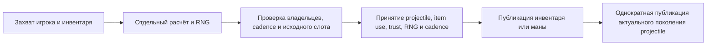

# Владение использованием предметов игрока 1.4.5.8

[English](../en/player-item-use-1458.md) · [Расчёт боя](combat-damage.md)

Общий калькулятор экипировки принимает восемь обычных металлических комплектов и варианты с древними железным/золотым шлемами: 26 деталей и десять комбинаций полных комплектов. Итоговая защита Copper/Tin/Iron/Lead/Silver/Tungsten/Gold/Platinum равна 6/7/9/11/13/15/16/20. Смешанные детали сохраняют личную защиту. PvE, PvP и серверные игроки используют существующий общий боевой snapshot. Неправильные слоты, префиксы брони, неизвестная экипировка и неподтверждённые полные endgame-комплекты сохраняют ограничения; vanity и неактивные loadout не дают эффектов.

Строгий projectile item use захватывает точное соединение/игрока, serial инвентаря, экипировку и buffs до расчёта. Сохранение ammo готовится на клоне существующего общего `UnifiedRandom`: Celebration Mk2 (`3930`, `Next(2)`) идёт до Magic Quiver; Minishark — после. Бесконечные ammo тоже выполняют применимые броски. Только первый принятый дочерний projectile Celebration volley владеет сохранением и расходом ammo. Более ранний совместимый неподдержанный ammo не пропускается.

Подготовка не продвигает поколение и не вызывает sinks. Отказ при устаревших владельцах, распределении, cadence или RNG сохраняет состояние использования предмета. Успешное принятие проходит без внешних callbacks; инвентарь/мана, combat trust, projectile, RNG и cadence приняты до публикации. Последующее намеренное изменение callback не перезаписывается. Публикация projectile однократна и отказывается от поколения, удалённого или заменённого callback. Публичное обычное создание сохраняет исходное замещение/overflow заполненного пула. Транзакция также защищает уже допущенные самостоятельные метательные и channeled magic источники.

Исходные рождения владеют пустыми buff-слотами. Известные Ammo Box (`93`) и Ammo Reservation (`112`) теперь участвуют в исходных проверках сохранения боеприпасов. Точный порядок: Celebration `Next(2)`, применимый Quiver `Next(5)`, Box `Next(5)`, Potion `Next(5)`, затем Minishark `Next(3)`. Успешная ранняя проверка не пропускает следующие броски, в том числе для бесконечных боеприпасов. Дубли buff-слотов дают один флаг эффекта и одну проверку. Пакет 50 сохраняет длительность 60; выделенный сервер не уменьшает её локально для удалённого игрока. Смерть очищает непостоянные слоты; поля эффектов очищаются следующей фазой сброса и buffs. Отсутствующий владелец импортированных buffs остаётся неизвестным и не даёт строгого ranged combat trust.

Вольфрамовая пуля (`4915`) использует существующий projectile `14`: урон 9, отбрасывание 4, скорость боеприпаса 4.5 и расходуемость. Принятое нейтральное подмножество пуль — Musket Ball, Silver Bullet, Tungsten Bullet и Endless Musket Pouch. Новое специальное поведение projectile или статусов не предполагается. Независимые вызовы выделенного сервера охватывают 32 использования боеприпасов и четыре состояния жизненного цикла; компактные тесты сравнивают расход, следующий RNG, сохранённые слоты и параметры выстрела вольфрамовой пулей. Контроли на копиях обнаруживают пропущенные броски Box/Potion, неверный порядок, ранний выход при сохранении, пропуск бросков бесконечных боеприпасов и отсутствие вольфрамовой пули.

Броня с сохранением ammo, cycling, зависимые от анимации семейства, другие ammo transforms, potion/bag use, полная совместимость item use и полный порядок RNG-фаз обновления игрока требуют отдельной работы. Новый пакет использования предмета не добавляется. Эффекты исходного `StatusNPC` для уже принятых Fire Arrow (`2`) и других projectile со статусами остаются отдельной границей NPC-попаданий; расширение боеприпасов не заявляет их полную NPC-совместимость статусов.

Независимые исходные defaults/grants/эффекты комплектов и captures `Player.PickAmmo` сопровождаются компактными тестами и отрицательными контролями. Команды проверяют устаревшие инвентарь/экипировку/игрока/RNG, повторное соединение, место, cadence, состояние первого callback, сохранение изменения callback, бесконечные ammo, детей Celebration и соседние mana/standalone use.

Предыдущий checkpoint брони и атомарности: full 1562839/1562840, focused 98/98, fast tier, без failures/errors и с одним прежним skip жидкостей; Windows NativeAOT/пять smokes и все локальные gates прошли. Linux NativeAOT локально не подтверждён.

Проверка экономии боеприпасов: full 1562851/1562852, focused 110/110, fast 24558/24559; без отказов и ошибок, один прежний пропуск жидкостей. Свежая Windows NativeAOT, пять smoke-проверок и локальные проверки прошли. Настоящая Linux NativeAOT локально не подтверждена.
