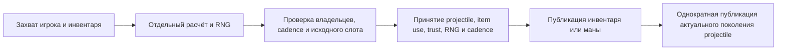

# Владение использованием предметов игрока 1.4.5.8

## Текущая remote-фаза — 2026-10-09

`ServerRuntimeState.Tick` теперь выполняет ограниченную обычную remote-фазу через `PlayerAuthority.TickRemotePlayerPhase`. Она захватывает полный состав активных игроков, планирует физические слоты `0`–`254` по возрастанию на одном сохранённом курсоре `UpdatePlayers` и проверяет каждого захваченного игрока, инвентарь, индексированные buff-слоты, секции тайлов и RNG перед принятием без callbacks. Слот `255` остаётся вне исходного цикла обновления. Типизированные владельцы мира и projectiles устанавливают факты окружения/grappling; необязательные callbacks не могут заменить их другими фактами. Принятая фаза заменяет отдельный тик здоровья/анимации этих игроков, исключая повторную регенерацию или уменьшение таймеров. Удалённое питьё сохраняет исходную семантику: без второго расхода инвентаря и выдуманных сообщений о здоровье, мане, анимации или баффах.

Допущенный профиль покрывает пустой выбранный предмет и восемь обычных зелий с нейтральными представленными экипировкой/окружением. Живая фаза владеет регенерацией/heat маны, таймерами предмета/отпусканием кнопки, задержками зелий, обычной физикой и проекцией текущего здоровья. Ранние выходы dead/ghost/outside сохраняют или сбрасывают только поля, выбранные исходной ветвью. Доказательства реального packet `12`/Spawn сохраняют jump, контакты Honey/Shimmer и gravity там, где это требуется, сбрасывая контакты Wet/Lava. Constructor release-jump равен false; обычный packet `13` несёт свой реальный флаг gravity. Живые обновления без крыльев сохраняют `WingTime = 0`; явно импортированные ранние выходы сохраняют прежнее wing time. Одновременные горизонтальные флаги следуют исходной ветви скорости.

Неподдерживаемый игрок отклоняет весь подготовленный состав. Реальный тик затем снимает владение общим RNG и достоверность всех item/physics-фаз: последующие пакеты `5`/`42`/`50`, повторное соединение или привязка того же RNG не восстанавливают неизвестную исходную историю. Пустой тик до первого подключения сохраняет seed/курсор без требования фактов мира. Неподдерживаемые экипировка, расходуемые предметы, grappling и более широкие фазы игрока остаются вне этой границы; полное расписание `Main` и совместимость клиентского RNG не заявлены.

Release с warnings-as-errors и 2 579 целевых проверок проходят. Первоначальный полный прогон без фильтра дал 1 563 033 успешных из 1 563 035, одно устаревшее ожидание vitals и один прежний skip, без runner errors за $579.954\,\mathrm{s}$. Fixture Revive с context0 ожидал мёртвого игрока при исходной свежей проекции здоровья100 и сообщённом здоровье0; ожидание исправлено без изменений production. Обновлённые vitals/ownership проверки проходят11/11; финальный fast проходит24 741/24 742 с одним прежним skip и без failures/errors. Контроль с прежним dead-state выявляет ошибку. Все17 shipping DLL совпадают с проверенными первоначальным full, Native и live, поэтому второй исчерпывающий прогон не выполнялся.

Свежая shipping Windows NativeAOT/пять smokes и Release/Native socket-пробы packet82/49 проходят. Типизированный Native harness покрывает14 случаев и38 реальных `State.Tick` без ошибок; outside, slot255 и raw-cursor проверки в него не входят. Настоящая Linux NativeAOT локально не проверена. Результаты: `.cache/remote-player-phase-final-status.json`, `.cache/remote-player-phase-final-fast-tests/result.json`, `.cache/remote-player-phase-final-shipping-comparison.json`, `.cache/remote-player-phase-native-smoke/manifest.json` и `.cache/remote-player-phase-live-v1/results.json`.

Независимые исходные сравнения включают28 прямых и28 реальных `State.Tick` проходов состава,12 настроенных ранних выходов, пять реальных packet13 строк скорости и три явно заданных wing-time профиля по четыре прохода. Семь целевых Facts и восемь значимых omission-контролей проходят после восстановления, без runner errors. Точный scope/hashes: `.cache/remote-item-phase-tests/final-v8-freeze-manifest.json`; исходный состав: `.cache/remote-item-phase-app-source-proof/manifest.json`; Spawn/vitals контроли: `.cache/player-spawn-command-controls/status.json` и `.cache/player-vitals-spawn-controls/status.json`. Ранние маленькие сцены с неполной solid-инициализацией остаются доказательствами настроенных компонентов. Следующая фаза — исходные remote ItemCheck clocks для восьми пулевых оружий и нейтральных buffs93/112; более широкая совместимость игрока/клиентского RNG остаётся открытой.

## История foundation — 2026-10-08

Проверки checkpoint: прошли 772 целевые проверки и полный прогон без фильтра (1 563 025 успешных, один ранее известный skip, без ошибок). Свежая Windows NativeAOT-сборка и все пять smoke-путей проходят; Release и Native socket-проверки сохраняют порядок packet82/49 и ретрансляцию между двумя клиентами. Linux NativeAOT локально не проверен. Явно неизвестный/изменённый компактный импорт баффов не получает старые полные слоты. Общая фаза игрока остаётся вне расписания; сохранённые таймеры пока не симулируются непрерывно.

Основа выбранных расходуемых предметов (2026-10-08): расчёты по исходному серверу покрывают восемь обычных лечебных/мановых зелий, пустой выбранный предмет, таймеры и отпускание кнопки, mana heat и регенерацию маны удалённого игрока. Владелец баффов сохраняет все 44 индексированных типа и длительности, исходную вставку potion sickness и накопление mana sickness с пределом 600. Реальные значения конструктора отделены от настроенных прогретых входов. Packet42 меняет сообщённую ману и базовый максимум, не создавая отсутствующие таймеры; packet41 меняет только сообщённую анимацию. Перенос между мирами сохраняет известное состояние фазы предметов и копирует точные buff-слоты; импорт без состояния фаз остаётся неизвестным.

Композиция загруженного мира привязывает отдельный постоянный RNG UpdatePlayers по точному сохранённому тексту seed и реальным размерам/поверхности/режиму мира. Владение seed не устанавливает курсор после непредставленных обновлений. Новый вариант обычной физики учитывает небесную гравитацию и границы; производители смерти Remix/Skyblock остаются вне этого предложения. Общая фаза Player.Update пока не подключена к production-тику. Эти компоненты не устанавливают полную совместимость удалённого использования предметов, авторитетность инвентаря/патронов или расписания игроков. До проверенной атомарной интеграции сохраняется существующее расписание здоровья/анимации.

Независимые доказательства компонентов включают захваты расходуемых предметов/маны/lifecycle, сравнения реального AddBuff и 12 профилей физики полностью инициализированного мира по три тика. Ранние настроенные захваты зелий использовали маленькую сцену и неполную инициализацию solid-тайлов: они остаются доказательствами отдельных фаз, а не обычного пола или полного мира. Отдельные исправленные захваты Main.UpdateWorld_Players проверяют общий RNG и порядок игроков по слотам, но новый атомарный runtime-планировщик сохранён вне этого checkpoint до тестирования.

## Существующее владение ranged

Обычная стрельба пулями охватывает Minishark (`98`), Phoenix Blaster (`219`), Megashark (`533`), Chain Gun (`1929`), Boomstick (`964`), Shotgun (`534`), Tactical Shotgun (`679`) и Quad-Barrel Shotgun (`4703`). Minishark и Megashark выполняют исходные броски разброса; Chain Gun сохраняет раннее отклонение направления и позднее отклонение скорости. Shotgun и Boomstick сохраняют исходный бросок количества снарядов; Tactical создаёт шесть, Quad-Barrel — восемь с исходным нелинейным поворотом. Допустимость префикса учитывает исходное округление характеристик конкретного предмета. Броски сохранения патрона выполняются один раз на использование, включая все последующие применимые броски после раннего успеха и для бесконечных патронов.

Для нескольких снарядов первый пакет `27` готовит ограниченное предложение на отдельном RNG. Следующие исходные сообщения передают точные ключи в своём порядке. На игрока удерживается одно предложение, не более восьми сообщений в течение одного интервала использования оружия. Одинаковые повторы ничего не расходуют; противоречивые сообщения, устаревшие игрок/инвентарь/экипировка/buffs, изменившийся RNG или истечение срока отклоняют предложение без принятия части очереди. Перед принятием повторно проверяется каждый полный ключ сообщения: ключ, занятый за время ожидания, отклоняет очередь и сохраняет уже существующий projectile. Это существующая строгая политика серверного RNG: восстановление ограниченного направления не означает владения исходными клиентскими `MouseWorld` или `Main.rand`. Честные выстрелы вне представленного состояния RNG остаются вне строгого combat trust; полное согласование клиентского RNG ещё не закрыто.

Полное использование принимает все исходные выделения слотов, один расход патрона, trust, RNG, cadence и конечные сетевые baseline до внешних callbacks. Публикуется каждое принятое создание, включая промежуточные поколения, заменённые в том же физическом слоте. Замена не добавляет пакет `29`; подключающийся игрок получает только конечные живые baseline физических слотов `0`–`999`. Исходный резервный слот `1000` представим при вместимости `1001` и публикует создание уже подключённым игрокам, но исходный `MessageBuffer`, case `8`, исключает его из начальной отправки при подключении. Он также не входит в обычное обновление projectile и проверки попаданий PvE/PvP. Меньшая вместимость сохраняет ограниченный отказ выделения. Callback, заменивший принятое состояние, сохраняет нового персонажа и ключ; принятые патрон и RNG не откатываются.

[English](../en/player-item-use-1458.md) · [Расчёт боя](combat-damage.md)

Дополнительные функциональные слоты аксессуаров используют исходные правила доступности в общем расчёте боя. Индекс брони `8` (слот `67` в packet 5) требует сохранённый флаг Demon Heart и эффективный режим Expert; индекс `9` (слот `68`) требует эффективный Master независимо от Demon Heart. Good World увеличивает эффективную сложность до этих проверок. Заблокированные слоты не дают эффектов предмета или префикса. Неизвестное состояние Demon Heart отклоняет выбранный слот Expert вместо предположения о разблокировке. Экипировка человека и серверного игрока использует режим runtime назначения и актуальный профиль игрока.

Пустой активный функциональный слот может наследовать первый избранный предмет из трёх неактивных loadout в исходном порядке. Несовместимый первый избранный предмет останавливает поиск; более поздний loadout не заменяет его. При выборе учитываются настоящая активная экипировка, дубликаты в vanity, группы несовместимости и крыльев, а также первые избранные предметы в предыдущих пустых слотах аксессуаров. Заблокированный активный слот тоже может мешать наследованию в другом слоте, хотя сам не даёт бонусов. Выбранные поддержанные предметы сохраняют свои префиксы и эффекты обычных комплектов брони; предмет из неактивного loadout не перемещается и не расходуется. Боевые потребители человека и серверного игрока используют один выбор. Dedicated host явно владеет исходной пустой vanity-бронёй локального слота `255`, зарезервированного общим пулом игроков; изолированный контекст должен явно владеть этими тремя идентичностями для наследования брони. Совместимость брони в исходнике обращается к `Main.LocalPlayer`, а совместимость аксессуаров — к настоящему персонажу. Неизвестные метаданные выбранного предмета или необходимая локальная броня не получают доверия. Настоящие изменения loadout через packet 5 отклоняют подготовленные использования предметов существующими проверками игрока и профиля.

Подготовка использования projectile сохраняет ревизию игрока вместе с инвентарём, экипировкой и buffs. Изменённый профиль packet 4 увеличивает эту ревизию и отклоняет подготовленное использование до принятия расхода ammo, mana, поколения projectile или RNG.

Обычные попадания projectile и взрыва повторно проверяют атакующего после callbacks броска урона перед применением PvE или PvP damage. Прямые PvP-попадания предметом также повторно проверяют выбранный инвентарь и ревизию цели. Отклонённое устаревшее попадание не меняет здоровье цели, penetration или immunity. Переданные внешние random callbacks сохраняют собственное состояние бросков; эти проверки не откатывают произвольный внешний `Random`. Урон projectile серверного игрока использует тот же расчёт экипировки и отклоняет неподдержанные предметы вместо применения базовых бонусов.

Общий калькулятор экипировки принимает восемь обычных металлических комплектов и варианты с древними железным/золотым шлемами: 26 деталей и десять комбинаций полных комплектов. Итоговая защита Copper/Tin/Iron/Lead/Silver/Tungsten/Gold/Platinum равна 6/7/9/11/13/15/16/20. Смешанные детали сохраняют личную защиту. PvE, PvP и серверные игроки используют существующий общий боевой snapshot. Неправильные слоты, префиксы брони, неизвестная экипировка и неподтверждённые полные endgame-комплекты сохраняют ограничения; vanity не даёт боевых бонусов, а совместимые наследуемые функциональные предметы проходят описанный выше выбор.

Строгий projectile item use захватывает точное соединение/игрока, serial инвентаря, экипировку и buffs до расчёта. Сохранение ammo готовится на клоне существующего общего `UnifiedRandom`: Celebration Mk2 (`3930`, `Next(2)`) идёт до применимых проверок Magic Quiver, Ammo Box и Ammo Reservation; выбранная проверка Minishark, Megashark или Chain Gun — после них. Бесконечные ammo тоже выполняют применимые броски. Только первый принятый дочерний projectile Celebration volley владеет сохранением и расходом ammo. Обычная очередь пуль также владеет одним решением о сохранении и одним расходом патрона на всё использование. Более ранний совместимый неподдержанный ammo не пропускается.

Подготовка не продвигает поколение и не вызывает sinks. Отказ при устаревших владельцах, распределении, cadence или RNG сохраняет состояние использования предмета. Успешное принятие проходит без внешних callbacks; инвентарь/мана, combat trust, projectile, RNG и cadence приняты до публикации. Последующее намеренное изменение callback не перезаписывается. Публикация projectile однократна и отказывается от поколения, удалённого или заменённого callback. Публичное обычное создание сохраняет исходное замещение/overflow заполненного пула. Транзакция также защищает уже допущенные самостоятельные метательные и channeled magic источники.

Исходные рождения владеют пустыми buff-слотами. Известные Ammo Box (`93`) и Ammo Reservation (`112`) участвуют в исходных проверках сохранения боеприпасов. Точный порядок: Celebration `Next(2)`, применимый Quiver `Next(5)`, Box `Next(5)`, Potion `Next(5)`, затем выбранная проверка оружия: Minishark `Next(3) == 0`, Megashark `Next(2) == 0` или Chain Gun `Next(3) != 0`. Успешная ранняя проверка не пропускает следующие броски, в том числе для бесконечных боеприпасов. Броски количества снарядов и разброса идут после сохранения на том же отдельном RNG. Дубли buff-слотов дают один флаг эффекта и одну проверку. Пакет 50 сохраняет длительность 60; выделенный сервер не уменьшает её локально для удалённого игрока. Смерть очищает непостоянные слоты; поля эффектов очищаются следующей фазой сброса и buffs. Отсутствующий владелец импортированных buffs остаётся неизвестным и не даёт строгого ranged combat trust.

Вольфрамовая пуля (`4915`) использует существующий projectile `14`: урон 9, отбрасывание 4, скорость боеприпаса 4.5 и расходуемость. Принятое нейтральное подмножество пуль — Musket Ball, Silver Bullet, Tungsten Bullet и Endless Musket Pouch. Новое специальное поведение projectile или статусов не предполагается. Независимые вызовы выделенного сервера охватывают 32 использования боеприпасов и четыре состояния жизненного цикла; компактные тесты сравнивают расход, следующий RNG, сохранённые слоты и параметры выстрела вольфрамовой пулей. Контроли на копиях обнаруживают пропущенные броски Box/Potion, неверный порядок, ранний выход при сохранении, пропуск бросков бесконечных боеприпасов и отсутствие вольфрамовой пули.

Броня с сохранением ammo, cycling, зависимые от анимации семейства, другие ammo transforms, potion/bag use, полная совместимость item use и полный порядок RNG-фаз обновления игрока требуют отдельной работы. Новый пакет использования предмета не добавляется. Эффекты исходного `StatusNPC` для уже принятых Fire Arrow (`2`) и других projectile со статусами остаются отдельной границей NPC-попаданий; расширение боеприпасов не заявляет их полную NPC-совместимость статусов.

Независимые исходные defaults/grants/эффекты комплектов и captures `Player.PickAmmo` сопровождаются компактными тестами и отрицательными контролями. Команды проверяют устаревшие инвентарь/экипировку/игрока/RNG, повторное соединение, место, cadence, состояние первого callback, сохранение изменения callback, бесконечные ammo, детей Celebration и соседние mana/standalone use.

Предыдущий checkpoint брони и атомарности: full 1562839/1562840, focused 98/98, fast tier, без failures/errors и с одним прежним skip жидкостей; Windows NativeAOT/пять smokes и все локальные gates прошли. Linux NativeAOT локально не подтверждён.

Проверка экономии боеприпасов: full 1562851/1562852, focused 110/110, fast 24558/24559; без отказов и ошибок, один прежний пропуск жидкостей. Свежая Windows NativeAOT, пять smoke-проверок и локальные проверки прошли. Настоящая Linux NativeAOT локально не подтверждена.
