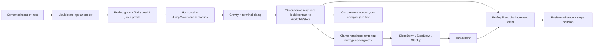

# Авторитетная физика игрока

[English](../en/player-physics.md) · [Документация](README.md) · [Host-интерфейсы](host-interfaces.md) · [Архитектура](architecture.md)

Эта страница описывает текущий проверенный путь физики обычного server-player без mount и с normal gravity в TerraRuntime. Референс — зафиксированная официальная сборка `TerrariaServer 1.4.5.8`, используемая repository reference probes.

## Владение состоянием

TerraRuntime владеет конечными position, velocity, collision response, jump counter/release gate и историей liquid contact. Trusted host передаёт только semantic horizontal/jump intent. Тип жидкости и конечные motion vectors host не задаёт.

Разделение **предыдущего** и **текущего** liquid state на один tick намеренное. В vanilla `Player.Update` параметры gravity/jump выбираются до `JumpMovement()`, а wet/honey/shimmer contact обновляется позже, перед collision dispatch. Поэтому при входе в жидкость текущий tick ещё использует предыдущий dry gravity/jump profile, но position advance уже масштабируется жидкостью. Обновлённый state становится входом профиля следующего authoritative tick.

## Базовая геометрия

Текущий проверенный hitbox игрока:

\[
W = 20\ \text{px},\qquad H = 42\ \text{px}.
\]

Размер vanilla tile:

\[
T = 16\ \text{px}.
\]

Liquid contact вычисляется из `WorldTileStore` через `VanillaWorldCollision.GetLiquidContacts`; host напрямую не выставляет `Wet`, `Lava`, `Honey` или `Shimmer`.

## Motion profiles

После выбора medium-specific `maxFallSpeed` Terraria добавляет \(0.01\) перед ordinary movement. TerraRuntime сохраняет это значение, а не округляет его обратно до номинального baseline.

| Liquid state прошлого tick | Gravity | Фактический max fall speed | Jump speed | Jump height |
| --- | ---: | ---: | ---: | ---: |
| dry | \(0.4\) | \(10.01\) | \(5.01\) | \(15\) ticks |
| water / lava | \(0.2\) | \(5.01\) | \(6.01\) | \(30\) ticks |
| honey | \(0.1\) | \(3.01\) | \(5.01\) | \(15\) ticks |
| shimmer contact | \(0.15\) | \(10.01\) | \(5.51\) | \(23\) ticks |

Для ordinary profile shimmer имеет приоритет над другими wet flags. Honey сохраняет базовый jump profile, меняя gravity и terminal fall speed. Lava в этом slice использует ordinary water movement profile; lava damage/debuff semantics относятся к отдельной gameplay-работе.

## Jump state и переходы жидкости

`ServerPlayerJumpIntent.Held` и `Released` остаются button-level semantic input. Vanilla jump counter и release gate принадлежат TerraRuntime.

При удержании активного прыжка `JumpMovement` снова устанавливает jump speed, выбранный по medium прошлого tick, и уменьшает remaining jump counter. Новый grounded jump получает jump height этого medium. `Released` обнуляет remaining counter и снова открывает release gate.

Когда обновлённый current contact меняется с wet на dry, vanilla ограничивает оставшийся jump counter одной пятой активного jump height:

\[
J_{next}=\min\left(J_{remaining},\left\lfloor\frac{J_{height}}{5}\right\rfloor\right).
\]

Для ordinary water максимум составляет \(6\) ticks, для honey \(3\), для shimmer \(4\).

## Collision displacement

Текущий liquid contact выбирает коэффициент position advance после `TileCollision`:

| Current contact | Position factor |
| --- | ---: |
| dry | \(1\) |
| water / lava | \(0.5\) |
| honey | \(0.25\) |
| shimmer | \(0.375\) |

Коэффициент масштабирует position advance, а не сохранённую collision velocity. Если tile collision изменил одну компоненту velocity, ограниченная ось применяется к позиции без повторного liquid factor. Это соответствует vanilla `Player.WetCollision`.

## Generation safety

Liquid state прошлого tick хранится во фиксированной таблице authoritative physics stepper по player slot. В каждой записи также хранится полный `PlayerHandle`. При reuse slot новой generation handle перестаёт совпадать, поэтому новый игрок начинает с dry previous-tick state. Старый liquid history не может перейти между generations, а объём хранения ограничен 256 runtime player slots.

## Явно вне проверенного slice

Эта страница пока не заявляет завершёнными mounts, reversed gravity, grapples, wings, extra jumps, auto-jump, flipper swimming, `ShouldFloatInWater`, merman/trident movement, shimmer transformation, lava damage/debuffs, drowning, water-walking equipment и accessory-specific movement modifiers.

Roadmap-пункт G6-D по полным source-backed movement/collision/gravity/jump/liquid semantics остаётся открытым, пока необходимые ordinary semantics и поддерживаемые исключения не доказаны executable tests/CI.
