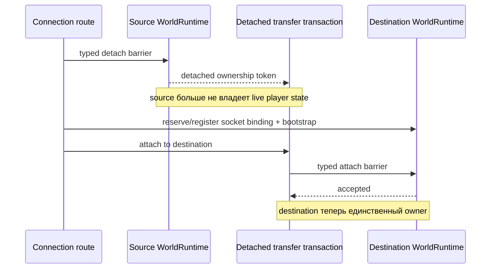

# Владение runtime-состоянием игрока

[English](../en/player-runtime-ownership.md) · [Архитектура](architecture.md)

## Правило владения

Изменяемое gameplay-состояние подключённого игрока в каждый момент принадлежит ровно одному authoritative loop конкретного `WorldRuntime`. Socket routing, операторские команды и код управления sandbox не получают player stores или изменяемый transfer payload.

Обычная обработка пакетов входит во владеющий runtime через typed authoritative commands. Перемещение между runtime подчиняется тому же правилу и не превращает connection code во временного второго владельца состояния.

## Владение по слоям

Player-данные теперь следуют тому же направлению зависимостей, что и остальной runtime:

- `TerraRuntime.Contracts.Runtime` владеет detached DTO для player commit, включая `PlayerAppearanceCommitRequest`, `PlayerMovementCommitRequest`, `PlayerSpawnCommitRequest`, equipment и vitals requests;
- `TerraRuntime.Gameplay.Players` владеет source-backed vanilla normalization/validation без изменяемого runtime-состояния;
- `TerraRuntime.Core` владеет authoritative ingress-контрактами и общими execution-механизмами;
- `TerraRuntime.Core.Players` владеет identity server-player slot и изменяемыми server-player state stores, чтобы player-specific механика не разрасталась в плоском namespace Core;
- application composition владеет connection admission, политикой истории/anti-cheat и конкретным routing authoritative-команд; world-owned `ServerPlayerAuthority` является единственным application-level owner, объединяющим server-player lifecycle, semantic control intents, physics progression и replication events.

Преобразование signed net-id из packet 5 теперь принадлежит application ingress boundary в `PlayerEquipmentPacket5Normalizer`. Core получает только канонические положительные item identity и напрямую проверяет server-owned inventory state; Gameplay не содержит wire-совместимую арифметику.

## Перенос между runtime

Level 1 transfer имеет три отдельные фазы ownership:

`RuntimePlayerTransferTransaction` скрывает detached `RuntimePlayerTransferState` внутри себя. `RuntimeConnectionRoute` получает только небольшую routing-проекцию, которая ему действительно нужна, например имя игрока, и может запросить одно из трёх terminal actions:

- прикрепить игрока к destination `WorldRuntime`;
- восстановить точное detached state в source runtime после неудачного переноса;
- уничтожить detached state при намеренном disconnect.

Транзакция одноразовая. После attach, restore или discard повторное terminal action отвергается. Так случайное двойное ownership и повторное использование detached payload становятся явной ошибкой, а не неявным shared-state поведением.

## Семантика отказов

Резервирование destination slot по возможности выполняется до source detach barrier. Если source уже отсоединил игрока, любой последующий сбой routing/bootstrap/attach обязан восстановить authoritative state исходного runtime до возврата к обычной игре.

Route никогда не обращается напрямую к player dictionary, inventory store или transfer-profile store другого runtime. Все переходы mutable state проходят через `RuntimePlayerTransferIngress`, поэтому только game loop destination runtime может установить перенесённое состояние.

World-space position не является переносимым player state между разными мирами. Успешный cross-runtime transfer всегда устанавливает floor-tile spawn destination world; authoritative top-left позиция вычисляется по Terraria 1.4.5.8 как `X = spawnX * 16 + 8 - playerWidth / 2`, `Y = spawnY * 16 - playerHeight`. Исходные координаты сохраняются только для rollback в тот же source runtime при сорванном transfer. Это не зависит от `forceRespawn`: обычный drag/move в sandbox тоже появляется на spawn целевого мира. Initial join по-прежнему завершает bootstrap packet 49, но live cross-world transfer уже находится в vanilla connection state 10, где packet 49 не вызывает `Player.Spawn`; поэтому replacement-world bootstrap завершается явным packet 12 `PlayerSpawn` с destination `SpawnX/SpawnY`. Packet 12 является последним world-handoff frame внутри атомарного bootstrap batch; post-attach global baselines вроде packet 82 могут следовать после него, но не несут world/position state.

В Terraria 1.4.5.8 `Player.Spawn(SpawningIntoWorld)` может установить клиентские personal `SpawnX/SpawnY` в `-1/-1`, если `FindSpawn`/`CheckSpawn` не нашёл допустимый personal spawn, после чего multiplayer client отправляет packet 12 обратно. Пока активен replacement-world landing gate, TerraRuntime поглощает этот немедленный `SpawningIntoWorld` packet как echo синтетического handoff, а не принимает его за новый authoritative respawn. Поэтому destination attach остаётся на spawn целевого мира, а echo не может перезаписать movement-correction target координатами у левого верхнего края. Обычная обработка post-join respawn packet 12 не меняется.

Vanilla inventory slot `58` соответствует `Main.mouseItem`, поэтому его нельзя слепо копировать через live world handoff. Перед detach занятый cursor slot ровно один раз переносится в свободный main-inventory slot `0..49`, а slot 58 очищается в detached image. Если свободного main slot нет, transfer отменяется до detach и оставляет source state без изменений. Destination явно публикует очищенный cursor перед normalized inventory, а packet-5 echoes во время активного replacement-world landing gate не могут восстановить устаревший cursor item. Поэтому повторные переходы primary/sandbox сохраняют общее количество предметов без duplication или потери cursor stack.

Live handoff добавляет packet-23 despawn для активных NPC исходного runtime перед replacement `WorldData`, поэтому сущности source world не остаются на клиенте призраками в destination. После принятия batch landing gate отклоняет и исправляет запоздавшие packet-13 координаты из исходного мира, пока клиент не сообщит позицию рядом со spawn destination. Обычный movement также проверяется и на connection boundary, и в authoritative world writer по краевой полосе `$640\,\mathrm{px}$` из Terraria 1.4.5.8 `Player.BordersMovement`. Out-of-bounds samples не становятся authoritative и не запускают section streaming; connection получает последнюю принятую позицию. Синтетические test worlds, слишком маленькие для двух краевых полос, используют только границу полного тела игрока внутри мира.

Same-runtime respawn использует ту же detach/attach transaction. Благодаря этому respawn и sandbox movement работают на одной модели ownership вместо второго независимого mutation path. Входящий client packet 12 после принятого respawn реплицируется другим playing connections, но не эхоится обратно origin connection: клиент уже выполнил свой spawn transition, а повторная отправка того же spawn может повторно запустить локальный transition и создать feedback loop. Respawn также очищает pre-death transient movement flags и инвалидирует retained packet-13 baseline; teleport инвалидирует этот baseline по той же причине. Поэтому последующий AOI resync не может повторно выдать pre-respawn/pre-teleport позицию до прихода нового movement packet.

Client-owned appearance, equipment, movement и health replication хранит exact-generation baselines. Если следующий update кодируется в те же байты, повторный fanout peers не выполняется; для movement duplicate подавляется только когда interest/visibility membership не изменился. Duplicate packet-16 health updates также coalesce'ятся для peers, но authoritative owner health correction намеренно обходит это подавление для самого owner. Authoritative NPC packet-23 и projectile packet-27 updates используют такое же generation-safe exact-wire coalescing: runtime-only изменения revision/timer, не меняющие encoded state, больше не создают повторный broadcast, а spawn/despawn и любое изменившееся wire state отправляются сразу. Это exact-state coalescing, а не timer throttling.

## Runtime GodMode ownership

GodMode — authoritative generation-scoped runtime flag, который зеркалит vanilla `CreativePowers.GodmodePower`. Он устанавливается только через typed trusted-host/TUI administration boundary, переносится в detached Level-1 transfer state для того же live connection и удаляется при disconnect. На диск он не сохраняется. Server→client синхронизация выполняется vanilla net module packet 82 (`SyncOnePlayer` при изменении и `SyncEveryone` как baseline). Входящий client packet 82 не является authority и не может самовольно включить GodMode.

При включённом флаге authoritative PvP, NPC contact и admitted hostile NPC-projectile damage завершаются до mutation HP/immunity, а vanilla клиент сам не входит в обычный `Player.Hurt`, поэтому для Hurt-based источников нет ни снятия HP, ни knockback. Старые packet-16 heal-back, owner health repair, movement correction epoch и специальное поглощение packet 13 для GodMode удалены полностью; fallback-пути нет. Combat text `MISS` остаётся только presentation-эффектом. В Terraria 1.4.5.8 drowning является отдельным краем: он напрямую уменьшает `statLife`, обходя обычный `Player.Hurt`; TerraRuntime намеренно не возвращает скрытый heal-back ради маскировки этой vanilla-семантики.
