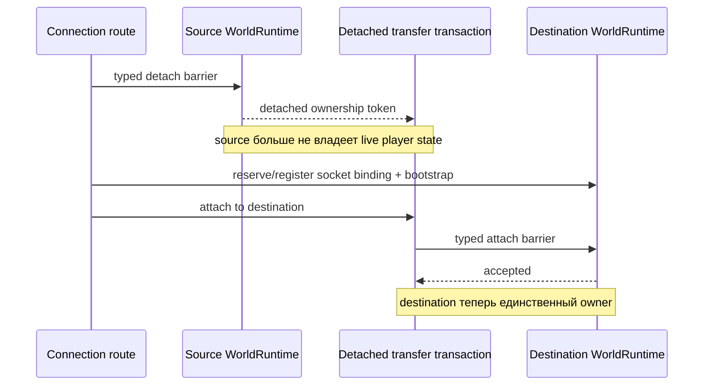

# Владение runtime-состоянием игрока

[English](../en/player-runtime-ownership.md) · [Архитектура](architecture.md)

## Правило владения

Изменяемое gameplay-состояние подключённого игрока в каждый момент принадлежит ровно одному authoritative loop конкретного `WorldRuntime`. Socket routing, операторские команды и код управления sandbox не получают player stores или изменяемый transfer payload.

Обычная обработка пакетов входит во владеющий runtime через typed authoritative commands. Перемещение между runtime подчиняется тому же правилу и не превращает connection code во временного второго владельца состояния.

## Владение по слоям

Player-данные теперь следуют тому же направлению зависимостей, что и остальной runtime:

- `TerraRuntime.Contracts.Runtime` владеет detached DTO для player commit, включая `PlayerAppearanceCommitRequest`, `PlayerMovementCommitRequest`, `PlayerSpawnCommitRequest`, equipment и vitals requests;
- `TerraRuntime.Gameplay.Players` владеет source-backed vanilla normalization/validation без изменяемого runtime-состояния;
- `TerraRuntime.Core` владеет authoritative ingress-контрактами и общими execution-механизмами;
- `TerraRuntime.Core.Players` владеет identity server-player slot и изменяемыми server-player state stores, чтобы player-specific механика не разрасталась в плоском namespace Core;
- application composition владеет connection admission, политикой истории/anti-cheat и конкретным routing authoritative-команд; world-owned `ServerPlayerAuthority` является единственным application-level owner, объединяющим server-player lifecycle, semantic control intents, physics progression и replication events.

Преобразование signed net-id из packet 5 теперь принадлежит application ingress boundary в `PlayerEquipmentPacket5Normalizer`. Core получает только канонические положительные item identity и напрямую проверяет server-owned inventory state; Gameplay не содержит wire-совместимую арифметику.

## Перенос между runtime

Level 1 transfer имеет три отдельные фазы ownership:

`RuntimePlayerTransferTransaction` скрывает detached `RuntimePlayerTransferState` внутри себя. `RuntimeConnectionRoute` получает только небольшую routing-проекцию, которая ему действительно нужна, например имя игрока, и может запросить одно из трёх terminal actions:

- прикрепить игрока к destination `WorldRuntime`;
- восстановить точное detached state в source runtime после неудачного переноса;
- уничтожить detached state при намеренном disconnect.

Транзакция одноразовая. После attach, restore или discard повторное terminal action отвергается. Так случайное двойное ownership и повторное использование detached payload становятся явной ошибкой, а не неявным shared-state поведением.

## Семантика отказов

Резервирование destination slot по возможности выполняется до source detach barrier. Если source уже отсоединил игрока, любой последующий сбой routing/bootstrap/attach обязан восстановить authoritative state исходного runtime до возврата к обычной игре.

Route никогда не обращается напрямую к player dictionary, inventory store или transfer-profile store другого runtime. Все переходы mutable state проходят через `RuntimePlayerTransferIngress`, поэтому только game loop destination runtime может установить перенесённое состояние.

Same-runtime respawn использует ту же detach/attach transaction. Благодаря этому respawn и sandbox movement работают на одной модели ownership вместо второго независимого mutation path.

## Runtime GodMode ownership

GodMode — authoritative generation-scoped runtime flag. Он устанавливается только через typed trusted-host/TUI administration boundary, переносится в detached Level-1 transfer state для того же live connection и удаляется при disconnect. На диск он не сохраняется. При включённом флаге authoritative PvP, NPC contact и admitted hostile NPC-projectile damage завершаются до mutation HP/immunity.

Terraria 1.4.5.8 по-прежнему считает lava, drowning и fall damage локально через `Player.Hurt`. Пока эти environmental sources не симулируются TerraRuntime полностью, GodMode player не может уменьшить authoritative HP входящим packet 16: decrease отклоняется, а текущее authoritative health сразу реплицируется обратно этому connection. Это compatibility guard, а не передача клиенту произвольной health authority.
