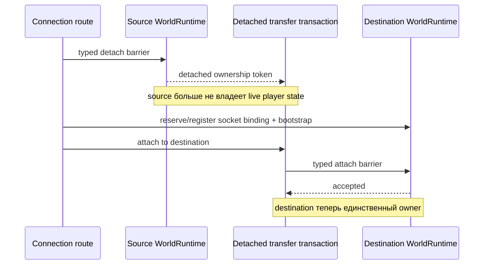

# Владение runtime-состоянием игрока

[English](../en/player-runtime-ownership.md) · [Архитектура](architecture.md)

## Правило владения

Изменяемое gameplay-состояние подключённого игрока в каждый момент принадлежит ровно одному authoritative loop конкретного `WorldRuntime`. Socket routing, операторские команды и код управления sandbox не получают player stores или изменяемый transfer payload.

Обычная обработка пакетов входит во владеющий runtime через typed authoritative commands. Перемещение между runtime подчиняется тому же правилу и не превращает connection code во временного второго владельца состояния.

## Перенос между runtime

Level 1 transfer имеет три отдельные фазы ownership:

`RuntimePlayerTransferTransaction` скрывает detached `RuntimePlayerTransferState` внутри себя. `RuntimeConnectionRoute` получает только небольшую routing-проекцию, которая ему действительно нужна, например имя игрока, и может запросить одно из трёх terminal actions:

- прикрепить игрока к destination `WorldRuntime`;
- восстановить точное detached state в source runtime после неудачного переноса;
- уничтожить detached state при намеренном disconnect.

Транзакция одноразовая. После attach, restore или discard повторное terminal action отвергается. Так случайное двойное ownership и повторное использование detached payload становятся явной ошибкой, а не неявным shared-state поведением.

## Семантика отказов

Резервирование destination slot по возможности выполняется до source detach barrier. Если source уже отсоединил игрока, любой последующий сбой routing/bootstrap/attach обязан восстановить authoritative state исходного runtime до возврата к обычной игре.

Route никогда не обращается напрямую к player dictionary, inventory store или transfer-profile store другого runtime. Все переходы mutable state проходят через `RuntimePlayerTransferIngress`, поэтому только game loop destination runtime может установить перенесённое состояние.

Same-runtime respawn использует ту же detach/attach transaction. Благодаря этому respawn и sandbox movement работают на одной модели ownership вместо второго независимого mutation path.
