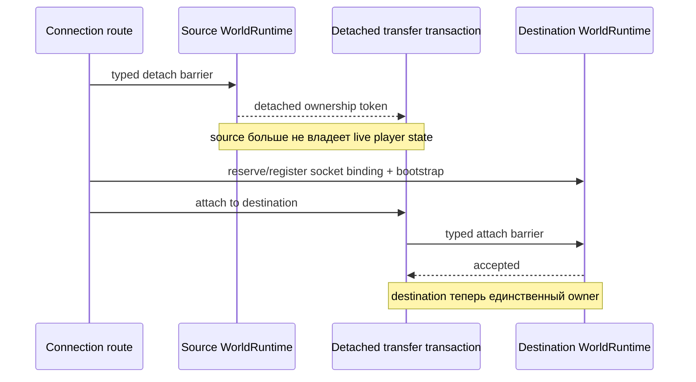

# Владение runtime-состоянием игрока

Локальная приёмка одиннадцатого блока: 1553881/1553882 тестов, без ошибок и падений, один прежний пропуск worldgen; чистая Release-сборка, Windows NativeAOT, пять smoke-проверок и локальные gates прошли. См. [контрольную точку NPC](../roadmap/npc-ai-parity.md). Предыдущие записи о кандидатах и ожидаемой приёмке ниже описывают свои исторические блоки. Полная совместимость геймплея и NPC остаётся открытой.

Десятый объединённый блок принят локально: 1474709/1474710 тестов, без ошибок и падений, один прежний пропуск worldgen; чистая Release-сборка, Windows NativeAOT, пять smoke-проверок и локальные проверки пройдены. См. [контрольную точку NPC](../roadmap/npc-ai-parity.md). Прежние записи candidate/pending ниже относятся к истории соответствующих блоков. Полная совместимость остаётся открытой.

2026-10-05: реальные переходы подключения, отключения и переноса людей и серверных игроков обновляют представление сырых слотов для NPC. Поколение и счётчик состава защищают от отключения и повторного подключения в тот же слот; слот255 сохраняет исходное состояние конструктора. Здоровье серверного игрока хранит базовый максимум100 и флаги дебаффов своего поколения, атомарно обновляя производный максимум и флаги; городские NPC получают выбранный предмет из настоящего инвентаря. Условие выпадения сердца использует текущий производный максимум, а неизвестное здоровье останавливает выбранное предложение сердца. Проверки предметов сохраняют снимки игроков и счётчик изменений инвентаря, включая возврат прежних значений. Формат файла мира не меняется. Динамический Skyblock lowTiles и открытый Void Bag с неполностью импортированным хранилищем остаются неизвестными и ограничивают предложение Sickle у Zombie.

`PlayerStateSnapshot.HasMount` обозначает активацию отдельно от типа транспорта. Источники снимков должны устанавливать его для любого активного транспорта, включая тип ноль; одного `MountType` недостаточно для активации. Команды движения получают его из нормализованного бита присутствия пакета. Его читают репликация снимков, геометрия NPC и переносы с сохранением позиции; респавн и размещение в точке спавна нового мира сбрасывают его. Это временное состояние игрока без нового поля файла мира.

[English](../en/player-runtime-ownership.md) · [Архитектура](architecture.md)

## Правило владения

Изменяемое gameplay-состояние подключённого игрока в каждый момент принадлежит ровно одному authoritative loop конкретного `WorldRuntime`. Socket routing, операторские команды и код управления sandbox не получают player stores или изменяемый transfer payload.

Обычная обработка пакетов входит во владеющий runtime через typed authoritative commands. Перемещение между runtime подчиняется тому же правилу и не превращает connection code во временного второго владельца состояния.

## Владение по слоям

Player-данные теперь следуют тому же направлению зависимостей, что и остальной runtime:

- `TerraRuntime.Contracts.Runtime` владеет detached DTO для player commit, включая `PlayerAppearanceCommitRequest`, `PlayerMovementCommitRequest`, `PlayerSpawnCommitRequest`, equipment и vitals requests;
- `TerraRuntime.Gameplay.Players` владеет source-backed vanilla normalization/validation без изменяемого runtime-состояния;
- `TerraRuntime.Core` владеет authoritative ingress-контрактами и общими execution-механизмами;
- `TerraRuntime.Core.Players` владеет identity server-player slot и изменяемыми server-player state stores, чтобы player-specific механика не разрасталась в плоском namespace Core;
- application composition владеет connection admission, политикой истории/anti-cheat и конкретным routing authoritative-команд; world-owned `ServerPlayerAuthority` является единственным application-level owner, объединяющим server-player lifecycle, semantic control intents, physics progression и replication events.

Преобразование signed net-id из packet 5 теперь принадлежит application ingress boundary в `PlayerEquipmentPacket5Normalizer`. Core получает только канонические положительные item identity и напрямую проверяет server-owned inventory state; Gameplay не содержит wire-совместимую арифметику.

## Перенос между runtime

Level 1 transfer имеет три отдельные фазы ownership:

```mermaid
sequenceDiagram
    participant Route as Connection route
    participant Source as Source WorldRuntime
    participant Tx as Detached transfer transaction
    participant Destination as Destination WorldRuntime

    Route->>Source: typed detach barrier
    Source-->>Tx: detached ownership token
    Note over Source,Tx: source больше не владеет live player state
    Route->>Destination: reserve/register socket binding + bootstrap
    Route->>Tx: attach to destination
    Tx->>Destination: typed attach barrier
    Destination-->>Tx: accepted
    Note over Tx,Destination: destination теперь единственный owner
```

`RuntimePlayerTransferTransaction` скрывает detached `RuntimePlayerTransferState` внутри себя. `RuntimeConnectionRoute` получает только небольшую routing-проекцию, которая ему действительно нужна, например имя игрока, и может запросить одно из трёх terminal actions:

- прикрепить игрока к destination `WorldRuntime`;
- восстановить точное detached state в source runtime после неудачного переноса;
- уничтожить detached state при намеренном disconnect.

Транзакция одноразовая. После attach, restore или discard повторное terminal action отвергается. Так случайное двойное ownership и повторное использование detached payload становятся явной ошибкой, а не неявным shared-state поведением.

## Семантика отказов

Резервирование destination slot по возможности выполняется до source detach barrier. Если source уже отсоединил игрока, любой последующий сбой routing/bootstrap/attach обязан восстановить authoritative state исходного runtime до возврата к обычной игре.

Route никогда не обращается напрямую к player dictionary, inventory store или transfer-profile store другого runtime. Все переходы mutable state проходят через `RuntimePlayerTransferIngress`, поэтому только game loop destination runtime может установить перенесённое состояние.

World-space position не является переносимым player state между разными мирами. Успешный cross-runtime transfer всегда устанавливает floor-tile spawn destination world; authoritative top-left позиция вычисляется по Terraria 1.4.5.8 как `X = spawnX * 16 + 8 - playerWidth / 2`, `Y = spawnY * 16 - playerHeight`. Исходные координаты сохраняются только для rollback в тот же source runtime при сорванном transfer. Это не зависит от `forceRespawn`: обычный drag/move в sandbox тоже появляется на spawn целевого мира. Initial join по-прежнему завершает bootstrap packet 49, но live cross-world transfer уже находится в vanilla connection state 10, где packet 49 не вызывает `Player.Spawn`; поэтому replacement-world bootstrap завершается явным packet 12 `PlayerSpawn` с destination `SpawnX/SpawnY`. Packet 12 является последним world-handoff frame внутри атомарного bootstrap batch; post-attach global baselines вроде packet 82 могут следовать после него, но не несут world/position state.

В Terraria 1.4.5.8 `Player.Spawn(SpawningIntoWorld)` может установить клиентские personal `SpawnX/SpawnY` в `-1/-1`, если `FindSpawn`/`CheckSpawn` не нашёл допустимый personal spawn, после чего multiplayer client отправляет packet 12 обратно. Пока активен replacement-world landing gate, TerraRuntime поглощает этот немедленный `SpawningIntoWorld` packet как echo синтетического handoff, а не принимает его за новый authoritative respawn. Поэтому destination attach остаётся на spawn целевого мира, а echo не может перезаписать movement-correction target координатами у левого верхнего края. Обычная обработка post-join respawn packet 12 не меняется.

Vanilla inventory slot `58` соответствует `Main.mouseItem`, поэтому его нельзя слепо копировать через live world handoff. Перед detach занятый cursor slot ровно один раз переносится в свободный main-inventory slot `0..49`, а slot 58 очищается в detached image. Если свободного main slot нет, transfer отменяется до detach и оставляет source state без изменений. Destination явно публикует очищенный cursor перед normalized inventory, а packet-5 echoes во время активного replacement-world landing gate не могут восстановить устаревший cursor item. Поэтому повторные переходы primary/sandbox сохраняют общее количество предметов без duplication или потери cursor stack.

Live handoff добавляет packet-23 despawn для активных NPC исходного runtime перед replacement `WorldData`, поэтому сущности source world не остаются на клиенте призраками в destination. После принятия batch landing gate отклоняет и исправляет запоздавшие packet-13 координаты из исходного мира, пока клиент не сообщит позицию рядом со spawn destination. Обычный movement также проверяется и на connection boundary, и в authoritative world writer по краевой полосе `$640\,\mathrm{px}$` из Terraria 1.4.5.8 `Player.BordersMovement`. Out-of-bounds samples не становятся authoritative и не запускают section streaming; connection получает последнюю принятую позицию. Синтетические test worlds, слишком маленькие для двух краевых полос, используют только границу полного тела игрока внутри мира.

Same-runtime respawn использует ту же detach/attach transaction. Благодаря этому respawn и sandbox movement работают на одной модели ownership вместо второго независимого mutation path. Входящий client packet 12 после принятого respawn реплицируется другим playing connections, но не эхоится обратно origin connection: клиент уже выполнил свой spawn transition, а повторная отправка того же spawn может повторно запустить локальный transition и создать feedback loop. Respawn также очищает pre-death transient movement flags и инвалидирует retained packet-13 baseline; teleport инвалидирует этот baseline по той же причине. Поэтому последующий AOI resync не может повторно выдать pre-respawn/pre-teleport позицию до прихода нового movement packet.

Client-owned appearance, equipment, movement и health replication хранит exact-generation baselines. Если следующий update кодируется в те же байты, повторный fanout peers не выполняется; для movement duplicate подавляется только когда interest/visibility membership не изменился. Duplicate packet-16 health updates также coalesce'ятся для peers, но authoritative owner health correction намеренно обходит это подавление для самого owner. Authoritative NPC packet-23 и projectile packet-27 updates используют такое же generation-safe exact-wire coalescing: runtime-only изменения revision/timer, не меняющие encoded state, больше не создают повторный broadcast, а spawn/despawn и любое изменившееся wire state отправляются сразу. Это exact-state coalescing, а не timer throttling.

## Runtime GodMode ownership

GodMode — authoritative generation-scoped runtime flag, который зеркалит vanilla `CreativePowers.GodmodePower`. Он устанавливается только через typed trusted-host/TUI administration boundary, переносится в detached Level-1 transfer state для того же live connection и удаляется при disconnect. На диск он не сохраняется. Server→client синхронизация выполняется vanilla net module packet 82 (`SyncOnePlayer` при изменении и `SyncEveryone` как baseline). Входящий client packet 82 не является authority и не может самовольно включить GodMode.

При включённом флаге authoritative PvP, NPC contact и admitted hostile NPC-projectile damage завершаются до mutation HP/immunity, а vanilla клиент сам не входит в обычный `Player.Hurt`, поэтому для Hurt-based источников нет ни снятия HP, ни knockback. Старые packet-16 heal-back, owner health repair, movement correction epoch и специальное поглощение packet 13 для GodMode удалены полностью; fallback-пути нет. Combat text `MISS` остаётся только presentation-эффектом. В Terraria 1.4.5.8 drowning является отдельным краем: он напрямую уменьшает `statLife`, обходя обычный `Player.Hurt`; TerraRuntime намеренно не возвращает скрытый heal-back ради маскировки этой vanilla-семантики.

## Владение stealth удалённого игрока (пакет 84)

`RuntimePlayerMember.Stealth` изначально равен `1`, как поле оригинального `Player`. Пакет 84 поступает в типизированную очередь привязанного мира с аутентифицированными слотом и поколением соединения; заявленный номер игрока не выбирает другого участника. Допускаются конечные значения `[0,1]`; некорректная длина, NaN, бесконечность и выход за диапазон отклоняются до изменения состояния. Проверка диапазона — политика входной границы, более строгая, чем оригинальный `ReadSingle`.

Мир владеет значением до отключения. Возрождение в том же поколении сохраняет его: оригинальный `Player.Spawn` не присваивает stealth. Перенос содержит nullable-поле `PlayerStateSnapshot.Stealth`: принадлежащий миру ноль сохраняется, отсутствующая проекция (включая default-структуру) даёт единицу. Недопустимая проекция отклоняется до регистрации инвентаря и игрока. Принятый сервером PvE/PvP `Hurt` сбрасывает stealth в единицу и отправляет обновление другим игрокам; GodMode, иммунитет и остальные отклонённые удары его сохраняют. Пакет 16 с жизнью не означает вызов `Hurt`.

Пакет 84 пересылается играющим участникам кроме отправителя. В `NetMessage.SyncOnePlayer` его нет, поэтому при входе не создаётся дополнительный baseline stealth. Владение поколением сохраняется в состоянии игрока мира, а не в кеше сокета. Эта область предоставляет удалённую видимость для разговора NPC; обновления экипировки Shroomite/Vortex, локальный сброс при использовании предмета и модификаторы урона stealth остаются отдельными задачами.

`PlayerStealth1458Tests` проверяет байты оригинального исполняемого файла, аутентификацию, диапазон, отклонение чужого поколения, nullable-перенос, возрождение и принятый/отклонённый урон. Оригинальный `TerrariaServer 1.4.5.8` через `NetMessage.SendData(84)` выдал `080054070000803E` для слота 7 / 0.25; серверный `MessageBuffer.GetData` заменил подложный слот 199 отправителем 7, сохранив слот 199. Оригинальный `Player.Hurt` при иммунитете вернул ноль и сохранил 0.25, а при принятом ударе вернул десять урона и stealth один.

Пакет 41 теперь записывает принадлежащий соединению счётчик анимации предмета и конечный угол поворота. Заявленный клиентом слот отбрасывается; старое соединение и поколение игрока не могут изменить текущего участника. Nullable-поля снимка отличают отсутствующую проекцию от полученного нуля. Допустимый перенос с сохранением позиции мира сохраняет живой счётчик. Принятая смерть и тик умершего игрока обнуляют анимацию; сам Spawn пакета 12 сохраняет анимацию и угол даже для состояния умершего игрока, что подтверждено исходным бинарником. Собственная политика переноса обнуляет анимацию при сбросе позиции или переносе умершего игрока; это не приписывается исходному Spawn. Перед симуляцией NPC обычный ItemCheck уменьшает счётчик на один; отпущенный Revolver — на два. Снимки баффов Frozen, Webbed, Stoned и Shimmer обнуляют счётчик через исходный предикат CCed. Эти наблюдения используются для видимости NPC; они не разрешают атаки предметом, эффекты channel, урон и боевые модификаторы. Представление применения предмета серверным игроком устанавливает тот же собственный счётчик и читает его инвентарь для правила Revolver.

Кандидаты целей NPC теперь получают собственную анимацию пакета 41 и stealth пакета 84. Бит 6 MiscFlags2 пакета 13 остаётся lastItemUseAttemptSuccess и не заменяет анимацию. Для умершего игрока и принятого возрождения TalkNPC и сессия магазина закрываются до планирования городских NPC. Независимый запуск исходного бинарника подтвердил байты пакетов, замену заявленного слота на аутентифицированный, обычный счётчик 9→8, отпущенный Revolver 9→7 и frozen/webbed/stoned 9→0.

Пакет `134` сохраняет восемь сообщённых клиентом компонентов удачи только для аутентифицированного поколения соединения. `RuntimePlayerMember.Luck` начинается с исходного нуля конструктора; optional-компоненты отличают отсутствие пакета от представленного полностью нулевого пакета. Пересчёт объединяет компоненты с сохранённым флагом Galaxy Pearl пакета 4, загруженным фактом Lantern Night и собственным присутствием Stinky из пакета 50. При отсутствии владельца Lantern новые факторы не допускаются. Живые удалённые игроки уменьшают таймер божьей коровки и положительную удачу монет при поддержанной обычной скорости дня; мёртвые игроки возвращаются раньше этого обновления. Появление в том же поколении сохраняет компоненты, замена начинает без них, а пользовательский transfer сохраняет их и пересчитывает по фактам мира назначения. Неконечные компоненты либо результат отклоняются до ревизии/отправки. Исходная адресная рассылка исключает отправителя и не добавляет вымышленный join baseline. Динамическая оркестрация Lantern, ускоренные таймеры и серверное восстановление клиентских факторов снаряжения/факелов остаются открытыми.

## Удалённый biome context (пакет36)

Authenticated packet36 теперь владеет всеми пятью исходными zone bytes и byte townNPCs для точного connection/player generation. Заявленный wire slot отбрасывается до допуска команды; неправильная длина останавливает обработку до queue, а заполненный mailbox отбрасывает заменяемое наблюдение. Допустимый game-thread commit один раз увеличивает member revision и передаётся playing peers без sender. Все исходные byte values сохраняются без вычисления зон из terrain и без ограничения town count. Эти наблюдения не разрешают NPC spawns и не меняют natural-spawn trust.

Исходный Player constructor доказывает известные нулевые zones/town count для нового membership. Двадцать четыре original Spawn cases по всем четырём contexts, alive/dead и byte0/1/255 сохраняют все пять zones и town count197. Respawn и transfer того же generation сохраняют наблюдения; отсутствующая импортированная nullable projection остаётся неизвестной. Replacement membership начинает с настоящих source constructor values, старые команды не могут его изменить. Не создаётся отсутствующий в источнике packet36 join/transfer replay; исходный клиент отправляет изменения и повтор каждые900 network ticks.

Исходный false→true zone5 Shimmer edge вызывает SpawnFaelings. Уже активный физический NPC677 приводит к возврату на первом AnyNPCs без RNG; этот путь допустим. Без него весь update отклоняется до изменения zones/revision/relay/RNG, пока настоящий producer не владеет scope/selected-item/dual-dungeon/spawn facts. Повторное true и falling update не требуют producer. Эта явная граница допуска оставляет first-entry Faelings открытым.

Town social selection сохраняет physical identities подключённых и серверных игроков, generation/revision, death state и настоящие mounted bounds. Ближний серверный актор с неизвестными zones учитывается, а не игнорируется; выбранные surface-biome topics отклоняют его отсутствующую projection. [Town evidence](town-npc-housing-shops.md#темы-биомов-из-принадлежащих-runtime-зон) содержит независимые исходные bytes, lifecycle, приоритет биомов и реальные world ticks. Zones временные и не добавляют player/world-file persistence.
## Максимальное здоровье удалённого игрока

Фаза игрока перед NPC сохраняет nullable `PlayerStateSnapshot.DerivedLifeMax` отдельно от базового максимума packet16. Dedicated remote `ResetEffects` сбрасывает `statLifeMax2` к base; каждый положительный слот Lifeforce113 добавляет `base / 5 / 20 * 20` с целочисленной арифметикой. Повторения обрабатываются отдельно; удалённые buff durations не уменьшаются. Outside пропускает ResetEffects, но применяет buffs к прежнему derived. Ghost возвращается после ResetEffects до buffs; dead сохраняет derived и очищает непостоянные slots на месте. Восемь death-persistent identities сохраняют свои слоты; новый authoritative buff занимает первую свободную ячейку.

Packet16/50 не вычисляют derived немедленно. Spawn сохраняет прежний derived до следующей фазы; transfer сохраняет nullable provenance, новое поколение начинает с исходных constructor base/derived100. Base provenance не подменяет синхронизированную текущую жизнь. Неизвестные imported base/buff/derived остаются неизвестными. Ошибочные значения и revision exhaustion не допускают частичную запись. Server-owned store использует тот же nullable snapshot и generation/revision-safe setter; его фаза перед NPC использует представленные buff owners.

Настоящий remote `Player.Update` для анимированных Life Crystal29 и Life Fruit1291 не выполняет owner-only use при dedicated `Main.myPlayer=255`; наблюдения не изменяют derived или inventory. Матрица320 случаев проверяет base/derived, clock и stack. Это ownership удалённого контекста, а не authoritative локальное использование расходников.

`PlayerDerivedHealth1458Tests` проверяет288 непрерывных Player.Update,864 полных Main player-phase,401 death-buff metadata,64 целочисленных healing-topic boundaries,40 Spawn и320 animated-use случаев. Town fixtures содержат648 пар с отдельными потоками `Main.SwapRandom("UpdatePlayers")` и `Main.SwapRandom("UpdateNPCs")`. Player manaHeat/ItemCheck draws принадлежат первому и не сдвигают второй. Derived transient; формат player/world files не расширен.

## Актуальность текущей жизни для NPC

Исходный constructor `statLife=100` независим от обоих максимумов, но не доказывает постоянство жизни: dedicated remote `Player.Update` выполняет regeneration и DoT. Независимая матрица480 непрерывных случаев использует настоящие constructor/GetData16/50/Spawn/UpdateWorld_Players при Main.myPlayer255. Poison20 снижает constructor100 до99 на tick30 и80 на600; Fire24 — до98 и60. Lifeforce113 увеличивает derived до120, а положительная regeneration поднимает current100 до102 к600. CursedInferno может снизить жизнь ниже нуля: вызов смерти отдельно ограничен local owner. Ghost/dead/outside отличаются; Base/Derived не заменяют эти writers.

Nullable `NpcLifeCurrent` описывает доступность синхронизированного наблюдения для NPC, а не PvP authority. Packet16 текущего поколения делает наблюдение доступным; положительный pre-Spawn report сохраняется, потому что исходный Spawn не меняет положительную жизнь. Birth без наблюдения и неположительная pre-Spawn реконструкция недоступны. Respawn/forced transfer инвалидируют доступность; обычный transfer сохраняет nullable provenance, следующая удалённая health-phase граница инвалидирует её с той же owned revision. HasHealth/Life сохраняются для существующего combat owner. При saturated revision snapshot не допускает устаревшее наблюдение. Server-owned health остаётся актуальным в своём owned store.

Выбранные Items/heart offers требуют этой provenance и лениво отклоняют выбранные недоступные facts. Свежий report после player phase может дать ограниченную исходную пару; packet16 в очереди перед настоящим world tick становится недоступным до NPC scheduling. Полное владение непрерывными remote regeneration/environment/current-life остаётся открытым. Current-life100 field, packet44 handler, расширение PvP и новые file fields не добавлены.
