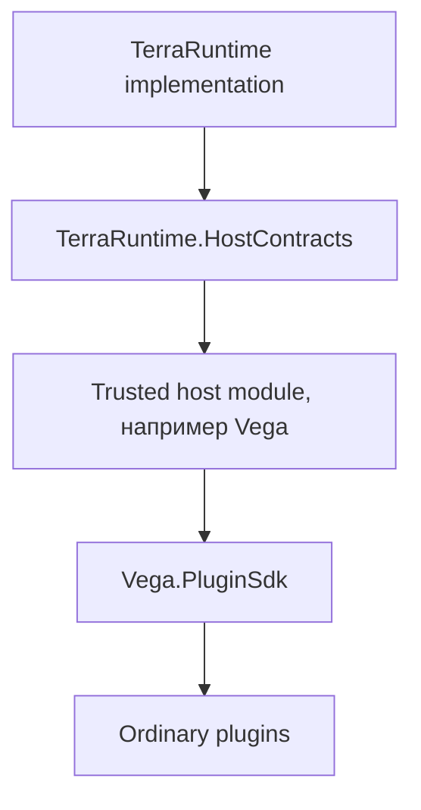
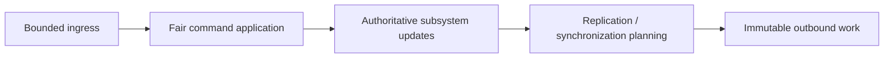
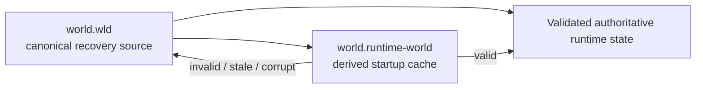
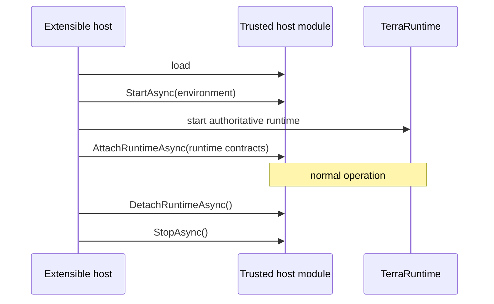
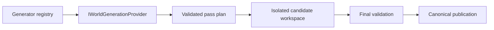
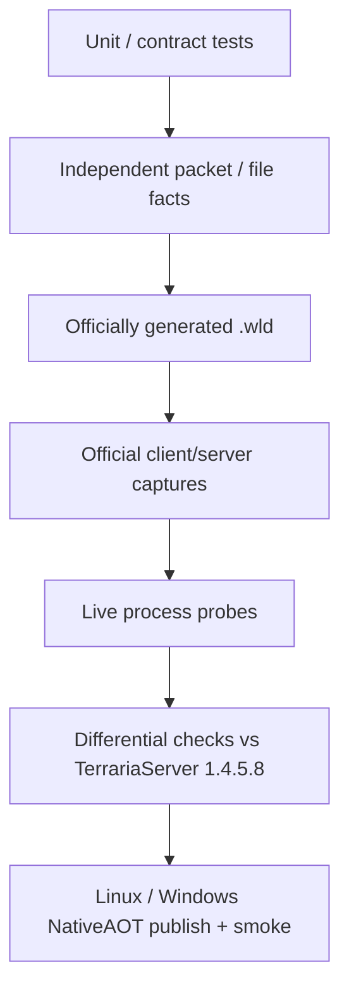

# Руководство по проекту TerraRuntime

[English](../en/project-guide.md) · [Документация](README.md) · [Архитектура](architecture.md) · [Host interfaces](host-interfaces.md) · [Roadmap](../roadmap.md)

## 1. Что такое TerraRuntime

TerraRuntime — clean-room серверный runtime Terraria на .NET 11. Цель — observable parity с официальным TerrariaServer 1.4.5.8 при другой внутренней архитектуре: explicit ownership state, bounded work, тестируемые boundaries и gameplay code без зависимости от socket transport details.

> Vanilla-visible behavior сохраняется; внутренняя реализация может отличаться, если observable contract остаётся тем же.

TerraRuntime не является форком TerrariaServer и не использует его runtime objects. Official server остаётся behavioral/differential reference. Protocol 326 представлен через Multiplicity за собственной protocol boundary TerraRuntime.

## 2. Shipping profiles

### Standalone NativeAOT

`TerraRuntime.Server` — standalone executable. Runtime core остаётся NativeAOT-compatible; Linux x64 / Windows x64 publish-and-smoke являются shipping gates. Arbitrary managed DLL plugins в этом profile не загружаются.

### Extensible CoreCLR

`TerraRuntime.Extensible.Server` — self-contained CoreCLR host для trusted host module вроде Vega.



Ordinary plugins не получают implementation objects TerraRuntime.

## 3. Структура репозитория

| Path | Responsibility |
|---|---|
| `build/` | solution и shipping publish entry point |
| `src/TerraRuntime` | standalone composition root, startup, gameplay/network/world composition, TUI |
| `src/TerraRuntime.ExtensibleHost` | CoreCLR host и trusted host-module loading |
| `src/TerraRuntime.HostContracts` | narrow privileged host-module contracts |
| `src/TerraRuntime.Contracts` | stable snapshots, IDs и runtime/gameplay control contracts |
| `src/TerraRuntime.Core` | authoritative state, commands, entity systems и scheduling |
| `src/TerraRuntime.Network` | connection pipeline, ingress/egress и bounded queues |
| `src/TerraRuntime.Protocol` | protocol boundary и shared framing/codec concepts |
| `src/TerraRuntime.Protocol.Multiplicity` | Multiplicity adapter |
| `src/TerraRuntime.World` | `.wld`, tiles, sections, collision, liquids, cache и persistence helpers |
| `tests/TerraRuntime.Tests` | unit/integration/contract tests |
| `tests/TerraRuntime.HostModuleFixture` | extensible-host boundary fixture |
| `tools/` | reference probes, world verification и CI tooling |
| `docs/roadmap/` | detailed subsystem roadmaps |

## 4. Сборка

SDK pinned через `global.json`; main solution — `build/TerraRuntime.slnx`.

Обычные restore/build/test команды запускаются из корня репозитория:

```bash
dotnet restore build/TerraRuntime.slnx
dotnet build build/TerraRuntime.slnx -c Release
dotnet test build/TerraRuntime.slnx -c Release --no-build
```

Чтобы получить оба shipping deployment для текущей ОС в дереве `artifacts/`, используется одна команда:

```powershell
pwsh build/publish.ps1
```

`-Profile native-aot` или `-Profile coreclr` собирает только один профиль. Через `-RuntimeIdentifier` RID можно указать явно; shipping NativeAOT/ReadyToRun publish намеренно отклоняется, если RID не соответствует текущей ОС.

Обычный build не является complete shipping proof. Runtime-core changes обязаны сохранять exercised Linux/Windows NativeAOT publication paths.

## 5. Runtime layout

Standalone deployment использует literal filesystem layout:

```text
TerraRuntime.Server[.exe]
Worlds/
config/
data/
logs/
```

CoreCLR extensible deployment дополнительно содержит trusted host/plugin locations вроде `runtime/`, `HostModules/`, `ServerPlugins/`. `Worlds/` — canonical interactive-selection directory; explicit `--world <path.wld>` может указывать наружу.

## 6. Client connection path

```mermaid
flowchart LR
    TCP["TCP socket"] --> Read["Connection read loop"]
    Read --> Frame["Bounded frame decoder"]
    Frame --> Proto["Protocol validation / decode"]
    Proto --> Command["Owned semantic command"]
    Command --> Queue["Authoritative game-loop queue"]
    Queue --> Validate["Gameplay / state validation"]
    Validate --> Mutate["Authoritative mutation"]
    Mutate --> Projection["Immutable event / snapshot"]
    Projection --> Recipients["Recipient / synchronization planning"]
    Recipients --> Encode["Protocol encode"]
    Encode --> OutQ["Bounded per-client outbound queue"]
    OutQ --> Writer["Socket writer"]
```



Network callbacks не мутируют world/player/NPC/projectile/item state напрямую. Client input проходит bounded framing/size checks, session legality и subsystem validation до mutation.

## 7. Authoritative game loop

Mutable simulation state принадлежит одному dedicated game-loop thread. Terraria baseline:

$$
f_{\mathrm{tick}}=60\,\mathrm{Hz},
\qquad
T_{\mathrm{tick}}\approx16.67\,\mathrm{ms}.
$$

Command work bounded globally и per source; deferred work observable, а не drains without limit.



Blocking disk/network I/O не является required progress authoritative tick.

## 8. Join и initial synchronization

Join следует verified protocol state/order. TerraRuntime владеет player slot, проводит connection через legal handshake/join state, передаёт required world/section state и переходит в normal gameplay только после выполненного bootstrap contract.

Current pre-`packet 49` structural ceiling:

$$
F_{\mathrm{pre49,max}}=65\ \text{frames},
\qquad
F_{\mathrm{probe}}=96\ \text{frames}.
$$

Live official-world probes дают independent ordering evidence поверх self-round-trip tests.

## 9. Canonical world и runtime cache

Terraria `.wld` остаётся canonical persistent state. `.runtime-world` — disposable derived startup image.



Cache corruption не должен превращаться в canonical-world corruption.

## 10. Сохранение

Live persistence захватывает mutable state только на authoritative boundary; serialization/I/O работают с detached data.

```mermaid
flowchart LR
    State["Authoritative state"] --> Capture["Bounded snapshot / shadow capture"]
    Capture --> Detached["Detached immutable save image"]
    Detached --> Writer["Background serialization"]
    Writer --> Temp["Same-directory temporary file"]
    Temp --> Flush["Durable file flush"]
    Flush --> Publish["Atomic replace / move"]
    Publish --> Fsync["Linux parent-directory fsync"]
    Fsync --> Canonical["Complete canonical .wld"]
```



Save requests bounded/coalesced. TUI может request/observe save, но не владеет mutable persistence state.

## 11. Gameplay architecture

Gameplay реализуется subsystem by subsystem. Packet IDs остаются в protocol boundary; version-pinned content IDs становятся domain concepts; runtime entity identity generation-safe и отделена от content type; AI/physics/combat не encode packets напрямую; replication строится из authoritative state/events.

Substantial foundations уже есть для players, world items, tiles, chests, signs, projectiles и NPC lifecycle slices. Broad vanilla coverage всё ещё incomplete для многих NPC AI families, bosses, events, housing, loot, wiring/liquids/growth, progression и vanilla WorldGen. См. [Gameplay](gameplay.md).

## 12. Interest management

Interest management runtime-owned. External hosts получают только enable/disable control. Spatial indexing, hysteresis, enter/leave semantics, resync policy и recipient selection остаются internal.

Suppression не включается только потому, что spatial index существует; correctness должна быть proven, uncertain state fail-open к broad vanilla-like routing.

## 13. Operations и TUI

Terminal UI потребляет bounded immutable operations snapshots и отправляет administrative mutations через safe operation/command boundaries.

UI failure деградирует в plain console и не становится server failure. Trusted CoreCLR hosts могут регистрировать complete independent dashboards, но не inject arbitrary controls в built-in dashboard.

## 14. Trusted host-module lifecycle



`ITerraRuntimeHostEnvironment` предоставляет deployment paths и registration surfaces до появления live world. `ITerraRuntimeHostRuntime` attach'ится позже и отдаёт narrow snapshots/operations, не mutable implementation state.

## 15. World generation



Built-in `terraruntime:flat` — infrastructure baseline, не vanilla WorldGen parity. Vanilla generation остаётся large RNG-order-sensitive work.

## 16. Errors и security

Normal hostile/malformed input contained до smallest practical scope. Client-controlled data не выбирает unbounded allocation/backlog, не bypass'ит connection/gameplay legality, не блокирует authoritative progress unbudgeted work и не мутирует state из network callback.

Malformed protocol, rate limit, invalid state, gameplay rejection, backpressure и typed terminal-stop categories остаются distinguishable.

## 17. Compatibility evidence



Evidence strength соответствует claim strength. Green self-round-trip недостаточен для wire/gameplay parity.

## 18. Правило документации

RU/EN documentation changes являются частью того же implementation work. Architecture/process diagrams используют Mermaid, а не ASCII pseudo-diagrams. Measured quantities, rates, sizes и formulas оформляются LaTeX where appropriate; packet IDs, API names, versions, CLI syntax и literal layouts остаются code literals.

## 19. Mapping изменений

| Change | Documentation |
|---|---|
| public host/runtime contract | `host-interfaces.md` и при необходимости `architecture.md` |
| lifecycle/ownership/threading | `architecture.md` + `project-guide.md` |
| CLI/deployment/startup | `project-guide.md` + `operations-tui.md` |
| persistence/cache/world format | `world-persistence.md` + overview pages |
| gameplay subsystem boundary | `gameplay.md` + `architecture.md` + roadmap |
| networking/synchronization/security | matching subsystem guide(s) |
| new limitation/divergence | user-facing guide + roadmap |

Documentation описывает implemented behavior и явно отделяет его от target design.
