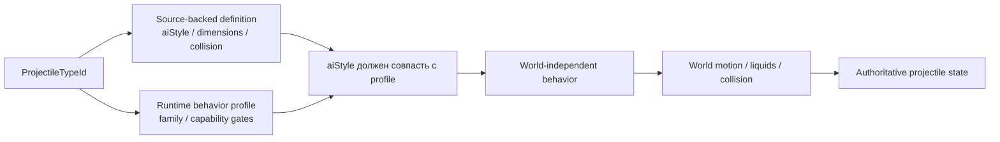
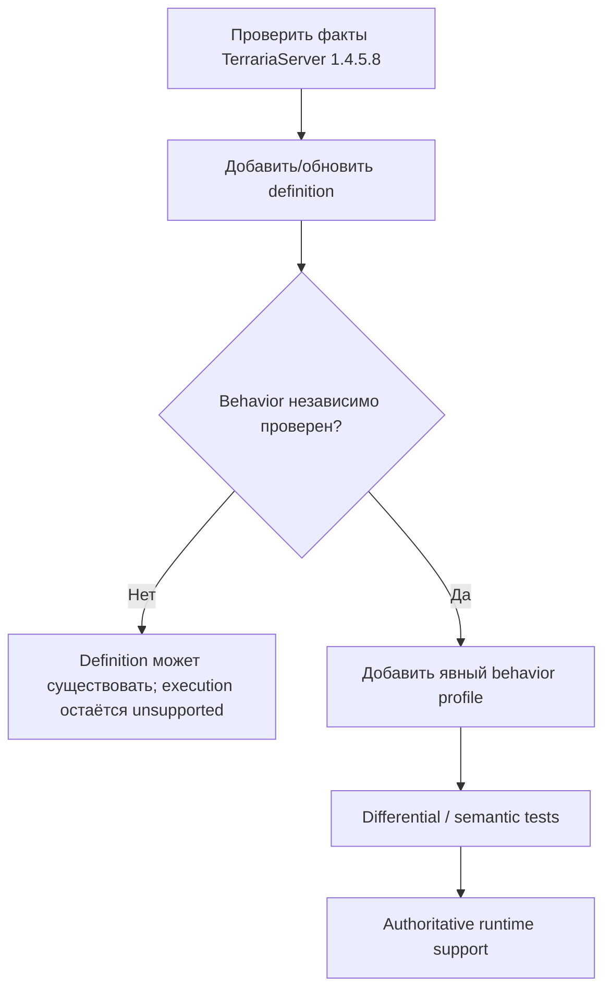
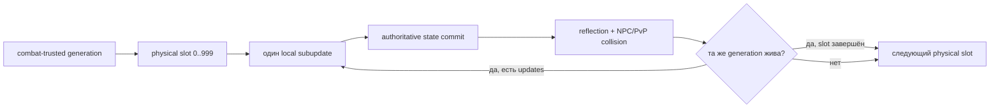

# Профили поведения снарядов

TerraRuntime не считает Terraria `aiStyle` достаточным доказательством того, что любой снаряд с тем же числовым стилем можно безопасно пустить по одной и той же authoritative-реализации.

Source-backed каталог определений и runtime-каталог поведения отвечают на разные вопросы:

Владение runtime-частью projectile-кода теперь следует foundation dependency layers. Стабильные projectile identities и detached DTO остаются в `TerraRuntime.Contracts`; source-backed protocol-neutral семантика simulation, включая definitions, lifecycle-факты `Projectile.SetDefaults`, hostility, owner sentinels, extra-update counts и математику NPC reflection, находится в `TerraRuntime.Gameplay.Projectiles`; generation-safe mutable stores, lifecycle mutations, execution и commit boundaries остаются в `TerraRuntime.Core`. Существующий world-only предикат `CutTilesAt` намеренно не переносится вверх: `TerraRuntime.World` остаётся sibling foundation layer и зависит только от Contracts, поэтому эту границу нужно переработать отдельно, а не добавлять зависимость World от Gameplay.

- `VanillaProjectileDefinitionCatalog` хранит проверенные факты TerrariaServer 1.4.5.8: размеры, collision shape, `aiStyle`, поведение в воде и флаги tile collision;
- `VanillaProjectileBehaviorProfileCatalog` явно разрешает конкретному projectile type использовать реализацию TerraRuntime и хранит runtime-ограничения/исключения.

## Почему `aiStyle` не является dispatcher'ом

`aiStyle` является vanilla/version data. `VanillaProjectileBehaviorFamily` является стратегией реализации, которой владеет TerraRuntime.

Эти идентичности намеренно разделены. Будущий source-backed projectile может иметь `aiStyle = 1`, как текущий basic-arrow slice, но одновременно содержать дополнительные ветви `AI_001`, owner-gated state, RNG-эффекты или lifecycle mutations, которых authoritative model TerraRuntime пока не знает. Поэтому одно лишь появление definition не включает его behavior автоматически.

Runtime работает fail-closed, пока одновременно не выполнены два условия:

1. для projectile type существует явный behavior profile;
2. `ExpectedAiStyle` профиля совпадает с `AiStyle` source-backed definition.

## Текущие профили

| Family | Текущий статус | Важные ограничения |
|---|---|---|
| `BasicArrow` | реализован | требуется default `ai[2]`; только явно перечисленные types |
| `Thrown` | реализован | явное source-backed membership |
| `Boomerang` | реализован source-backed runtime для type 6 | outbound-таймер, возврат к владельцу, отключение tile collision на return-фазе и проверенное исключение из pre-AI world-bounds |
| `SkeletronSkull` / Deerclops families | реализованы source-backed gameplay slices | явное membership boss projectiles; без generic promotion по `aiStyle` |
| `FallingStar` | реализован Star Cannon Star type `955` | только gameplay-значимое состояние `aiStyle 5`; natural Falling Star type `12` не допущен profile |
| `SuperStar` | реализован type `728` | source-backed gameplay motion `AI_151` и spawn дочернего type `729` |
| `SuperStarSlash` | type `729` реализован и допущен к combat | `extraUpdates=2`; collision/damage interleave после каждого local subupdate |

Green Laser намеренно не спрятан внутри generic basic-arrow пути. Его profile содержит `RejectServerOwned`, потому что dedicated-server owner branch меняет gameplay state, которого текущая authoritative model ещё не представляет.

## Владение world-boundary логикой

Pre-AI world-bound поведение тоже стало частью profile metadata. `VanillaProjectileWorldStateStepper` больше не смотрит прямо на `AiStyle`, решая, применять ли обычное world-bound завершение.

Размеры мира продолжают использовать проверенный Terraria tile scale:

$$
1\ \text{tile}=16\ \mathrm{px}.
$$

Profile определяет только применимость pre-AI world-bound правила. Tile queries, liquids, collision и integration по-прежнему принадлежат `VanillaProjectileWorldMotionResolver`.

## Правило расширения

Добавление нового projectile идёт в таком порядке:

Нельзя выводить behavior profile только из `AiStyle`. Это намеренное разделение границ доказательств, а не дублирование gameplay logic.

## Проверка

`VanillaProjectileBehaviorProfileCatalogTests` проверяет:

- явную классификацию текущих basic-arrow и thrown types;
- owner-gated исключение Green Laser;
- source-backed профиль Enchanted Boomerang с outbound/return-фазами, возвратом к владельцу и отключением tile collision на return-фазе;
- соответствие profile каждому source-backed definition `aiStyle`;
- fail-closed поведение при несовпадении definition и runtime profile;
- отсутствие автоматического вывода поведения для unprofiled projectile.

Существующие projectile behavior/world tests продолжают проверять фактическую скорость, таймеры, collision и lifecycle через те же production steppers.

## Combat handoff и runtime integrity

Projectile simulation, reflection и entity combat выполняются вперемежку на authoritative owner. В закреплённом TerrariaServer 1.4.5.8 цикл `Projectile.Update` вызывает `Damage()` внутри каждого local update, поэтому TerraRuntime не должен откладывать combat до завершения всех `extraUpdates`:

Положительные промежуточные subupdates коммитятся в generation-safe store, поэтому reflection, расход penetration, изменение velocity или despawn видны до следующего local update. При этом обычная packet-27 replication для таких промежуточных состояний намеренно не публикуется. Обычное истечение `timeLeft` завершается после interaction boundary, потому что vanilla вызывает `Damage()` до хвоста `timeLeft--`/`Kill()`; tile/world/behavior termination остаются pre-damage и не получают искусственного hit. Финальное выжившее local state публикует один обычный projectile update, а terminal removal/despawn по-прежнему публикуется немедленно. Так сохраняется source ordering без умножения обычной сетевой репликации на `extraUpdates + 1`.

Runtime-only combat trust остаётся привязанным к точной generation. Trusted generation отвергает owner packet 27/29 rewrites и раннее завершение. Client-origin generation пересекает эту границу только для source-backed weapon/ammo комбинаций, где projectile type, damage, knockback, launch-speed magnitude, cadence и spawn parameters проверены по server-owned state. Unsupported комбинации остаются compatibility/synchronization state и не могут менять authoritative HP NPC/игрока.

Допущенный friendly player-projectile slice теперь включает проверенные families `BasicArrow`, `Thrown`, Enchanted Boomerang, Super Star `728` и Super Star Slash `729`. NPC collision использует source-backed geometry definition и смоделированное семейство immunity. Super Star `728` использует generation-local one-hit-per-NPC immunity и создаёт type `729` после committed parent hit. Super Star Slash имеет infinite penetration и shared-by-type NPC immunity на $10\,\text{ticks}$. Поскольку type `729` имеет `extraUpdates=2`, его три local movement state могут source-order столкнуться с целями в течение одного global tick; shared static immunity clock запрещает повторный damage тому же NPC, но позволяет траектории slash попасть в другого NPC на более позднем subupdate.

PvP pass выполняется на той же subupdate boundary. Type `729` считается ranged для source-backed Frost/status branch, сохраняет обычное exact-projectile player immunity и намеренно пропускает `Projectile.TryDoingOnHitEffects`, как требует закреплённое type-specific исключение. Packet 117 не используется как authority для projectile damage.

World motion по-прежнему владеет tile collision, liquid contact, world bounds и source-backed lifetime. В fail-closed остатке остаются более широкая weapon/ammo provenance и special spawn geometry, unsupported projectile AI/collision hooks, owner-hit исключения, остальные status/buff side effects, kill/on-kill child families и полная parity slot-pressure/oldest-projectile replacement. Natural Falling Star type `12` также остаётся вне допущенного behavior profile, пока authoritative day/remix-world state не владеет его gameplay kill gate.

`ProjectileNpcHitIntentBuilder` остаётся provenance boundary для путей, которые строят явные NPC hit intents: player owner byte разрешается через `IRuntimePlayerSlotSnapshotLookup` в текущий `PlayerHandle`, поэтому reuse slot не переносит provenance на заменившего игрока. Server/NPC-origin projectile provenance остаётся fail-closed, пока origin `NpcHandle` не хранится явно.
