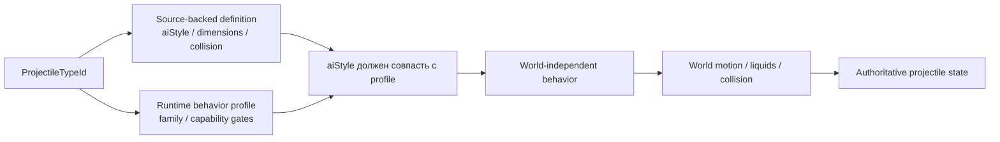
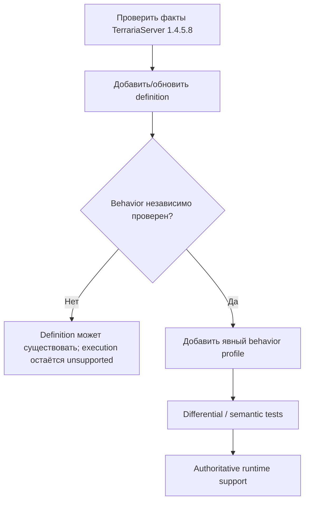
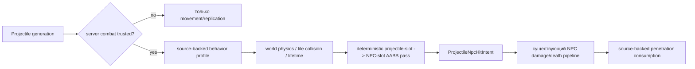

# Профили поведения снарядов

TerraRuntime не считает Terraria `aiStyle` достаточным доказательством того, что любой снаряд с тем же числовым стилем можно безопасно пустить по одной и той же authoritative-реализации.

Source-backed каталог определений и runtime-каталог поведения отвечают на разные вопросы:

Владение runtime-частью projectile-кода теперь следует foundation dependency layers. Стабильные projectile identities и detached DTO остаются в `TerraRuntime.Contracts`; source-backed protocol-neutral семантика simulation, включая definitions, lifecycle-факты `Projectile.SetDefaults`, hostility, owner sentinels, extra-update counts и математику NPC reflection, находится в `TerraRuntime.Gameplay.Projectiles`; generation-safe mutable stores, lifecycle mutations, execution и commit boundaries остаются в `TerraRuntime.Core`. Существующий world-only предикат `CutTilesAt` намеренно не переносится вверх: `TerraRuntime.World` остаётся sibling foundation layer и зависит только от Contracts, поэтому эту границу нужно переработать отдельно, а не добавлять зависимость World от Gameplay.

- `VanillaProjectileDefinitionCatalog` хранит проверенные факты TerrariaServer 1.4.5.8: размеры, collision shape, `aiStyle`, поведение в воде и флаги tile collision;
- `VanillaProjectileBehaviorProfileCatalog` явно разрешает конкретному projectile type использовать реализацию TerraRuntime и хранит runtime-ограничения/исключения.

## Почему `aiStyle` не является dispatcher'ом

`aiStyle` является vanilla/version data. `VanillaProjectileBehaviorFamily` является стратегией реализации, которой владеет TerraRuntime.

Эти идентичности намеренно разделены. Будущий source-backed projectile может иметь `aiStyle = 1`, как текущий basic-arrow slice, но одновременно содержать дополнительные ветви `AI_001`, owner-gated state, RNG-эффекты или lifecycle mutations, которых authoritative model TerraRuntime пока не знает. Поэтому одно лишь появление definition не включает его behavior автоматически.

Runtime работает fail-closed, пока одновременно не выполнены два условия:

1. для projectile type существует явный behavior profile;
2. `ExpectedAiStyle` профиля совпадает с `AiStyle` source-backed definition.

## Текущие профили

| Family | Текущий статус | Важные ограничения |
|---|---|---|
| `BasicArrow` | реализован | требуется default `ai[2]`; только явно перечисленные types |
| `Thrown` | реализован | явное source-backed membership |
| `Boomerang` | реализован source-backed runtime для type 6 | outbound-таймер, возврат к владельцу, отключение tile collision на return-фазе и проверенное исключение из pre-AI world-bounds |

Green Laser намеренно не спрятан внутри generic basic-arrow пути. Его profile содержит `RejectServerOwned`, потому что dedicated-server owner branch меняет gameplay state, которого текущая authoritative model ещё не представляет.

## Владение world-boundary логикой

Pre-AI world-bound поведение тоже стало частью profile metadata. `VanillaProjectileWorldStateStepper` больше не смотрит прямо на `AiStyle`, решая, применять ли обычное world-bound завершение.

Размеры мира продолжают использовать проверенный Terraria tile scale:

$$
1\ \text{tile}=16\ \mathrm{px}.
$$

Profile определяет только применимость pre-AI world-bound правила. Tile queries, liquids, collision и integration по-прежнему принадлежат `VanillaProjectileWorldMotionResolver`.

## Правило расширения

Добавление нового projectile идёт в таком порядке:

Нельзя выводить behavior profile только из `AiStyle`. Это намеренное разделение границ доказательств, а не дублирование gameplay logic.

## Проверка

`VanillaProjectileBehaviorProfileCatalogTests` проверяет:

- явную классификацию текущих basic-arrow и thrown types;
- owner-gated исключение Green Laser;
- source-backed профиль Enchanted Boomerang с outbound/return-фазами, возвратом к владельцу и отключением tile collision на return-фазе;
- соответствие profile каждому source-backed definition `aiStyle`;
- fail-closed поведение при несовпадении definition и runtime profile;
- отсутствие автоматического вывода поведения для unprofiled projectile.

Существующие projectile behavior/world tests продолжают проверять фактическую скорость, таймеры, collision и lifecycle через те же production steppers.

## Combat handoff и runtime integrity

У projectile simulation и NPC combat теперь есть исполняемый post-simulation handoff для намеренно небольшого trusted slice:

Runtime-only combat trust привязан к точной generation. Projectile, созданный через server runtime command path, может быть помечен как combat-trusted; новая generation из клиентского packet 27 **не** становится trusted только потому, что owner byte совпал с connection. После пометки generation как combat-trusted владелец через packet 27/29 уже не может переписать её position/velocity/AI, identity/damage-поля или досрочно уничтожить. Untrusted compatibility-generation сохраняет bounded owner updates, но не допускается к authoritative NPC combat. Это не даёт новому server-side NPC hit pass превратить непроверенный клиентский projectile claim в authoritative world damage.

Для combat-trusted player projectiles текущий hit pass допускает только behavior profiles с уже реализованными source-backed collision/penetration semantics. Первый slice покрывает выбранные `BasicArrow`/`Thrown` projectiles и source-backed Enchanted Boomerang, выбирает live generation-safe NPC по source-backed AABB geometry, применяет bounded baseline cooldown для пары projectile/NPC, коммитит damage/death через существующий NPC combat pipeline и только после успешного hit расходует source-backed penetration. Positive penetration уменьшается; последний hit despawn-ит точную generation; infinite penetration остаётся активным. Порядок детерминирован physical projectile slot, затем physical NPC slot.

World motion уже владеет tile collision, liquid contact, world bounds и source-backed lifetime. Новый pass добавляет entity collision и обычные NPC damage side effects, не возвращая эти обязанности в packet handling.

Runtime по-прежнему fail-closed на важных недостающих частях: promotion легитимных client projectiles по weapon/ammo source, полные vanilla projectile AI families, exceptional local/static NPC immunity, player/PvP collision, projectile buffs/debuffs, child/on-hit projectile spawn ordering и type-specific on-hit effects. В частности, client packet-27 projectiles остаются synchronization state, а не authoritative NPC-damage source, пока их weapon/ammo mapping не будет независимо проверен.

`ProjectileNpcHitIntentBuilder` остаётся provenance boundary: для player-owned projectile hit owner byte разрешается через `IRuntimePlayerSlotSnapshotLookup` в текущий `PlayerHandle`, поэтому reuse slot не переносит provenance на нового игрока. Server/NPC-origin projectile provenance остаётся fail-closed, пока origin `NpcHandle` не хранится явно.
