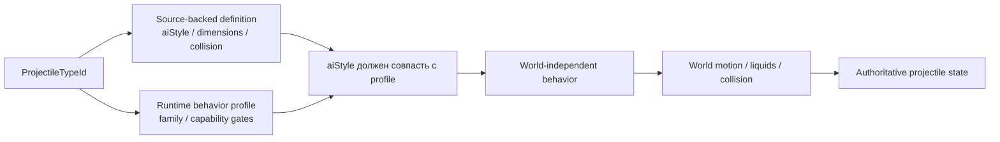
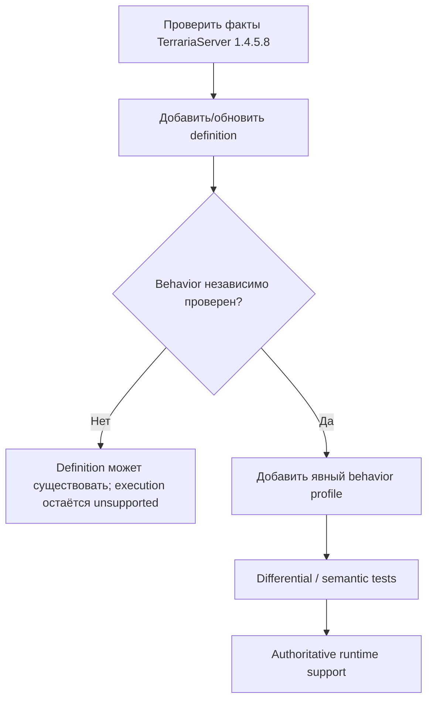

# Профили поведения снарядов

TerraRuntime не считает Terraria `aiStyle` достаточным доказательством того, что любой снаряд с тем же числовым стилем можно безопасно пустить по одной и той же authoritative-реализации.

Source-backed каталог определений и runtime-каталог поведения отвечают на разные вопросы:

- `VanillaProjectileDefinitionCatalog` хранит проверенные факты TerrariaServer 1.4.5.8: размеры, collision shape, `aiStyle`, поведение в воде и флаги tile collision;
- `VanillaProjectileBehaviorProfileCatalog` явно разрешает конкретному projectile type использовать реализацию TerraRuntime и хранит runtime-ограничения/исключения.

## Почему `aiStyle` не является dispatcher'ом

`aiStyle` является vanilla/version data. `VanillaProjectileBehaviorFamily` является стратегией реализации, которой владеет TerraRuntime.

Эти идентичности намеренно разделены. Будущий source-backed projectile может иметь `aiStyle = 1`, как текущий basic-arrow slice, но одновременно содержать дополнительные ветви `AI_001`, owner-gated state, RNG-эффекты или lifecycle mutations, которых authoritative model TerraRuntime пока не знает. Поэтому одно лишь появление definition не включает его behavior автоматически.

Runtime работает fail-closed, пока одновременно не выполнены два условия:

1. для projectile type существует явный behavior profile;
2. `ExpectedAiStyle` профиля совпадает с `AiStyle` source-backed definition.

## Текущие профили

| Family | Текущий статус | Важные ограничения |
|---|---|---|
| `BasicArrow` | реализован | требуется default `ai[2]`; только явно перечисленные types |
| `Thrown` | реализован | явное source-backed membership |
| `Boomerang` | известен, но не реализован | сохраняет проверенное исключение из pre-AI world-bounds |

Green Laser намеренно не спрятан внутри generic basic-arrow пути. Его profile содержит `RejectServerOwned`, потому что dedicated-server owner branch меняет gameplay state, которого текущая authoritative model ещё не представляет.

## Владение world-boundary логикой

Pre-AI world-bound поведение тоже стало частью profile metadata. `VanillaProjectileWorldStateStepper` больше не смотрит прямо на `AiStyle`, решая, применять ли обычное world-bound завершение.

Размеры мира продолжают использовать проверенный Terraria tile scale:

$$
1\ \text{tile}=16\ \mathrm{px}.
$$

Profile определяет только применимость pre-AI world-bound правила. Tile queries, liquids, collision и integration по-прежнему принадлежат `VanillaProjectileWorldMotionResolver`.

## Правило расширения

Добавление нового projectile идёт в таком порядке:

Нельзя выводить behavior profile только из `AiStyle`. Это намеренное разделение границ доказательств, а не дублирование gameplay logic.

## Проверка

`VanillaProjectileBehaviorProfileCatalogTests` проверяет:

- явную классификацию текущих basic-arrow и thrown types;
- owner-gated исключение Green Laser;
- известный, но пока не реализованный boomerang profile;
- соответствие profile каждому source-backed definition `aiStyle`;
- fail-closed поведение при несовпадении definition и runtime profile;
- отсутствие автоматического вывода поведения для unprofiled projectile.

Существующие projectile behavior/world tests продолжают проверять фактическую скорость, таймеры, collision и lifecycle через те же production steppers.
