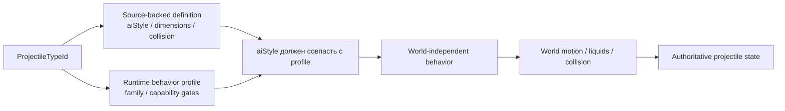
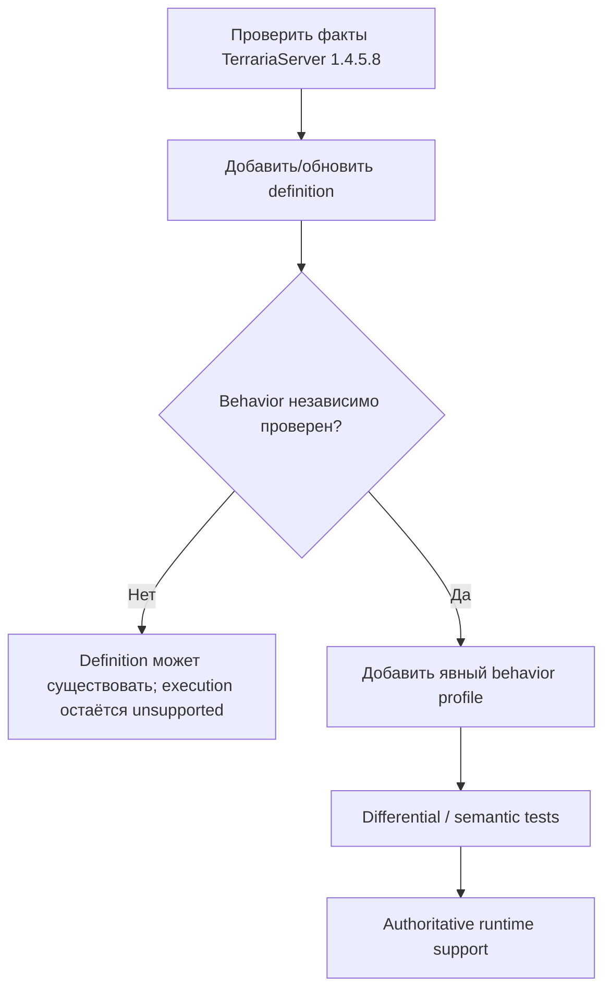
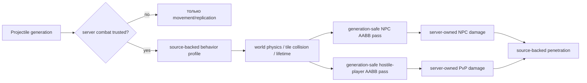

# Профили поведения снарядов

TerraRuntime не считает Terraria `aiStyle` достаточным доказательством того, что любой снаряд с тем же числовым стилем можно безопасно пустить по одной и той же authoritative-реализации.

Source-backed каталог определений и runtime-каталог поведения отвечают на разные вопросы:

Владение runtime-частью projectile-кода теперь следует foundation dependency layers. Стабильные projectile identities и detached DTO остаются в `TerraRuntime.Contracts`; source-backed protocol-neutral семантика simulation, включая definitions, lifecycle-факты `Projectile.SetDefaults`, hostility, owner sentinels, extra-update counts и математику NPC reflection, находится в `TerraRuntime.Gameplay.Projectiles`; generation-safe mutable stores, lifecycle mutations, execution и commit boundaries остаются в `TerraRuntime.Core`. Существующий world-only предикат `CutTilesAt` намеренно не переносится вверх: `TerraRuntime.World` остаётся sibling foundation layer и зависит только от Contracts, поэтому эту границу нужно переработать отдельно, а не добавлять зависимость World от Gameplay.

- `VanillaProjectileDefinitionCatalog` хранит проверенные факты TerrariaServer 1.4.5.8: размеры, collision shape, `aiStyle`, поведение в воде и флаги tile collision;
- `VanillaProjectileBehaviorProfileCatalog` явно разрешает конкретному projectile type использовать реализацию TerraRuntime и хранит runtime-ограничения/исключения.

## Почему `aiStyle` не является dispatcher'ом

`aiStyle` является vanilla/version data. `VanillaProjectileBehaviorFamily` является стратегией реализации, которой владеет TerraRuntime.

Эти идентичности намеренно разделены. Будущий source-backed projectile может иметь `aiStyle = 1`, как текущий basic-arrow slice, но одновременно содержать дополнительные ветви `AI_001`, owner-gated state, RNG-эффекты или lifecycle mutations, которых authoritative model TerraRuntime пока не знает. Поэтому одно лишь появление definition не включает его behavior автоматически.

Runtime работает fail-closed, пока одновременно не выполнены два условия:

1. для projectile type существует явный behavior profile;
2. `ExpectedAiStyle` профиля совпадает с `AiStyle` source-backed definition.

## Текущие профили

| Family | Текущий статус | Важные ограничения |
|---|---|---|
| `BasicArrow` | реализован | требуется default `ai[2]`; только явно перечисленные types |
| `Thrown` | реализован | явное source-backed membership |
| `Boomerang` | реализован source-backed runtime для type 6 | outbound-таймер, возврат к владельцу, отключение tile collision на return-фазе и проверенное исключение из pre-AI world-bounds |
| `Bomb` | реализованы launcher types 133..144 | aiStyle-16 физика grenade/mine, impact-fuse прямых rocket и source-backed explosion damage shape; presentation и destructive world side effects остаются отдельно |
| `HostileStraightArrow` | реализованы server-owned 83/84/100/259 | явный AI_001 путь без gravity и без изменения ai0; сохраняется source ai1 latch первого шага |
| `PlanteraSeed` | реализованы server-owned 275/276 | отложенная gravity 0.025; в Expert homing, минимум speed 14, отключение tile collision и cap lifetime 180 ticks |
| `GolemFireball` | реализован server-owned 258 | aiStyle-8 полёт без gravity; collision-owned ai0, четыре полных bounce и завершение на пятом impact |

Green Laser намеренно не спрятан внутри generic basic-arrow пути. Его profile содержит `RejectServerOwned`, потому что dedicated-server owner branch меняет gameplay state, которого текущая authoritative model ещё не представляет.

## Владение world-boundary логикой

Pre-AI world-bound поведение тоже стало частью profile metadata. `VanillaProjectileWorldStateStepper` больше не смотрит прямо на `AiStyle`, решая, применять ли обычное world-bound завершение.

Размеры мира продолжают использовать проверенный Terraria tile scale:

$$
1\ \text{tile}=16\ \mathrm{px}.
$$

Profile определяет только применимость pre-AI world-bound правила. Tile queries, liquids, collision и integration по-прежнему принадлежат `VanillaProjectileWorldMotionResolver`.

## Правило расширения

Добавление нового projectile идёт в таком порядке:

Нельзя выводить behavior profile только из `AiStyle`. Это намеренное разделение границ доказательств, а не дублирование gameplay logic.

## Проверка

`VanillaProjectileBehaviorProfileCatalogTests` проверяет:

- явную классификацию текущих basic-arrow и thrown types;
- owner-gated исключение Green Laser;
- source-backed профиль Enchanted Boomerang с outbound/return-фазами, возвратом к владельцу и отключением tile collision на return-фазе;
- явные hostile boss/NPC families для прямых beams, Plantera seeds и Golem fireball, включая их нестандартные gravity/collision правила;
- соответствие profile каждому source-backed definition `aiStyle`;
- fail-closed поведение при несовпадении definition и runtime profile;
- отсутствие автоматического вывода поведения для unprofiled projectile.

Существующие projectile behavior/world tests продолжают проверять фактическую скорость, таймеры, collision и lifecycle через те же production steppers.

## Combat handoff и runtime integrity

У projectile simulation и NPC combat теперь есть исполняемый post-simulation handoff для намеренно небольшого trusted slice:

Combat trust привязан к точной generation. Server-created generation может быть trusted напрямую, а client packet-27 generation пересекает ту же границу только после strict source-backed provenance. Сейчас admitted client paths покрывают обычные ранние bows/arrows, basic guns с Musket Ball/Silver Bullet, Grenade Launcher/Rocket Launcher/Proximity Mine Launcher с Rocket I-IV, selected-stack Shuriken/Bone/Throwing Knife/Poisoned Knife/Rotten Egg/Star Anise/Bone Dagger и prefix-free channeled Magic Missile/Flamelash/Rainbow Rod. Для rocket-ammo воспроизводится vanilla transform `base projectile + ammo offset`, а packet projectile type не принимается за истину. Provenance проверяет selected weapon, первый совместимый ammo где он нужен, projectile transform/type, server-calculated damage/knockback, launch-speed magnitude, допустимые initial `ai[]`, spawn distance и source-backed use cadence; расход ammo/throwable и admitted magic mana коммитятся только сервером. Unsupported sources остаются compatibility state и не могут наносить authoritative damage. После promotion обычный projectile нельзя переписать owner packet 27/29 по position/velocity/AI, identity/damage-полям или досрочно уничтожить. Magic Missile/Flamelash/Rainbow Rod являются намеренным исключением только для **intent, а не state**: packet 27 может обновить лишь `ai[0]/ai[1]` как requested cursor target после generation/type/damage ownership checks; сервер ограничивает точку source-backed player-reachable прямоугольником 1920x1200 и игнорирует клиентские position/velocity. Packet-13 `controlUseItem` вместе с authoritative selected item переводит projectile в release. Затем сервер выполняет source-backed поиск ближайшего NPC в радиусе 800 px с line-of-sight и в порядке физических NPC slots для текущего моделируемого chaseable candidate set и сам re-steer projectile к authoritative центру NPC; при отсутствии цели скорость нормализуется к released 32 px/tick. Rainbow Rod дополнительно сохраняет vanilla channelled tile-collision damping: столкнувшаяся компонента скорости уменьшается до 10%, а projectile не умирает от этого контакта.

Для combat-trusted player projectiles текущие hit passes допускают только behavior profiles, для которых представлены source-backed collision/penetration semantics. NPC-hit выбирает live generation-safe target по source-backed AABB geometry, применяет ordinary shared owner/NPC immunity baseline для admitted multi-hit families, permanent projectile-local NPC immunity для grenade variants 133/136/139/142 и source-backed projectile-local cooldown Flamelash/Rainbow Rod в 12 ticks. Затем он рассчитывает damage variance/crit/armor penetration из server-owned combat state, коммитит через существующий NPC pipeline и расходует penetration только после успешного hit. Отдельный generation-safe PvP pass выбирает hostile legal players, отсекает same-team targets, рассчитывает PvP damage без packet 117, применяет vanilla 40-tick projectile/player immunity baseline и расходует тот же source-backed penetration state. Positive penetration уменьшается, последний hit despawn-ит точную generation, infinite penetration остаётся активным.

World motion уже владеет tile collision, liquid contact, world bounds и source-backed lifetime. Server-owned hostile simulation slice дополнительно исполняет source-backed AI_001 beams Wall of Flesh/Probe/Retinazer/Golem (83/84/100/259), Plantera Seed/Poison Seed (275/276), Plantera Thorn Ball (277), Golem Fireball (258), Skeletron Prime Bomb (102), Duke Fishron Sharknado/Sharknado Bolt/Cthulunado (384/385/386), Phantasmal Eye/Sphere/Deathray (452/454/455), Phantasmal Bolt (462), Hallow Boss Lasting Rainbow/Rainbow Streak/Death Aurora (872/873/874), Fairy Queen Lance/Sun Dance (919/923), Queen Slime Smash (922), Cultist fireballs (467/468), Ancient Doom projectile (593) и Queen Slime gel (926). Runtime lifecycle владеет vanilla `Projectile.localAI[0..2]`, включая source integer-resized hitbox Sharknado/Cthulunado, расширяющийся квадрат Queen Slime Smash, фазы Phantasmal и warm-up timers Empress. Source-переход Moon Lord Hand на tick 292 теперь переводит в released-state только Sphere 454 точной generation этого NPC, выставляя `ai[0] = -1` и speed 12 только после успешного NPC state commit. Kill() Phantasmal Eye/Sphere replay-ится как source hostile AABB 144x144/208x208 с исходным knockback и точным NPC provenance. Sharknado Bolt aiStyle 65 теперь владеет source wave/homing/wet-kill поведением, а его committed Kill() staging-ит Sharknado 384 либо terrain-anchored Cthulunado 386 с classic/expert damage и наследует исходный `NpcHandle` generation. World-bounds removal не создаёт Kill() side effects. Presentation-only dust/sound/lighting не переводятся в authoritative gameplay state. Launcher types 133..144 по-прежнему владеют source-backed aiStyle-16 bounce/arming и generation-safe PrepareBombToBlow handoff.

Runtime по-прежнему fail-closed на важных недостающих частях: полном weapon/ammo/provenance coverage за пределами admitted families, других controlled/channeled families вроде legacy Flying Knife, yoyos и holdouts, полном authoritative учёте mana modifiers/refill, multishot и special spawn parameters, оставшихся vanilla projectile AI families, остальных local/static immunity variants, exceptional hitboxes/target rules, explosive self-hurt/owner-hit semantics, world/tile destruction Rocket II/IV, projectile buffs/debuffs и точном child/on-hit spawn ordering. Для Duke slice отдельно остаются aiStyle-64 recursive tornado-segment creation и projectile-to-NPC создание Sharkron/Sharkron2, хотя on-kill создание tornado из #385 уже authoritative. Поэтому client packet-27 generations вне strict source-backed catalog остаются synchronization/diagnostic state, а не authoritative combat sources.

`ProjectileNpcHitIntentBuilder` остаётся provenance boundary: для player-owned projectile hit owner byte разрешается через `IRuntimePlayerSlotSnapshotLookup` в текущий `PlayerHandle`, поэтому reuse slot не переносит provenance на нового игрока. Server/NPC-origin generations хранят точный generation-safe origin `NpcHandle`; authoritative hostile pass допускает только поколения с source-backed definition/profile и живым корректным provenance.

## Server-hostile projectile provenance и player hits

Server/NPC-origin projectile generation теперь хранит точный originating `NpcHandle` generation-safe. В authoritative player-hit pass допускаются только server-hostile projectiles, для которых есть source-backed definition и реализованный behavior profile. В текущий подтверждённый slice входят ранее поддержанные hostile beams/Plantera/Golem families, а также Spazmatism Cursed Flame/Eye Fire (96/101), Phantasmal Bolt (462), Cultist fireballs (467/468), Ancient Doom projectile (593) и Queen Slime gel (926). Cultist fireballs сохраняют physical player-slot target, line-of-sight acquisition и verified `AngleLerp` 0.008/0.01; Queen Slime gel использует source-backed early-fall counter. Dust/sound/lighting остаются presentation-only.

NPC contact и admitted hostile projectile hits теперь проходят server-owned player damage/immunity/knockback/HP boundary; unsupported hostile families fail closed. При runtime GodMode PvE hit не меняет HP/immunity. Вместо chat сервер отправляет protocol-326 packet 119 world combat text (`MISS` и bounded joke variants) в области попадания. Terraria 1.4.5.8 обрабатывает packet 119 через `CombatText.NewText`: начальная вертикальная скорость текста `-7`, затем каждый update применяется vanilla damping `0.92`, поэтому надпись взлетает, замедляется и затухает без повторной рассылки пакетов.
