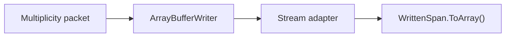
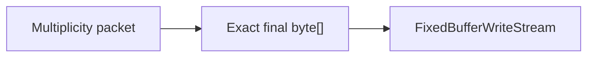

# Evidence производительности protocol hot path

[English](../en/protocol-hotpath-performance.md) · [Performance](performance-runtime.md) · [Protocol 326 boundary](protocol-326-typed-boundary.md)

## Область

`tools/TerraRuntime.ProtocolBench` даёт воспроизводимое before/after evidence для изменения materialization в protocol serialization. Benchmark намеренно содержит только benchmark-копию предыдущего growable-buffer пути:



и сравнивает её с production exact-size path:



Legacy implementation существует только внутри benchmark и не должна возвращаться в production runtime path.

## Cases

Suite покрывает четыре representative operations:

| Case | Назначение |
| --- | --- |
| `frame-32-byte` | generic Terraria framing: caller-owned exact span против growable writer + final copy |
| `packet14-player-active` | очень маленький high-frequency lifecycle packet |
| `packet5-equipment` | fixed-size player inventory/equipment state |
| `packet13-movement-minimal` | high-frequency authoritative movement serialization |

До measurement current и legacy output обязаны быть byte-for-byte identical для каждого case. При mismatch run завершается до принятия performance numbers.

## Measurement contract

Обе реализации получают одинаковый warmup до начала measured samples. Порядок samples чередуется между current-first и legacy-first, чтобы tiered PGO, изменение CPU frequency, cache temperature и drift shared runner не давали систематическое преимущество реализации, которая измеряется второй. В report используется median нечётного количества samples для:

$$
A = \frac{\text{allocated bytes}}{\text{operations}},
$$

и

$$
T = \frac{\text{elapsed nanoseconds}}{\text{operations}}.
$$

Allocation измеряется через `GC.GetAllocatedBytesForCurrentThread()` в synchronous single-threaded loop. Throughput вычисляется как

$$
R = \frac{10^9}{T}\ \mathrm{operations/s}.
$$

Benchmark записывает runtime description, OS, process architecture, processor count, commit SHA, iteration/sample counts, warmup count и признак alternating order в JSON.

## CI gate

`.github/workflows/protocol-hotpath-performance.yml` запускает обе реализации в одном process на одном runner. Для каждого case gate требует:

1. current allocation per operation строго меньше preserved legacy path;
2. current median time per operation не хуже `$1.50\times$` legacy median.

Throughput tolerance намеренно мягкий, потому что shared CI CPU scheduling шумный. Allocation является жёстким deterministic claim; throughput защищает от ситуации, когда удалённая copy заменена неожиданно дорогой реализацией.

Exact-size stream держит successful write path минимальным: одна capacity check и одна copy. Invalid over-write только помечает candidate failed и не тратит CPU на partial prefix, который всё равно никогда не будет опубликован.

JSON report загружается как `protocol-hotpath-<commit>` на 14 дней. Это evidence только для serializer/framing materialization change; оно не заменяет `$24/64/128/255$` connection workload matrix и end-to-end tick profiling.

## Локальный запуск

```bash
dotnet run \
  --project tools/TerraRuntime.ProtocolBench/TerraRuntime.ProtocolBench.csproj \
  -c Release \
  -- \
  --gate \
  --iterations 200000 \
  --samples 5 \
  --json artifacts/performance/protocol-hotpath.json
```

Не следует делать performance claim из одного isolated `ns/op`. Нужно сохранять JSON artifact, смотреть allocation и throughput вместе и сохранять wire equality вместе с обычными protocol tests.
