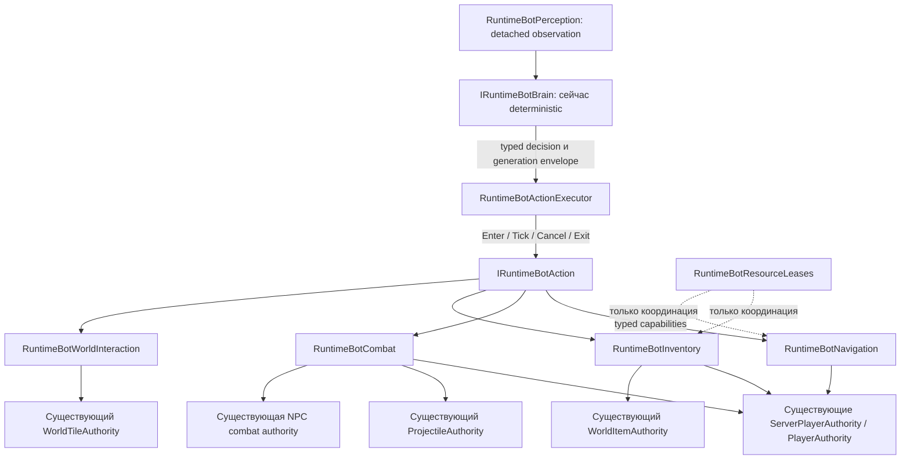
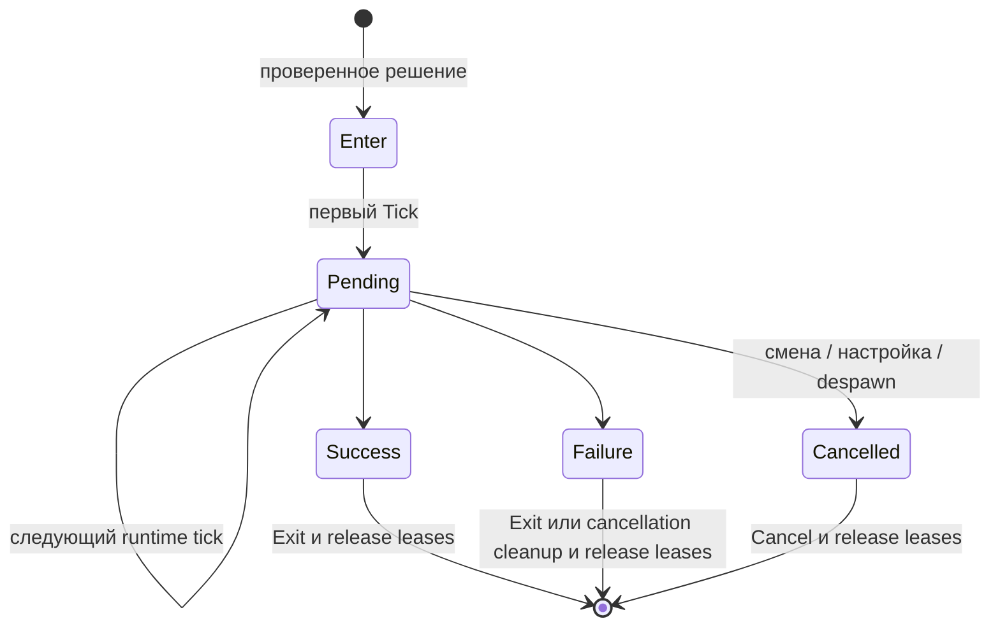

# Архитектура задач и действий PlayerBot

Окно настроек явно поясняет: Mining помогает выбранному игроку при недавней подземной добыче, только для земли/камня. Сохранённый интеграционный тест проверяет два последовательных authoritative-разрушения через полную анимацию кирки, показ кирки/использования, точное число дропов и отсутствие добычи между взмахами. Это подтверждение исполнения вспомогательного действия, не автономная добыча руды и не завершение будущих Mine/Build/Craft actions.

PlayerBot остаётся обычным server-owned игроком. `Application/Bots` выбирает и планирует поведение, но не создаёт вторую симуляцию игрока, снарядов, inventory, урона или тайлов. Hostile operator NpcBot не возвращён; обычные NPC actors и магазины независимы.

## Владение

`RuntimeBotAuthority` создаёт, настраивает и удаляет ботов, собирает collaborators, обнаруживает потерю поколения игрока, вызывает controller и публикует detached telemetry. Циклы атак, подбора, расходников, выбора целей и навигации вынесены. `BotState` хранит только состояние bot policy; authoritative actor state остаётся у прежних владельцев. `BotPolicy` именует тактические пороги и watchdog действий, а не дублирует gameplay-каталоги.

`RuntimeBotController` сначала выполняет обязательные мгновенные pickup/healing/mana, затем получает актуальное наблюдение и вызывает сменный brain и один исполнитель долгоживущей цели. Обслуживание inventory не конкурирует с целью и не отключается. Combat buffs сохраняют прежнее место внутри Guard. Порядок обычной server-player physics и последующих combat passes не изменён.

`RuntimeBotPerception` ограниченно читает игрока, защищаемую цель, кандидата Guard и полезный предмет. Существующий target-lock/squad scoring сохранён; записи в мир отсутствуют. Первый snapshot намеренно компактный: self, configuration, живая защищаемая цель, выбранный противник, полезный предмет, счётчики/capabilities inventory, underground hint, необходимость recovery, текущее действие и прошлый результат. Это не сканер всего мира, карта маршрутов или экспорт полного inventory. Все поля — detached value snapshots, без mutable arrays/dictionaries и ссылок на actors.

## Идентичность и валидация

Observation содержит `WorldRuntimeIdentity` с logical runtime и activation session, точный `PlayerHandle` бота, локальный ID, монотонную revision, поколение цели и tick. Production composition передаёт `WorldRuntime.Identity`; самостоятельный `ServerRuntimeState` владеет собственной activation identity. Настройка и потеря точного поколения сопровождаемого игрока увеличивают goal generation. Перезаход в тот же слот не наследует старую цель.

`RuntimeBotDecisionEnvelope.Validate` отвергает другой bot/world/session/goal/revision и несовпадающие явно заданные player/NPC/item handles. Неверное решение не вытесняет текущее действие. После приёма executor разрешает новые observations, но проверяет сохранённые поколения до Tick. NPC/item intents закрепляют точное поколение сущности, а не номер слота. Адаптеры операций также отвергают устаревший observation scope до исполнения. Action context предоставляет только typed navigation/combat/inventory/world-interaction capabilities, не `RuntimeBotAuthority` и не mutable stores.

Это внутренний синхронный контракт, не публичный plugin SDK и не async planner. `IRuntimeBotBrain` заменяем через composition. Brain не является authority. Action не является authority. Оба не могут обходить normal player semantics. Lease не даёт права изменять сущность.

## Lifecycle и действия

`Enter` вызывается один раз, `Tick` — не более одного раза за runtime tick; завершённые actions больше не исполняются. `Exit` завершает presentation/movement успешного или неудачного действия; `Cancel` обрабатывает прерывание, включая отмену Mirror. Результат содержит `Pending`, `Success`, `Failure`, `Cancelled` и typed failure code. Строки не используются как машинная семантика.

Executor нельзя перепривязать к другому боту или activation. Откат observation revision отвергается, даже если она новее исходного решения. Если входящий context принадлежит другому поколению/миру, отмена использует capabilities исходного бота. Stop, Mirror cleanup, configure и despawn проверяют актуальное соответствие actor: переиспользование `ServerPlayerId` не позволяет изменить новое поколение. Исключения invariant callbacks остаются видимыми runtime, но владение action и leases всё равно очищается.

Непрерывные Idle/Follow/Guard не имеют произвольного глобального position watchdog. Существующая source-backed презентация Mirror стала отдельным recovery action. Runtime watchdog — $120\,\text{ticks}$; сам предмет по-прежнему использует $90\,\text{ticks}$ с recall посередине. Attack имеет watchdog $180\,\text{ticks}$. Collect и автономный Mining ограничены $1800\,\text{ticks}$ и окном stagnation $300\,\text{ticks}$. Политики централизованы в `BotPolicy`. Метрику progress задаёт action: сбор использует расстояние до точного item, добыча — сближение и подтверждённые разрушения прохода. Осмысленный stationary progress допустим; правила «не двигается — сломан» нет.

Actions: Idle, Follow, Guard, Attack, PickupUsefulItem, UseConsumable, RecoverToTarget, Mining, Collect, ReturnToPlayer. Movement представлен typed navigation primitive, не дублирующим physics action. Выбор оружия, prediction, LOS/trajectory admission, ammo transaction, melee commit, порядок potions, полёт, локальные пещерные обходы и безопасный recall вынесены без замены механики. Ограниченный поиск `BotTraversal` не изменён; глобальный A* не добавлен.

## Режимы оператора

В настройках есть `Mining ore`: Copper, Tin, Iron, Lead, Silver, Tungsten, Gold или Platinum. Mining больше не требует цели-игрока или недавнего копания человеком. Прежняя подземная помощь Follow/Guard остаётся отдельной и сохраняет regression на cadence/presentation.

| Режим | Поддержанное поведение |
| --- | --- |
| Idle | Остановка с автоматическими pickup и consumables. |
| Follow | Прежнее разнесённое сопровождение, пещеры, помощь в добыче и Mirror recovery. |
| Guard | Прежние target locks, squad positioning, оружие и authoritative combat для защиты выбранного игрока. |
| Mining | Самостоятельный поиск выбранной обычной руды под землёй, lease, подход и проход размером с тело через Dirt/Stone существующей Vortex Pickaxe, затем обычный world-item pickup. Цель-игрок не требуется. |
| Collect | Подход к доступному полезному предмету в существующем ограниченном радиусе поиска, lease точного поколения и прежний conservative pickup. Неподдержанные предметы игнорируются. |
| ReturnToPlayer | Возврат к цели с остановкой в пределах $96\,\mathrm{px}$ без совпадения координат; обычный Mirror recovery сохраняется. |

Follow, Guard и ReturnToPlayer требуют current player handle. Mining на поверхности возвращает `PermissionDenied`, без проверенных layer facts — `UnsupportedAction`. Build, crafting, chopping, chests и другой неподдержанный gameplay не представлены работающими режимами. TUI показывает current action и typed recent result; прежние числовые/network и bot status поля сохранены.

`RuntimeBotMining` владеет возобновляемым локальным поиском, а не второй tile authority: квадрат $65\times65\,\text{tiles}$, не более $256\,\text{cells/bot/tick}$, повтор после $60\,\text{ticks}$. Кандидаты выбираются в стабильном порядке обхода, не по оценке кратчайшего пути. Observation содержит координату, тип и revision секции. Изменение секции, включая remove/replace ABA, отменяет старое разрешение на удар; только собственная подтверждённая раскопка обновляет revision удерживаемой цели. Leases исключают конкурирующие claims и освобождаются при завершении, отмене и despawn. Выпавшая земля не прерывает активный подход к руде; автоматический pickup остаётся включён. Перед созданием рудного дропа проверяется место в inventory.

Каждый удар использует общую server-player pick transaction `WorldTileAuthority`: живой actor, underground/reach/pick/cadence, резервирование предмета, tile mutation, world drop и held-tool replication. Прямая награда в inventory или запись в tile store запрещены. Сейчас разрешены восемь обычных руд и Dirt/Stone для прохода, без стенок, жидкостей, проводов и соседних специальных построек. Остальные руды, специальные seed-правила, сундуки, глобальная разведка и произвольные пещерные маршруты не поддержаны. Это ограниченная автономная добыча, не полный parity mining/building/crafting.

## Координация

Адресный action `PickupUsefulItem` передаёт точный observed item handle существующему inventory adapter. Повторно использованный слот/поколение или другой предмет рядом не могут выполнить это действие. Автоматическое обслуживание сохраняет прежний ограниченный поиск полезных предметов.

`RuntimeBotResourceLeases` — single-writer store одного runtime. Ключ включает world/session и точный `WorldItemHandle` либо координату тайла; владелец — bot ID и точное поколение игрока. Лимит $1024\,\text{leases}$, обычный TTL $180\,\text{ticks}$, максимальный TTL $3600\,\text{ticks}$. Конкурирующий acquire запрещён, просроченные leases удаляются. Terminal action, cancel, reconfigure и despawn освобождают владение. Pickup освобождает краткую transaction lease немедленно. Collect исключает предмет, занятый другим ботом. Прежние Guard soft assignments не эксклюзивны: вся группа по-прежнему может атаковать одного босса. Общие area/NPC/chest policies остаются будущими расширениями.

## Внешний planner и очередь работ

```mermaid
flowchart LR
    Snapshot[RuntimeBotObservationSnapshot] --> Reduced[Сокращённая semantic serialization вне runtime]
    Reduced --> Planner[Внешний Vega / script / scenario / LLM planner]
    Planner --> Parse[Parse и schema validation]
    Parse --> Intent[Typed intent validation]
    Intent --> Permission[Permission validation]
    Permission --> Generation[World / bot / goal / revision validation]
    Generation --> Action[Допущенное runtime action]
```

LLM, HTTP client, prompts, provider packages, model routing, dynamic loading и reflection registration не добавлены. Raw model JSON нельзя исполнять. Будущий внешний planner обязан пройти все перечисленные gates и передавать typed decisions через world command boundary. Текущий exact-revision контракт намеренно отвергает stale replies. Async delivery и публичный SDK пока не реализованы.

Дальнейшие actions: расширение Mine на другие руды и маршруты за пределами локального поиска, Chop, Build, Explore, OpenChest, Loot, Craft, расширения ReturnToPlayer и ProtectArea. Каждому нужны проверенные возможности существующих authorities; неподдержанное исполнение должно возвращать `Failure(UnsupportedAction)`, не approximation игровой семантики.

## Проверка

`RuntimeBotActionExecutorTests` проверяет lifecycle, switching, deadlines, stationary semantic progress, generations и leases. `RuntimeBotAuthorityTests` — настоящие modes/inventory/leases/observations. Существующие `RuntimeBotNetworkAcceptanceTests` и `BotTraversalTests` сохраняют packet/combat/pickup/death/Mirror/cave regressions. UI tests проверяют режимы и результаты. Актуальные gates и внешние ограничения записаны в [work state](../agent-memory/work-state.md), source facts — в [verified vanilla](../agent-memory/verified-vanilla.md). Этот рефакторинг не означает официальный client playthrough или полную vanilla parity.
