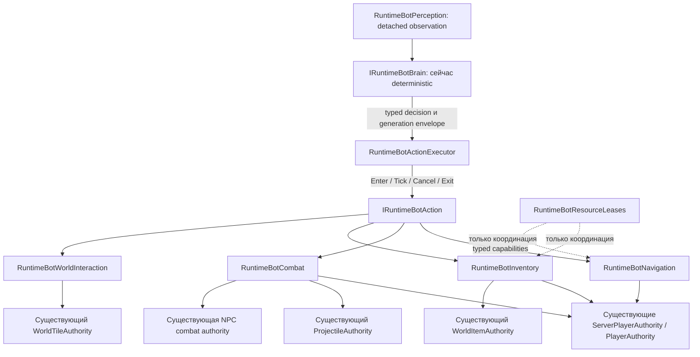
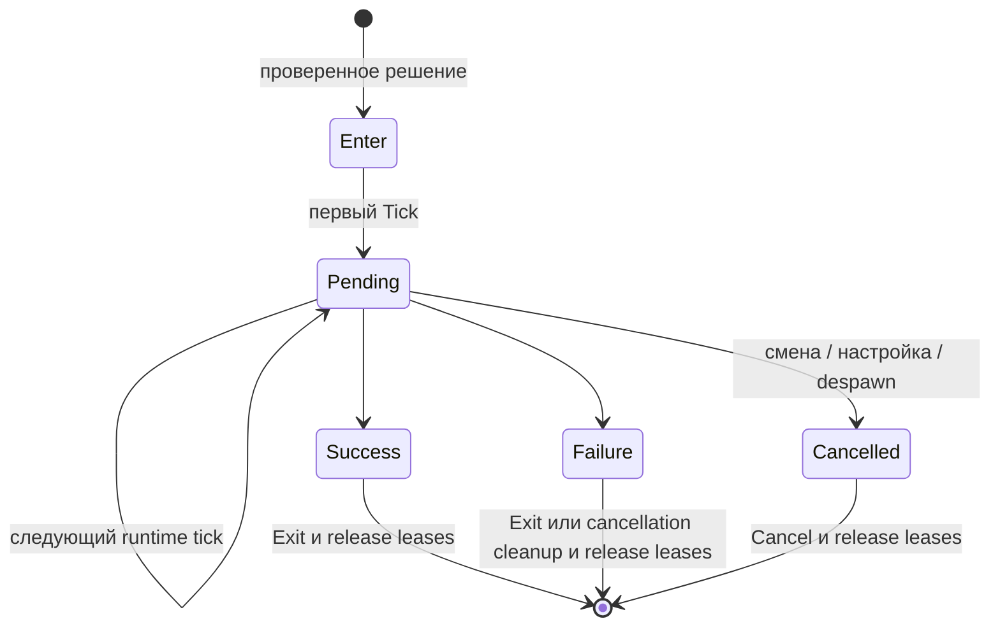

# Архитектура задач и действий PlayerBot

Окно настроек явно поясняет: Mining помогает выбранному игроку при недавней подземной добыче, только для земли/камня. Сохранённый интеграционный тест проверяет два последовательных authoritative-разрушения через полную анимацию кирки, показ кирки/использования, точное число дропов и отсутствие добычи между взмахами. Это подтверждение исполнения вспомогательного действия, не автономная добыча руды и не завершение будущих Mine/Build/Craft actions.

PlayerBot остаётся обычным server-owned игроком. `Application/Bots` выбирает и планирует поведение, но не создаёт вторую симуляцию игрока, снарядов, inventory, урона или тайлов. Hostile operator NpcBot не возвращён; обычные NPC actors и магазины независимы.

## Расход патронов ботом и мана Arcane

Бот принимает расход патрона, выбранный предмет, анимацию, создание снаряда с доверенным владельцем и задержку атаки до первого обработчика события. Атака берёт актуальное состояние того же живого персонажа после навигации и использования расходников в этом тике; прицеливание использует текущую позицию, строгая проверка подготовленного снимка сохраняется. Отказ выделения снаряда не меняет инвентарь и представление игрока. Обработчик не может вызвать откат поверх новых значений или второй принятый выстрел. Уведомления проверяют актуальное содержимое компонентов и поколения игрока и снаряда; после исключения остальные актуальные уведомления выполняются, затем возвращается первое исключение. Существующий журнал фиксирует подключения и их игровые сеансы после внешних вызовов, до изменения состояния: подключившийся до принятия получает одно сообщение создания, подключившийся из обработчика видит снаряд в начальном состоянии один раз; заменённые подключения и перезапущенные сеансы пропускаются. Прежняя политика одного снаряда и одного патрона сохраняется; экономия Minishark и RNG оригинального Shoot остаются отдельной задачей.

Ограниченная фаза удалённого игрока получает бонус Arcane66 через общий выбор эффективных слотов для156/3212:20 маны на эффективный предмет, предел400 до регенерации. Предметы156/3212 без префикса в декоративных слотах13..19 только блокируют соответствующее наследование. Базовая мана, счётчик и задержка регенерации сохраняют прежних владельцев. Независимые53 профиля оригинала на двух платформах подтверждают арифметику и выбор экипировки в настроенных фазах; это не захват сетевого инвентаря и не поддержка всей экипировки. Объединённая проверка пройдена: Release,18482 целевых теста, один полный прогон с1563131 успешным тестом и одним известным skip, пять проверок WindowsNativeAOT и live82/49 для Release/Native. Точные типизированные проверки расхода патронов бота дают5786 проверок на managed/Native. Отдельная типизированная проверка фазы Arcane даёт956618 проверок на каждой платформе; интеграционные managed-тесты State.Tick/full56/full44 сохраняют отдельную область проверки. Полный инвентарь и патроны человека, остальная экипировка и combat остаются открытыми.

## Частичный подбор предметов ботом

Доверенный подбор принимает доступную часть стака через ограниченный журнал уникальных слотов и оставляет остаток того же поколения в мире. Одна подготовленная player revision принимает все слоты до observers. Для нужных боеприпасов порядок54..57 затем1..49, для других полезных предметов1..49; совместимые стаки идут до пустых слотов, оружие в слоте0 защищено. Эта политика бота отличается от original GetItem favorite/hotbar/ammo ordering. Входящий стак больше9999 отклоняется до импорта. Существующий world allocation owner сохраняет body/generation остатка и увеличивает revision либо сохраняет обычную семантику полного удаления. Уведомления каждого слота сохраняют новые значения callback; после исключения остальные актуальные уведомления выполняются, затем возвращается первое исключение. Публикация мира идёт независимо в finally и подавляется при замене body/generation. Прежний single-item путь расходников сохранён. Original28 identities/168 configured calls подтверждают capacity/conservation references, без полной pickup или human inventory authority.

Локальная проверка принята: Release Rebuild без warnings/errors, focused 18477/18477; ОДИН полный прогон 1563126/1563127, ноль failures/errors, один известный canonical-liquid skip, runner $552.801\,\mathrm{s}$. Shipping WindowsNativeAOT и пять smokes зелёные; typed managed/fresh Native проходят по5039 проверок против точных32 references, выполняя оба перенесённых Fact с теми же assertions/resource, без исключений. Source168 capacity references и59 actual pickup cases ограничены описанной политикой бота, без полной GetItem parity. AMD64 PE: CLR directory нулевой. Release/Native live82/49 зелёные:15 sections/client,312 frames before49,129/relay/chat82, чистая остановка. Два групповых Fact проходят2/2; девять typed omission controls дают2/2/1/1/1/1/1/1/1 assertion failures без runner errors. Отдельный cache-only managed private-state diagnostic проходит1/1; два его omission controls дают по одному assertion failure, без runner errors. Reflection отсутствует в двух durable Fact и Native. Исторические ошибки scaffolding/компиляции duplicate-control сохранены как diagnostics и не входят в meaningful results. CI-tools/docs/graph/domain/diff зелёные; dependencies/project edges не добавлены. LinuxNativeAOT локально не проверен, GitHub CI не ожидаем. Source/test SHA256 `3bc74a252d640676b87be51d0fde2c0c52d28fc342f405e29f0339fe7ddab0cf`; production SHA256 `17d95adf456518b66e9d87657a058300b6aed1a37a907343b5b79ead41d383d1`.

Evidence: `.cache/bot-partial-pickup-block-v1-status.json`, `.cache/bot-partial-pickup-block-v1-full-tests/result.json`, `.cache/bot-partial-pickup-shipping-bin-v1/shipping-freeze.json`, `.cache/bot-partial-pickup-native-preparation/freeze-manifest.json`, `.cache/bot-partial-pickup-block-live-v1/results.json`, `.cache/getitem-storage-next-proof/manifest.json`, `.cache/bot-partial-pickup-next-witness/manifest.json`, `.cache/bot-partial-pickup-prototype-v1/final-candidate-freeze-v3.json`, `.cache/bot-partial-pickup-independent-tests/freeze-manifest.json`, `.cache/bot-partial-pickup-independent-tests/promotion-manifest.json`, `.cache/bot-partial-pickup-independent-review/freeze-manifest.json`.

## Доверенное потребление расходников ботом

Лечение, мана и допустимые Archery/Wrath готовят инвентарь и эффект вместе. Нужен известный живой актёр и точный player/Bot command scope. Подготовленный player owner принимает предмет и необязательные нормализованные vitals одной revision; подготовленные potion delay/buff expiry принимаются до observers. Независимые item/vitals publication guards сохраняют новые значения callback и потребляют offers до throws/reentry. Смена actor/configuration/goal/observation/tick останавливает оставшееся потребление маны или следующих бафф-слотов. Pickup сохраняет прежний строгий owner guard. Переполнение expiry и нормализованный переход смерти отклоняются до расхода предмета. Прежний выбор и экономия зелий сохранены; оригинальный ManaV2=true допускает расход при полной мане, в отличие от экономии бота. Допустимы три healing/четыре mana/два combat buff;14 исходных ID и42 плюс семь clamp references не доказывают полные Quick* semantics, sickness21/94, void inventory, animations или полные player buff slots.

Локальная проверка принята: Release Rebuild без warnings/errors, focused 18475/18475; ОДИН полный прогон 1563124/1563125, ноль failures/errors, один известный canonical-liquid skip, runner $534.048\,\mathrm{s}$. Shipping WindowsNativeAOT и пять smokes зелёные; typed managed/fresh Native проходят по1224 проверки против точных32 references, включая два перенесённых Fact,14 catalog rows,7 совместимых Bot clamp cases,4 source ordering references и1 full-mana policy reference. AMD64 PE: CLR directory нулевой. Release/Native live82/49 зелёные:15 sections/client,312 frames before49,129/relay/chat82, чистая остановка. Два групповых Fact проходят; шесть omission controls дают2/1/1/2/1/1 assertion failures без runner errors. Первые пять обнаруживают регрессии; шестой проверяет новый внутренний known-health contract — публичный observation scope уже отклонял неизвестное здоровье. Независимые42 Quick* profiles и7 clamp calls охватывают14 ID; это configured component evidence, без whole Main или inventory-wire chronology. Допуск трёх healing/четырёх mana/двух combat buffs сохранён; ManaV2 full-mana source policy отличается от экономии бота. CI-tools/docs/graph/domain/diff зелёные; dependencies/project edges не добавлены. LinuxNativeAOT локально не проверен, GitHub CI не ожидаем. Source/test SHA256 `5f1826fa04cba376765bf464c3b3a97135b58d4e621a60c119b5ec3fc1efd9ed`; production SHA256 `b082573a13a384b7f3ed332d8924e03098365e191e82d590ef78a59d26738416`.

Evidence: `.cache/bot-consumable-block-v1-status.json`, `.cache/bot-consumable-block-v1-full-tests/result.json`, `.cache/bot-consumable-shipping-bin-v1/shipping-freeze.json`, `.cache/bot-consumable-native-preparation/freeze-manifest.json`, `.cache/bot-consumable-block-live-v1/results.json`, `.cache/bot-consumable-callback-next-proof/manifest.json`, `.cache/bot-quick-consumable-original-next-proof-v3/manifest.json`, `.cache/bot-quick-consumable-smallmax-next-proof/manifest.json`, `.cache/bot-consumable-atomic-next-prototype/promoted-final-freeze.json`, `.cache/bot-consumable-independent-durable-v2/promotion-manifest.json`, `.cache/bot-consumable-independent-durable-v2/promoted-gzip-controls-final.json`.

## Атомарный доверенный подбор

Доверенный Bot pickup заранее готовит полный следующий ограниченный словарь инвентаря и использует существующий world-item allocation preview. Инвентарь и удаление предмета принимаются до observers. Финальные проверки actor/revision/item-generation и bot configuration/goal/observation/tick отклоняют устаревшие предложения. Inventory callback может изменить другой предмет или бросить исключение: принятое состояние сохраняется, а удаление публикуется независимо один раз при актуальном поколении. Новое поколение предмета подавляет устаревшее удаление. Leases освобождаются при любом выходе; неуспешная подготовка не меняет ни одного владельца. Сохраняется консервативная политика useful-item, slot-order и полного стека. Human client-reported151 остаётся отчётом удаления, после которого приходят inventory reports5/138; дополнительной выдачи предмета нет. Полная vanilla GetItem parity и улучшение allocations/performance не заявлены. Один групповой Fact проверяет6196 независимых numeric identities/idempotence/bounds и152 настоящие bootstrap server rows с literal peer frames/full56/public Next;12 prior-policy и164 client rows остаются references. Game positive/restored19534 проверок, omissions96/364/10 assertion failures без runner errors. App positive/restored39159 проверок, оба omissions дают по одному assertion failure без runner errors; прежние168/194/2800 references сохранены. Два групповых Bot Fact обнаруживают старый порядок уведомлений, player ABA, bot configuration и замену владельца reservation: omissions2/1/1/1 failures, ноль runner errors, positive/restored зелёные. Начальные ошибки Native harness scaffolding (implicit imports и anonymous JSON AOT contract) сохранены; исправлено только typed scaffolding, assertions прежние. Шесть повторённых оригинальных human pickup calls показывают151/21 до следующих5/138 без server inventory grant от151/21. Полные human inventory custody и source GetItem parity не заявлены.

Release Rebuild без warnings/errors; focused 18473/18473 зелёный. ОДИН полный прогон: 1563122/1563123, ноль failures/errors и один известный canonical-liquid skip, время runner $625.014\,\mathrm{s}$. Свежий shipping WindowsNativeAOT и пять smokes зелёные; typed managed/fresh Native31267 проверок каждый против точных32 references; AMD64 PE с нулевым CLR directory. Native проверяет typed canonical inventory/public seeded-next и пять Bot custody scenarios; private full56/буквальные source relay frames и lease/null-dictionary extras остаются managed evidence. Release/Native live82/49 зелёные:15 sections/client,312 frames before49,129/relay/chat82 и чистое завершение. CI-tools/docs/graph/domain/diff зелёные. Новых dependencies/project edges нет. Настоящий LinuxNativeAOT локально не проверен; GitHub CI не ожидаем.

Evidence: `.cache/identity-bot-block-v1-status.json`, `.cache/identity-bot-block-v1-full-tests/result.json`, `.cache/identity-bot-shipping-bin-v1/shipping-freeze.json`, `.cache/packet5-identity-bot-native-preparation/freeze-manifest.json`, `.cache/identity-bot-block-live-v1/results.json`, `.cache/packet5-retained-identity-game-work/freeze-manifest.json`, `.cache/packet5-retained-identity-game-work/promotion/promotion-manifest.json`, `.cache/packet5-retained-identity-app-next-work/freeze-manifest-v2.json`, `.cache/bot-pickup-atomic-lease-v4/promoted-final-freeze.json`, `.cache/packet5-retained-identity-next-proof/manifest.json`, `.cache/inventory-stack-metadata-next-proof/manifest.json`, `.cache/world-item-pickup-chronology-next-proof/manifest.json`.

## Владение

```mermaid
flowchart TD
    Observation[RuntimeBotPerception: detached observation] --> Brain[IRuntimeBotBrain: сейчас deterministic]
    Brain -->|typed decision и generation envelope| Executor[RuntimeBotActionExecutor]
    Executor -->|Enter / Tick / Cancel / Exit| Action[IRuntimeBotAction]
    Action -->|typed capabilities| Navigation[RuntimeBotNavigation]
    Action --> Combat[RuntimeBotCombat]
    Action --> Inventory[RuntimeBotInventory]
    Action --> Interaction[RuntimeBotWorldInteraction]
    Navigation --> Player[Существующие ServerPlayerAuthority / PlayerAuthority]
    Combat --> Player
    Combat --> Projectile[Существующий ProjectileAuthority]
    Combat --> NPC[Существующая NPC combat authority]
    Inventory --> Player
    Inventory --> Item[Существующий WorldItemAuthority]
    Interaction --> Tile[Существующий WorldTileAuthority]
    Leases[RuntimeBotResourceLeases] -. только координация .-> Inventory
    Leases -. только координация .-> Navigation
```

`RuntimeBotAuthority` создаёт, настраивает и удаляет ботов, собирает collaborators, обнаруживает потерю поколения игрока, вызывает controller и публикует detached telemetry. Циклы атак, подбора, расходников, выбора целей и навигации вынесены. `BotState` хранит только состояние bot policy; authoritative actor state остаётся у прежних владельцев. `BotPolicy` именует тактические пороги и watchdog действий, а не дублирует gameplay-каталоги.

`RuntimeBotController` сначала выполняет обязательные мгновенные pickup/healing/mana, затем получает актуальное наблюдение и вызывает сменный brain и один исполнитель долгоживущей цели. Обслуживание inventory не конкурирует с целью и не отключается. Combat buffs сохраняют прежнее место внутри Guard. Порядок обычной server-player physics и последующих combat passes не изменён.

`RuntimeBotPerception` ограниченно читает игрока, защищаемую цель, кандидата Guard и полезный предмет. Существующий target-lock/squad scoring сохранён; записи в мир отсутствуют. Первый snapshot намеренно компактный: self, configuration, живая защищаемая цель, выбранный противник, полезный предмет, счётчики/capabilities inventory, underground hint, необходимость recovery, текущее действие и прошлый результат. Это не сканер всего мира, карта маршрутов или экспорт полного inventory. Все поля — detached value snapshots, без mutable arrays/dictionaries и ссылок на actors.

## Идентичность и валидация

Observation содержит `WorldRuntimeIdentity` с logical runtime и activation session, точный `PlayerHandle` бота, локальный ID, монотонную revision, поколение цели и tick. Production composition передаёт `WorldRuntime.Identity`; самостоятельный `ServerRuntimeState` владеет собственной activation identity. Настройка и потеря точного поколения сопровождаемого игрока увеличивают goal generation. Перезаход в тот же слот не наследует старую цель.

`RuntimeBotDecisionEnvelope.Validate` отвергает другой bot/world/session/goal/revision и несовпадающие явно заданные player/NPC/item handles. Неверное решение не вытесняет текущее действие. После приёма executor разрешает новые observations, но проверяет сохранённые поколения до Tick. NPC/item intents закрепляют точное поколение сущности, а не номер слота. Адаптеры операций также отвергают устаревший observation scope до исполнения. Action context предоставляет только typed navigation/combat/inventory/world-interaction capabilities, не `RuntimeBotAuthority` и не mutable stores.

Это внутренний синхронный контракт, не публичный plugin SDK и не async planner. `IRuntimeBotBrain` заменяем через composition. Brain не является authority. Action не является authority. Оба не могут обходить normal player semantics. Lease не даёт права изменять сущность.

## Lifecycle и действия

```mermaid
stateDiagram-v2
    [*] --> Enter: проверенное решение
    Enter --> Pending: первый Tick
    Pending --> Pending: следующий runtime tick
    Pending --> Success
    Pending --> Failure
    Pending --> Cancelled: смена / настройка / despawn
    Success --> [*]: Exit и release leases
    Failure --> [*]: Exit или cancellation cleanup и release leases
    Cancelled --> [*]: Cancel и release leases
```

`Enter` вызывается один раз, `Tick` — не более одного раза за runtime tick; завершённые actions больше не исполняются. `Exit` завершает presentation/movement успешного или неудачного действия; `Cancel` обрабатывает прерывание, включая отмену Mirror. Результат содержит `Pending`, `Success`, `Failure`, `Cancelled` и typed failure code. Строки не используются как машинная семантика.

Executor нельзя перепривязать к другому боту или activation. Откат observation revision отвергается, даже если она новее исходного решения. Если входящий context принадлежит другому поколению/миру, отмена использует capabilities исходного бота. Stop, Mirror cleanup, configure и despawn проверяют актуальное соответствие actor: переиспользование `ServerPlayerId` не позволяет изменить новое поколение. Исключения invariant callbacks остаются видимыми runtime, но владение action и leases всё равно очищается.

Непрерывные Idle/Follow/Guard не имеют произвольного глобального position watchdog. Существующая source-backed презентация Mirror стала отдельным recovery action. Runtime watchdog — $120\,\text{ticks}$; сам предмет по-прежнему использует $90\,\text{ticks}$ с recall посередине. Attack имеет watchdog $180\,\text{ticks}$. Collect и автономный Mining ограничены $1800\,\text{ticks}$ и окном stagnation $300\,\text{ticks}$. Политики централизованы в `BotPolicy`. Метрику progress задаёт action: сбор использует расстояние до точного item, добыча — сближение и подтверждённые разрушения прохода. Осмысленный stationary progress допустим; правила «не двигается — сломан» нет.

Actions: Idle, Follow, Guard, Attack, PickupUsefulItem, UseConsumable, RecoverToTarget, Mining, Collect, ReturnToPlayer. Movement представлен typed navigation primitive, не дублирующим physics action. Выбор оружия, prediction, LOS/trajectory admission, ammo transaction, melee commit, порядок potions, полёт, локальные пещерные обходы и безопасный recall вынесены без замены механики. Ограниченный поиск `BotTraversal` не изменён; глобальный A* не добавлен.

## Режимы оператора

В настройках есть `Mining ore`: Copper, Tin, Iron, Lead, Silver, Tungsten, Gold или Platinum. Mining больше не требует цели-игрока или недавнего копания человеком. Прежняя подземная помощь Follow/Guard остаётся отдельной и сохраняет regression на cadence/presentation.

| Режим | Поддержанное поведение |
| --- | --- |
| Idle | Остановка с автоматическими pickup и consumables. |
| Follow | Прежнее разнесённое сопровождение, пещеры, помощь в добыче и Mirror recovery. |
| Guard | Прежние target locks, squad positioning, оружие и authoritative combat для защиты выбранного игрока. |
| Mining | Самостоятельный поиск выбранной обычной руды под землёй, lease, подход и проход размером с тело через Dirt/Stone существующей Vortex Pickaxe, затем обычный world-item pickup. Цель-игрок не требуется. |
| Collect | Подход к доступному полезному предмету в существующем ограниченном радиусе поиска, lease точного поколения и прежний conservative pickup. Неподдержанные предметы игнорируются. |
| ReturnToPlayer | Возврат к цели с остановкой в пределах $96\,\mathrm{px}$ без совпадения координат; обычный Mirror recovery сохраняется. |

Follow, Guard и ReturnToPlayer требуют current player handle. Mining на поверхности возвращает `PermissionDenied`, без проверенных layer facts — `UnsupportedAction`. Build, crafting, chopping, chests и другой неподдержанный gameplay не представлены работающими режимами. TUI показывает current action и typed recent result; прежние числовые/network и bot status поля сохранены.

`RuntimeBotMining` владеет возобновляемым локальным поиском, а не второй tile authority: квадрат $65\times65\,\text{tiles}$, не более $256\,\text{cells/bot/tick}$, повтор после $60\,\text{ticks}$. Кандидаты выбираются в стабильном порядке обхода, не по оценке кратчайшего пути. Observation содержит координату, тип и revision секции. Изменение секции, включая remove/replace ABA, отменяет старое разрешение на удар; только собственная подтверждённая раскопка обновляет revision удерживаемой цели. Leases исключают конкурирующие claims и освобождаются при завершении, отмене и despawn. Выпавшая земля не прерывает активный подход к руде; автоматический pickup остаётся включён. Перед созданием рудного дропа проверяется место в inventory.

Каждый удар использует общую server-player pick transaction `WorldTileAuthority`: живой actor, underground/reach/pick/cadence, резервирование предмета, tile mutation, world drop и held-tool replication. Прямая награда в inventory или запись в tile store запрещены. Сейчас разрешены восемь обычных руд и Dirt/Stone для прохода, без стенок, жидкостей, проводов и соседних специальных построек. Остальные руды, специальные seed-правила, сундуки, глобальная разведка и произвольные пещерные маршруты не поддержаны. Это ограниченная автономная добыча, не полный parity mining/building/crafting.

## Координация

Адресный action `PickupUsefulItem` передаёт точный observed item handle существующему inventory adapter. Повторно использованный слот/поколение или другой предмет рядом не могут выполнить это действие. Автоматическое обслуживание сохраняет прежний ограниченный поиск полезных предметов.

`RuntimeBotResourceLeases` — single-writer store одного runtime. Ключ включает world/session и точный `WorldItemHandle` либо координату тайла; владелец — bot ID и точное поколение игрока. Лимит $1024\,\text{leases}$, обычный TTL $180\,\text{ticks}$, максимальный TTL $3600\,\text{ticks}$. Конкурирующий acquire запрещён, просроченные leases удаляются. Terminal action, cancel, reconfigure и despawn освобождают владение. Pickup освобождает краткую transaction lease немедленно. Collect исключает предмет, занятый другим ботом. Прежние Guard soft assignments не эксклюзивны: вся группа по-прежнему может атаковать одного босса. Общие area/NPC/chest policies остаются будущими расширениями.

## Внешний planner и очередь работ

```mermaid
flowchart LR
    Snapshot[RuntimeBotObservationSnapshot] --> Reduced[Сокращённая semantic serialization вне runtime]
    Reduced --> Planner[Внешний Vega / script / scenario / LLM planner]
    Planner --> Parse[Parse и schema validation]
    Parse --> Intent[Typed intent validation]
    Intent --> Permission[Permission validation]
    Permission --> Generation[World / bot / goal / revision validation]
    Generation --> Action[Допущенное runtime action]
```

LLM, HTTP client, prompts, provider packages, model routing, dynamic loading и reflection registration не добавлены. Raw model JSON нельзя исполнять. Будущий внешний planner обязан пройти все перечисленные gates и передавать typed decisions через world command boundary. Текущий exact-revision контракт намеренно отвергает stale replies. Async delivery и публичный SDK пока не реализованы.

Дальнейшие actions: расширение Mine на другие руды и маршруты за пределами локального поиска, Chop, Build, Explore, OpenChest, Loot, Craft, расширения ReturnToPlayer и ProtectArea. Каждому нужны проверенные возможности существующих authorities; неподдержанное исполнение должно возвращать `Failure(UnsupportedAction)`, не approximation игровой семантики.

## Проверка

`RuntimeBotActionExecutorTests` проверяет lifecycle, switching, deadlines, stationary semantic progress, generations и leases. `RuntimeBotAuthorityTests` — настоящие modes/inventory/leases/observations. Существующие `RuntimeBotNetworkAcceptanceTests` и `BotTraversalTests` сохраняют packet/combat/pickup/death/Mirror/cave regressions. UI tests проверяют режимы и результаты. Актуальные gates и внешние ограничения записаны в [work state](../agent-memory/work-state.md), source facts — в [verified vanilla](../agent-memory/verified-vanilla.md). Этот рефакторинг не означает официальный client playthrough или полную vanilla parity.
