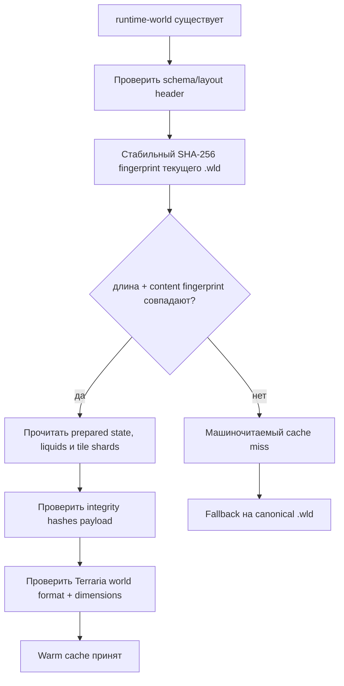

# Контракт валидности runtime-world cache

[English](../en/runtime-world-cache-validity.md) · [Пересборка runtime](runtime-world-save-rebuild.md) · [Сохранение мира](world-persistence.md) · [Дорожная карта](../roadmap.md)

## Правило

`.wld` остаётся каноническим источником истины. Образ `.runtime-world` принимается только если он доказывает принадлежность текущим байтам canonical world и текущему layout кеша TerraRuntime. Временные метки полезны для обнаружения смены файла во время чтения, но сами по себе никогда не разрешают cache hit.

## Контракт заголовка

Фиксированный 128-байтовый заголовок runtime-cache хранит:

- версию схемы runtime-image;
- версию runtime layout;
- версию формата мира Terraria;
- длину и время записи canonical source;
- 128-битный content fingerprint, полученный из SHA-256 канонического `.wld`;
- уже существующий XxHash3 digest встроенного canonical payload;
- метаданные layout tile record и shard.

128-битный fingerprint использует первые 16 байт SHA-256. Кеш является одноразовыми локальными данными, но идентичность источника нельзя выводить из длины или timestamp. Поэтому вероятность практической или случайной коллизии делается пренебрежимо малой без расширения уже фиксированного заголовка кеша.

Старые образы, у которых ранее зарезервированные байты заголовка не содержат текущий schema/layout contract, намеренно дают cache miss и перестраиваются из `.wld`; миграция runtime-cache не нужна.

## Инвариант post-load preparation

Layout `2` означает не только бинарный layout записей. Он гарантирует, что cached tile image и liquid scheduler уже прошли canonical post-load liquid sequence TerrariaServer 1.4.5.8: `QuickWater -> WaterCheck -> quickSettle drain -> WaterCheck`. `RuntimeWorldSnapshotCache.TryWriteAtomic` отказывается записывать неподготовленный `WorldTileStore`, поэтому ни один production caller не может выдать raw canonical state за layout-2 image. Prepared-marker является runtime-only; application code не может выставлять его вручную, а cache decoder восстанавливает его только после успешной проверки schema/layout, payload hashes, world format и dimensions.

Пересборка после canonical save следует тому же правилу. `RuntimeWorldSnapshotRebuilder` валидирует новый `.wld`, повторяет post-load liquid preparation и только после этого публикует derived cache. Поэтому startup cache hit и post-save rebuild имеют одинаковую семантику.

## Проверка при тёплом запуске

Fingerprint canonical-файла снимается только со стабильной генерации файла. Метаданные проверяются до и после хеширования, поэтому конкурентная замена `.wld` не может незаметно превратиться в допустимый fingerprint.

## Layout и целостность

`CurrentLayoutVersion` является явной точкой инвалидации при критичных изменениях compiled/runtime representation. Приём кеша также требует ожидаемый little-endian native layout `WorldTile` и фиксированные размеры tile/shard records, записанные в header.

Проверка целостности остаётся многоуровневой:

- встроенные canonical bytes: XxHash3;
- каждый tile shard: отдельный XxHash3;
- payload очереди жидкостей: XxHash3;
- prepared runtime-state payload: XxHash3.

Эти быстрые хеши защищают одноразовый кеш от повреждения. SHA-256-derived source fingerprint решает другую задачу: жёстко привязывает кеш к фактическому текущему поколению `.wld`.

## Семантика ошибок

Schema mismatch, layout mismatch, ошибка/несовпадение source fingerprint, несовпадение Terraria world format и повреждение payload имеют отдельные значения `RuntimeWorldSnapshotLoadResult`. Ни одна из этих ошибок не меняет `.wld`. Startup фиксирует причину промаха и переходит к canonical loader, после чего может построить новый runtime image.

## Проверка

Регрессионные тесты доказывают приём совпадающего canonical source, отказ после изменения `.wld` той же длины с восстановленным старым timestamp, машиночитаемые schema/layout/world-format mismatches, обнаружение повреждения tile shard после успешной проверки fingerprint canonical source, отказ layout-2 writer для неподготовленного мира и восстановление post-load-prepared invariant после успешного cache decode.
