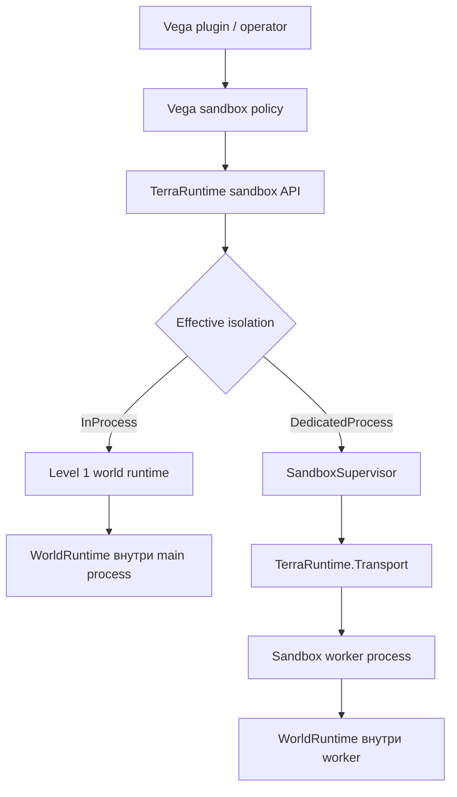
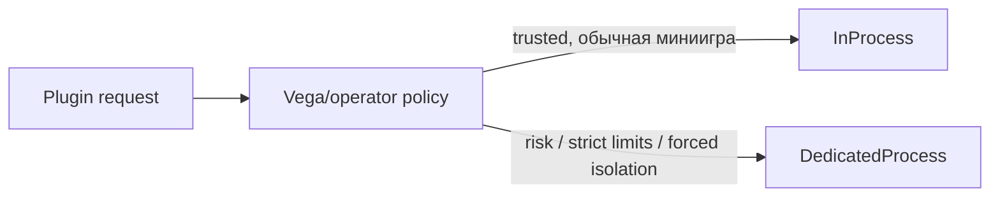

# Архитектура sandbox runtime

[English](../../en/sandbox/README.md) · [Roadmap](../../roadmap/sandbox/README.md)

Этот каталог является канонической архитектурной спецификацией sandbox-миров TerraRuntime.

Sandbox — не второй игровой движок и не замена Dimensions. Оба уровня изоляции используют одну модель `WorldRuntime`. Отличается только место, где живут runtime и его sandbox-local logic.

## Архитектура целиком



Vega запрашивает sandbox-семантику. TerraRuntime владеет authoritative world state и lifecycle процессов/socket. `TerraRuntime.Transport` остаётся общей control/server boundary, но локальный Level 2 после socket handoff ведёт gameplay traffic напрямую client-to-worker.

## Документы

- [Level 1: in-process sandbox](level-1.md) — несколько изолированных world runtimes в одном процессе.
- [Level 2: dedicated-process sandbox](level-2.md) — lifecycle worker, размещение, загрузка plugin/module и fault isolation.
- [Передача TCP socket](socket-handoff.md) — ownership main -> worker -> main без reconnect клиента.
- [Transport и control plane](transport.md) — что переносит Transport и что через него намеренно не идёт.
- [Интеграция Vega](vega-integration.md) — создание sandbox, выбор isolation, hooks, commands и sandbox-local plugins.

## Основные инварианты

1. Один live `WorldRuntime` имеет ровно одного authoritative simulation owner.
2. Client принадлежит максимум одному активному `WorldSessionId` одновременно.
3. Переданный в Level 2 client socket имеет ровно одного application-level process owner одновременно.
4. Identity `.wld` не является identity live runtime. Lifetime определяют `WorldRuntimeId` и `WorldSessionId`.
5. Level 1 не гоняет обычный gameplay через IPC.
6. Level 2 использует Transport для lifecycle/state/control, затем передаёт accepted TCP socket worker для прямого gameplay.
7. World/plugin scope retire как единое целое. Hooks, commands, timers и retained runtime references не должны пережить scope.
8. Vega policy может усилить запрошенную isolation, но не может незаметно ослабить требование dedicated process.

## Выбор isolation

Концептуально Vega может запросить:

```text
Auto
InProcess
DedicatedProcess
```

`Auto` отдаёт выбор policy. `InProcess` выражает предпочтение по производительности, но policy может усилить его до `DedicatedProcess`. `DedicatedProcess` является минимальным требованием isolation и не должен незаметно понижаться.



## Источники мира

Обязательная отдельная подсистема «templates» не нужна. Sandbox создаётся из реально поддерживаемого TerraRuntime source:

- существующий `.wld`;
- валидированное generated world state;
- snapshot/clone source.

Именованный каталог template можно позже положить поверх этих источников, если он реально понадобится операторам, но runtime-архитектура не зависит от нового формата template-файла.
