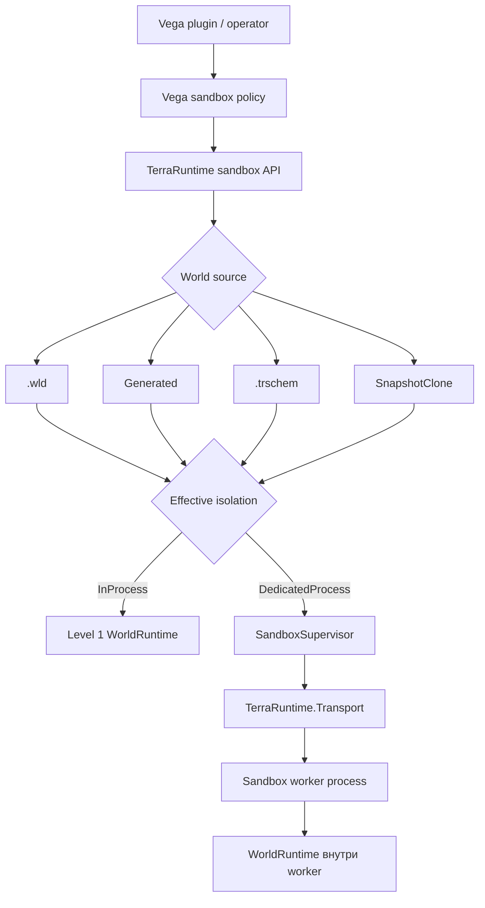
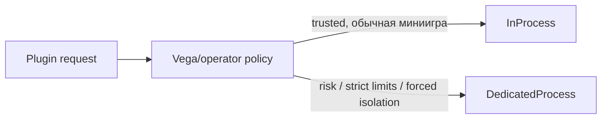

# Архитектура sandbox runtime

[English](../../en/sandbox/README.md) · [Roadmap](../../roadmap/sandbox/README.md)

Этот каталог является канонической архитектурной спецификацией sandbox-миров TerraRuntime.

Sandbox — не второй игровой движок и не замена Dimensions. Оба уровня изоляции используют одну модель `WorldRuntime`. Даже primary world является обычным `WorldRuntime`, который Vega/host просто выбрали как primary target. Отличается lifecycle/policy и, для Level 2, process boundary.

## Архитектура целиком



Vega запрашивает sandbox-семантику. TerraRuntime владеет authoritative world state и lifecycle процессов/socket. `TerraRuntime.Transport` остаётся общей control/server boundary, но локальный Level 2 после socket handoff ведёт gameplay traffic напрямую client-to-worker.

## Текущая базовая реализация Level 1

Сервер теперь допускает обычный persistent-мир как стандартный primary `WorldRuntime` и может одновременно запускать ограниченное число дополнительных Level 1 runtime в том же процессе. Каждый допущенный runtime владеет отдельным authoritative loop, а также собственным состоянием мира, сущностей, membership игроков, replication, cache и persistence.

В terminal UI и его plain-console fallback доступны команды:

```text
sandbox list
sandbox status <name>
sandbox create <name> l1 gen <generator-id> [seed <number|random>] [size <width>x<height>]
sandbox create <name> l1 file <relative-world-path>
sandbox regen <name> [seed <number|random>]
sandbox destroy <name>
sandbox jobs
sandbox job <id>
sandbox cancel <id>
```

Источники Generated и `.wld` материализуются и проверяются в ограниченной выделенной фоновой очереди до admission runtime. `--max-world-runtimes` задаёт лимит одновременно работающих миров (по умолчанию `8`), а `--sandbox-materialization-concurrency` — число materialization workers (по умолчанию `1`). File-команды принимают только относительные пути к `.wld` внутри каталога primary world.

Перенос/respawn игроков, live materialization `.trschem`, отдельный game-mode scope и regeneration с подключёнными игроками остаются следующими срезами. До появления transfer/bootstrap среза `regen` безопасно отклоняется при наличии игроков и не меняет активную session.

## Документы

- [Level 1: in-process sandbox](level-1.md) — полный независимый `WorldRuntime` в общем процессе, plugin compatibility и shared chat.
- [Level 2: dedicated-process sandbox](level-2.md) — lifecycle worker, размещение, загрузка выбранного game mode/plugin и fault isolation.
- [Источники мира и TerraRuntime Schematic](world-sources-schematics.md) — `.wld`, generated worlds, `.trschem`, chests, tile entities, NPC, markers и materialization.
- [Передача TCP socket](socket-handoff.md) — ownership main -> worker -> main без reconnect клиента.
- [Transport и control plane](transport.md) — что переносит Transport и что через него намеренно не идёт.
- [Интеграция Vega](vega-integration.md) — создание sandbox, выбор isolation, hooks, commands и sandbox-local logic.

## Основные инварианты

1. Один live `WorldRuntime` имеет ровно одного authoritative simulation owner.
2. Primary world не является специальной simulation class; это host-selected обычный `WorldRuntime`.
3. Полный mutable gameplay state runtime-local: players, NPC, bosses/AI, projectiles, items, tiles, chests/signs/tile entities, liquids, wiring, events, time/weather, progression, RNG, replication и persistence.
4. Client принадлежит максимум одному активному `WorldSessionId` одновременно.
5. Переданный в Level 2 client socket имеет ровно одного application-level process owner одновременно.
6. Identity `.wld`/`.trschem` не является identity live runtime. Lifetime определяют `WorldRuntimeId` и `WorldSessionId`.
7. Level 1 не гоняет обычный gameplay через IPC.
8. Level 2 использует Transport для lifecycle/state/control, затем передаёт accepted TCP socket worker для прямого gameplay.
9. Legacy Vega plugins по умолчанию остаются привязаны только к selected primary runtime; sandbox-aware logic получает отдельный `SandboxContext`.
10. Общий Vega chat router разрешён для Level 1, но сообщения сохраняют `WorldRuntimeIdentity` и visibility policy.
11. Vega policy может усилить запрошенную isolation, но не может незаметно ослабить требование dedicated process.

## Выбор isolation

Концептуально Vega может запросить:

```text
Auto
InProcess
DedicatedProcess
```

`Auto` отдаёт выбор policy. `InProcess` выражает предпочтение по производительности, но policy может усилить его до `DedicatedProcess`. `DedicatedProcess` является минимальным требованием isolation и не должен незаметно понижаться.



## Источники мира

Level 1 и Level 2 используют один `SandboxWorldSource`:

- существующий `.wld`;
- `Generated` request через TerraRuntime world generators;
- нативную TerraRuntime schematic `.trschem`;
- snapshot/clone source после реализации соответствующего runtime snapshot contract.

`.trschem` является общим форматом TerraRuntime/Vega/WorldEdit, а не WorldEdit-зависимостью. Он рассчитан на reusable scenes/arenas и может содержать tiles, liquids/wiring, chests с contents, signs, typed tile entities, NPC placements, world items и named markers/regions.

Одна и та же карта должна запускаться Level 1 или Level 2 без смены asset format.
