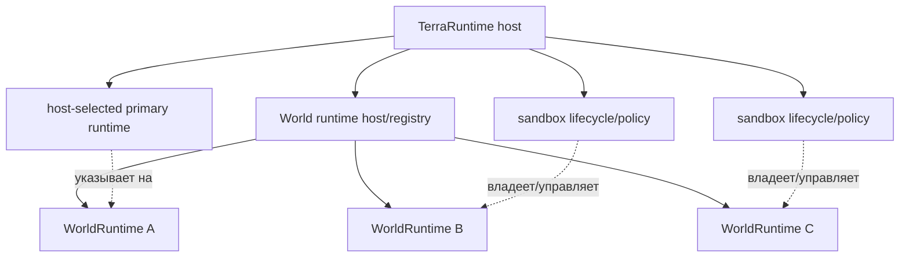
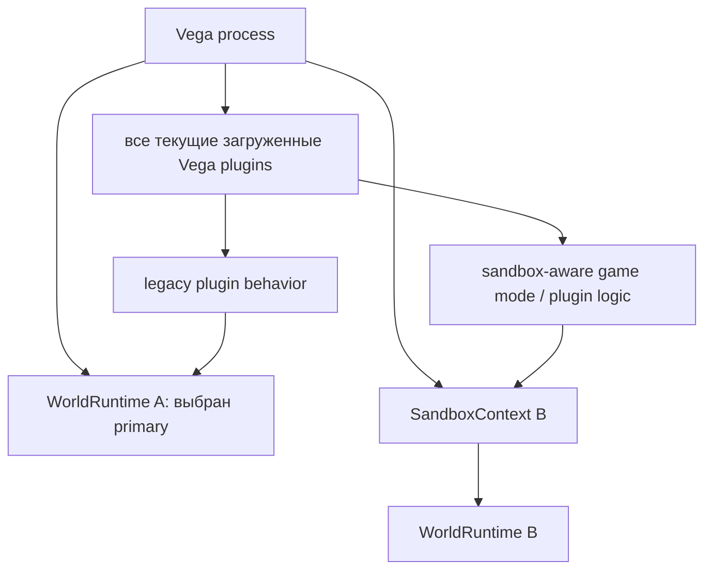
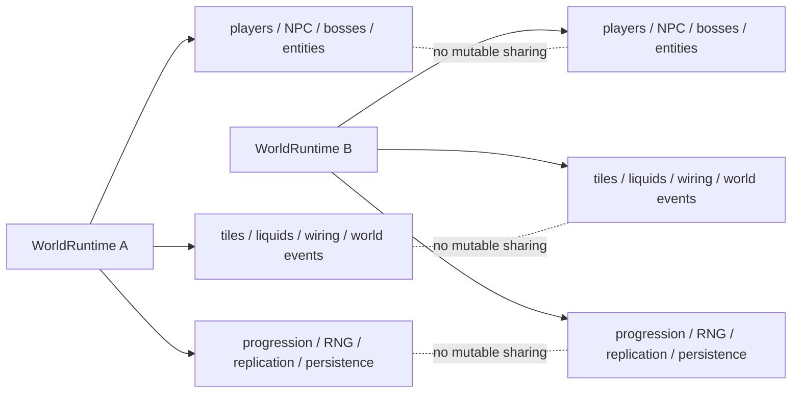
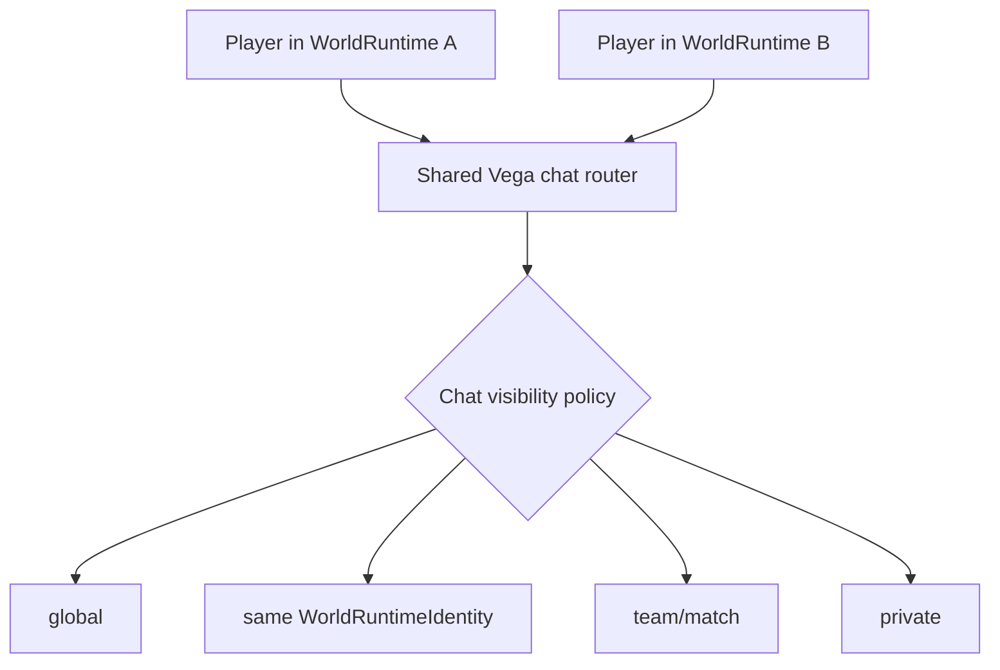
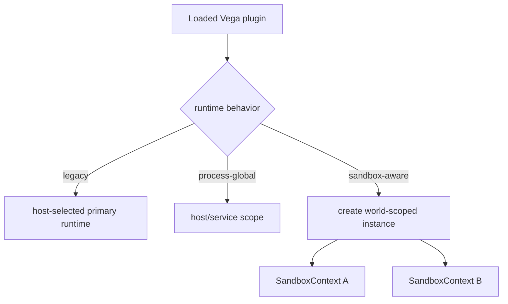
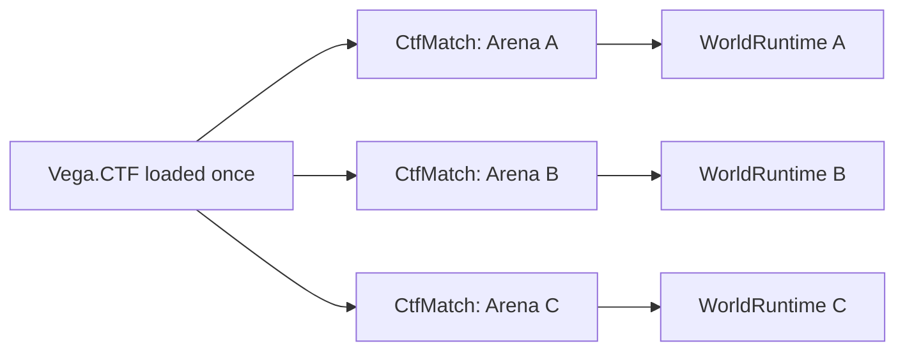
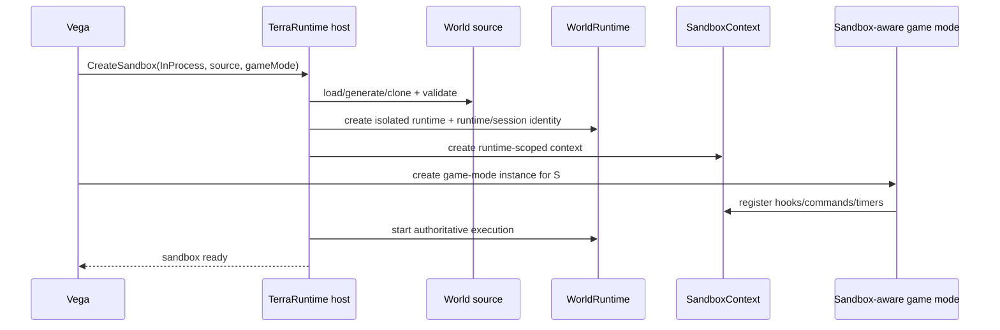
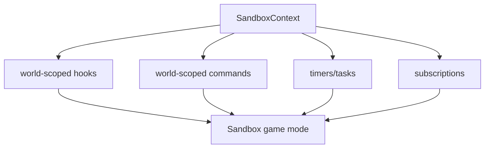
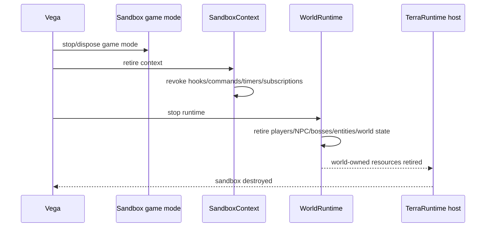

# Level 1: in-process sandbox

[Обзор](README.md) · [English](../../en/sandbox/level-1.md)

Level 1 запускает sandbox как ещё один независимый `WorldRuntime` внутри того же процесса TerraRuntime. Его цель — дешёвая изоляция **полного игрового мира и world-scoped plugin state** без отдельного OS process.

## Нормативная модель

Отдельного типа `PrimaryWorldRuntime` не существует. Основной мир и Level 1 sandbox используют один и тот же runtime abstraction.



`WorldRuntime` не должен знать, считает ли оператор его основным миром, arena, tutorial или другим host-owned назначением. Это lifecycle/policy Vega и host, а не разновидность simulation.

Назначение primary задаёт defaults: куда попадает игрок при обычном входе, к какому runtime по compatibility policy привязываются legacy plugins и какой runtime обычно имеет persistent lifetime. Level 1 sandbox — просто другой `WorldRuntime`, вокруг которого есть sandbox lifecycle/policy.

Level 1 не создаёт второй Vega process, не перезагружает assembly и не собирает отдельный набор DLL. Все уже загруженные плагины Vega остаются загруженными один раз в основном процессе.

При этом sandbox **не наследует автоматически world-scoped поведение всех текущих плагинов**. Legacy plugin, написанный с предположением об одном мире, по compatibility policy получает callbacks только для выбранного Vega primary runtime. Только явно sandbox/multi-world-aware логика получает `SandboxContext` другого runtime.



Это сохраняет обратную совместимость: включение Level 1 не должно внезапно заставить старые `/home`, economy, protection или gameplay plugins получать события из временной arena.

## Полная изоляция игрового мира

`WorldRuntime` является границей всего mutable gameplay state, а не только players/chests.

Каждый runtime обязан иметь независимые:

- players и их world membership/state;
- NPC и town NPC;
- bosses, boss AI, boss lifecycle и interaction/loot credit;
- projectiles, dropped items и runtime entity registries/IDs;
- tiles, walls, objects, chests, signs и tile entities;
- liquids;
- wiring, mechanisms и world-interaction state;
- world clock, day/night, weather и environment state;
- invasions, world events и event-local counters;
- progression и boss/event completion flags;
- spawn state, spawn pools и world-local gameplay coordinators;
- RNG streams и deterministic world randomness;
- player/NPC/projectile/item replication state;
- section visibility/cache/bootstrap state;
- persistence/autosave state согласно runtime persistence policy;
- world-scoped extension/plugin/game-mode mutable state;
- hooks, commands, timers и subscriptions, привязанные к runtime.



Например, убийство boss внутри arena не может выставить progression flag runtime, выбранного primary. Blood Moon, invasion, rain, NPC housing, chest contents или wiring state одного runtime не могут проявиться в другом через shared globals.

## Что может быть общим

Общими могут быть только явно process-global инфраструктурные сервисы, которые не являются mutable state конкретного мира.

Для Level 1 baseline отдельно разрешён общий **Vega chat router**. Сообщение, созданное игроком из world context, должно нести `WorldRuntimeIdentity`, чтобы policy могла различать global/world/team/private visibility.



Shared chat не означает shared world hooks или shared mutable gameplay state. Другие cross-world services добавляются только как явные host-level contracts, а не потому, что два runtime находятся в одном process.

## Plugin compatibility policy

Level 1 использует три поведения без обязательного публичного enum в первой реализации:

1. **Legacy / primary-only** — существующий plugin остаётся загруженным, но получает world-scoped callbacks только для runtime, выбранного Vega как primary.
2. **Process-global infrastructure** — код не привязан к одному `WorldRuntime` и не мутирует gameplay state напрямую.
3. **Sandbox-aware / multi-world-aware** — plugin или game mode явно создаёт отдельное world-scoped состояние через `SandboxContext` для каждого runtime, в котором участвует.



Не требуется выгружать или повторно загружать plugin assembly для Level 1. Изоляция достигается отдельным runtime/context/state, а не отдельным `AssemblyLoadContext`.

## Минимальная модель game mode

Baseline не требует произвольного `Modules = [...]` dependency graph для Level 1. Sandbox выбирает один game mode/owner logic, а нужные ему helper services остаются обычным кодом или API Vega/TerraRuntime.

Концептуально:

```text
Sandbox
  WorldRuntime
  SandboxContext
  SandboxGameMode instance
```

Один загруженный game-mode plugin может породить несколько независимых экземпляров:



Mutable match state принадлежит экземпляру arena и не хранится в случайных process-global singletons.

## Lifecycle создания



Sandbox не считается `Ready`, пока world runtime и обязательная sandbox-aware logic не готовы. Legacy plugins при этом не получают новый scope.

## Hooks, commands и timers

Все sandbox registrations принадлежат `SandboxContext` и должны быть revocable.



`/team`, player-death handler или arena timer не становятся глобальными только потому, что plugin assembly глобально загружен в Vega.

## Teardown



Ephemeral runtime не оставляет world state, registrations или retained runtime references после teardown. Persistent runtime следует явной persistence policy.

## Чего Level 1 не даёт

Level 1 даёт полную world-state/lifecycle isolation, но не hostile-code security isolation. Plugin code всё ещё находится в одном OS process. `Environment.FailFast`, unsafe/native crash или process-wide OOM способны завершить весь process. Для изоляции plugin code и world runtime от main process используется Level 2.
