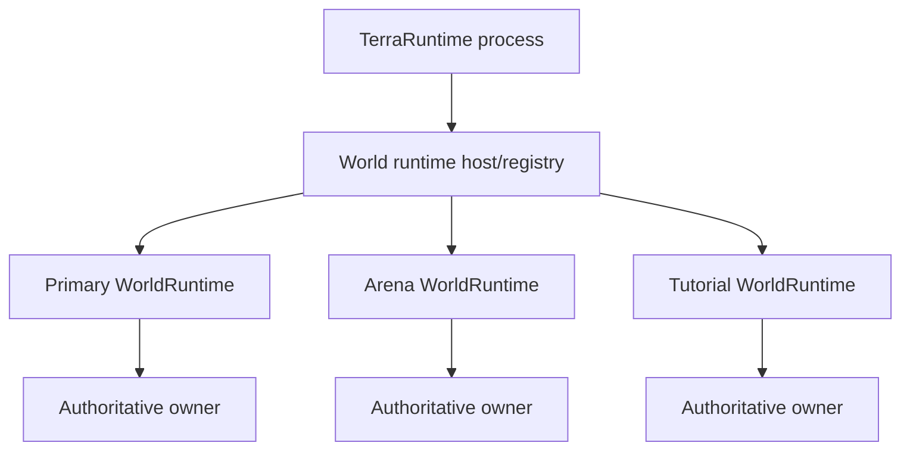
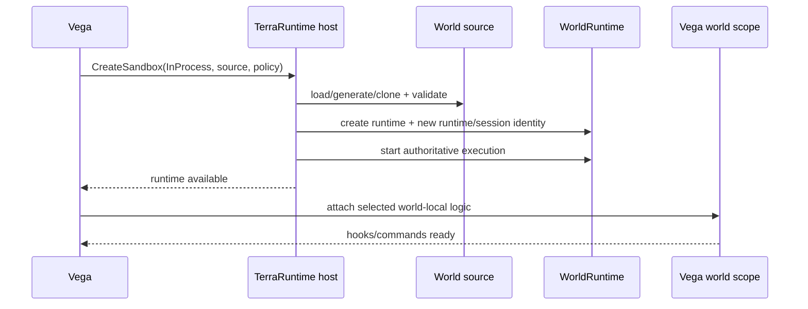
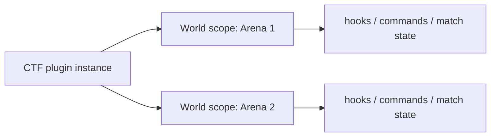
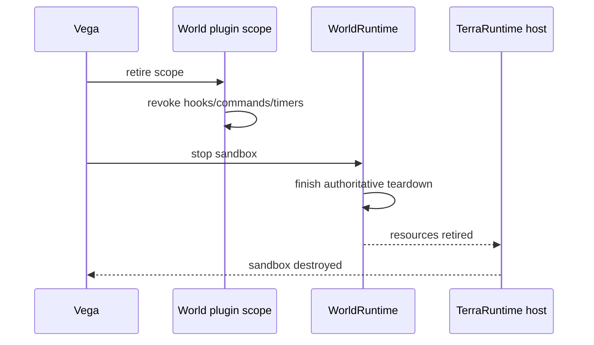

# Level 1: in-process sandbox

[Обзор](README.md) · [English](../../en/sandbox/level-1.md)

Level 1 запускает sandbox как ещё один независимый `WorldRuntime` внутри того же процесса TerraRuntime.

## Модель владения

Процесс может содержать несколько миров, но mutable simulation ownership остаётся отдельным для каждого runtime. Runtime владеет своими players, NPCs, projectiles, items, world clock/progression, RNG streams, extension state, replication state и persistence policy.

Один мир не должен менять другой через shared global state.

## Lifecycle создания

Реальная реализация может attach host logic до admission игроков, но sandbox нельзя считать ready, пока обязательный world/plugin scope не готов.

## Scope плагинов и команд

Level 1 не требует отдельного процесса Vega. Уже загруженный Vega plugin получает отдельный scope для каждого мира, в котором участвует.

Registrations должны быть world-scoped и revocable. Плагин не должен добавлять глобальную `/team` или глобальный player-death handler только потому, что они нужны одной arena.

## Teardown

Ephemeral state исчезает вместе с runtime. Persistent worlds следуют своей явной persistence policy.

## Чего Level 1 не даёт

Level 1 даёт state/lifecycle isolation, но не security isolation от враждебного кода. Crash, `Environment.FailFast`, unsafe native failure или process-wide OOM внутри in-process кода всё ещё способны уронить весь сервер. Для реальной process boundary используется Level 2.
