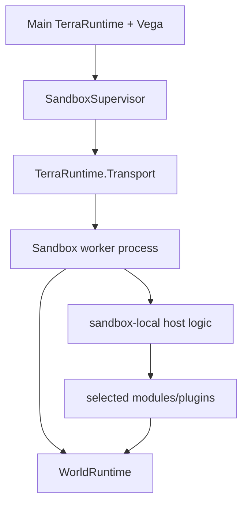
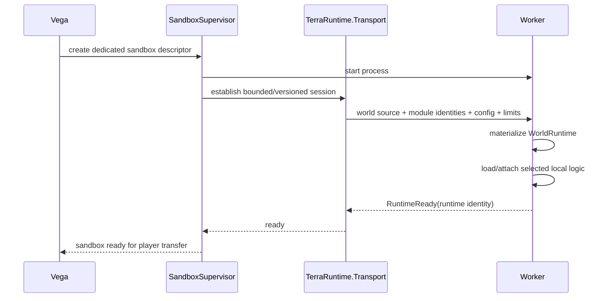
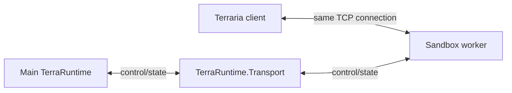
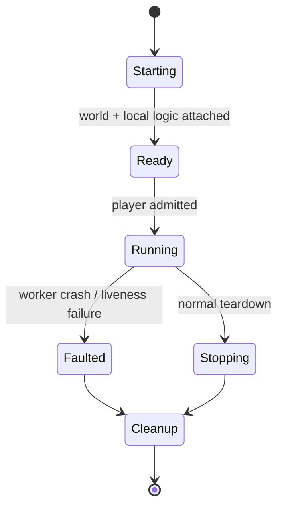

# Level 2: dedicated-process sandbox

[Обзор](README.md) · [Передача socket](socket-handoff.md) · [English](../../en/sandbox/level-2.md)

Level 2 запускает один sandbox-мир в отдельном worker process для fault и resource isolation.

## Состав worker

Первая реализация должна использовать один sandbox world на worker. Несколько worlds в одном worker являются только будущей optimization после измерений.

## Что передаёт Vega

Создание декларативное. Концептуально запрос содержит:

- isolation requirement;
- world source (`.wld`, validated generated state или clone/snapshot);
- selected sandbox-side modules/plugins;
- configuration plugin/module;
- player/resource limits;
- lifecycle policy, например ephemeral/persistent.

Worker нельзя помечать `RuntimeReady`, пока обязательный world data и обязательная local logic успешно не загружены.

## Profile для dynamic plugin loading

Worker, который динамически загружает выбранные managed Vega/plugin assemblies, требует CoreCLR extensible profile, потому что arbitrary managed DLL loading не входит в NativeAOT runtime-only contract.

Worker без dynamic managed modules может использовать NativeAOT runtime-only profile. Нельзя ослаблять NativeAOT constraints всего core graph только ради упрощения Level 2 plugin loading.

## Последовательность запуска

## Решение по data plane

После передачи accepted TCP connection игрока worker обычный Terraria gameplay traffic идёт напрямую между client и worker.

Это убирает необходимость decode/encode или proxy каждого movement/combat packet через main process.

## Fault model

Crash worker может уничтожить sandbox-local gameplay, но не должен напрямую завершать main TerraRuntime process. `SandboxSupervisor` отвечает за detection, cleanup и детерминированную обработку affected connections.

Если ownership переданного socket потеряна так, что безопасный handback доказать нельзя, disconnect безопаснее попытки угадать, какой процесс всё ещё владеет connection.
