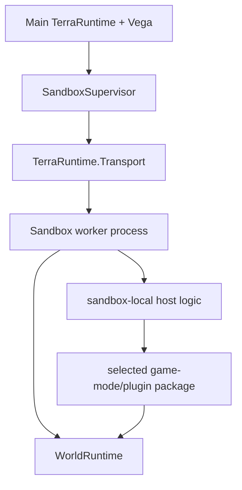
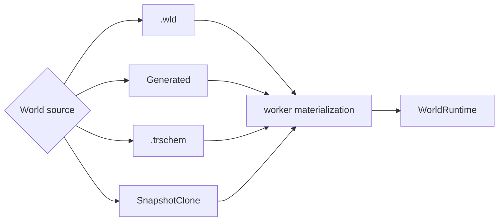
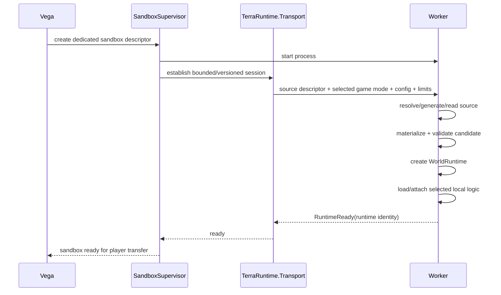
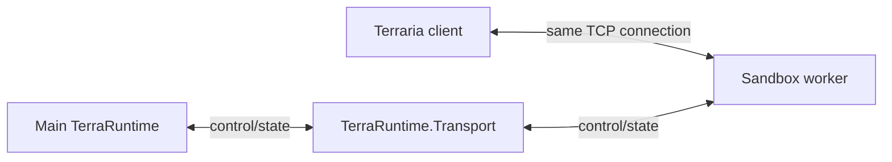
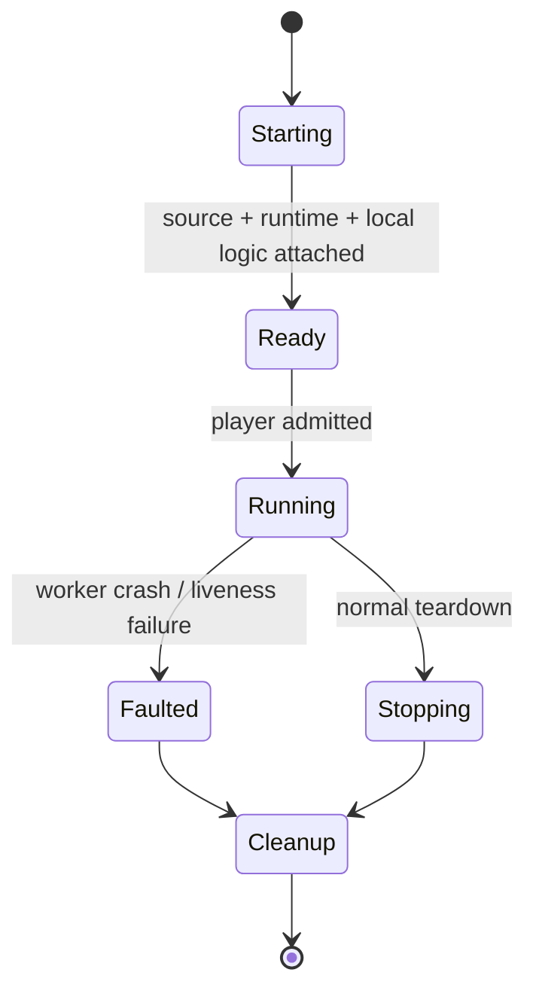

# Level 2: dedicated-process sandbox

[Обзор](README.md) · [Источники мира и schematic](world-sources-schematics.md) · [Передача socket](socket-handoff.md) · [English](../../en/sandbox/level-2.md)

Level 2 запускает один sandbox-мир в отдельном worker process для fault/resource isolation. Внутри worker используется тот же `WorldRuntime`, что и в Level 1/primary-selected runtime.

## Реализованная runtime-only основа

`SandboxSupervisor` владеет одним скрытым дочерним процессом приложения и одним ephemeral `WorldRuntime` на lease. Закрытый startup `--sandbox-worker <pipe-id>` не открывает публичный Terraria listener. Повторно используются существующие materializer и authoritative game-loop owner; IPC не меняет simulation state. Это проверенная основа жизненного цикла, **не играбельный Level 2**: host/Vega admission, локальная game-mode logic, resource enforcement, перенос игроков и двусторонний socket handoff остаются открытыми. Схемы ниже описывают целевую архитектуру, а не готовый допуск игроков.

Асинхронный локальный pipe использует BCL `CurrentUserOnly` ([контракт платформы](https://learn.microsoft.com/en-us/dotnet/api/system.io.pipes.pipeoptions?view=net-10.0)). Взаимные HMAC-SHA256 challenge/confirmation связывают отдельный bootstrap secret ребёнка, свежий challenge, точный PID запущенного процесса и process-instance GUID. Secret передаётся через environment ребёнка, удаляется там до startup, не попадает в аргументы команды/control payload; его owned byte buffer обнуляется. Это не защита от атакующего с доступом к памяти/учётной записи supervisor.

Существующий versioned `TRPC` header ограничивает payload до $8\,\mathrm{KiB}$ перед allocation. Source-generated JSON отклоняет неизвестные/отсутствующие поля конструктора. Допущены только authentication, create, heartbeat/snapshot и stop, по одному сериализованному запросу на lease. Неизвестные операции, flags, correlations, identities и module/source declarations закрываются fail-closed. Startup ограничен $180\,\mathrm{s}$, запрос — $10\,\mathrm{s}$, heartbeat идёт каждые $2\,\mathrm{s}$, control inactivity worker ограничена $15\,\mathrm{s}$. Ранний выход ребёнка прерывает startup; прерванный exchange закрывает pipe вместо повторного использования частичного frame.

Допущенные sources: встроенный `Generated` и абсолютный `.wld` reference с обязательным SHA-256. Общий Level1/worker file materializer ограничивает input до $128\,\mathrm{MiB}$ перед allocation и проверяет именно тот буфер, который затем декодируется. Для Level1 обязательный digest не вводится. Генерация/чтение/validation происходят до запуска runtime, вне его game thread. `Running` требует validated bootstrap и первый tick при $60\,\mathrm{Hz}$. Stop не сохраняет мир; ошибочный/отменённый control завершает только owned child. Нет automatic restart, восстановления socket или постоянного gameplay proxy.

`TerraRuntime.Server --sandbox-worker-smoke` проверяет два настоящих executable приложения, authentication, tick progress, изоляцию падения одного ребёнка и graceful stop. Нужен executable приложения, не `dotnet <dll>`. Тесты также покрывают повторный teardown, heartbeat, cancellation, invalid descriptors/framing, целостность файла и materialization failure. `.trschem`, snapshots, dynamic modules и OS CPU/memory quotas этим срезом не поддерживаются.

## Состав worker

Первая реализация должна использовать один sandbox world на worker. Несколько worlds в одном worker являются только будущей optimization после измерений.

## Источник мира

Level 2 использует тот же `SandboxWorldSource`, что и Level 1:

- существующий `.wld`;
- `Generated(generatorId, seed, size, options)`;
- TerraRuntime Schematic `.trschem` + canvas/materialization policy;
- snapshot/clone source после реализации snapshot contract.

`Generated` может выполняться прямо внутри worker через существующий world-generation provider/plan contract. Для `.wld` и `.trschem` local worker обычно получает stable source reference + integrity hash из controlled store, а не бесконечно гоняет весь asset через control messages.

`.trschem` может включать tiles/walls/liquids/wiring, chests и item contents, signs, typed tile entities, fresh NPC placements, world items и named markers/regions. Worker материализует их в isolated candidate, валидирует и только потом создаёт live runtime.

## Что передаёт Vega

Создание декларативное. Концептуально descriptor содержит:

- isolation requirement;
- один общий world source descriptor;
- selected sandbox-side game-mode/plugin package;
- configuration;
- player/resource limits;
- lifecycle/persistence policy.

Worker нельзя помечать `RuntimeReady`, пока world source не materialized/validated и обязательная local logic не загружена.

## Profile для dynamic plugin loading

Worker, который динамически загружает выбранную managed Vega/plugin assembly, требует CoreCLR extensible profile, потому что arbitrary managed DLL loading не входит в NativeAOT runtime-only contract.

Worker без dynamic managed modules может использовать NativeAOT runtime-only profile. Нельзя ослаблять NativeAOT constraints всего core graph только ради упрощения Level 2 plugin loading.

## Последовательность запуска

TCP socket transfer начинается **после** `RuntimeReady`; подготовка world source не должна происходить в середине connection handoff.

## Решение по data plane

После передачи accepted TCP connection игрока worker обычный Terraria gameplay traffic идёт напрямую между client и worker.

Это убирает необходимость decode/encode или proxy каждого movement/combat packet через main process.

## Fault model

Crash worker может уничтожить sandbox-local gameplay, но не должен напрямую завершать main TerraRuntime process. `SandboxSupervisor` отвечает за detection, cleanup и детерминированную обработку affected connections.

Если ownership переданного socket потеряна так, что безопасный handback доказать нельзя, disconnect безопаснее попытки угадать, какой process всё ещё владеет connection.
