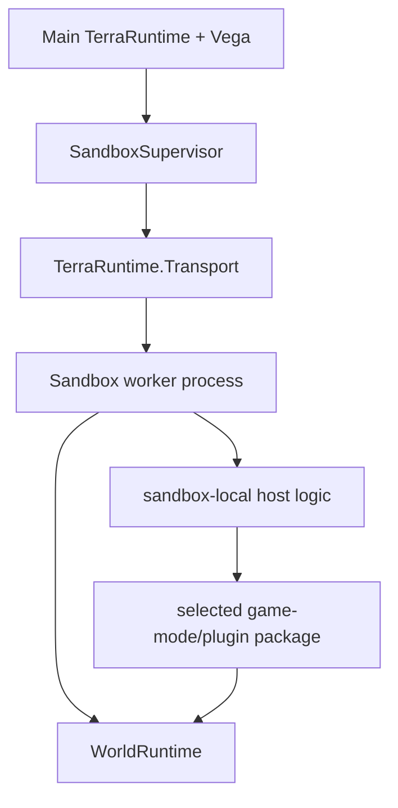
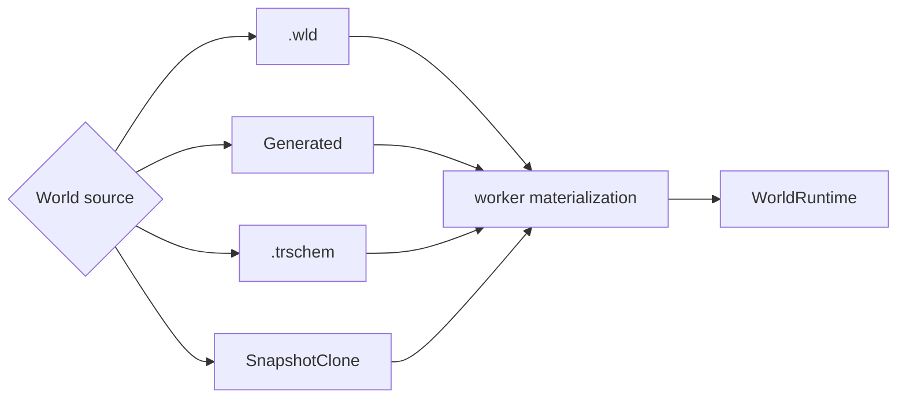
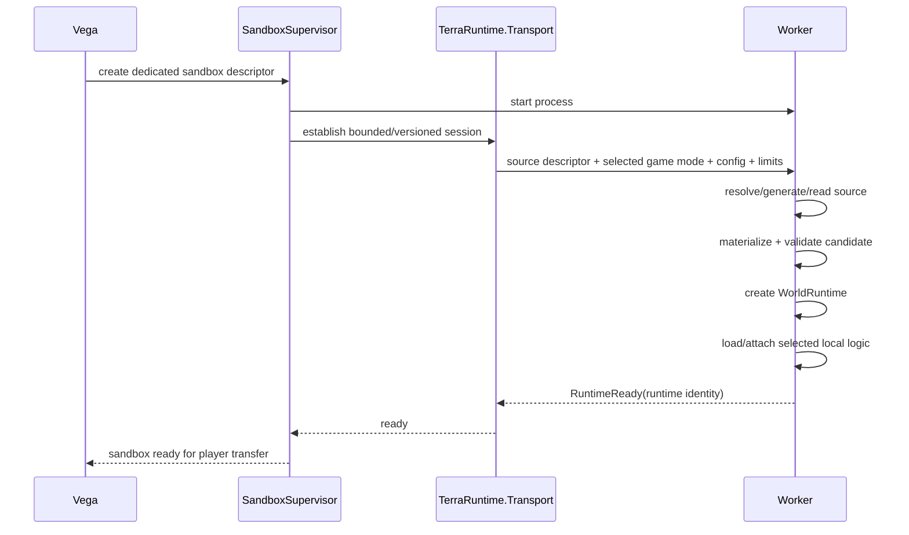
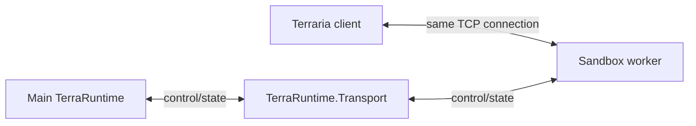
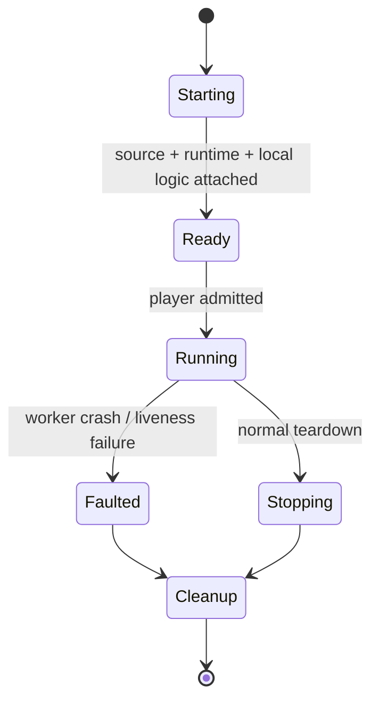

# Level 2: dedicated-process sandbox

[Обзор](README.md) · [Источники мира и schematic](world-sources-schematics.md) · [Передача socket](socket-handoff.md) · [English](../../en/sandbox/level-2.md)

Level 2 запускает один sandbox-мир в отдельном worker process для fault/resource isolation. Внутри worker используется тот же `WorldRuntime`, что и в Level 1/primary-selected runtime.

## Состав worker

Первая реализация должна использовать один sandbox world на worker. Несколько worlds в одном worker являются только будущей optimization после измерений.

## Источник мира

Level 2 использует тот же `SandboxWorldSource`, что и Level 1:

- существующий `.wld`;
- `Generated(generatorId, seed, size, options)`;
- TerraRuntime Schematic `.trschem` + canvas/materialization policy;
- snapshot/clone source после реализации snapshot contract.

`Generated` может выполняться прямо внутри worker через существующий world-generation provider/plan contract. Для `.wld` и `.trschem` local worker обычно получает stable source reference + integrity hash из controlled store, а не бесконечно гоняет весь asset через control messages.

`.trschem` может включать tiles/walls/liquids/wiring, chests и item contents, signs, typed tile entities, fresh NPC placements, world items и named markers/regions. Worker материализует их в isolated candidate, валидирует и только потом создаёт live runtime.

## Что передаёт Vega

Создание декларативное. Концептуально descriptor содержит:

- isolation requirement;
- один общий world source descriptor;
- selected sandbox-side game-mode/plugin package;
- configuration;
- player/resource limits;
- lifecycle/persistence policy.

Worker нельзя помечать `RuntimeReady`, пока world source не materialized/validated и обязательная local logic не загружена.

## Profile для dynamic plugin loading

Worker, который динамически загружает выбранную managed Vega/plugin assembly, требует CoreCLR extensible profile, потому что arbitrary managed DLL loading не входит в NativeAOT runtime-only contract.

Worker без dynamic managed modules может использовать NativeAOT runtime-only profile. Нельзя ослаблять NativeAOT constraints всего core graph только ради упрощения Level 2 plugin loading.

## Последовательность запуска

TCP socket transfer начинается **после** `RuntimeReady`; подготовка world source не должна происходить в середине connection handoff.

## Решение по data plane

После передачи accepted TCP connection игрока worker обычный Terraria gameplay traffic идёт напрямую между client и worker.

Это убирает необходимость decode/encode или proxy каждого movement/combat packet через main process.

## Fault model

Crash worker может уничтожить sandbox-local gameplay, но не должен напрямую завершать main TerraRuntime process. `SandboxSupervisor` отвечает за detection, cleanup и детерминированную обработку affected connections.

Если ownership переданного socket потеряна так, что безопасный handback доказать нельзя, disconnect безопаснее попытки угадать, какой process всё ещё владеет connection.
