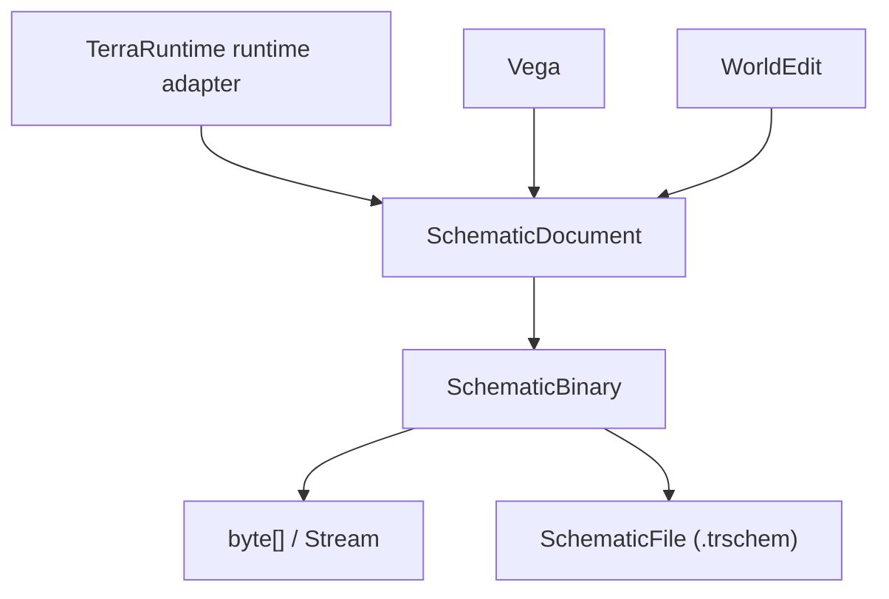

# API TerraRuntime Schematic

[Обзор sandbox](README.md) · [English](../../en/sandbox/schematic-api.md) · [Источники и дизайн формата](world-sources-schematics.md)

`TerraRuntime.Schematics` — общий NativeAOT-safe пакет модели и бинарного кодека `.trschem`. Он не зависит от `TerraRuntime.Core`, `TerraRuntime.World`, Vega или WorldEdit. TerraRuntime, Vega и WorldEdit должны использовать этот пакет напрямую, без слоёв адаптации формата.

## Текущая реализованная поверхность

Первая реализация даёт четыре независимых слоя:

1. `SchematicDocument` и typed records схемы;
2. `SchematicBinary` для детерминированной bounded бинарной сериализации;
3. `SchematicFile` для прямой загрузки/сохранения файлов;
4. `ISchematicCaptureSource` / `ISchematicRestoreTarget` как нейтральные контракты снятия и восстановления схемы.

Runtime-owned реализация capture/materialization намеренно не входит в первый кусок. Реализация для живого TerraRuntime всё равно должна выполнять mutation через authoritative ownership/command boundary мира.

## Бинарный API

WorldEdit, Vega, тесты и другие инструменты могут работать прямо с бинарными данными:

```csharp
byte[] bytes = SchematicBinary.Serialize(document);
SchematicDocument loaded = SchematicBinary.Deserialize(bytes);
```

Есть операции со `Stream`, не требующие файлового пути:

```csharp
SchematicBinary.Write(stream, document);
SchematicDocument loaded = SchematicBinary.Read(stream);

await SchematicBinary.WriteAsync(stream, document, cancellationToken);
SchematicDocument loadedAsync = await SchematicBinary.ReadAsync(stream, cancellationToken);
```

Reader проверяет magic/version, dimensions, границы section directory, пересечение sections, размеры sections, CRC-32, required/unknown sections, counts, coordinates и UTF-8 limits до принятия документа. `.trschem` v1 пока намеренно не включает compression, поэтому stored и decoded section sizes обязаны совпадать.

## File API

Общее расширение файла — `.trschem`:

```csharp
SchematicFile.Save("arena.trschem", document);
SchematicDocument loaded = SchematicFile.Load("arena.trschem");

await SchematicFile.SaveAsync("arena.trschem", document, cancellationToken);
SchematicDocument loadedAsync = await SchematicFile.LoadAsync("arena.trschem", cancellationToken);
```

Save пишет во временный файл в том же каталоге и затем заменяет destination path. Load для seekable file проверяет глобальный file-size ceiling ещё до чтения.

## Контракты capture и restore

Пакет формата не знает, как конкретный runtime/editor хранит состояние мира. Вместо этого определены нейтральные границы:

```csharp
public interface ISchematicCaptureSource
{
    SchematicDocument Capture(in SchematicBounds bounds);
}

public interface ISchematicRestoreTarget
{
    void Restore(SchematicDocument schematic, in SchematicPlacement placement);
}
```

`SchematicBounds` описывает область для capture. `SchematicPlacement` задаёт tile-origin назначения. WorldEdit сможет реализовать эти контракты над своей editing surface; TerraRuntime реализует их через authoritative runtime operations на этапе materialization.

## Records v1

Модель сейчас представляет:

- tiles/walls/frames, paint/coating-compatible flags, liquids и wiring state;
- chests с bounded name и максимум `40` item slots;
- signs;
- typed tile entities: training dummy, item frame, logic sensor, display doll, weapons rack, hat rack, food platter и teleportation pylon;
- fresh NPC placements, включая optional town-home/name/life fields, но без runtime slots и raw AI arrays;
- dropped/world items;
- named point/region markers;
- bounded string metadata.

NPC и boss entries остаются **fresh placement records**. Runtime materializer будет выделять новые destination-local identities и canonical AI state, а не восстанавливать source-world slot/target/`ai[]` references.

## Граница формата



Пакет является границей формата данных, а не ещё одним движком мира. Загрузка/сохранение `.wld` остаются ответственностью `TerraRuntime.World`.
