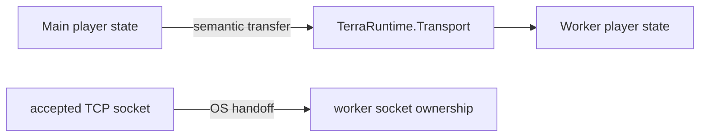
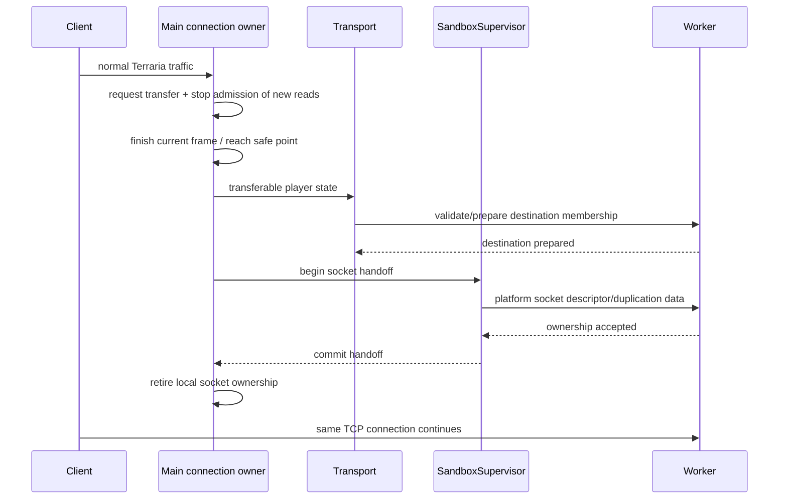
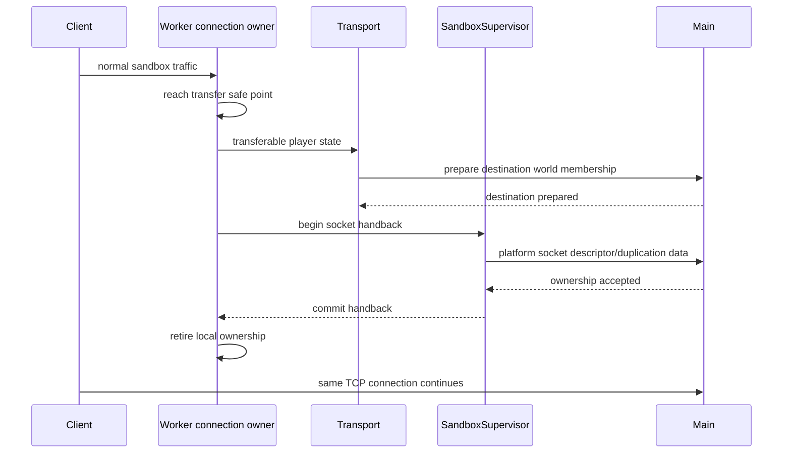
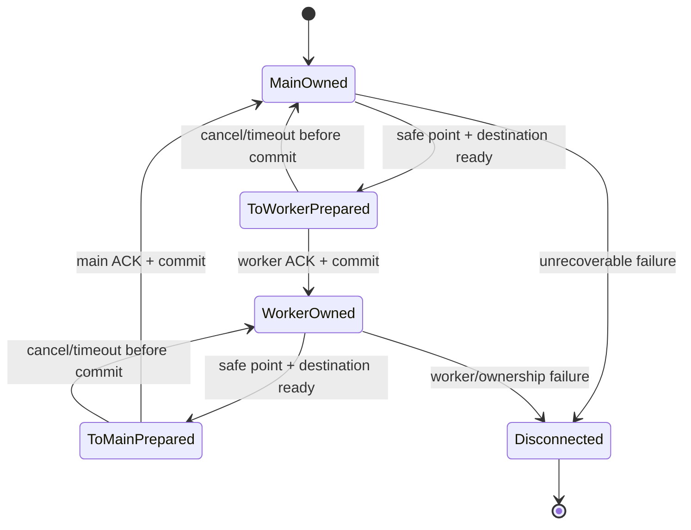

# Передача TCP socket в Level 2

[Обзор](README.md) · [Level 2](level-2.md) · [English](../../en/sandbox/socket-handoff.md)

Локальный Level 2 сохраняет существующее Terraria TCP connection игрока, перемещая ownership connection между main process и sandbox worker.

## Разделение state и socket ownership

Во время transfer перемещаются две разные вещи:

1. **semantic player/runtime state** через bounded/versioned сообщения `TerraRuntime.Transport`;
2. **живой accepted socket/descriptor** через OS-specific socket-handoff mechanism.

Socket не сериализуется в Transport payload.

## Требование safe point

Kernel receive/send queues следуют механизму socket ownership, но process-local bytes не переезжают. Если process уже считал bytes в frame decoder, `PipeReader`, backing buffer `SequenceReader` или локальную queue, эти bytes не появятся в destination process сами собой.

Поэтому ownership commit разрешён только в safe point, где:

- в source decoder нет partial Terraria frame;
- нет непереданных process-local receive bytes;
- нет одновременно выполняющегося read callback;
- pending writes flushed/completed или явно retired согласно connection pipeline contract;
- подготовлен transferable player-state snapshot/command set;
- destination runtime готов принять connection.

## Вход в sandbox

После ownership commit source не должен возобновлять чтение.

## Возврат в main

## State machine ownership

Состояния `BothOwned` не существует.

## Platform paths

### Windows

Используются проверенные Winsock socket duplication/handoff semantics, например `WSADuplicateSocket` плюс поддерживаемый .NET reconstruction path. Конкретная реализация должна быть проверена на shipping .NET 11/Windows target до закрытия roadmap item.

### Unix/Linux

Используется file-descriptor passing через локальный Unix-domain control channel с `SCM_RIGHTS` или другим проверенным equivalent. Descriptor passing является ancillary-data operation, а не обычными serialized Transport payload data.

## Правило отказа

Если после crash process или неоднозначного platform failure ownership доказать нельзя, система fail closed. Отключить одного sandbox-player безопаснее, чем позволить двум process одновременно читать один TCP byte stream и ломать protocol state.
