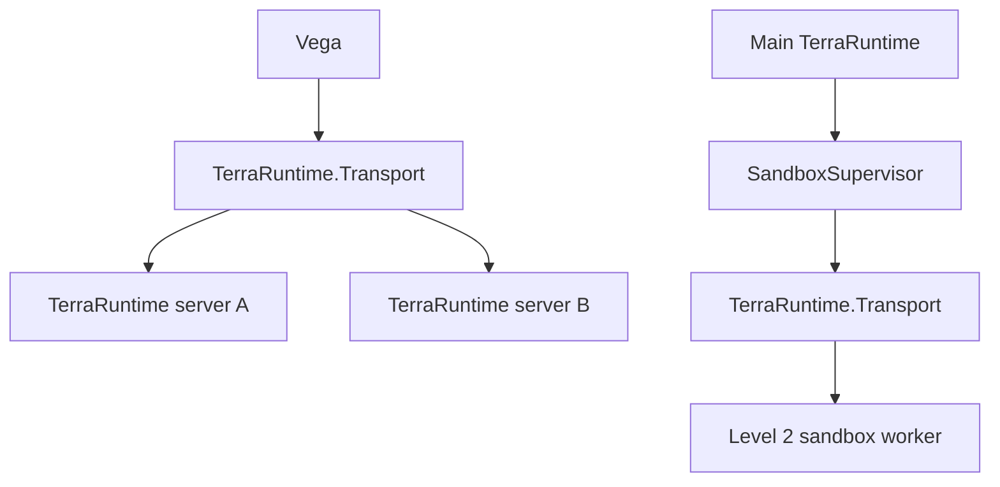
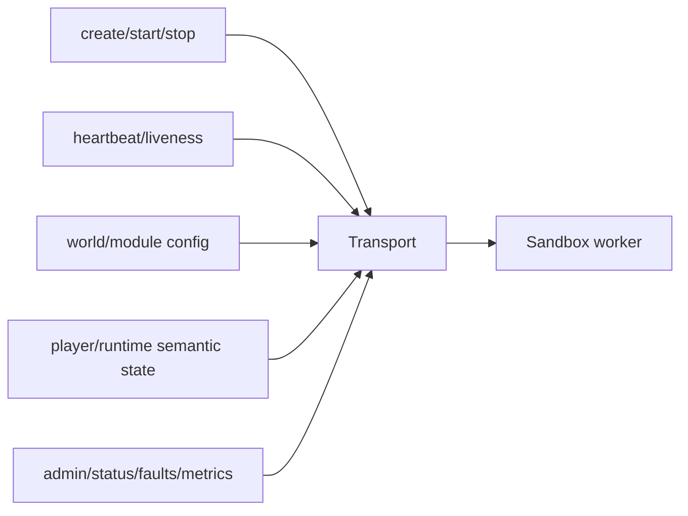
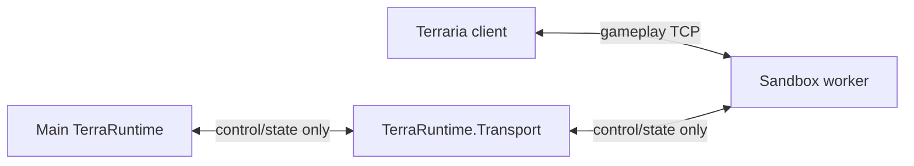
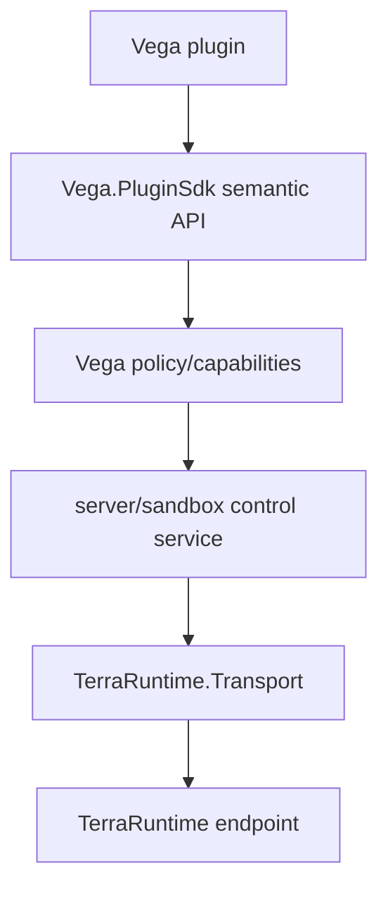

# Transport и sandbox control plane

[Обзор](README.md) · [English](../../en/sandbox/transport.md)

`TerraRuntime.Transport` сохраняется как first-class boundary. Sandbox support даёт ему два явных назначения, а не превращает его в универсальную gameplay-шину.

## Две topology

Первая topology нужна для Vega communication с несколькими TerraRuntime servers. Вторая — для supervision локальных sandbox workers и semantic transfer.

## Что Transport переносит для Level 2

Transport должен переносить bounded semantic messages, например:

- worker handshake/capabilities;
- sandbox creation descriptor;
- runtime ready/faulted/stopping status;
- heartbeat/liveness;
- bounded player-state transfer payloads;
- administrative lifecycle operations;
- summaries logs/metrics, где это уместно.

## Что Transport не переносит

Для локального Level 2 после socket handoff он **не** переносит постоянно каждый Terraria movement/combat/world packet между client и worker.

Также Transport не владеет Vega plugin permissions, gameplay mutation semantics, world business logic и универсальной RPC object model.

## Слои service

Обычные plugins не должны получать unrestricted raw Transport sessions только потому, что им нужна cross-server или sandbox операция.

## Bounds и versioning

Каждое message family имеет явные size/count limits. Pending requests, timeouts, queue depths и heartbeat state bounded. Service versions/capabilities negotiated, а не угадываются по process version или socket address.

Socket handoff metadata может координироваться через Transport session, но живой kernel socket передаётся platform mechanism, описанным в [socket-handoff.md](socket-handoff.md).
