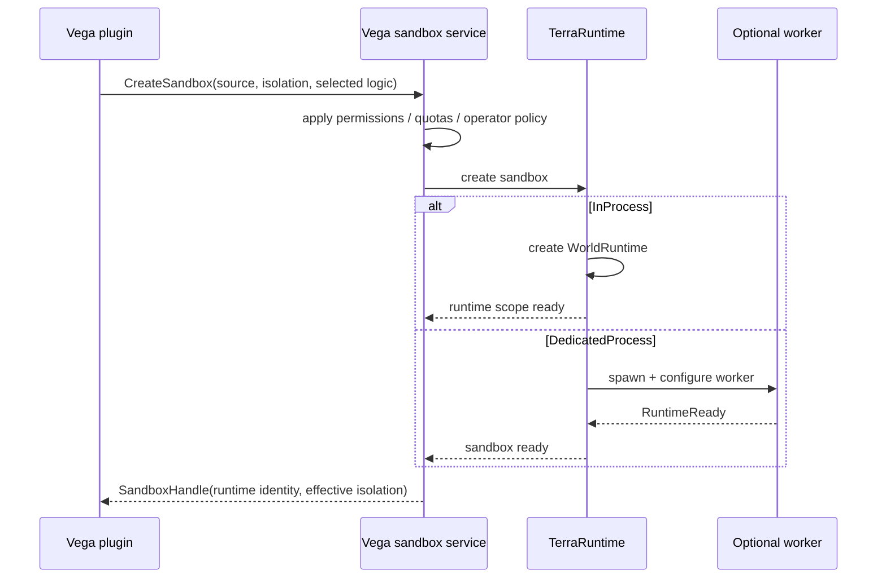
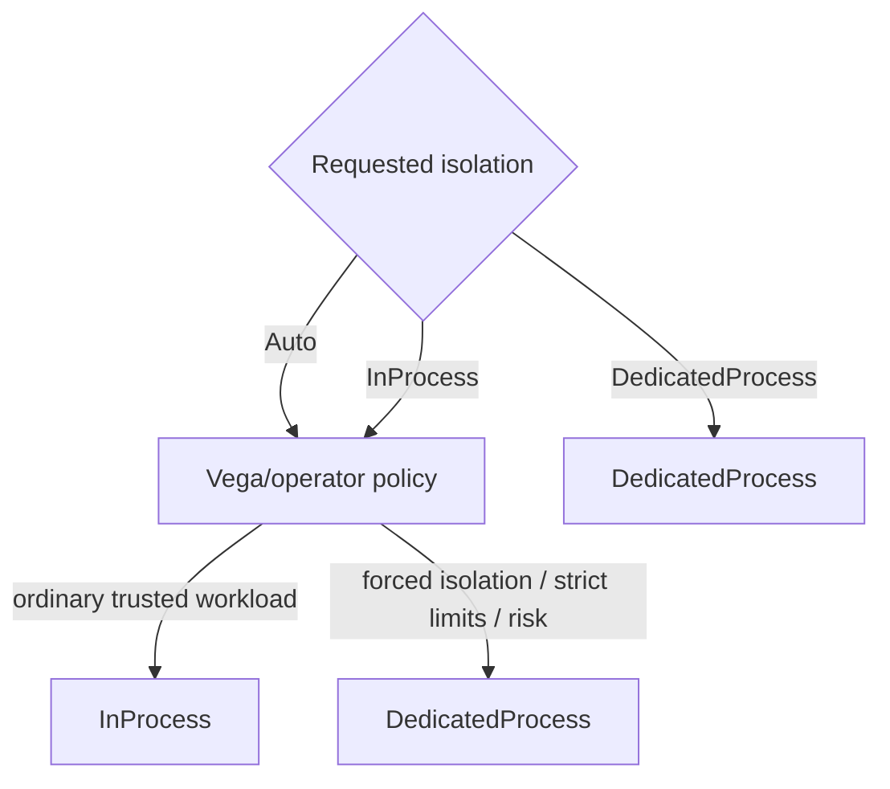
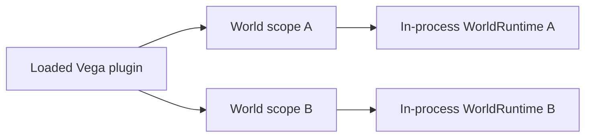
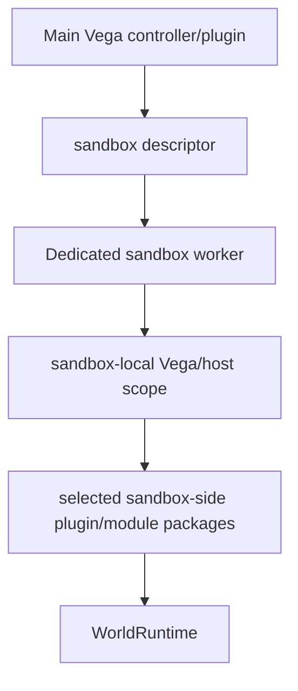
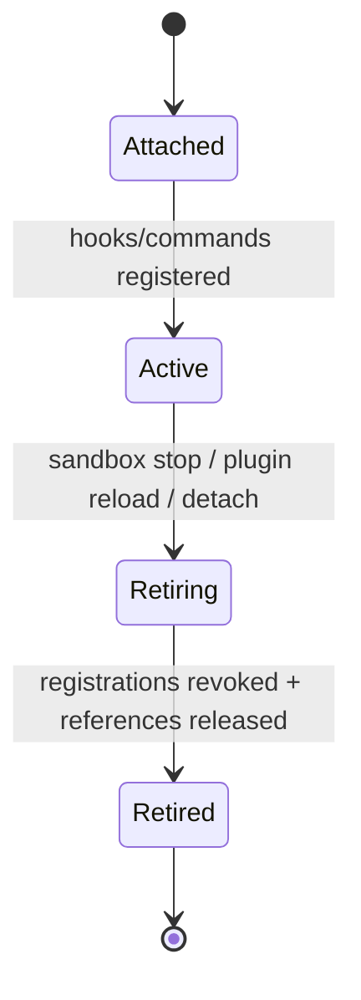

# Интеграция Vega с sandbox worlds

[Обзор](README.md) · [English](../../en/sandbox/vega-integration.md)

Vega должна давать plugins один semantic sandbox API. Plugin запрашивает мир, source и isolation requirement; Vega/operator policy определяет effective isolation с правилом: требуемая isolation никогда незаметно не ослабляется.

## Flow создания



Конкретные public types пока не зафиксированы. Важна semantic boundary: plugin не запускает process, не дублирует socket и не разговаривает с raw Transport самостоятельно.

## Isolation policy



`DedicatedProcess` является минимумом. Policy может усилить `InProcess` до `DedicatedProcess`, но не может незаметно понизить dedicated requirement.

## Hooks и commands

Sandbox нужен собственный world/plugin scope. Hooks, commands, timers и match state привязываются к конкретному `WorldRuntimeIdentity`.

### Level 1



Один plugin assembly/instance может обслуживать несколько scopes, если его state model это позволяет, но per-match mutable state не должен случайно становиться global.

### Level 2



Hot-path hooks и world-local commands выполняются внутри worker, который владеет world и client socket. Они не являются RPC callbacks в main Vega process.

Global/operator commands остаются в main Vega и используют semantic control operations, когда им нужно посмотреть или остановить sandbox.

## Выбор plugin/package для Level 2

Vega должна описывать выбранную worker-side logic стабильными package/module identity, version и integrity metadata, а не сериализовать живые plugin objects.

Концептуально creation descriptor может содержать:

```text
plugin/module id
version
content hash
configuration
required capabilities
```

Локальный worker может загружать их из controlled plugin/package store. Постоянно копировать arbitrary DLL bytes через Transport для каждого матча не является baseline design.

## Lifetime registrations

World-scoped registrations должны быть revocable. Точное имя типа пока не фиксируется, но lifecycle должен вести себя как lease:



Stale delegate или command registration не должны удерживать unloaded plugin context или dead `WorldRuntime`.

## Текущее ограничение TerraRuntime

Текущий trusted-host loader использует single-runtime attachment model. Multi-world support должен развить lifecycle до независимых runtime scopes по `WorldRuntimeIdentity`, а не одного global attached flag. Существующую per-world activation policy нужно переиспользовать, а не создавать вторую activation system.
