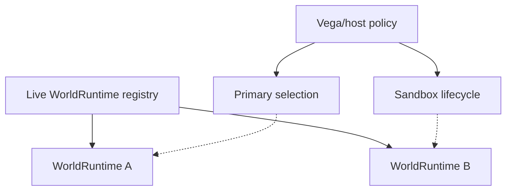
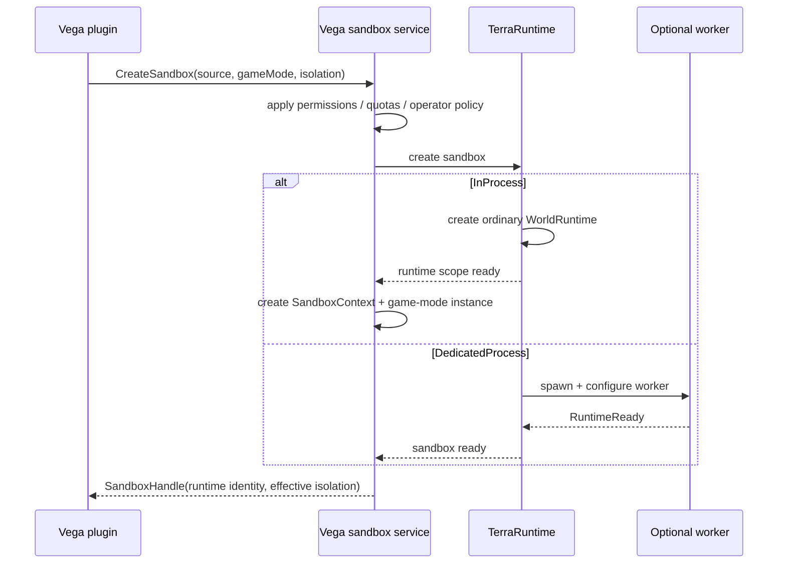
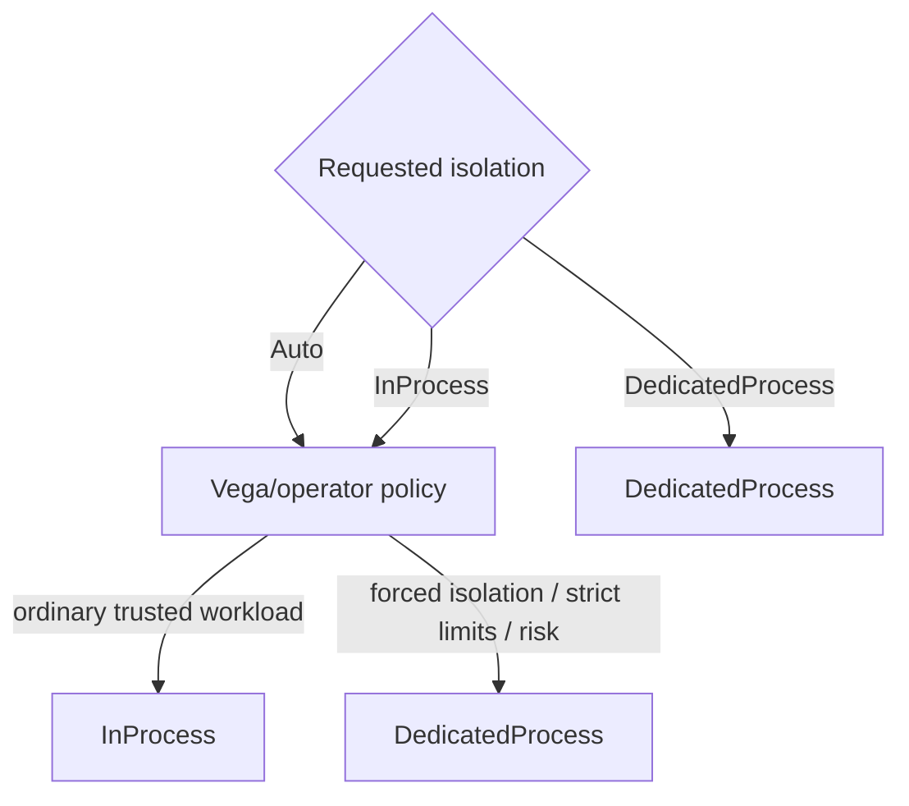
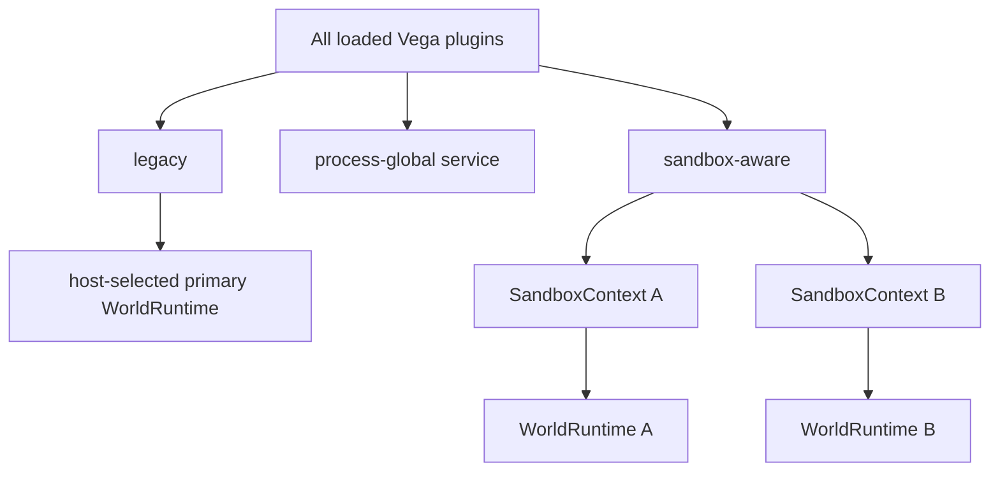
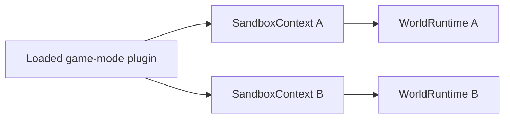
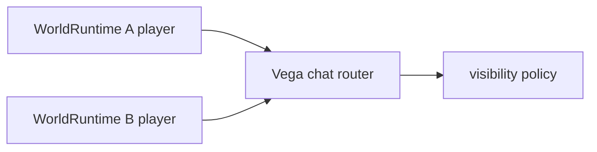
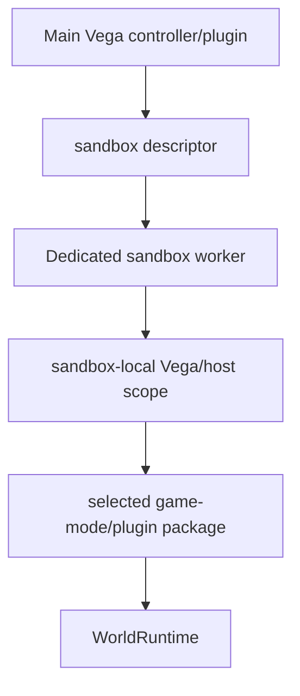
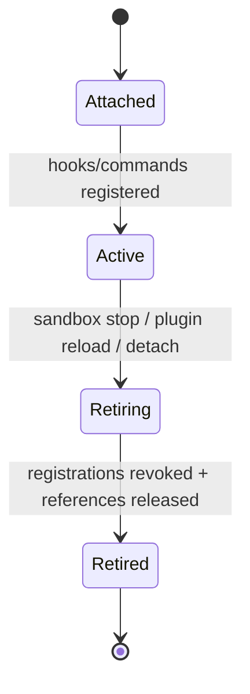

# Интеграция Vega с sandbox worlds

[Обзор](README.md) · [English](../../en/sandbox/vega-integration.md)

Vega должна давать plugins один semantic sandbox API. Plugin запрашивает world source, game mode и isolation requirement; Vega/operator policy определяет effective isolation с правилом: требуемая isolation никогда незаметно не ослабляется.

## Primary runtime не является отдельным типом мира

Vega/host выбирает один обычный `WorldRuntime` как primary target для обычного входа игроков и compatibility старых plugins. Сам `WorldRuntime` не должен иметь отдельную primary/sandbox simulation class.



## Flow создания



Конкретные public types пока не зафиксированы. Важна semantic boundary: plugin не запускает process, не дублирует socket и не разговаривает с raw Transport самостоятельно.

## Isolation policy



`DedicatedProcess` является минимумом. Policy может усилить `InProcess` до `DedicatedProcess`, но не может незаметно понизить dedicated requirement.

## Level 1: все plugins загружены, но не все подключены к каждому миру

Level 1 не создаёт отдельный plugin host. Все текущие Vega plugin assemblies остаются загруженными один раз в main process.

Но это **не означает**, что каждый plugin автоматически получает hooks/events каждого `WorldRuntime`.

Compatibility policy:

- legacy/single-world plugin получает world-scoped callbacks только runtime, выбранного Vega как primary;
- process-global infrastructure может оставаться общей, если она не владеет mutable gameplay state мира;
- sandbox/multi-world-aware plugin или game mode явно получает отдельный `SandboxContext` конкретного runtime;
- sandbox-aware mutable state создаётся отдельно для каждой arena/session.



Baseline Level 1 не требует `Modules = [...]`. Создание sandbox выбирает один game mode/owner logic. Нужные Teams/score/spawn helper-части остаются обычным кодом game mode либо host APIs. Произвольный dependency graph добавляется только при реальной необходимости.

## Hooks, commands и timers

Sandbox получает собственный runtime context. Hooks, commands, timers и match state привязываются к конкретному `WorldRuntimeIdentity` и удаляются вместе с `SandboxContext`.



Один plugin assembly загружен один раз, но per-match mutable state не является global singleton.

## Shared chat в Level 1

Общий Vega chat router является допустимым process-global сервисом. Он может обслуживать игроков из разных runtimes, но сообщение должно сохранять `WorldRuntimeIdentity` источника, чтобы Vega могла реализовать global/world/team/private visibility.



Общий chat не делает NPC, bosses, progression, hooks или другие gameplay systems общими.

## Level 2



В Level 2 worker загружает только требуемую sandbox-side game mode/plugin package и её необходимые runtime dependencies, а не полный набор plugins main Vega.

Hot-path hooks и world-local commands выполняются внутри worker, который владеет world и client socket. Они не являются RPC callbacks в main Vega process.

Global/operator commands остаются в main Vega и используют semantic control operations, когда им нужно посмотреть или остановить sandbox.

## Выбор package для Level 2

Vega описывает выбранную worker-side logic стабильными package identity, version и integrity metadata, а не сериализует живые plugin objects.

Концептуально creation descriptor может содержать:

```text
plugin/game-mode package id
version
content hash
configuration
required capabilities
```

Локальный worker может загружать package из controlled plugin/package store. Постоянно копировать arbitrary DLL bytes через Transport для каждого матча не является baseline design.

## Lifetime registrations

World-scoped registrations должны быть revocable. Точное имя типа пока не фиксируется, но lifecycle должен вести себя как lease:



Stale delegate или command registration не должны удерживать unloaded plugin context или dead `WorldRuntime`.

## Текущее ограничение TerraRuntime

Текущий trusted-host loader использует single-runtime attachment model. Multi-world support должен развить lifecycle до независимых runtime scopes по `WorldRuntimeIdentity`, а не одного global attached flag. Существующую per-world activation policy нужно переиспользовать, а не создавать вторую activation system.
