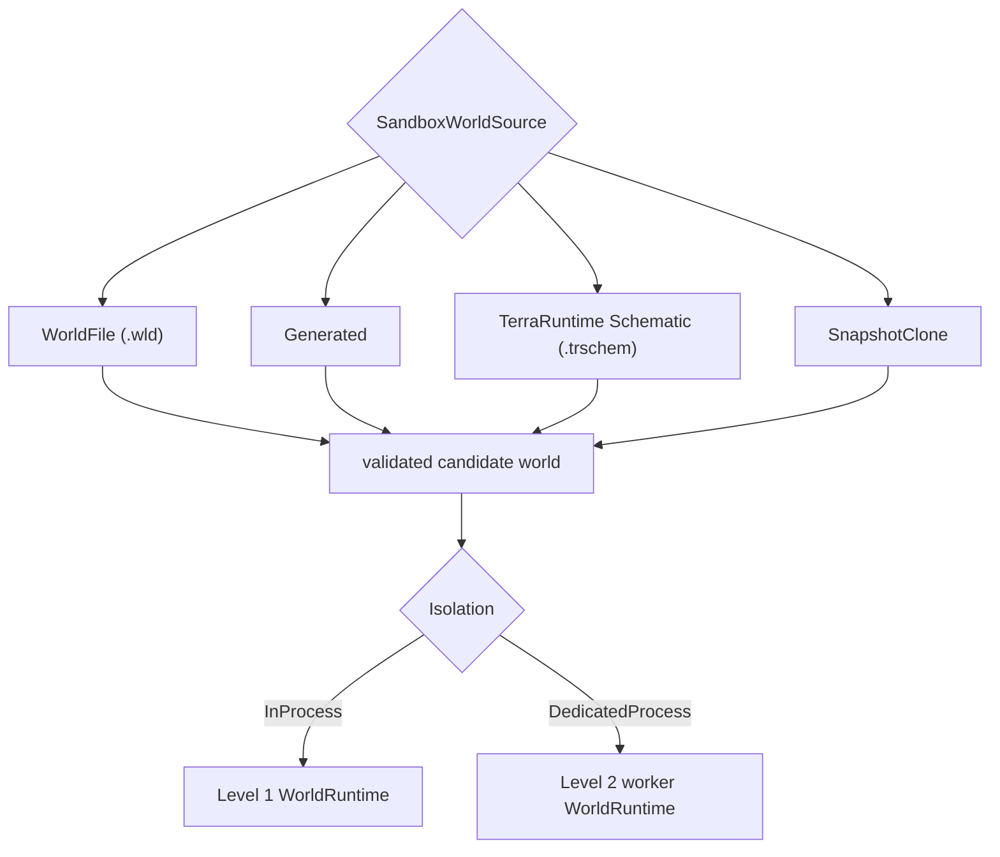
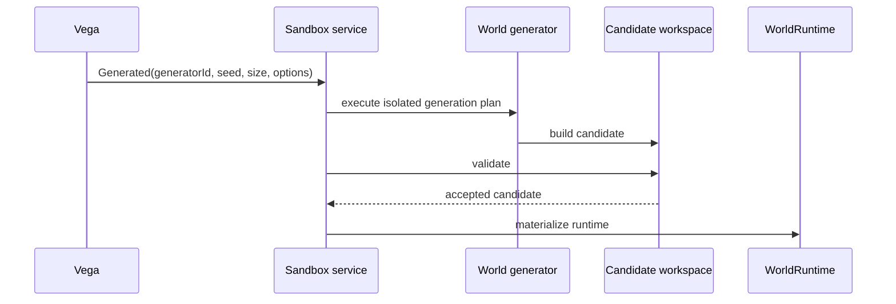
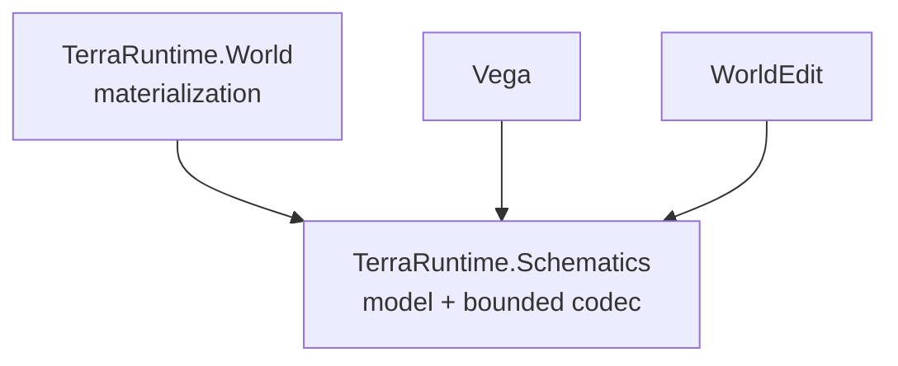
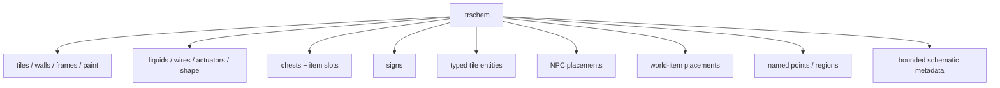
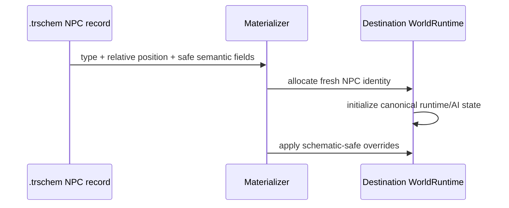
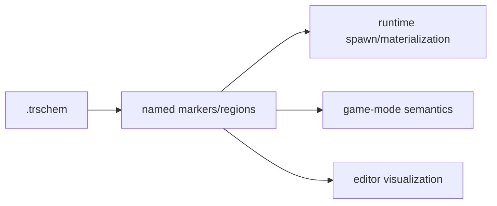
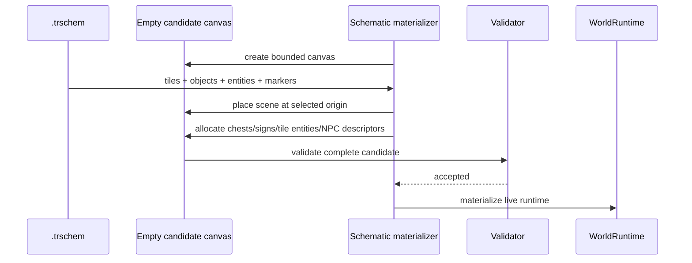

# Источники sandbox мира и TerraRuntime Schematic

[Обзор sandbox](README.md) · [English](../../en/sandbox/world-sources-schematics.md) · [Roadmap](../../roadmap/sandbox/README.md)

Level 1 и Level 2 используют **одинаковую модель источника мира**. Isolation определяет, где будет жить `WorldRuntime`; она не должна менять способ описания исходного мира.

## Единый `SandboxWorldSource`

Baseline должен поддерживать как минимум:

```text
WorldFile      -> существующий .wld
Generated      -> generator id + seed + size + generation options
Schematic      -> TerraRuntime .trschem + canvas/materialization options
SnapshotClone  -> immutable runtime/world snapshot source, когда эта возможность реализована
```



Таким образом, одна и та же arena может быть запущена как Level 1 или Level 2 без смены формата карты.

## Generated source

Generated source не передаёт готовый `.wld` как обязательный промежуточный артефакт. Он описывает generation request через существующие TerraRuntime world-generation contracts: `WorldGeneratorId`, seed, dimensions и generation options.



Level 2 может выполнить generation внутри worker. Level 1 выполняет её в main process against an isolated candidate workspace. В обоих случаях authoritative live runtime появляется только после успешной generation/validation.

## World file source

`WorldFile` использует существующий `.wld` loader и validation rules. Sandbox runtime получает новую `WorldRuntimeIdentity`; путь/identity исходного `.wld` не является identity live runtime.

Ephemeral sandbox не обязан переписывать исходный файл. Persistent mode использует явную persistence policy и отдельные правила публикации/сохранения.

## TerraRuntime Schematic

TerraRuntime получает собственный переносимый формат scene/region: **TerraRuntime Schematic**, рекомендуемое расширение `.trschem`.

Это нативный формат TerraRuntime ecosystem. TerraRuntime не зависит от WorldEdit и не содержит compatibility adapter старого WorldEdit format. Vega и WorldEdit должны использовать `.trschem` напрямую через общий codec/model.

Рекомендуемая граница кода:



`TerraRuntime.Schematics` должен быть небольшой NativeAOT-safe библиотекой без зависимости на `TerraRuntime.Core`, Vega или WorldEdit. Это позволяет editor/plugin code читать и писать тот же файл без протягивания server runtime внутрь WorldEdit.

## Что представляет `.trschem`

Schematic является **переносимым описанием сцены/области**, а не сериализацией живого `WorldRuntime` и не вторым форматом `.wld`.

Все координаты внутри файла относительны bounds схемы. Runtime IDs, player connections, entity slots и process-specific handles не сохраняются.



### Tiles

Tile records должны покрывать данные, уже необходимые runtime/worldgen: tile type, wall, frame, active/inactive state, slope/shape, paint/coating flags, liquid amount/kind, wires и actuator state.

Кодек должен использовать bounded deterministic representation. Palette/RLE и optional per-section compression допустимы, но точная схема кодирования должна иметь golden tests и limits до использования untrusted files.

### Chests

Chest record хранит:

- относительную tile-coordinate позицию;
- bounded name;
- до vanilla `40` item slots;
- для slot: item type, stack и prefix.

Chest runtime slot/id не сохраняется. При materialization runtime выделяет новые локальные IDs.

### Signs

Sign record хранит относительную позицию и bounded UTF-8 text. Runtime заново выделяет local sign identity.

### Tile entities

Tile entities сохраняются **typed semantic records**, а не opaque dump внутренних классов. Format version определяет поддерживаемые kinds/payloads. Reader обязан fail closed для malformed или обязательного неподдерживаемого payload.

### NPC

`.trschem` v1 поддерживает NPC placement records, чтобы WorldEdit/Vega могли сохранить сцену вместе с NPC и потом породить fresh NPC при materialization.

Переносимый NPC record может содержать:

- `NpcTypeId`;
- относительную pixel-coordinate позицию;
- direction/sprite direction, когда это безопасно для fresh spawn;
- optional bounded custom/town NPC name;
- optional town-NPC home tile и homeless flag;
- optional safe appearance/variant fields, если для них существует стабильный semantic contract;
- optional life override только если runtime явно поддерживает его как schematic-safe поле.

Не сохраняются как baseline:

- runtime NPC slot/index;
- `WorldRuntimeId`/`WorldSessionId` исходного мира;
- target player slot;
- `realLife`/parent slot references;
- raw `ai[]`/`localAI[]` dumps;
- network generation counters/handles;
- transient pathfinding/combat scheduler state.



Boss types могут быть представлены NPC placement record, но materialization создаёт **fresh boss instance**, а не продолжает бой из исходного мира. Game modes всё равно предпочтительно сами решают, когда активировать encounter.

### World items и другие runtime entities

v1 должен поддерживать dropped/world item placements с item type, stack, prefix и relative position. Runtime IDs и transient pickup/network state создаются заново.

Projectiles и другие сильно transient simulation entities не входят в обязательный v1 baseline. Их можно добавить отдельной versioned section позже только после определения portable semantics для owner/AI/reference state. Формат не должен притворяться memory snapshot.

## Named markers и regions

Schematic должна уметь хранить bounded named points и rectangles. Они позволяют самой карте описывать семантические места без зависимости на CTF/WorldEdit code.

Например:

```text
spawn
team:red:spawn
team:blue:spawn
boss:spawn
lobby
arena:bounds
```

Runtime может понимать только минимально стандартизованные markers, например optional player spawn. Vega/game mode и WorldEdit могут использовать остальные names как metadata.



## Schematic -> целый sandbox world

Schematic остаётся region/scene format. Для запуска отдельного sandbox runtime source descriptor дополняет её canvas/materialization policy.

Концептуально:

```text
SchematicWorldSource
  schematic: arena.trschem
  canvasWidth
  canvasHeight
  placementOrigin / placementAnchor
  spawnMarker
  world generation/environment defaults
```

Materializer создаёт изолированный candidate workspace, размещает schematic, восстанавливает semantic objects/entities, валидирует итог и только потом создаёт `WorldRuntime`.



Placement/collision policy является параметром операции, а не скрытым свойством файла. Для создания нового sandbox baseline используется deterministic replace into a fresh candidate. WorldEdit может позднее предлагать `replace`, `only-air` и другие editor policies поверх того же format.

## Формат файла и безопасность

`.trschem` должен быть versioned sectioned binary format. Baseline specification должна включать:

- fixed magic, например `TRSC`;
- explicit format version;
- source Terraria content version/compatibility marker;
- bounded width/height and section count;
- section directory with kind, stored length, decoded length and flags;
- checksum per section or equivalent corruption detection;
- optional BCL-supported compression applied independently to bounded sections;
- hard limits before allocation/decompression;
- duplicate/overlapping required-section rejection;
- deterministic writer ordering for reproducible files.

Logical sections v1:

```text
Header / SectionDirectory
Tiles
Chests
Signs
TileEntities
Npcs
WorldItems
Markers
Metadata
```

Unknown optional future sections may be skipped only when the format explicitly marks them optional. Unknown required sections fail closed.

## WorldEdit и Vega

WorldEdit не требует adapter внутри TerraRuntime. Он должен читать, создавать, редактировать и сохранять `.trschem` через тот же `TerraRuntime.Schematics` model/codec.

Vega также может хранить arena assets как `.trschem` и передавать TerraRuntime стабильный source reference/hash. Для Level 2 supervisor/worker передают descriptor/source identity через control plane; постоянно сериализовать весь schematic через Transport не требуется, если оба process имеют доступ к controlled world/schematic store.

## Что `.trschem` не является

- не `.wld` replacement;
- не live process snapshot;
- не сериализация arbitrary plugin objects;
- не dump runtime IDs/entity slots;
- не legacy WorldEdit format;
- не обязательное место хранения player accounts/inventories;
- не способ переносить active TCP connections.

Схема предназначена для повторно используемых arena/build/scene assets и их semantic contents, которые можно безопасно материализовать в новый `WorldRuntime`.
