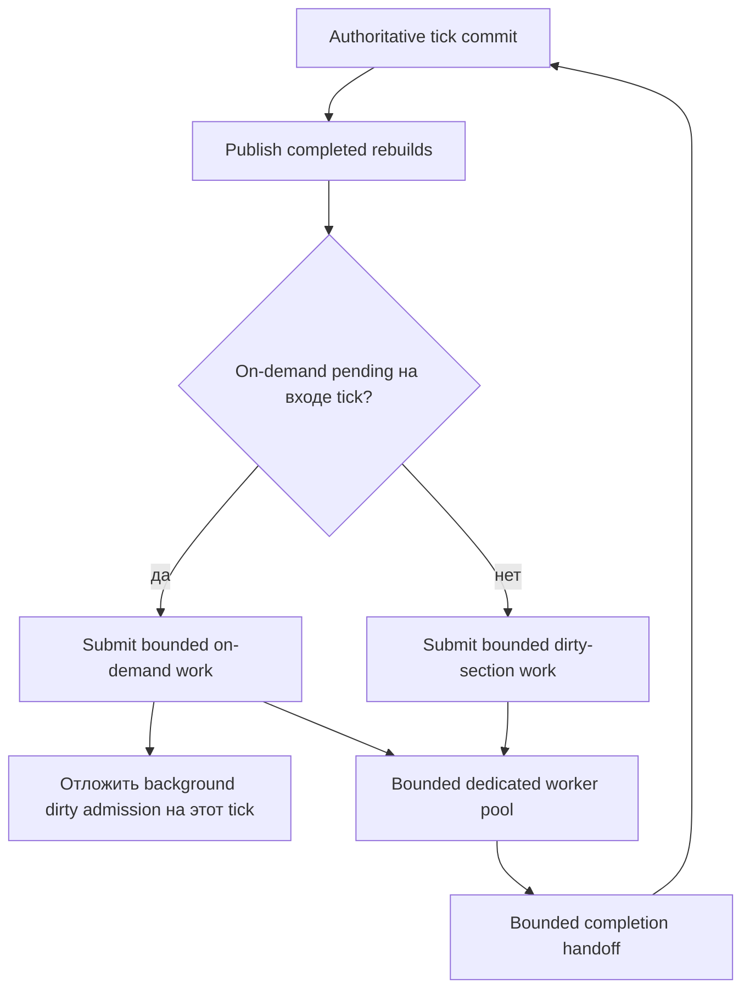

# Планирование rebuild section cache

[English](../en/section-cache-scheduling.md) · [Производительность](performance-runtime.md) · [Performance roadmap](../roadmap/performance-tick-stability.md)

TerraRuntime перестраивает устаревшие packet-10 section frames вне authoritative game loop. Один bounded worker pool обслуживает два класса работы:

- **on-demand** rebuild, который запрашивает connection, ожидающий missing/stale section frame;
- **background dirty** rebuild, появляющийся из обычных live world mutations.

Join-critical работа получает детерминированный tick-level приоритет admission.

## Зачем нужен tick reservation

Worker queue конкурентная. Без явного правила scheduler worker может снять on-demand item между двумя наблюдениями внутри одного `Tick()`. Тогда `PendingWork` уменьшается на единицу, и background dirty работа успевает попасть в очередь сразу следом. Итог начинает зависеть от планирования ОС, а не от runtime policy.

Поэтому runtime фиксирует наличие on-demand work на входе tick. Если такая работа есть, background dirty admission в этом tick пропускается, даже если worker мгновенно забрал join-critical item. Уже выполняющаяся background work не отменяется; правило ограничивает только **новый admission**.

Получается детерминированный контракт:

\[
Q_{\mathrm{join}}(t)>0 \Longrightarrow A_{\mathrm{dirty}}(t)=0,
\]

где \(Q_{\mathrm{join}}(t)\) — число pending on-demand requests на входе tick, а \(A_{\mathrm{dirty}}(t)\) — новая background dirty работа, допущенная в этом tick.

Worker pool и map on-demand requests остаются bounded. Это изменение не означает завершение всего mass-join fairness milestone: global CPU-time budgets, oldest-join age, fairness между несколькими игроками и полный stress matrix остаются открытой performance работой.

## Telemetry

`SectionCacheRebuildPipelineSnapshot.DirtyDeferredForOnDemand` считает ticks, в которых dirty-section backlog существовал, но новая dirty работа намеренно откладывалась из-за join-priority on-demand requests.

Counter проецируется в `RuntimeWorldSnapshot.SectionCacheDirtyDeferredForOnDemand`, поэтому local operations/TUI и будущие remote operator surfaces могут отличить обычный dirty backlog от намеренного join-priority deferral.

Остальная section-cache telemetry продолжает показывать dirty backlog, in-flight work, worker pending/active counts, submissions/rejections, cache hits/misses/stale reads, waits/completions/timeouts и bounded admission on-demand requests.

## Граница корректности

Приоритет меняет только scheduling. Section revision validation, immutable snapshot capture, stale-result rejection, single-flight на section, bounded worker/completion queues и правила cache publication остаются прежними.

Отложенная dirty section остаётся dirty и снова eligible в первый последующий tick, который начинается без on-demand work. Ни одна dirty mutation не выбрасывается ради ускорения join.
