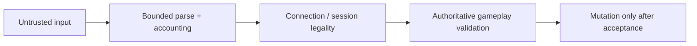
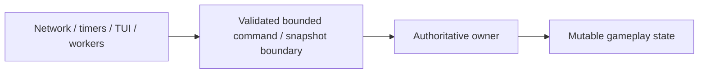
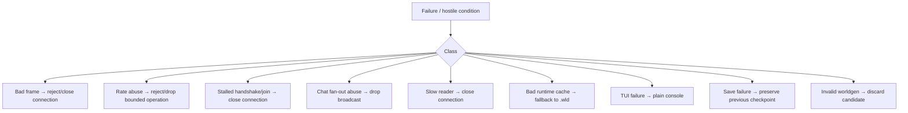

# Security, trust boundaries и failure isolation

[English](../en/security.md) · [Документация](README.md) · [Networking](networking-protocol.md) · [Roadmap](../roadmap.md)

## 1. Security model

Каждый client-controlled byte, length, rate, identity claim и gameplay request считается untrusted.

Security — набор boundaries, а не один anti-cheat component. Они не дают одному peer или malformed persisted input получить unbounded CPU, memory, queue growth или direct authoritative access.

## 2. Security и anti-cheat

Protocol hardening reject'ит malformed framing, invalid/unsupported handshake, configured rate abuse, capacity exhaustion, illegal connection-state ordering и malformed variable-length payloads.

Gameplay authority reject'ит syntactically valid action только если server может доказать невозможность в current authoritative state. False-positive anti-cheat, ломающий legal vanilla behavior, является correctness bug.

## 3. Connection admission

`TerrariaConnectionAdmissionGate` ограничивает active capacity и admission-attempt rate. Default rate ceiling:

$$
R_{\mathrm{admission}}=512\ \text{attempts}/\mathrm{s}.
$$

Каждая попытка потребляет rate budget **до** capacity admission, поэтому full server нельзя превратить в unlimited accept/reject churn loop.

Successful admission возвращает idempotently releasable lease; repeated dispose не double-release'ит active capacity.

## 4. Handshake и join deadlines

Current defaults:

$$
T_{\mathrm{handshake}}=10\,\mathrm{s},
\qquad
T_{\mathrm{join}}=2\,\mathrm{min}.
$$

Valid `Hello` завершает handshake deadline, но не выдаёт unlimited player-slot lease. До readiness `Playing` active join-abuse deadline. После `Playing` current normal idle timeout infinite, если deployment не configured иначе.

`HandshakeTimeout`, `JoinTimeout`, `IdleTimeout` остаются distinct telemetry categories.

## 5. Connection/message rate accounting

Connections используют fixed-window accounting configured frame/byte work. `TerrariaMessageRateAccountant` применяет stricter budgets только к explicitly configured message IDs, while all traffic still crosses connection-wide accounting.

Rate ceilings — abuse bounds, не ordinary gameplay cadence. Join/section/chest traffic бывает legitimately bursty, поэтому tightening требует measurement.

## 6. Global fan-out budget

Public `Say` chat превращает один legal input в $O(P)$ outbound work, где $P$ — playing peers. Поэтому существует server-global pre-fan-out ceiling:

$$
R_{\mathrm{chat}}=256\ \text{broadcasts}/\mathrm{s}.
$$

Over-budget broadcast drop'ится и учитывается как rate-limited rejection до recipient iteration. Это loose hard-abuse protection, не normal chat cadence.

## 7. Framing и hostile sizes

Frame lengths/packet-declared lengths hostile до validation. Impossible/truncated frames reject deterministically, size ceilings применяются до large allocation, client counts не выбирают unbounded memory, transient receive buffers не escape в gameplay state, parser failure остаётся bounded scope.

## 8. Session legality и identity

Well-formed packet может быть illegal до handshake, slot assignment или world entry. Session state валидируется до gameplay mutation. Client-claimed identity игнорируется, где connection уже задаёт authoritative ownership.

Generation/revision-aware handles также защищают от stale commands после numeric-slot reuse.

## 9. Bounded queues и authoritative work

Inbound commands, outbound frames, section/compression work и diagnostics retention bounded.

Authoritative loop сочетает global capacity, per-tick operation limits, per-source fairness и per-source pending ceilings. Shared work, которое bypass'ит loop и multiplicates recipients, требует own server-global budget до multiplication.

Security budgets global, когда work конкурирует за shared tick/resource; умножение full allowance на player count лишь увеличивает DoS surface.

## 10. Single-writer containment

Off-thread direct mutation запрещена. Это уменьшает races и число мест, где hostile input может corrupt shared state.

## 11. World/object safety

World coordinates проверяются до array access; future area operations обязаны bound integer overflow, negative dimensions, attacker-controlled rectangles и repeated expensive framing/liquid/placement work.

Chest/object handling валидирует identity/coordinates и contains malformed input. Strict inventory conservation/anti-dupe rejection ждёт proven server-owned item model вместо guessed vanilla transitions.

## 12. Persistence и cache safety

Canonical `.wld` остаётся recovery source. `.runtime-world` считается untrusted persisted input и обязан пройти layout/integrity validation либо fallback на `.wld`.

Canonical save publication использует detached snapshots, temporary files, durable file flush, atomic replace/move и Linux parent-directory `fsync` where supported. Unknown/newer layouts не rewrite по guessed offsets.

Malformed network input не должен обходить normal final-save/shutdown path healthy world.

## 13. Host/UI/dependency boundaries

Trusted CoreCLR host modules получают narrow `TerraRuntime.HostContracts`, не mutable stores. Ordinary Vega plugins остаются за Vega Plugin SDK. NativeAOT standalone не arbitrary-load'ит managed plugin DLLs.

TUI использует bounded read snapshots и controlled operations.

Production dependencies сохраняют NativeAOT/trimming contract и проходят Linux/Windows native publish/smoke gates where applicable.

## 14. Failure isolation

Ordinary hostile network input не должен fail-fast process. Invariant throws остаются для impossible internal programming states.

## 15. Security telemetry

Observability различает active/accepted/rejected connections, capacity/rate admission rejects, connection/message/global-fan-out rate limits, typed stop reasons, malformed/protocol failures, slow clients, queue/backlog state, invalid gameplay requests, cache failures и save failures.

Telemetry сама bounded, чтобы reporting не стал attack surface.

## 16. Fuzzing

Permanent deterministic malformed/fuzz regression floor существует для framing и typed packet decoders, включая hostile declared lengths и segmented input. Это не complete fuzz coverage.

Broader corpora нужны для section/tile data, `.wld` parsing, command/text parsing и future complex variable-length gameplay formats.

Полезный adversarial test доказывает bounded rejection и последующую способность обработать valid connection/operation.

## 17. Evidence и limitations

Evidence включает admission churn/capacity, handshake/join/idle deadlines, connection/message/global-fan-out budgets, malformed packets, real-socket slow readers, command fairness, world/cache corruption, persistence interruption/atomic publication и live official-client probes.

Remaining work: broader fuzz corpora, complete subsystem budgets/rate classes, richer rejection telemetry, full authoritative movement/inventory/combat validation, `$24$`-player / `$255$`-connection production-like stress и long-running soak/adversarial scenarios.

## 18. Checklist security change

Security change не завершён, пока attacker-controlled sizes bounded до allocation, expensive work budgeted, failures contained, rejection categories typed, authoritative state не mutated off-thread, persistence recovery safe, old behavior fails regression test, diagrams используют Mermaid, dimensional values используют LaTeX, и эта page изменена вместе с `docs/en/security.md`.
