# Генерация мира Skyblock

[English](../en/skyblock-world-generation.md) · [Генерация мира](world-generation.md) · [Документация](README.md) · [Roadmap прогрессии](../roadmap/skyblock-progression.md)

## 1. Область реализации

`terraruntime:skyblock` — встроенный детерминированный генератор Terraria-совместимых Skyblock-миров. Большая часть карты остаётся пустой, а terrain, жидкости и структуры, необходимые для прогрессии, размещаются в заранее зарезервированных областях. Это собственный профиль TerraRuntime, а не заявление о source-exact воспроизведении vanilla Skyblock generator.

## 2. Граф проходов

```mermaid
flowchart LR
    Layout["layout\nроли + зоны безопасности"] --> Islands["islands\nстартовый + биомные/ресурсные острова"]
    Islands --> Ores["ores\nCopper/Iron/Silver/Gold в каменных островах"]
    Ores --> Resources["resources\nWater/Lava/Honey/Shimmer"]
    Resources --> Structures["structures\nалтари + Hellforge + Hive + Temple + микро-ресурсы"]
    Structures --> Dungeon["dungeon\nнижний dungeon-остров"]
    Dungeon --> Chests["chests\npersistent loot"]
    Chests --> Metadata["metadata\nspawn + dungeon + layers + Guide"]
    Metadata --> Compose["каноническая сборка .wld"]
    Compose --> Validate["round-trip WorldFileLoader"]
```

Каждый проход использует `IsolatedDeterministic` RNG. Поток выводится из seed мира и стабильного ID прохода, поэтому добавление несвязанного pass не должно незаметно менять уже существующую раскладку.

## 3. Раскладка островов

Стартовый остров находится по центру примерно на высоте `$0.28H$`, где `$H$` — высота мира. Для обычных размеров генератор целится в

$$
N=\operatorname{clamp}\left(\left\lfloor\frac{W}{70}\right\rfloor,12,120\right)
$$

дополнительных случайных островов. Кандидат отклоняется, если его safety envelope пересекает уже зарезервированный остров или нижний dungeon envelope.

Минимальная поддерживаемая область `$256\times160$` больше не пытается запихнуть обычное случайное поле в физически тесное пространство. При `$W<512$` или `$H<220$` используется компактная детерминированная раскладка, которая всё равно гарантирует Desert, Snow, Jungle, Evil, Cavern и Aether роли.

## 4. Биомные и ресурсные роли

| Роль | Поверхность | Тело | Гарантия прогрессии |
|---|---|---|---|
| Starter / Forest | Dirt | Stone | безопасный spawn |
| Desert | Sand | Sand | материал пустыни |
| Snow | Snow Block | Ice Block | Water |
| Jungle | Jungle Grass | Mud | Honey + Hive/Temple anchors |
| Evil | Corruption или Crimson | соответствующий evil stone | Demon/Crimson Altar |
| Cavern | Stone | Stone | Lava + Hellforge |
| Aether | Stone | Stone | Shimmer + Marble/Granite |

Evil-палитра следует `WorldGenerationOptions.Evil`: Crimson-мир не получает одновременно Corruption terrain и наоборот.

## 5. Гарантированные жидкости

Pass `resources` вырезает ограниченные бассейны в четырёх зарезервированных островах:

- Snow — Water;
- Cavern — Lava;
- Jungle — Honey;
- Aether — Shimmer.

Ячейки бассейна неактивны, содержат полный объём жидкости и явный `WorldGenerationLiquidKind`. Тело острова удерживает жидкость, поэтому всё проходит через существующий нормализованный tile ABI и канонический `.wld` codec.

## 6. Структуры прогрессии

Pass `structures` идёт после жидкостей, чтобы resource geometry и object placement не были свалены в одну делюгу.

### Evil Altar

Первый Evil-остров получает один source-backed `DemonAltar`. Это frame-important объект `$3\times2$`. Corruption использует frame-X `$0,18,36$`, Crimson — source-shaped offset `$54,72,90$`; frame-Y в обоих случаях `$0,18$`.

### Hellforge

На Lava-острове ставится один `$3\times2$` `Hellforge` рядом с лавовым бассейном, поэтому forge не уничтожает источник Lava.

### Hive

Jungle/Honey-остров получает оболочку `Hive` и фон `HiveUnsafe` вокруг Honey-бассейна. Это worldgen anchor. Larva/Queen Bee interaction остаётся отдельной задачей authoritative gameplay и не считается закрытой только потому, что мы нарисовали улей.

### Lihzahrd chamber

Под Jungle-островом строится компактная камера из `LihzahrdBrick` и `LihzahrdBrickUnsafe` с одним `$3\times2$` `LihzahrdAltar`. Таким образом генератор гарантирует Golem altar anchor; расход Power Cell и summon Golem всё ещё относятся к runtime gameplay.

## 7. Микро-ресурсы

Без дополнительного давления на layout тот же pass создаёт небольшие детерминированные resource anchors:

- Mushroom Grass на Mud на фланге Snow/Water-острова;
- Marble и Granite внутри Aether-острова вне Shimmer-бассейна;
- pocket с `SpiderUnsafe` и Cobweb над флангом Water-острова;
- сам Water-бассейн является гарантированным fishing-water anchor.

Это ресурсы прогрессии, а не утверждение о точной геометрии vanilla micro-biomes.

## 8. Spawn, слои, dungeon и стартовый NPC

Spawn указывает на воздух прямо над центром стартового острова, а тайл под ним твёрдый. Стартовый сундук смещён от колонки spawn.

Вертикальная классификация намеренно опущена:

$$
\text{worldSurface}\approx0.62H
$$

$$
\text{rockLayer}\approx0.80H
$$

Dungeon anchor размещается на крупном нижнем Stone-острове возле одного края примерно на `$0.72H$`. Закрытая комната использует source-pinned unsafe Blue Dungeon wall. Это Skyblock structure, а не source-exact `DungeonPass`.

Pass `metadata` также сохраняет стартового Guide (`netId 22`, имя `Andrew`) в точке `spawn * 16` через candidate NPC side table, поэтому свежие Skyblock-миры получают тот же town-NPC bootstrap, что и свежие vanilla-миры, и проходят round-trip `WorldFileFreshComposer326` и загрузку официальным сервером.

## 9. Сундуки и рудные уровни

Skyblock использует `IWorldGenerationChestWorkspace`: генератор запрашивает detached chest state и не пишет сырые `.wld` bytes. До публикации проверяются координаты, дубликаты anchors, stack, prefix и vanilla item range.

Стартовый сундук сейчас содержит Copper Pickaxe, `$100$` Dirt Block, `$25$` Stone Block и `$50$` Gel. Обычные caches получают детерминированные Dirt/Stone/Gel и существующий редкий tier со Slime Staff. Более богатый loot остаётся отдельной source-backed задачей.

Отдельный pass `ores` встраивает детерминированные кластеры меди (`7`), железа (`6`), серебра (`9`) и золота (`8`) в каменные острова после построения тел островов и до вырезания жидкостных бассейнов, поэтому руда не перезаписывает reservoirs. Desert/Snow/Jungle и острова-резервуары пропускаются, чтобы сохранить палитры и ячейки бассейнов.

## 10. Source contracts

Skyblock не превращает числа из таблиц сообщества в «доказанные» runtime identities. `probe_tile_wall_definitions.py` проверяет точные константы TerrariaServer 1.4.5.8 по официальной сборке с закреплённым SHA-256. Текущий progression-набор включает Altar, Hellforge, Hive, Lihzahrd, Mushroom, Marble, Granite, Cobweb и соответствующие unsafe walls.

## 11. Acceptance boundary

Focused-тесты проверяют:

- normal и compact layouts;
- Corruption/Crimson palette и frame selection алтаря;
- Water/Lava/Honey/Shimmer;
- Altar, Hellforge, Hive и Lihzahrd anchors;
- Mushroom/Marble/Granite/Spider resources;
- детерминированные рудные кластеры и персистенцию стартового Guide;
- детерминированный structure footprint;
- полный `.wld` round-trip жидкостей, структур, стен, frames, руды, сундуков и town NPC;
- репликацию `SkyblockLowTiles` в WorldInfo через `VanillaSkyblockRuntimePolicy1458`.

Отдельный Skyblock acceptance создаёт канонический Small-мир `$4200\times1200$` обычным CLI, повторно загружает его verifier'ом TerraRuntime и запускает закреплённый официальный TerrariaServer 1.4.5.8.

Полная проходимость Skyblock всё ещё требует runtime gameplay profile и машинно проверяемого progression verifier. Эти задачи ведутся отдельно в roadmap прогрессии.
