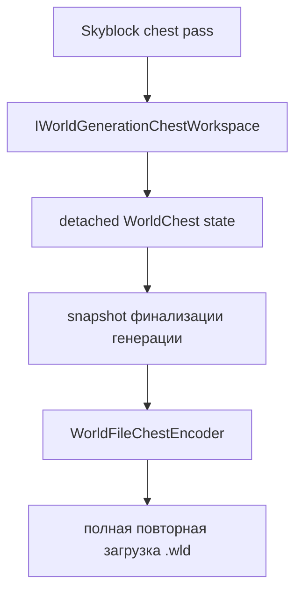
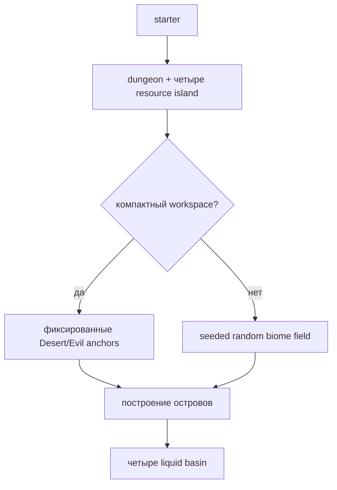

# Генерация мира Skyblock

[English](../en/skyblock-world-generation.md) · [Генерация мира](world-generation.md) · [Документация](README.md) · [Roadmap прогрессии](../roadmap/skyblock-progression.md)

## 1. Область реализации

`terraruntime:skyblock` — встроенный детерминированный генератор TerraRuntime для Terraria-совместимых Skyblock-миров. Большая часть карты остаётся пустой, пространство прогрессии распределяется между летающими островами, spawn гарантированно находится на стартовом острове, уровни underground/cavern опускаются вниз, а отдельный dungeon-остров создаётся независимо от обычного поля островов.

Профиль намеренно нестандартный. Это не псевдоним vanilla secret seed и не заявление о source-exact воспроизведении ванильного Skyblock-генератора Terraria.

## 2. Граф проходов

```mermaid
flowchart LR
    Layout["layout\nрезервирование ролей и зон безопасности"] --> Islands["islands\nстартовый, биомные и ресурсные острова"]
    Islands --> Resources["resources\nWater/Lava/Honey/Shimmer резервуары"]
    Resources --> Dungeon["dungeon\nнижний dungeon-остров"]
    Dungeon --> Chests["chests\nобъекты и сохраняемый loot"]
    Chests --> Metadata["metadata\nspawn + dungeon + слои"]
    Metadata --> Compose["каноническая сборка .wld"]
    Compose --> Validate["round-trip проверка WorldFileLoader"]
```

Каждый проход использует `IsolatedDeterministic` RNG. Поток выводится из seed мира и стабильного ID прохода, поэтому несвязанный будущий pass не должен незаметно сдвигать RNG уже существующего прохода.

## 3. Раскладка островов

Стартовый остров размещается по центру мира примерно на высоте `$0.28H$`, где `$H$` — высота мира. Сверху у него Dirt, внутри Stone.

Для обычных размеров случайное поле целится в

$$
N = \operatorname{clamp}\left(\left\lfloor\frac{W}{70}\right\rfloor, 12, 120\right),
$$

где `$W$` — ширина мира. Кандидат отбрасывается, если его зона безопасности пересекает ранее зарезервированный остров или нижний dungeon-envelope. Если требуемое поле разместить нельзя, генерация завершается ошибкой.

Документированный минимум `$256\times160$` теперь имеет отдельную компактную детерминированную раскладку. Для узких или низких миров (`$W<512$` или `$H<220$`) генератор не пытается впихнуть обычное поле из двенадцати случайных островов в физически недостаточное пространство. При этом сохраняются гарантированные роли Forest/Starter, Desert, Snow, Jungle, Evil, Cavern и Aether.

Большинство обычных случайных островов располагается примерно в диапазоне `$0.14H\ldots0.56H$`; каждый шестой случайный остров становится Cavern и выбирается из более глубокого диапазона `$0.66H\ldots0.86H$`.

## 4. Биомные и ресурсные роли

| Роль | Поверхность | Тело | Дополнительная гарантия |
|---|---|---|---|
| Starter / Forest | Dirt | Stone | опора spawn |
| Desert | Sand | Sand | гарантирован в compact layout |
| Snow | Snow Block | Ice Block | резервуар Water |
| Jungle | Jungle Grass | Mud | резервуар Honey |
| Evil, Corruption | Corrupt Grass | Ebonstone | следует evil мира |
| Evil, Crimson | Crimson Grass | Crimstone | следует evil мира |
| Cavern | Stone | Stone | резервуар Lava |
| Aether | Stone | Stone | резервуар Shimmer |

Evil-роль следует `WorldGenerationOptions.Evil`: Crimson Skyblock не создаёт одновременно Corruption-ландшафт и наоборот.

Именованные tile identity этих палитр остаются source-backed через закреплённый workflow TerrariaServer 1.4.5.8. Для добавления progression liquids не понадобилось вводить ни одного угаданного tile ID.

## 5. Гарантированные жидкости прогрессии

Проход `resources` превращает четыре заранее зарезервированных острова в детерминированные источники:

- Snow-остров: Water;
- Cavern-остров: Lava;
- Jungle-остров: Honey;
- Aether-остров: Shimmer.

Каждый источник — ограниченный бассейн, вырезанный в центре острова. Ячейки бассейна являются неактивными тайлами с полной величиной жидкости и явным `WorldGenerationLiquidKind`; окружающее тело острова образует дно и стенки. Поэтому реализация остаётся внутри существующего нормализованного tile ABI и штатного `.wld` liquid encoding path.

Отдельный Aether-остров размещается на стороне, противоположной выбранной стороне dungeon. Water, Honey и Lava острова резервируются до случайного поля, поэтому дальнейшая раскладка не может занять их зоны безопасности.

## 6. Spawn

Spawn указывает на воздушный тайл непосредственно над центром стартового острова. Тесты требуют твёрдый тайл сразу под ним. Стартовый сундук смещён относительно колонки spawn, поэтому игрок не появляется внутри многотайлового объекта.

## 7. Опущенные уровни underground и cavern

Skyblock намеренно откладывает обычную классификацию глубины:

$$
\text{worldSurface}\approx0.62H
$$

$$
\text{rockLayer}\approx0.80H
$$

Большая часть поля летающих островов остаётся в sky/surface-зоне, а underground/cavern поведение смещается ближе ко дну мира.

## 8. Dungeon-остров

Dungeon anchor размещается на крупном нижнем Stone-острове возле одного из краёв мира примерно на `$0.72H$`. На острове есть закрытое помещение с source-pinned unsafe Blue Dungeon wall, а runtime metadata указывает на эту нижнюю структуру.

Это Skyblock-структура прогрессии, а не заявление о точном воспроизведении vanilla `DungeonPass`.

## 9. Генерируемые сундуки

Skyblock использует опциональную capability `IWorldGenerationChestWorkspace`. Генератор запрашивает detached chest state и не пишет сырые байты `.wld`.

Координаты, повторные anchors, stack, prefix и диапазон vanilla item ID проверяются до публикации candidate. Стартовый сундук сейчас содержит Copper Pickaxe, `$100$` Dirt Block и `$50$` Gel. Обычные cache получают детерминированные количества Dirt/Gel с уже существующим редким уровнем Slime Staff, а нижний dungeon cache содержит дополнительный запас.

Более богатый loot должен и дальше добавлять именованные item identity только после source-проверки.

## 10. Детерминизм и отказ

Ресурсные острова резервируются в layout до принятия случайных островов. Там же резервируется dungeon-envelope. Зависимость получается явной:

Если обязательную роль нельзя разместить без нарушения зоны безопасности, генерация падает, а не молча публикует мир без ресурса прогрессии. Fixed-seed тесты теперь сравнивают footprint жидкостей вместе с metadata и состоянием сундуков.

## 11. Сравнение с tModLoader и оставшаяся прогрессия

Публичные Skyblock-моды экосистемы tModLoader обычно решают не только геометрию: добавляют пути возобновляемых ресурсов, специальные структуры, fallback loot, изменённые drops/events, а иногда отдельные mining/dungeon пространства. TerraRuntime намеренно разделяет world generation и authoritative gameplay rules.

Текущий генератор теперь закрывает детерминированную геометрию островов и все четыре vanilla liquid class, но полная Skyblock-прогрессия всё ещё требует source-backed fallback для структур/ресурсов и отдельного runtime gameplay profile. Эти задачи записаны в [roadmap Skyblock-прогрессии](../roadmap/skyblock-progression.md).

Код реализаций tModLoader в TerraRuntime не копируется.

## 12. Граница acceptance

Отдельный Skyblock acceptance создаёт канонический Small-мир `$4200\times1200$` через обычный CLI TerraRuntime, повторно загружает его verifier'ом TerraRuntime, а затем запускает закреплённый официальный TerrariaServer 1.4.5.8 на полученном `.wld`.

Focused-тесты дополнительно проверяют биомные палитры, детерминированную раскладку, compact minimum-world, опору spawn, опущенные dungeon/layers, резервирование dungeon, round-trip сундуков и сохранение Water/Lava/Honey/Shimmer через обычный encoder/loader мира.
