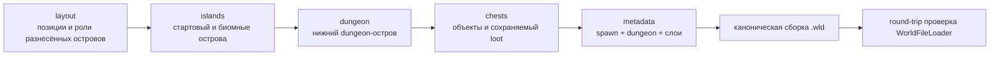
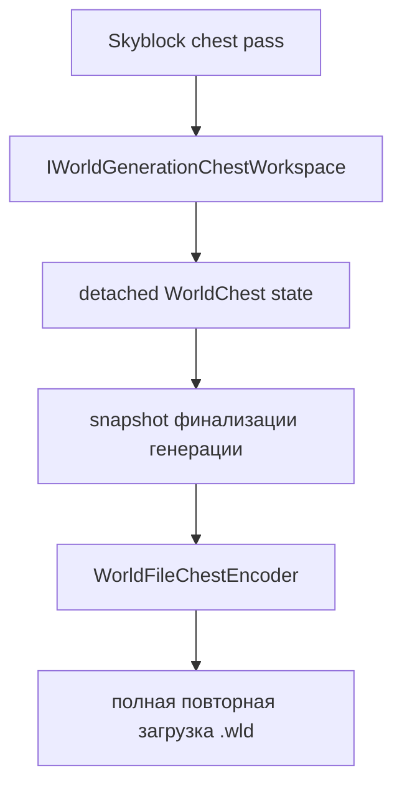

# Генерация мира Skyblock

[English](../en/skyblock-world-generation.md) · [Генерация мира](world-generation.md) · [Документация](README.md)

## 1. Область реализации

`terraruntime:skyblock` — встроенный детерминированный генератор TerraRuntime для Terraria-совместимых Skyblock-миров. В отличие от работы над source-parity vanilla, этот профиль намеренно нестандартный: большая часть карты остаётся пустой, пространство прогрессии распределяется между летающими островами, spawn гарантированно находится на стартовом острове, уровни underground/cavern опускаются вниз, а отдельный dungeon-остров создаётся в нижней части мира.

Генератор не является псевдонимом vanilla secret seed. Выбор `terraruntime:skyblock` всегда означает собственный Skyblock-профиль TerraRuntime.

## 2. Граф проходов

Каждый проход использует `IsolatedDeterministic` RNG. Поток выводится из seed мира и стабильного ID прохода, поэтому несвязанные будущие проходы не должны незаметно менять уже существующую раскладку островов.

## 3. Поле островов

Стартовый остров размещается по центру мира примерно на высоте `$0.28H$`, где `$H$` — высота мира. Сверху у него Dirt, внутри Stone.

Проход раскладки целится в

$$
N = \operatorname{clamp}\left(\left\lfloor\frac{W}{70}\right\rfloor, 12, 120\right)
$$

дополнительных островов при ширине мира `$W$`. Кандидат отбрасывается при пересечении горизонтальной и вертикальной зон безопасности. Объём нижнего dungeon-острова резервируется уже на layout-pass, поэтому обычный остров не может быть позднее перезаписан dungeon-структурой. Если требуемое поле разместить нельзя, генерация завершается ошибкой вместо тихой публикации заметно урезанного мира.

Большинство островов располагается примерно в диапазоне `$0.14H \ldots 0.56H$`. Каждый шестой планируемый остров становится cavern-островом и выбирается из более глубокого диапазона `$0.66H \ldots 0.86H$`.

## 4. Роли биомных островов

Поверхностные острова детерминированно чередуются между Forest, Desert, Snow, Jungle и Evil. Координаты и размеры остаются зависимыми от seed, но цикл ролей гарантирует разнообразие ресурсов даже при минимальном поддерживаемом количестве островов.

| Роль | Поверхность | Тело острова |
|---|---|---|
| Starter / Forest | Dirt | Stone |
| Desert | Sand | Sand |
| Snow | Snow Block | Ice Block |
| Jungle | Jungle Grass | Mud |
| Evil, Corruption | Corrupt Grass | Ebonstone |
| Evil, Crimson | Crimson Grass | Crimstone |
| Cavern | Stone | Stone |

Evil-остров следует `WorldGenerationOptions.Evil`: Crimson Skyblock не создаёт одновременно Corruption-острова и наоборот.

Эти tile identity не взяты из таблиц сообщества. `probe_tile_wall_definitions.py` проверяет точные константы `Terraria.ID.TileID` по закреплённой официальной сборке TerrariaServer 1.4.5.8 через ILSpy source-contract репозитория. Перед декомпиляцией workflow также проверяет канонический SHA-256 управляемого `TerrariaServer.exe`.

## 5. Spawn

Spawn указывает на воздушный тайл непосредственно над центром стартового острова, а тесты требуют твёрдый тайл сразу под ним. Стартовый сундук смещён относительно колонки spawn, поэтому игрок не появляется внутри многотайлового объекта.

## 6. Опущенные уровни underground и cavern

Skyblock намеренно откладывает обычную классификацию глубины:

$$
\text{worldSurface} \approx 0.62H
$$

$$
\text{rockLayer} \approx 0.80H
$$

Большая часть поля летающих островов остаётся в sky/surface-зоне, а underground/cavern поведение смещается ближе ко дну мира.

## 7. Dungeon-остров

Dungeon anchor размещается на крупном нижнем каменном острове возле одного из краёв мира примерно на `$0.72H$`. На острове есть закрытое помещение с source-pinned unsafe Blue Dungeon wall, а dungeon metadata указывает на эту нижнюю структуру.

Это Skyblock-структура, а не заявление о точном воспроизведении vanilla `DungeonPass`.

## 8. Генерируемые сундуки

Skyblock расширяет generation workspace через опциональную capability `IWorldGenerationChestWorkspace`. Генератор запрашивает detached-сундуки и не пишет сырые байты `.wld`.

Координаты, дубликаты, stack, prefix и диапазон vanilla item ID проверяются до добавления сундука в candidate. Затем fresh-world composer записывает сундуки через канонический encoder и повторно загружает полученный файл до публикации.

Текущий source-pinned loot намеренно использует только уже проверенные в каталоге TerrariaServer 1.4.5.8 предметы: Copper Pickaxe, Dirt Block, Gel и редкий Slime Staff.

## 9. Уровни loot

В стартовом сундуке лежат Copper Pickaxe, `$100$` Dirt Block и `$50$` Gel. Обычные биомные cache получают детерминированное от seed количество Dirt/Gel. Каждый седьмой нестартовый cache дополнительно получает Slime Staff. В нижнем dungeon cache лежат Slime Staff и увеличенные запасы Dirt/Gel.

Дальнейшее расширение loot должно добавлять именованные item identity только после source-проверки. Числовые ID из таблиц сообщества не должны маскироваться под source-backed константы.

## 10. Исследование tModLoader

При проектировании использовались общие открытые паттерны worldgen из экосистемы tModLoader: разделение раскладки, геометрии/структур и наполнения сундуков на независимые проходы, а также сохранение координат важных объектов для последующих проходов. Код реализаций tModLoader или Calamity в TerraRuntime не копируется.

## 11. Граница acceptance

Отдельный Skyblock acceptance создаёт канонический Small-мир `$4200\times1200$` через обычный CLI TerraRuntime, повторно загружает его world verifier'ом TerraRuntime, а затем запускает закреплённый официальный TerrariaServer 1.4.5.8 на полученном `.wld`. Focused-тесты отдельно проверяют детерминированную раскладку, биомные палитры, опору spawn, опущенные dungeon/layers, резервирование dungeon-объёма и round-trip сохраняемых сундуков.

Профиль по-прежнему можно развивать более богатым source-pinned loot, жидкостями/рыболовными островами, дополнительными структурами и progression-ресурсами. Эти расширения не ослабляют уже существующий детерминированный контракт мира и persistence.
